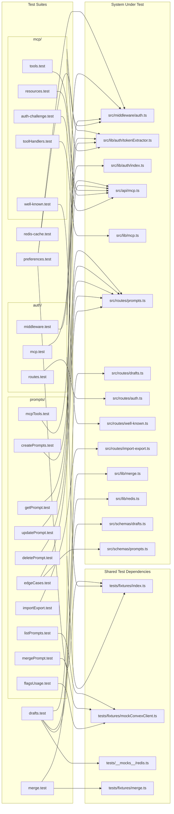
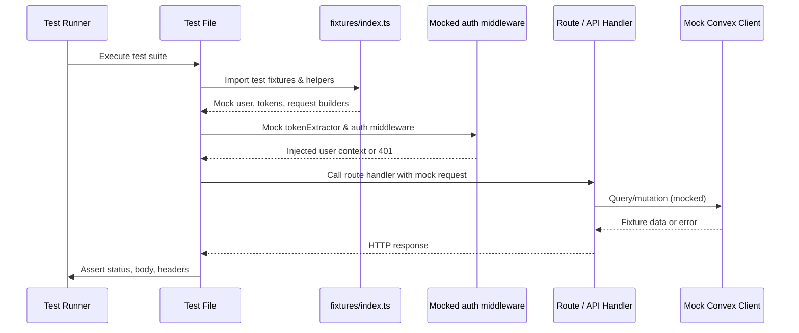

# Service Unit Tests

## Overview

Comprehensive unit test suite for the LiminalDB HTTP service layer. The 22 test files (~5,500 LOC) cover authentication middleware, prompt CRUD operations, MCP protocol endpoints, draft management, user preferences, merge logic, redis caching, and import/export functionality. Tests consistently depend on shared fixtures and mock the auth middleware and token extractor to isolate service-layer behavior.

## Responsibilities

- Validate auth middleware behavior including token extraction, JWT verification, and rejection of unauthenticated requests
- Test MCP protocol endpoints: tool invocation, resource listing, auth challenges, and .well-known discovery
- Verify prompt CRUD operations: create, read, update, delete, list, merge, flags, and edge cases
- Test import/export functionality for bulk prompt management
- Validate draft routes with Redis-backed storage and schema validation
- Test user preference endpoints
- Unit-test the three-way merge algorithm in isolation
- Verify Redis cache behavior
- Ensure MCP tool handler logic operates correctly independent of HTTP transport

## Structure Diagram

## Entity Table

| Name | Kind | Role | Public Entrypoints | Depends On | Used By |
| --- | --- | --- | --- | --- | --- |
| auth/middleware.test.ts | test-file | Tests auth middleware token validation, user context injection, and rejection paths | none | src/lib/auth/index.ts, src/lib/auth/tokenExtractor.ts, src/middleware/auth.ts, tests/fixtures/index.ts | none |
| auth/routes.test.ts | test-file | Tests auth route handlers (login, callback, logout) | none | src/lib/auth/tokenExtractor.ts, src/middleware/auth.ts, src/routes/auth.ts, tests/fixtures/index.ts | none |
| auth/mcp.test.ts | test-file | Tests MCP-specific authentication flows | none | src/api/mcp.ts, src/lib/auth/tokenExtractor.ts, src/middleware/auth.ts, tests/fixtures/index.ts | none |
| prompts/createPrompts.test.ts | test-file | Tests prompt creation endpoint with validation | none | src/lib/auth/tokenExtractor.ts, src/middleware/auth.ts, src/routes/prompts.ts, tests/fixtures/index.ts | none |
| prompts/getPrompt.test.ts | test-file | Tests single prompt retrieval | none | src/lib/auth/tokenExtractor.ts, src/middleware/auth.ts, src/routes/prompts.ts, tests/fixtures/index.ts | none |
| prompts/updatePrompt.test.ts | test-file | Tests prompt update operations | none | src/lib/auth/tokenExtractor.ts, src/middleware/auth.ts, src/routes/prompts.ts, tests/fixtures/index.ts | none |
| prompts/deletePrompt.test.ts | test-file | Tests prompt deletion | none | src/lib/auth/tokenExtractor.ts, src/middleware/auth.ts, src/routes/prompts.ts, tests/fixtures/index.ts | none |
| prompts/listPrompts.test.ts | test-file | Tests prompt listing with filtering and pagination | none | src/lib/auth/tokenExtractor.ts, src/middleware/auth.ts, tests/fixtures/index.ts, tests/fixtures/mockConvexClient.ts | none |
| prompts/mergePrompt.test.ts | test-file | Tests prompt merge endpoint with conflict resolution | none | src/lib/auth/tokenExtractor.ts, src/middleware/auth.ts, tests/fixtures/index.ts, tests/fixtures/mockConvexClient.ts | none |
| prompts/edgeCases.test.ts | test-file | Tests boundary conditions and error handling for prompts (486 LOC) | none | src/lib/auth/tokenExtractor.ts, src/middleware/auth.ts, src/routes/prompts.ts, src/schemas/prompts.ts, tests/fixtures/index.ts | none |
| prompts/flagsUsage.test.ts | test-file | Tests feature flag behavior in prompt operations | none | src/lib/auth/tokenExtractor.ts, src/middleware/auth.ts, tests/fixtures/index.ts, tests/fixtures/mockConvexClient.ts | none |
| prompts/importExport.test.ts | test-file | Tests bulk import/export of prompts (724 LOC, largest test file) | none | src/lib/auth/tokenExtractor.ts, src/middleware/auth.ts, src/routes/import-export.ts, tests/fixtures/index.ts | none |
| prompts/mcpTools.test.ts | test-file | Tests prompt operations exposed via MCP tool interface (715 LOC) | none | src/api/mcp.ts, src/lib/auth/tokenExtractor.ts, src/middleware/auth.ts, tests/fixtures/index.ts | none |
| mcp/tools.test.ts | test-file | Tests MCP tool listing and invocation via HTTP | none | src/api/mcp.ts, src/lib/auth/tokenExtractor.ts, src/middleware/auth.ts, tests/fixtures/index.ts | none |
| mcp/resources.test.ts | test-file | Tests MCP resource discovery and retrieval | none | src/api/mcp.ts, src/lib/auth/tokenExtractor.ts, src/middleware/auth.ts, tests/fixtures/index.ts | none |
| mcp/toolHandlers.test.ts | test-file | Unit tests for MCP tool handler logic independent of HTTP | none | src/lib/mcp.ts | none |
| mcp/auth-challenge.test.ts | test-file | Tests MCP auth challenge/response flow | none | src/api/mcp.ts, src/lib/auth/tokenExtractor.ts, src/middleware/auth.ts | none |
| mcp/well-known.test.ts | test-file | Tests .well-known endpoint for MCP/OAuth discovery | none | src/lib/auth/tokenExtractor.ts, src/middleware/auth.ts, src/routes/well-known.ts | none |
| drafts/drafts.test.ts | test-file | Tests draft CRUD with Redis-backed storage and schema validation | none | src/lib/auth/tokenExtractor.ts, src/lib/redis.ts, src/middleware/auth.ts, src/routes/drafts.ts, src/schemas/drafts.ts, tests/__mocks__/redis.ts, tests/fixtures/index.ts | none |
| preferences.test.ts | test-file | Tests user preference read/write endpoints | none | src/lib/auth/tokenExtractor.ts, src/middleware/auth.ts, tests/fixtures/index.ts | none |
| lib/merge.test.ts | test-file | Unit tests for three-way merge algorithm | none | src/lib/merge.ts, tests/fixtures/merge.ts | none |
| redis-cache.test.ts | test-file | Tests Redis caching layer behavior | none | none | none |

## Key Flow

## Flow Notes

| Step | Actor/Component | Action | Output / Side Effect |
| --- | --- | --- | --- |
| 1 | Test Runner | Discovers and executes test files under tests/service/ | Test suites initialized |
| 2 | Test File | Imports shared fixtures and mocks tokenExtractor + auth middleware to simulate authenticated/unauthenticated requests | Test context with mocked auth layer |
| 3 | Test File | Invokes the system under test (route handler, API endpoint, or library function) with crafted request data | HTTP response or function return value |
| 4 | Test File | Asserts response status codes, body content, error messages, and side effects against expected outcomes | Pass/fail result reported to test runner |

## Source Coverage

- tests/service/auth/mcp.test.ts
- tests/service/auth/middleware.test.ts
- tests/service/auth/routes.test.ts
- tests/service/drafts/drafts.test.ts
- tests/service/lib/merge.test.ts
- tests/service/mcp/auth-challenge.test.ts
- tests/service/mcp/resources.test.ts
- tests/service/mcp/toolHandlers.test.ts
- tests/service/mcp/tools.test.ts
- tests/service/mcp/well-known.test.ts
- tests/service/preferences.test.ts
- tests/service/prompts/createPrompts.test.ts
- tests/service/prompts/deletePrompt.test.ts
- tests/service/prompts/edgeCases.test.ts
- tests/service/prompts/flagsUsage.test.ts
- tests/service/prompts/getPrompt.test.ts
- tests/service/prompts/importExport.test.ts
- tests/service/prompts/listPrompts.test.ts
- tests/service/prompts/mcpTools.test.ts
- tests/service/prompts/mergePrompt.test.ts
- tests/service/prompts/updatePrompt.test.ts
- tests/service/redis-cache.test.ts

## Cross-Module Context

- tests/service/auth/mcp.test.ts -> src/api/mcp.ts (usage)
- tests/service/auth/mcp.test.ts -> src/lib/auth/tokenExtractor.ts (usage)
- tests/service/auth/mcp.test.ts -> src/middleware/auth.ts (usage)
- tests/service/auth/mcp.test.ts -> tests/fixtures/index.ts (usage)
- tests/service/auth/middleware.test.ts -> src/lib/auth/index.ts (usage)
- tests/service/auth/middleware.test.ts -> src/lib/auth/tokenExtractor.ts (usage)
- tests/service/auth/middleware.test.ts -> src/middleware/auth.ts (usage)
- tests/service/auth/middleware.test.ts -> tests/fixtures/index.ts (usage)
- tests/service/auth/routes.test.ts -> src/lib/auth/tokenExtractor.ts (usage)
- tests/service/auth/routes.test.ts -> src/middleware/auth.ts (usage)
- tests/service/auth/routes.test.ts -> src/routes/auth.ts (usage)
- tests/service/auth/routes.test.ts -> tests/fixtures/index.ts (usage)
- tests/service/drafts/drafts.test.ts -> src/lib/auth/tokenExtractor.ts (usage)
- tests/service/drafts/drafts.test.ts -> src/lib/redis.ts (usage)
- tests/service/drafts/drafts.test.ts -> src/middleware/auth.ts (usage)
- tests/service/drafts/drafts.test.ts -> src/routes/drafts.ts (usage)
- tests/service/drafts/drafts.test.ts -> src/schemas/drafts.ts (usage)
- tests/service/drafts/drafts.test.ts -> tests/__mocks__/redis.ts (usage)
- tests/service/drafts/drafts.test.ts -> tests/fixtures/index.ts (usage)
- tests/service/lib/merge.test.ts -> src/lib/merge.ts (usage)
- tests/service/lib/merge.test.ts -> tests/fixtures/merge.ts (usage)
- tests/service/mcp/auth-challenge.test.ts -> src/api/mcp.ts (usage)
- tests/service/mcp/auth-challenge.test.ts -> src/lib/auth/tokenExtractor.ts (usage)
- tests/service/mcp/auth-challenge.test.ts -> src/middleware/auth.ts (usage)
- tests/service/mcp/resources.test.ts -> src/api/mcp.ts (usage)
- tests/service/mcp/resources.test.ts -> src/lib/auth/tokenExtractor.ts (usage)
- tests/service/mcp/resources.test.ts -> src/middleware/auth.ts (usage)
- tests/service/mcp/resources.test.ts -> tests/fixtures/index.ts (usage)
- tests/service/mcp/toolHandlers.test.ts -> src/lib/mcp.ts (usage)
- tests/service/mcp/tools.test.ts -> src/api/mcp.ts (usage)
- tests/service/mcp/tools.test.ts -> src/lib/auth/tokenExtractor.ts (usage)
- tests/service/mcp/tools.test.ts -> src/middleware/auth.ts (usage)
- tests/service/mcp/tools.test.ts -> tests/fixtures/index.ts (usage)
- tests/service/mcp/well-known.test.ts -> src/lib/auth/tokenExtractor.ts (usage)
- tests/service/mcp/well-known.test.ts -> src/middleware/auth.ts (usage)
- tests/service/mcp/well-known.test.ts -> src/routes/well-known.ts (usage)
- tests/service/preferences.test.ts -> src/lib/auth/tokenExtractor.ts (usage)
- tests/service/preferences.test.ts -> src/middleware/auth.ts (usage)
- tests/service/preferences.test.ts -> tests/fixtures/index.ts (usage)
- tests/service/prompts/createPrompts.test.ts -> src/lib/auth/tokenExtractor.ts (usage)
- tests/service/prompts/createPrompts.test.ts -> src/middleware/auth.ts (usage)
- tests/service/prompts/createPrompts.test.ts -> src/routes/prompts.ts (usage)
- tests/service/prompts/createPrompts.test.ts -> tests/fixtures/index.ts (usage)
- tests/service/prompts/deletePrompt.test.ts -> src/lib/auth/tokenExtractor.ts (usage)
- tests/service/prompts/deletePrompt.test.ts -> src/middleware/auth.ts (usage)
- tests/service/prompts/deletePrompt.test.ts -> src/routes/prompts.ts (usage)
- tests/service/prompts/deletePrompt.test.ts -> tests/fixtures/index.ts (usage)
- tests/service/prompts/edgeCases.test.ts -> src/lib/auth/tokenExtractor.ts (usage)
- tests/service/prompts/edgeCases.test.ts -> src/middleware/auth.ts (usage)
- tests/service/prompts/edgeCases.test.ts -> src/routes/prompts.ts (usage)
- tests/service/prompts/edgeCases.test.ts -> src/schemas/prompts.ts (usage)
- tests/service/prompts/edgeCases.test.ts -> tests/fixtures/index.ts (usage)
- tests/service/prompts/flagsUsage.test.ts -> src/lib/auth/tokenExtractor.ts (usage)
- tests/service/prompts/flagsUsage.test.ts -> src/middleware/auth.ts (usage)
- tests/service/prompts/flagsUsage.test.ts -> tests/fixtures/index.ts (usage)
- tests/service/prompts/flagsUsage.test.ts -> tests/fixtures/mockConvexClient.ts (usage)
- tests/service/prompts/getPrompt.test.ts -> src/lib/auth/tokenExtractor.ts (usage)
- tests/service/prompts/getPrompt.test.ts -> src/middleware/auth.ts (usage)
- tests/service/prompts/getPrompt.test.ts -> src/routes/prompts.ts (usage)
- tests/service/prompts/getPrompt.test.ts -> tests/fixtures/index.ts (usage)
- tests/service/prompts/importExport.test.ts -> src/lib/auth/tokenExtractor.ts (usage)
- tests/service/prompts/importExport.test.ts -> src/middleware/auth.ts (usage)
- tests/service/prompts/importExport.test.ts -> src/routes/import-export.ts (usage)
- tests/service/prompts/importExport.test.ts -> tests/fixtures/index.ts (usage)
- tests/service/prompts/listPrompts.test.ts -> src/lib/auth/tokenExtractor.ts (usage)
- tests/service/prompts/listPrompts.test.ts -> src/middleware/auth.ts (usage)
- tests/service/prompts/listPrompts.test.ts -> tests/fixtures/index.ts (usage)
- tests/service/prompts/listPrompts.test.ts -> tests/fixtures/mockConvexClient.ts (usage)
- tests/service/prompts/mcpTools.test.ts -> src/api/mcp.ts (usage)
- tests/service/prompts/mcpTools.test.ts -> src/lib/auth/tokenExtractor.ts (usage)
- tests/service/prompts/mcpTools.test.ts -> src/middleware/auth.ts (usage)
- tests/service/prompts/mcpTools.test.ts -> tests/fixtures/index.ts (usage)
- tests/service/prompts/mergePrompt.test.ts -> src/lib/auth/tokenExtractor.ts (usage)
- tests/service/prompts/mergePrompt.test.ts -> src/middleware/auth.ts (usage)
- tests/service/prompts/mergePrompt.test.ts -> tests/fixtures/index.ts (usage)
- tests/service/prompts/mergePrompt.test.ts -> tests/fixtures/mockConvexClient.ts (usage)
- tests/service/prompts/updatePrompt.test.ts -> src/lib/auth/tokenExtractor.ts (usage)
- tests/service/prompts/updatePrompt.test.ts -> src/middleware/auth.ts (usage)
- tests/service/prompts/updatePrompt.test.ts -> src/routes/prompts.ts (usage)
- tests/service/prompts/updatePrompt.test.ts -> tests/fixtures/index.ts (usage)
