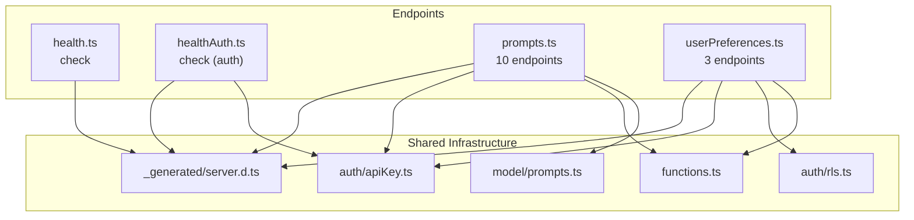
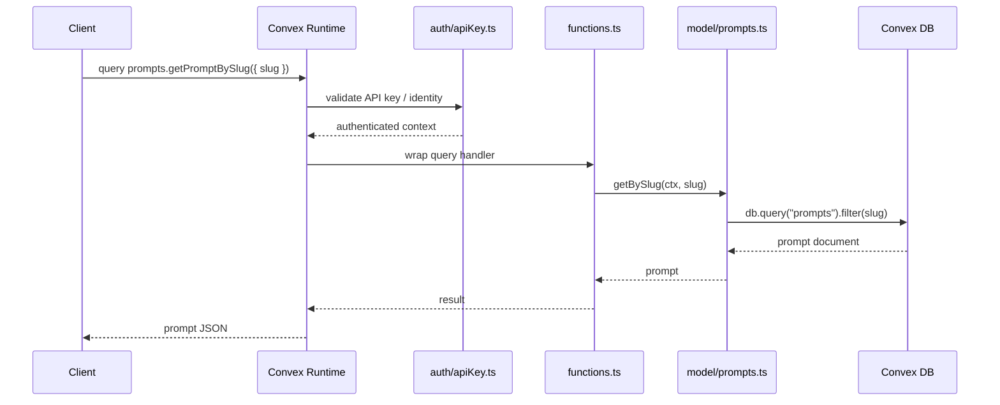

# Convex API Endpoints

## Overview

This module defines the Convex query and mutation endpoints that form the public API surface of LiminalDB. It is organized into four files covering prompt CRUD and search, health checks (unauthenticated and authenticated), and per-user theme/preference management. All authenticated endpoints delegate to `convex/auth/apiKey.ts` for API-key verification, and prompt endpoints further delegate to `convex/model/prompts.ts` for data-access logic. User preferences additionally enforce row-level security via `convex/auth/rls.ts`.

## Responsibilities

- Expose prompt CRUD operations (insert, get, update, delete by slug)
- Provide ranked listing and full-text search over prompts
- Track prompt usage and manage prompt flags (e.g., featured, archived)
- List all distinct tags across prompts
- Serve unauthenticated and authenticated health-check queries
- Manage per-user theme and general preferences with row-level security

## Structure Diagram

## Entity Table

| Name | Kind | Role | Public Entrypoints | Depends On | Used By |
| --- | --- | --- | --- | --- | --- |
| check (health) | query | Unauthenticated health-check endpoint returning service status | convex/health.ts:check | convex/_generated/server.d.ts | none |
| check (healthAuth) | query | Authenticated health-check endpoint that validates API key before returning status | convex/healthAuth.ts:check | convex/_generated/server.d.ts, convex/auth/apiKey.ts | none |
| insertPrompts | mutation | Bulk-insert one or more prompt documents | convex/prompts.ts:insertPrompts | convex/auth/apiKey.ts, convex/functions.ts, convex/model/prompts.ts | none |
| getPromptBySlug | query | Retrieve a single prompt by its unique slug | convex/prompts.ts:getPromptBySlug | convex/auth/apiKey.ts, convex/functions.ts, convex/model/prompts.ts | none |
| listPrompts | query | List prompts with default ordering | convex/prompts.ts:listPrompts | convex/auth/apiKey.ts, convex/functions.ts, convex/model/prompts.ts | none |
| listPromptsRanked | query | List prompts ordered by ranking criteria (e.g., usage count) | convex/prompts.ts:listPromptsRanked | convex/auth/apiKey.ts, convex/functions.ts, convex/model/prompts.ts | none |
| searchPrompts | query | Full-text search across prompt content | convex/prompts.ts:searchPrompts | convex/auth/apiKey.ts, convex/functions.ts, convex/model/prompts.ts | none |
| updatePromptBySlug | mutation | Update prompt fields identified by slug | convex/prompts.ts:updatePromptBySlug | convex/auth/apiKey.ts, convex/functions.ts, convex/model/prompts.ts | none |
| deletePromptBySlug | mutation | Soft- or hard-delete a prompt by slug | convex/prompts.ts:deletePromptBySlug | convex/auth/apiKey.ts, convex/functions.ts, convex/model/prompts.ts | none |
| updatePromptFlags | mutation | Toggle prompt flags such as featured or archived | convex/prompts.ts:updatePromptFlags | convex/auth/apiKey.ts, convex/functions.ts, convex/model/prompts.ts | none |
| trackPromptUse | mutation | Increment usage counter for a prompt | convex/prompts.ts:trackPromptUse | convex/auth/apiKey.ts, convex/functions.ts, convex/model/prompts.ts | none |
| listTags | query | Return distinct tags across all prompts | convex/prompts.ts:listTags | convex/auth/apiKey.ts, convex/functions.ts, convex/model/prompts.ts | none |
| getThemePreference | query | Read the current user's theme preference | convex/userPreferences.ts:getThemePreference | convex/auth/apiKey.ts, convex/auth/rls.ts, convex/functions.ts | none |
| updateThemePreference | mutation | Set the current user's theme preference | convex/userPreferences.ts:updateThemePreference | convex/auth/apiKey.ts, convex/auth/rls.ts, convex/functions.ts | none |
| getAllPreferences | query | Retrieve all stored preferences for the authenticated user | convex/userPreferences.ts:getAllPreferences | convex/auth/apiKey.ts, convex/auth/rls.ts, convex/functions.ts | none |

## Key Flow

## Flow Notes

| Step | Actor/Component | Action | Output / Side Effect |
| --- | --- | --- | --- |
| 1 | Client | Invokes a Convex query or mutation endpoint (e.g., getPromptBySlug) | Request enters Convex runtime |
| 2 | auth/apiKey.ts | Validates the API key or JWT identity attached to the request | Authenticated context or rejection |
| 3 | functions.ts | Wraps the handler with shared middleware (logging, error handling) | Normalized execution context |
| 4 | model/prompts.ts | Executes the data-access logic against the Convex database | Query result or mutation confirmation |
| 5 | Convex Runtime | Serializes the result and returns it to the caller | JSON response to client |

## Source Coverage

- convex/health.ts
- convex/healthAuth.ts
- convex/prompts.ts
- convex/userPreferences.ts

## Cross-Module Context

- convex/health.ts -> convex/_generated/server.d.ts (import)
- convex/healthAuth.ts -> convex/_generated/server.d.ts (import)
- convex/healthAuth.ts -> convex/auth/apiKey.ts (import)
- convex/prompts.ts -> convex/_generated/server.d.ts (import)
- convex/prompts.ts -> convex/auth/apiKey.ts (import)
- convex/prompts.ts -> convex/functions.ts (import)
- convex/prompts.ts -> convex/model/prompts.ts (import)
- convex/userPreferences.ts -> convex/_generated/server.d.ts (import)
- convex/userPreferences.ts -> convex/auth/apiKey.ts (import)
- convex/userPreferences.ts -> convex/auth/rls.ts (import)
- convex/userPreferences.ts -> convex/functions.ts (import)
