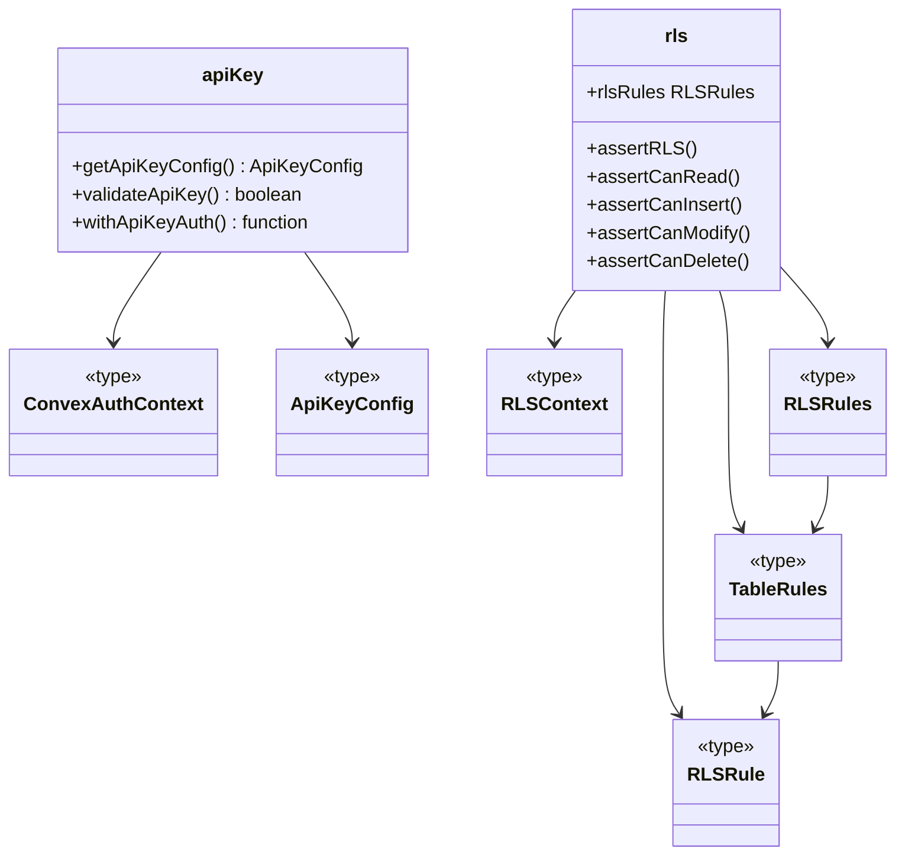
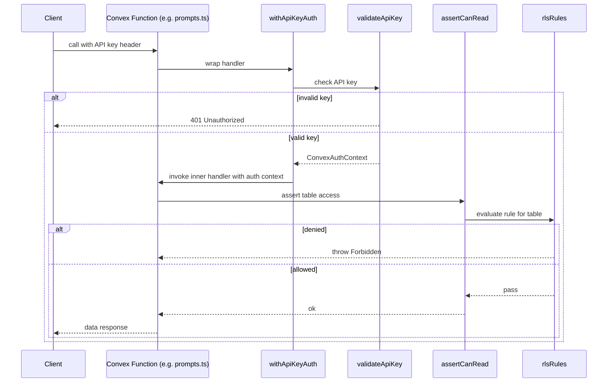

# Convex Auth & RLS

## Overview

This module provides the backend authentication and authorization layer for LiminalDB's Convex functions. It is composed of two complementary subsystems: **API key validation** (`apiKey.ts`) authenticates inbound requests by verifying a shared secret, and **row-level security** (`rls.ts`) enforces per-table access rules (read, insert, modify, delete) scoped to the authenticated user. Shared type definitions in `types.ts` tie both subsystems together with a common auth context.

## Responsibilities

- Validate API keys on inbound Convex function calls and produce an authenticated context
- Provide a higher-order wrapper (`withApiKeyAuth`) that guards Convex functions behind API key authentication
- Define per-table RLS rules (read, insert, modify, delete) as declarative policy objects
- Assert RLS permissions before any data access or mutation via `assertCanRead`, `assertCanInsert`, `assertCanModify`, `assertCanDelete`
- Export shared type contracts (`ConvexAuthContext`, `ApiKeyConfig`, `RLSContext`) consumed across the backend

## Structure Diagram

## Entity Table

| Name | Kind | Role | Public Entrypoints | Depends On | Used By |
| --- | --- | --- | --- | --- | --- |
| getApiKeyConfig | function | Reads the API key configuration from the Convex environment | convex/auth/apiKey.ts:getApiKeyConfig | convex/_generated/server.d.ts, ApiKeyConfig | convex/prompts.ts, convex/userPreferences.ts, convex/healthAuth.ts |
| validateApiKey | function | Validates a provided API key against stored configuration and returns auth result | convex/auth/apiKey.ts:validateApiKey | convex/_generated/server.d.ts, ConvexAuthContext | convex/prompts.ts, convex/userPreferences.ts, convex/healthAuth.ts |
| withApiKeyAuth | function | Higher-order wrapper that guards a Convex function behind API key authentication | convex/auth/apiKey.ts:withApiKeyAuth | validateApiKey, ConvexAuthContext | convex/prompts.ts, convex/userPreferences.ts, convex/healthAuth.ts |
| rlsRules | variable | Declarative map of per-table RLS policy rules | convex/auth/rls.ts:rlsRules | RLSRules, TableRules, RLSRule | assertRLS, convex/model/prompts.ts, convex/userPreferences.ts |
| assertRLS | function | Generic RLS assertion — checks a named operation against the rules for a table | convex/auth/rls.ts:assertRLS | RLSContext, rlsRules | assertCanRead, assertCanInsert, assertCanModify, assertCanDelete |
| assertCanRead | function | Asserts the authenticated user may read rows from a given table | convex/auth/rls.ts:assertCanRead | assertRLS | convex/model/prompts.ts, convex/userPreferences.ts |
| assertCanInsert | function | Asserts the authenticated user may insert rows into a given table | convex/auth/rls.ts:assertCanInsert | assertRLS | convex/model/prompts.ts, convex/userPreferences.ts |
| assertCanModify | function | Asserts the authenticated user may update rows in a given table | convex/auth/rls.ts:assertCanModify | assertRLS | convex/model/prompts.ts, convex/userPreferences.ts |
| assertCanDelete | function | Asserts the authenticated user may delete rows from a given table | convex/auth/rls.ts:assertCanDelete | assertRLS | convex/model/prompts.ts, convex/userPreferences.ts |
| ConvexAuthContext | type | Shared type representing the authenticated Convex request context | convex/auth/types.ts:ConvexAuthContext | none | apiKey.ts, rls.ts |
| ApiKeyConfig | type | Type for API key configuration values | convex/auth/types.ts:ApiKeyConfig | none | apiKey.ts |
| RLSContext | type | Type carrying authenticated user identity into RLS rule evaluation | convex/auth/types.ts:RLSContext | none | rls.ts |
| RLSRule | type | Type for a single access-control predicate (e.g., a read or write check) | convex/auth/rls.ts:RLSRule | RLSContext | TableRules |
| TableRules | type | Bundles read/insert/modify/delete RLS rules for one table | convex/auth/rls.ts:TableRules | RLSRule | RLSRules |
| RLSRules | type | Map of table names to their TableRules | convex/auth/rls.ts:RLSRules | TableRules | rlsRules |

## Key Flow

## Flow Notes

| Step | Actor/Component | Action | Output / Side Effect |
| --- | --- | --- | --- |
| 1 | Client | Sends a Convex function call with an API key (e.g., via header or argument) | Raw request reaches the Convex function endpoint |
| 2 | withApiKeyAuth | Intercepts the call and delegates to `validateApiKey` to verify the key against stored config | Returns 401 on failure, or a `ConvexAuthContext` on success |
| 3 | Convex Function | Runs business logic and calls an RLS assertion (e.g., `assertCanRead`) before querying data | RLS context is evaluated against `rlsRules` for the target table |
| 4 | assertCanRead / assertRLS | Looks up the table's rule in `rlsRules` and evaluates the predicate against the authenticated user | Throws Forbidden if denied; otherwise returns control to the function |
| 5 | Convex Function | Completes the query/mutation and returns the result to the client | Data response sent to caller |

## Source Coverage

- convex/auth.config.ts
- convex/auth/apiKey.ts
- convex/auth/rls.ts
- convex/auth/types.ts

## Cross-Module Context

- convex/auth/apiKey.ts -> convex/_generated/server.d.ts (import)
- convex/healthAuth.ts -> convex/auth/apiKey.ts (import)
- convex/model/prompts.ts -> convex/auth/rls.ts (import)
- convex/prompts.ts -> convex/auth/apiKey.ts (import)
- convex/userPreferences.ts -> convex/auth/apiKey.ts (import)
- convex/userPreferences.ts -> convex/auth/rls.ts (import)
- tests/convex/auth/apiKey.test.ts -> convex/auth/apiKey.ts (usage)
- tests/convex/auth/rls.test.ts -> convex/auth/rls.ts (usage)
- tests/convex/healthAuth.test.ts -> convex/auth/apiKey.ts (usage)
- tests/convex/healthAuth.test.ts -> convex/auth/types.ts (usage)
