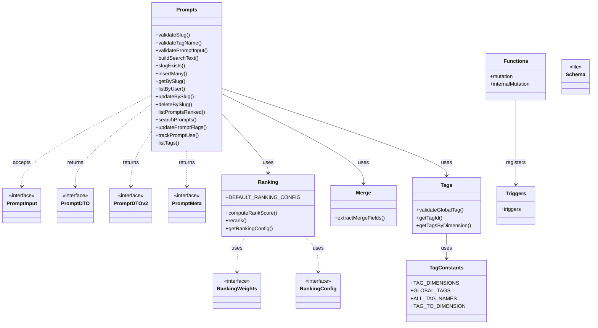
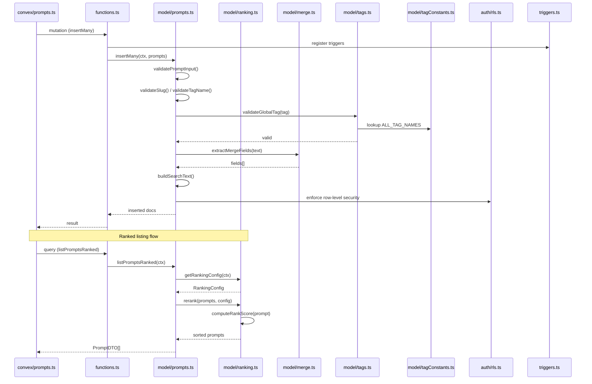

# Convex Data Model

## Overview

The Convex Data Model module is the domain model layer for LiminalDB. It defines the database schema, prompt CRUD operations, tag taxonomy, ranking algorithms, merge logic, and mutation triggers. All Convex mutations and queries in the API layer delegate to this module for business logic, validation, and data access. The module enforces row-level security via an RLS collaborator and provides typed DTOs for the transport boundary.

## Responsibilities

- Define the Convex database schema (tables, indexes, search indexes) in `schema.ts`
- Provide full CRUD operations for prompts (insert, get, update, delete by slug) with input validation
- Implement ranked listing and full-text search of prompts
- Track prompt usage counters and flag updates
- Manage a global tag taxonomy organized by dimensions (tagConstants, tags)
- Compute rank scores using configurable weighted factors (ranking)
- Extract merge fields from prompt templates (merge logic)
- Register database triggers for side-effects on mutations
- Wrap Convex mutation/internalMutation with trigger support via `functions.ts`

## Structure Diagram

## Entity Table

| Name | Kind | Role | Public Entrypoints | Depends On | Used By |
| --- | --- | --- | --- | --- | --- |
| schema.ts | file | Defines all Convex tables, indexes, and search indexes for the application | convex/schema.ts | none | none |
| Prompts (model/prompts.ts) | module | Core prompt CRUD, validation, search, ranking delegation, and usage tracking | insertMany, getBySlug, listByUser, updateBySlug, deleteBySlug, listPromptsRanked, searchPrompts, updatePromptFlags, trackPromptUse, listTags, validatePromptInput, validateSlug, validateTagName, buildSearchText, slugExists | model/merge.ts, model/ranking.ts, model/tags.ts, auth/rls.ts | convex/prompts.ts, migrations/backfillSearchText.ts |
| Ranking (model/ranking.ts) | module | Weighted rank-score computation and re-ranking of prompt lists | computeRankScore, rerank, getRankingConfig, DEFAULT_RANKING_CONFIG | none | model/prompts.ts, migrations/seedRankingConfig.ts |
| Merge (model/merge.ts) | module | Extracts merge/template fields from prompt text | extractMergeFields | none | model/prompts.ts |
| Tags (model/tags.ts) | module | Tag lookup, validation against the global tag taxonomy | validateGlobalTag, getTagId, getTagsByDimension | model/tagConstants.ts | model/prompts.ts |
| TagConstants (model/tagConstants.ts) | module | Static definitions for tag dimensions, global tags, and dimension mappings | TAG_DIMENSIONS, GLOBAL_TAGS, ALL_TAG_NAMES, TAG_TO_DIMENSION, TagDimension, TagName | none | model/tags.ts, migrations/seedGlobalTags.ts |
| Triggers (triggers.ts) | variable | Registers database triggers for side-effects on table mutations | triggers | none | functions.ts |
| Functions (functions.ts) | module | Wraps Convex mutation and internalMutation with trigger support | mutation, internalMutation | triggers.ts | convex/prompts.ts, convex/userPreferences.ts |
| NotImplementedError | class | Custom error class for unimplemented features | NotImplementedError | none | none |

## Key Flow

## Flow Notes

| Step | Actor/Component | Action | Output / Side Effect |
| --- | --- | --- | --- |
| 1 | API Layer (convex/prompts.ts) | Calls trigger-wrapped mutation from functions.ts with prompt input | Mutation context with triggers registered |
| 2 | model/prompts.ts | Validates input (slug format, tag names, required fields) via validatePromptInput | Validated PromptInput or thrown validation error |
| 3 | model/tags.ts | Validates tags against global taxonomy from tagConstants | Confirmed valid tag references |
| 4 | model/merge.ts | Extracts template merge fields (e.g. {{variable}}) from prompt text | Array of merge field names |
| 5 | model/prompts.ts | Builds search text, enforces RLS, persists to database | Inserted prompt document(s) |
| 6 | model/ranking.ts | On ranked queries, loads RankingConfig and computes weighted scores per prompt | Sorted PromptDTO[] ordered by rank score |

## Source Coverage

- convex/errors.ts
- convex/functions.ts
- convex/model/merge.ts
- convex/model/prompts.ts
- convex/model/ranking.ts
- convex/model/tagConstants.ts
- convex/model/tags.ts
- convex/schema.ts
- convex/triggers.ts

## Cross-Module Context

- convex/functions.ts -> convex/_generated/server.d.ts (import)
- convex/migrations/backfillSearchText.ts -> convex/model/prompts.ts (import)
- convex/migrations/seedGlobalTags.ts -> convex/model/tagConstants.ts (import)
- convex/migrations/seedRankingConfig.ts -> convex/model/ranking.ts (import)
- convex/model/prompts.ts -> convex/_generated/dataModel.d.ts (import)
- convex/model/prompts.ts -> convex/_generated/server.d.ts (import)
- convex/model/prompts.ts -> convex/auth/rls.ts (import)
- convex/model/ranking.ts -> convex/_generated/server.d.ts (import)
- convex/model/tags.ts -> convex/_generated/dataModel.d.ts (import)
- convex/model/tags.ts -> convex/_generated/server.d.ts (import)
- convex/prompts.ts -> convex/functions.ts (import)
- convex/prompts.ts -> convex/model/prompts.ts (import)
- convex/triggers.ts -> convex/_generated/dataModel.d.ts (import)
- convex/userPreferences.ts -> convex/functions.ts (import)
- tests/convex/prompts/deleteBySlug.test.ts -> convex/model/prompts.ts (usage)
- tests/convex/prompts/getPromptBySlug.test.ts -> convex/model/prompts.ts (usage)
- tests/convex/prompts/insertPrompts.test.ts -> convex/model/prompts.ts (usage)
- tests/convex/prompts/mergeFields.test.ts -> convex/model/merge.ts (usage)
- tests/convex/prompts/ranking.test.ts -> convex/model/ranking.ts (usage)
- tests/convex/prompts/searchPrompts.test.ts -> convex/model/prompts.ts (usage)
- tests/convex/prompts/slugExists.test.ts -> convex/model/prompts.ts (usage)
- tests/convex/prompts/usageTracking.test.ts -> convex/model/prompts.ts (usage)
- tests/convex/prompts/validation.test.ts -> convex/model/prompts.ts (usage)
- tests/convex/tags/tagConstants.test.ts -> convex/model/tagConstants.ts (usage)
- tests/convex/tags/tags.test.ts -> convex/model/tagConstants.ts (usage)
- tests/convex/tags/tags.test.ts -> convex/model/tags.ts (usage)
