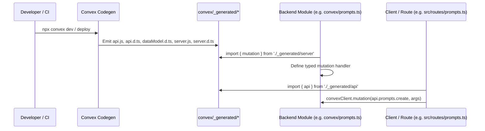

# Convex Generated

## Overview

Auto-generated Convex backend bindings that provide type-safe API references, data model types, and server function constructors. This module is produced by the Convex code-generation toolchain (`npx convex dev` / `npx convex deploy`) and serves as the typed bridge between hand-written backend functions and the Convex runtime. Nearly every backend module and several frontend/route modules depend on these generated files.

## Responsibilities

- Expose typed API references (`api`, `internal`, `components`) for calling Convex functions from clients and other server code
- Define the project-specific `DataModel` type used by model-layer modules for document typing
- Provide project-bound function constructors (`query`, `mutation`, `action`, `internalQuery`, `internalMutation`, `internalAction`, `httpAction`) that wrap generic Convex builders with the app's data model

## Structure Diagram

```mermaid
flowchart TD
  subgraph generated["convex/_generated"]
    api_d["api.d.ts\n(API type map)"]
    api_js["api.js\n(api, internal, components)"]
    dm["dataModel.d.ts\n(DataModel type)"]
    srv_d["server.d.ts\n(typed fn constructors)"]
    srv_js["server.js\n(query, mutation, action …)"]
  end

  subgraph consumers_backend["Backend Consumers"]
    funcs["convex/functions.ts"]
    prompts_fn["convex/prompts.ts"]
    health["convex/health.ts"]
    healthAuth["convex/healthAuth.ts"]
    apiKey["convex/auth/apiKey.ts"]
    userPrefs["convex/userPreferences.ts"]
    model_prompts["convex/model/prompts.ts"]
    model_tags["convex/model/tags.ts"]
    model_ranking["convex/model/ranking.ts"]
    triggers["convex/triggers.ts"]
    migrations["convex/migrations/*"]
  end

  subgraph consumers_frontend["Frontend / Route Consumers"]
    src_health["src/api/health.ts"]
    mcp["src/lib/mcp.ts"]
    routes["src/routes/*"]
  end

  srv_d --> funcs & prompts_fn & health & healthAuth & apiKey & userPrefs & model_prompts & model_tags & model_ranking & migrations
  dm --> model_prompts & model_tags & triggers
  api_d --> migrations & src_health & mcp & routes
```

## Entity Table

| Name | Kind | Role | Public Entrypoints | Depends On | Used By |
| --- | --- | --- | --- | --- | --- |
| api.d.ts | file | Type-level map of all public and internal Convex API endpoints, used by clients to call functions in a type-safe manner | convex/_generated/api.d.ts | none | src/api/health.ts, src/lib/mcp.ts, src/routes/prompts.ts, src/routes/preferences.ts, src/routes/import-export.ts, convex/migrations/backfillSearchText.ts, tests/integration/convex.test.ts, tests/integration/convex/convexCalls.test.ts, tests/integration/convex/prompts.test.ts |
| api.js | file | Runtime API reference objects (`api`, `internal`, `components`) generated from the project's function tree | api, internal, components | none | none |
| dataModel.d.ts | file | Project-specific DataModel type derived from the schema, used by model-layer code for typed document access | convex/_generated/dataModel.d.ts | none | convex/model/prompts.ts, convex/model/tags.ts, convex/triggers.ts, tests/fixtures/mockConvexCtx.ts, tests/convex/prompts/insertPrompts.test.ts |
| server.d.ts | file | Type declarations for project-bound function constructors (query, mutation, action, etc.) that inject the app DataModel | convex/_generated/server.d.ts | none | convex/functions.ts, convex/prompts.ts, convex/health.ts, convex/healthAuth.ts, convex/auth/apiKey.ts, convex/userPreferences.ts, convex/model/prompts.ts, convex/model/tags.ts, convex/model/ranking.ts, convex/migrations/backfillSearchText.ts, convex/migrations/migrationStatus.ts, convex/migrations/seedGlobalTags.ts, convex/migrations/seedRankingConfig.ts, tests/convex/tags/tags.test.ts |
| server.js | file | Runtime exports of typed function constructors wrapping Convex generic builders with the app's data model | query, internalQuery, mutation, internalMutation, action, internalAction, httpAction | none | none |

## Key Flow

## Flow Notes

| Step | Actor/Component | Action | Output / Side Effect |
| --- | --- | --- | --- |
| 1 | Developer / CI | Runs `npx convex dev` or `npx convex deploy`, triggering the Convex code generator | Generated files written to convex/_generated/ |
| 2 | Convex Codegen | Reads schema.ts and all function files to produce typed bindings | api.js, api.d.ts, dataModel.d.ts, server.js, server.d.ts |
| 3 | Backend Module | Imports typed function constructors (query, mutation, action) from server.js/server.d.ts | Type-safe function definitions bound to the app DataModel |
| 4 | Client / Route | Imports api from api.js/api.d.ts and invokes Convex functions via the client | Type-checked remote function calls with full argument and return-type safety |

## Source Coverage

- convex/_generated/api.d.ts
- convex/_generated/api.js
- convex/_generated/dataModel.d.ts
- convex/_generated/server.d.ts
- convex/_generated/server.js

## Cross-Module Context

- convex/auth/apiKey.ts -> convex/_generated/server.d.ts (import)
- convex/functions.ts -> convex/_generated/server.d.ts (import)
- convex/health.ts -> convex/_generated/server.d.ts (import)
- convex/healthAuth.ts -> convex/_generated/server.d.ts (import)
- convex/migrations/backfillSearchText.ts -> convex/_generated/api.d.ts (import)
- convex/migrations/backfillSearchText.ts -> convex/_generated/server.d.ts (import)
- convex/migrations/migrationStatus.ts -> convex/_generated/server.d.ts (import)
- convex/migrations/seedGlobalTags.ts -> convex/_generated/server.d.ts (import)
- convex/migrations/seedRankingConfig.ts -> convex/_generated/server.d.ts (import)
- convex/model/prompts.ts -> convex/_generated/dataModel.d.ts (import)
- convex/model/prompts.ts -> convex/_generated/server.d.ts (import)
- convex/model/ranking.ts -> convex/_generated/server.d.ts (import)
- convex/model/tags.ts -> convex/_generated/dataModel.d.ts (import)
- convex/model/tags.ts -> convex/_generated/server.d.ts (import)
- convex/prompts.ts -> convex/_generated/server.d.ts (import)
- convex/triggers.ts -> convex/_generated/dataModel.d.ts (import)
- convex/userPreferences.ts -> convex/_generated/server.d.ts (import)
- src/api/health.ts -> convex/_generated/api.d.ts (import)
- src/lib/mcp.ts -> convex/_generated/api.d.ts (import)
- src/routes/import-export.ts -> convex/_generated/api.d.ts (import)
- src/routes/preferences.ts -> convex/_generated/api.d.ts (import)
- src/routes/prompts.ts -> convex/_generated/api.d.ts (import)
- tests/convex/prompts/insertPrompts.test.ts -> convex/_generated/dataModel.d.ts (usage)
- tests/convex/tags/tags.test.ts -> convex/_generated/server.d.ts (usage)
- tests/fixtures/mockConvexCtx.ts -> convex/_generated/dataModel.d.ts (import)
- tests/integration/convex.test.ts -> convex/_generated/api.d.ts (usage)
- tests/integration/convex/convexCalls.test.ts -> convex/_generated/api.d.ts (usage)
- tests/integration/convex/prompts.test.ts -> convex/_generated/api.d.ts (usage)
