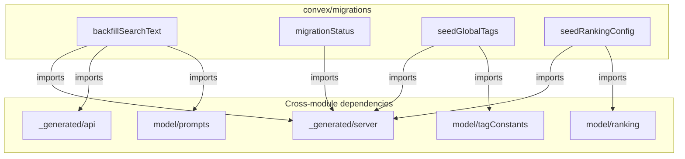
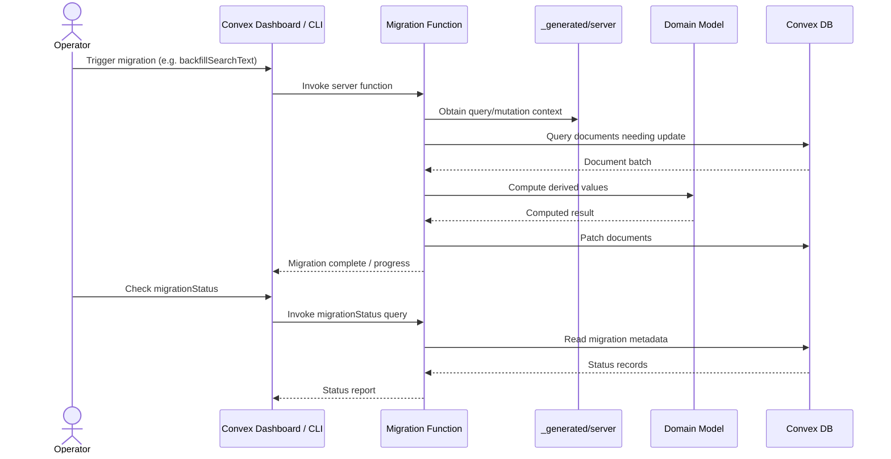

# Convex Migrations

## Overview

Data migration and seeding scripts for the LiminalDB Convex backend. This module provides one-off and repeatable operations to backfill computed fields, seed reference data (global tags, ranking configuration), and query migration status. Each script is a Convex server function that interacts with the database through the generated server API and domain model helpers.

## Responsibilities

- Backfill the `searchText` computed field on existing prompt documents
- Seed the global tags reference table from canonical tag constants
- Seed the ranking configuration table with default scoring weights
- Report the current status of registered migrations

## Structure Diagram

## Entity Table

| Name | Kind | Role | Public Entrypoints | Depends On | Used By |
| --- | --- | --- | --- | --- | --- |
| backfillSearchText | variable (migration) | Iterates over prompt documents and populates the searchText computed field using model/prompts helpers | backfillSearchText | _generated/api, _generated/server, model/prompts | none |
| migrationStatus | variable (query) | Returns the current execution status of registered migrations | migrationStatus | _generated/server | none |
| seedGlobalTags | variable (migration) | Seeds the global tags table from the canonical tag constants defined in model/tagConstants | seedGlobalTags | _generated/server, model/tagConstants | none |
| seedRankingConfig | variable (migration) | Seeds the ranking configuration table with default scoring weights from model/ranking | seedRankingConfig | _generated/server, model/ranking | none |

## Key Flow

## Flow Notes

| Step | Actor/Component | Action | Output / Side Effect |
| --- | --- | --- | --- |
| 1 | Operator | Triggers a migration or seed function via the Convex Dashboard or CLI | Server function invocation |
| 2 | Migration Function | Queries the database for documents that need updating (e.g. prompts missing searchText, or empty reference tables) | Batch of documents to process |
| 3 | Migration Function | Calls domain model helpers (prompts, tagConstants, ranking) to compute or retrieve canonical values | Computed field values or reference data |
| 4 | Migration Function | Writes updated documents or inserts seed rows into the Convex database | Persisted changes |
| 5 | Operator | Queries migrationStatus to verify completion | Status report of all registered migrations |

## Source Coverage

- convex/migrations/backfillSearchText.ts
- convex/migrations/migrationStatus.ts
- convex/migrations/seedGlobalTags.ts
- convex/migrations/seedRankingConfig.ts

## Cross-Module Context

- convex/migrations/backfillSearchText.ts -> convex/_generated/api.d.ts (import)
- convex/migrations/backfillSearchText.ts -> convex/_generated/server.d.ts (import)
- convex/migrations/backfillSearchText.ts -> convex/model/prompts.ts (import)
- convex/migrations/migrationStatus.ts -> convex/_generated/server.d.ts (import)
- convex/migrations/seedGlobalTags.ts -> convex/_generated/server.d.ts (import)
- convex/migrations/seedGlobalTags.ts -> convex/model/tagConstants.ts (import)
- convex/migrations/seedRankingConfig.ts -> convex/_generated/server.d.ts (import)
- convex/migrations/seedRankingConfig.ts -> convex/model/ranking.ts (import)
