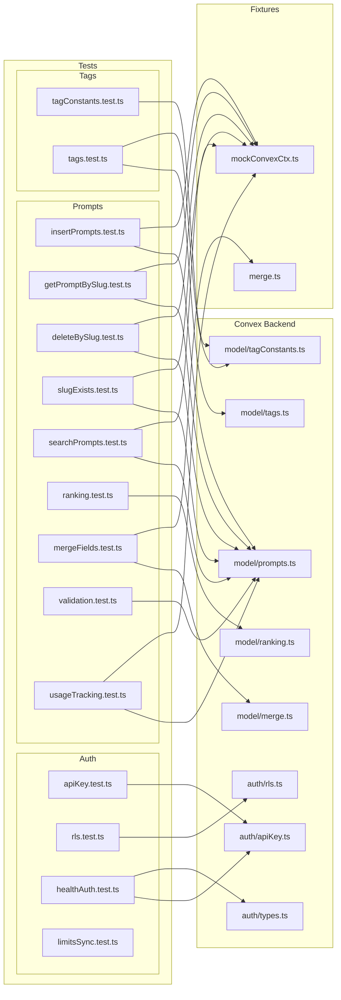
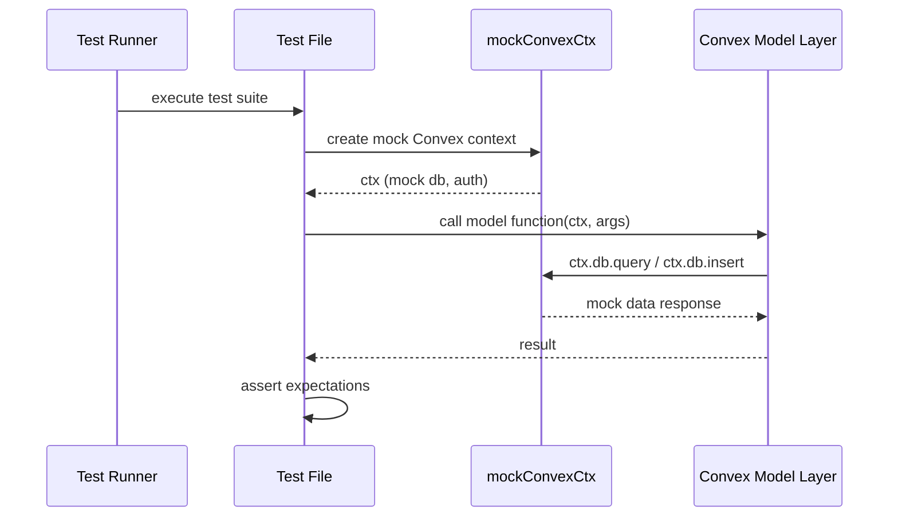

# Convex Unit Tests

## Overview

Unit test suite for the LiminalDB Convex backend. Organized into three domains — **auth** (API key validation, row-level security, health endpoint auth), **prompts** (CRUD, slug operations, search, ranking, merge, validation, usage tracking), and **tags** (tag CRUD, tag constants). Tests use mock Convex contexts from shared fixtures to isolate model-layer logic from the Convex runtime.

## Responsibilities

- Verify API key authentication and validation logic
- Test row-level security (RLS) policy enforcement
- Validate health endpoint authentication behavior
- Test prompt CRUD operations (insert, get-by-slug, delete-by-slug, slug-exists)
- Verify prompt search functionality
- Test prompt ranking/scoring algorithms
- Validate prompt field merging logic
- Enforce prompt input validation rules
- Track prompt usage metrics
- Test tag creation, association, and querying
- Verify tag constant definitions and constraints
- Ensure limits/sync behavior correctness

## Structure Diagram

## Entity Table

| Name | Kind | Role | Public Entrypoints | Depends On | Used By |
| --- | --- | --- | --- | --- | --- |
| apiKey.test.ts | file | Tests API key validation and extraction | none | convex/auth/apiKey.ts | none |
| rls.test.ts | file | Tests row-level security policy enforcement | none | convex/auth/rls.ts | none |
| healthAuth.test.ts | file | Tests authentication for health/status endpoints | none | convex/auth/apiKey.ts, convex/auth/types.ts | none |
| limitsSync.test.ts | file | Tests limits and sync behavior | none | none | none |
| insertPrompts.test.ts | file | Tests prompt insertion including upsert, dedup, and edge cases (largest test file at 459 LOC) | none | convex/model/prompts.ts, tests/fixtures/mockConvexCtx.ts, convex/_generated/dataModel.d.ts | none |
| getPromptBySlug.test.ts | file | Tests fetching prompts by slug identifier | none | convex/model/prompts.ts, tests/fixtures/mockConvexCtx.ts | none |
| deleteBySlug.test.ts | file | Tests prompt deletion by slug | none | convex/model/prompts.ts, tests/fixtures/mockConvexCtx.ts | none |
| slugExists.test.ts | file | Tests slug existence checking | none | convex/model/prompts.ts, tests/fixtures/mockConvexCtx.ts | none |
| searchPrompts.test.ts | file | Tests prompt search/query functionality | none | convex/model/prompts.ts, tests/fixtures/mockConvexCtx.ts | none |
| ranking.test.ts | file | Tests prompt ranking and scoring algorithms | none | convex/model/ranking.ts | none |
| mergeFields.test.ts | file | Tests field merging logic for prompt updates | none | convex/model/merge.ts, tests/fixtures/merge.ts | none |
| validation.test.ts | file | Tests prompt input validation rules | none | convex/model/prompts.ts | none |
| usageTracking.test.ts | file | Tests prompt usage metric tracking | none | convex/model/prompts.ts, tests/fixtures/mockConvexCtx.ts | none |
| tagConstants.test.ts | file | Tests tag constant definitions and constraints | none | convex/model/tagConstants.ts | none |
| tags.test.ts | file | Tests tag CRUD and association operations | none | convex/model/tags.ts, convex/model/tagConstants.ts, convex/_generated/server.d.ts | none |

## Key Flow

## Flow Notes

| Step | Actor/Component | Action | Output / Side Effect |
| --- | --- | --- | --- |
| 1 | Test Runner | Discovers and executes test files across auth, prompts, and tags suites | Test suite invocation |
| 2 | Test File | Creates a mock Convex context via mockConvexCtx fixture (for tests requiring DB interaction) | Mock context with stubbed db and auth |
| 3 | Test File | Calls the target model-layer function with mock context and test arguments | Function execution against mock data |
| 4 | Model Layer | Executes business logic, interacting with the mock db for queries/mutations | Return value or thrown error |
| 5 | Test File | Asserts return values, side effects, or error conditions match expectations | Pass/fail result reported to runner |

## Source Coverage

- tests/convex/auth/apiKey.test.ts
- tests/convex/auth/rls.test.ts
- tests/convex/healthAuth.test.ts
- tests/convex/limitsSync.test.ts
- tests/convex/prompts/deleteBySlug.test.ts
- tests/convex/prompts/getPromptBySlug.test.ts
- tests/convex/prompts/insertPrompts.test.ts
- tests/convex/prompts/mergeFields.test.ts
- tests/convex/prompts/ranking.test.ts
- tests/convex/prompts/searchPrompts.test.ts
- tests/convex/prompts/slugExists.test.ts
- tests/convex/prompts/usageTracking.test.ts
- tests/convex/prompts/validation.test.ts
- tests/convex/tags/tagConstants.test.ts
- tests/convex/tags/tags.test.ts

## Cross-Module Context

- tests/convex/auth/apiKey.test.ts -> convex/auth/apiKey.ts (usage)
- tests/convex/auth/rls.test.ts -> convex/auth/rls.ts (usage)
- tests/convex/healthAuth.test.ts -> convex/auth/apiKey.ts (usage)
- tests/convex/healthAuth.test.ts -> convex/auth/types.ts (usage)
- tests/convex/prompts/deleteBySlug.test.ts -> convex/model/prompts.ts (usage)
- tests/convex/prompts/deleteBySlug.test.ts -> tests/fixtures/mockConvexCtx.ts (usage)
- tests/convex/prompts/getPromptBySlug.test.ts -> convex/model/prompts.ts (usage)
- tests/convex/prompts/getPromptBySlug.test.ts -> tests/fixtures/mockConvexCtx.ts (usage)
- tests/convex/prompts/insertPrompts.test.ts -> convex/_generated/dataModel.d.ts (usage)
- tests/convex/prompts/insertPrompts.test.ts -> convex/model/prompts.ts (usage)
- tests/convex/prompts/insertPrompts.test.ts -> tests/fixtures/mockConvexCtx.ts (usage)
- tests/convex/prompts/mergeFields.test.ts -> convex/model/merge.ts (usage)
- tests/convex/prompts/mergeFields.test.ts -> tests/fixtures/merge.ts (usage)
- tests/convex/prompts/ranking.test.ts -> convex/model/ranking.ts (usage)
- tests/convex/prompts/searchPrompts.test.ts -> convex/model/prompts.ts (usage)
- tests/convex/prompts/searchPrompts.test.ts -> tests/fixtures/mockConvexCtx.ts (usage)
- tests/convex/prompts/slugExists.test.ts -> convex/model/prompts.ts (usage)
- tests/convex/prompts/slugExists.test.ts -> tests/fixtures/mockConvexCtx.ts (usage)
- tests/convex/prompts/usageTracking.test.ts -> convex/model/prompts.ts (usage)
- tests/convex/prompts/usageTracking.test.ts -> tests/fixtures/mockConvexCtx.ts (usage)
- tests/convex/prompts/validation.test.ts -> convex/model/prompts.ts (usage)
- tests/convex/tags/tagConstants.test.ts -> convex/model/tagConstants.ts (usage)
- tests/convex/tags/tags.test.ts -> convex/_generated/server.d.ts (usage)
- tests/convex/tags/tags.test.ts -> convex/model/tagConstants.ts (usage)
- tests/convex/tags/tags.test.ts -> convex/model/tags.ts (usage)
