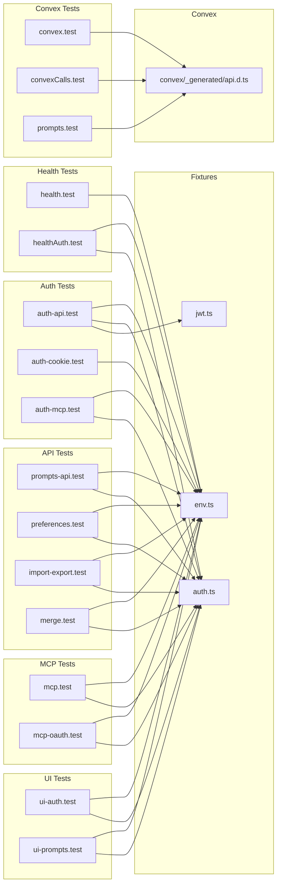
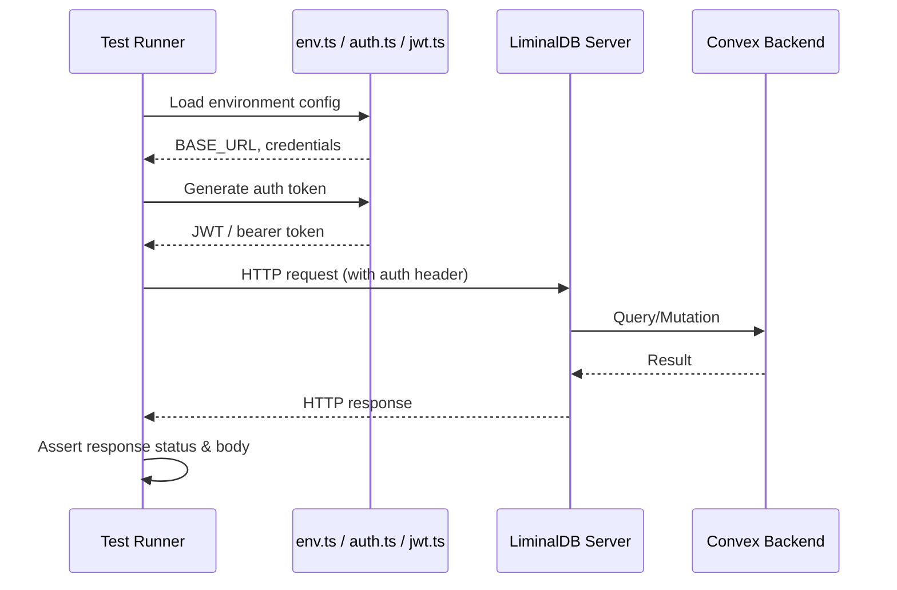

# Integration Tests

## Overview

End-to-end integration test suite for LiminalDB covering authentication (API, cookie, MCP), health checks, prompt CRUD, MCP protocol and OAuth, user preferences, import/export, merge operations, and UI flows. Tests are organized by domain area and share common fixtures for environment configuration and auth token generation.

## Responsibilities

- Validate API authentication flows (JWT, cookie-based, MCP bearer tokens)
- Test health and authenticated health endpoints
- Exercise prompt CRUD operations via both REST API and direct Convex calls
- Verify MCP protocol connectivity and OAuth authorization flows
- Test user preferences API
- Validate import/export round-trip functionality
- Test merge conflict resolution logic
- Cover UI authentication and prompt management flows via browser-level tests

## Structure Diagram

## Entity Table

| Name | Kind | Role | Public Entrypoints | Depends On | Used By |
| --- | --- | --- | --- | --- | --- |
| auth-api.test.ts | file | Tests API-level JWT authentication | none | tests/fixtures/auth.ts, tests/fixtures/env.ts, tests/fixtures/jwt.ts | none |
| auth-cookie.test.ts | file | Tests cookie-based authentication flow | none | tests/fixtures/env.ts | none |
| auth-mcp.test.ts | file | Tests MCP bearer token authentication | none | tests/fixtures/auth.ts, tests/fixtures/env.ts | none |
| convex.test.ts | file | Basic Convex connectivity test | none | convex/_generated/api.d.ts | none |
| convexCalls.test.ts | file | Tests Convex function call patterns | none | convex/_generated/api.d.ts | none |
| prompts.test.ts (convex) | file | Comprehensive Convex-level prompt CRUD tests | none | convex/_generated/api.d.ts | none |
| health.test.ts | file | Tests unauthenticated health endpoint | none | tests/fixtures/env.ts | none |
| healthAuth.test.ts | file | Tests authenticated health endpoint | none | tests/fixtures/auth.ts, tests/fixtures/env.ts | none |
| import-export.test.ts | file | Tests import/export round-trip data integrity | none | tests/fixtures/auth.ts, tests/fixtures/env.ts | none |
| mcp-oauth.test.ts | file | Tests MCP OAuth authorization flow | none | tests/fixtures/auth.ts, tests/fixtures/env.ts | none |
| mcp.test.ts | file | Tests MCP protocol connectivity | none | tests/fixtures/auth.ts, tests/fixtures/env.ts | none |
| merge.test.ts | file | Tests merge and conflict resolution logic | none | tests/fixtures/auth.ts, tests/fixtures/env.ts | none |
| preferences.test.ts | file | Tests user preferences API | none | tests/fixtures/auth.ts, tests/fixtures/env.ts | none |
| prompts-api.test.ts | file | Tests REST API prompt operations | none | tests/fixtures/auth.ts, tests/fixtures/env.ts | none |
| ui-auth.test.ts | file | Browser-level UI authentication tests | none | tests/fixtures/auth.ts, tests/fixtures/env.ts | none |
| ui-prompts.test.ts | file | Browser-level UI prompt management tests | none | tests/fixtures/auth.ts, tests/fixtures/env.ts | none |

## Key Flow

## Flow Notes

| Step | Actor/Component | Action | Output / Side Effect |
| --- | --- | --- | --- |
| 1 | Test Runner | Imports env.ts to resolve BASE_URL and environment-specific configuration | Server URL and env variables |
| 2 | Test Runner | Imports auth.ts / jwt.ts to generate valid authentication tokens | JWT or bearer token for requests |
| 3 | Test Runner | Sends authenticated HTTP requests to LiminalDB server endpoints | HTTP request with Authorization header |
| 4 | LiminalDB Server | Validates token and delegates to Convex backend for data operations | Query/mutation result from Convex |
| 5 | Test Runner | Asserts HTTP status codes, response shapes, and data correctness | Test pass/fail verdict |

## Source Coverage

- tests/integration/auth-api.test.ts
- tests/integration/auth-cookie.test.ts
- tests/integration/auth-mcp.test.ts
- tests/integration/convex.test.ts
- tests/integration/convex/convexCalls.test.ts
- tests/integration/convex/prompts.test.ts
- tests/integration/health.test.ts
- tests/integration/healthAuth.test.ts
- tests/integration/import-export.test.ts
- tests/integration/mcp-oauth.test.ts
- tests/integration/mcp.test.ts
- tests/integration/merge.test.ts
- tests/integration/preferences.test.ts
- tests/integration/prompts-api.test.ts
- tests/integration/ui/ui-auth.test.ts
- tests/integration/ui/ui-prompts.test.ts

## Cross-Module Context

- tests/integration/auth-api.test.ts -> tests/fixtures/auth.ts (usage)
- tests/integration/auth-api.test.ts -> tests/fixtures/env.ts (usage)
- tests/integration/auth-api.test.ts -> tests/fixtures/jwt.ts (usage)
- tests/integration/auth-cookie.test.ts -> tests/fixtures/env.ts (usage)
- tests/integration/auth-mcp.test.ts -> tests/fixtures/auth.ts (usage)
- tests/integration/auth-mcp.test.ts -> tests/fixtures/env.ts (usage)
- tests/integration/convex.test.ts -> convex/_generated/api.d.ts (usage)
- tests/integration/convex/convexCalls.test.ts -> convex/_generated/api.d.ts (usage)
- tests/integration/convex/prompts.test.ts -> convex/_generated/api.d.ts (usage)
- tests/integration/health.test.ts -> tests/fixtures/env.ts (usage)
- tests/integration/healthAuth.test.ts -> tests/fixtures/auth.ts (usage)
- tests/integration/healthAuth.test.ts -> tests/fixtures/env.ts (usage)
- tests/integration/import-export.test.ts -> tests/fixtures/auth.ts (usage)
- tests/integration/import-export.test.ts -> tests/fixtures/env.ts (usage)
- tests/integration/mcp-oauth.test.ts -> tests/fixtures/auth.ts (usage)
- tests/integration/mcp-oauth.test.ts -> tests/fixtures/env.ts (usage)
- tests/integration/mcp.test.ts -> tests/fixtures/auth.ts (usage)
- tests/integration/mcp.test.ts -> tests/fixtures/env.ts (usage)
- tests/integration/merge.test.ts -> tests/fixtures/auth.ts (usage)
- tests/integration/merge.test.ts -> tests/fixtures/env.ts (usage)
- tests/integration/preferences.test.ts -> tests/fixtures/auth.ts (usage)
- tests/integration/preferences.test.ts -> tests/fixtures/env.ts (usage)
- tests/integration/prompts-api.test.ts -> tests/fixtures/auth.ts (usage)
- tests/integration/prompts-api.test.ts -> tests/fixtures/env.ts (usage)
- tests/integration/ui/ui-auth.test.ts -> tests/fixtures/auth.ts (usage)
- tests/integration/ui/ui-auth.test.ts -> tests/fixtures/env.ts (usage)
- tests/integration/ui/ui-prompts.test.ts -> tests/fixtures/auth.ts (usage)
- tests/integration/ui/ui-prompts.test.ts -> tests/fixtures/env.ts (usage)
