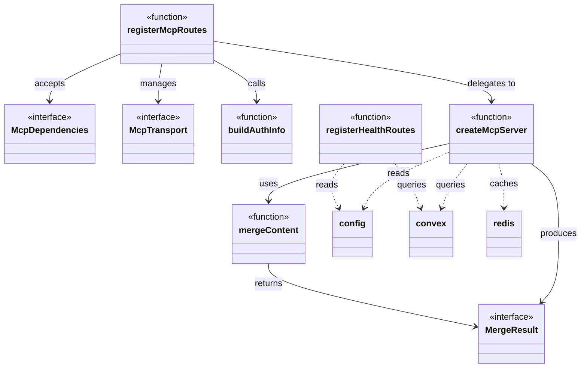
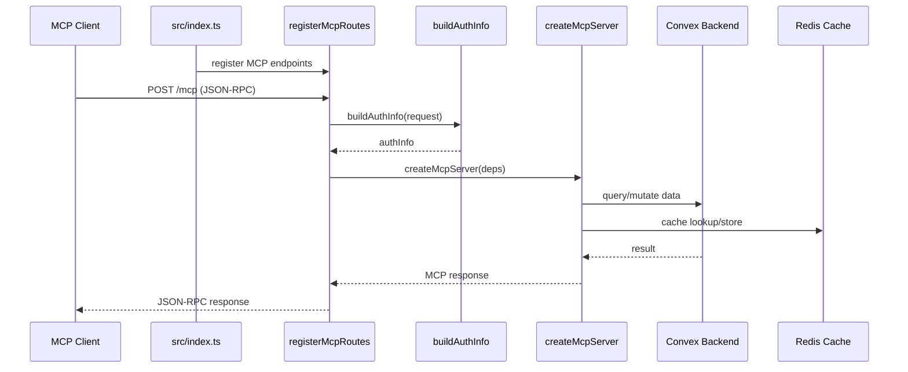

# MCP Server

## Overview

The MCP Server module implements LiminalDB's Model Context Protocol server, providing route registration for MCP transport endpoints and a health API. It is composed of four files: `src/lib/mcp.ts` (core server factory, ~1228 LOC), `src/api/mcp.ts` (HTTP route wiring and auth bridging), `src/api/health.ts` (health check routes), and `src/lib/merge.ts` (content merge utility). The module is the primary entry surface for MCP-compatible AI clients connecting to LiminalDB.

## Responsibilities

- Create and configure the MCP protocol server instance with tool handlers, resources, and prompts via `createMcpServer`
- Register MCP HTTP/transport routes on the application router via `registerMcpRoutes`
- Bridge authentication context into MCP sessions via `buildAuthInfo`
- Expose health check endpoints that verify Convex backend connectivity via `registerHealthRoutes`
- Provide a content merge utility (`mergeContent`) used by both MCP tool handlers and REST prompt routes

## Structure Diagram

## Entity Table

| Name | Kind | Role | Public Entrypoints | Depends On | Used By |
| --- | --- | --- | --- | --- | --- |
| createMcpServer | function | Factory that builds a fully-configured MCP server instance with tool handlers, resource providers, and prompt templates | src/lib/mcp.ts:createMcpServer | convex/_generated/api.d.ts, src/lib/config.ts, src/lib/convex.ts, src/lib/merge.ts, src/lib/redis.ts, src/schemas/preferences.ts, src/schemas/prompts.ts | src/api/mcp.ts, tests/service/mcp/toolHandlers.test.ts |
| registerMcpRoutes | function | Registers MCP HTTP transport endpoints on the application router | src/api/mcp.ts:registerMcpRoutes | src/lib/auth/index.ts, src/lib/config.ts, src/lib/mcp.ts, src/middleware/auth.ts | src/index.ts, tests/service/auth/mcp.test.ts, tests/service/mcp/auth-challenge.test.ts, tests/service/mcp/resources.test.ts, tests/service/mcp/tools.test.ts, tests/service/prompts/mcpTools.test.ts |
| buildAuthInfo | function | Extracts and constructs authentication context for MCP sessions from incoming requests | src/api/mcp.ts:buildAuthInfo | src/lib/auth/index.ts, src/middleware/auth.ts | src/index.ts, tests/service/auth/mcp.test.ts |
| McpDependencies | interface | Defines the dependency injection contract for MCP route registration | src/api/mcp.ts:McpDependencies | none | src/index.ts, tests/service/mcp/tools.test.ts |
| McpTransport | interface | Describes the transport abstraction used by MCP route handlers | src/api/mcp.ts:McpTransport | none | src/api/mcp.ts |
| registerHealthRoutes | function | Registers health check endpoints that verify Convex connectivity and report server status | src/api/health.ts:registerHealthRoutes | convex/_generated/api.d.ts, src/lib/config.ts, src/lib/convex.ts, src/middleware/auth.ts | src/index.ts |
| mergeContent | function | Merges content fields, returning a MergeResult indicating changes | src/lib/merge.ts:mergeContent | none | src/lib/mcp.ts, src/routes/prompts.ts, tests/service/lib/merge.test.ts |
| MergeResult | interface | Represents the outcome of a content merge operation | src/lib/merge.ts:MergeResult | none | src/lib/mcp.ts, src/routes/prompts.ts, tests/service/lib/merge.test.ts |

## Key Flow

## Flow Notes

| Step | Actor/Component | Action | Output / Side Effect |
| --- | --- | --- | --- |
| 1 | src/index.ts | Calls registerMcpRoutes and registerHealthRoutes to wire endpoints onto the HTTP server | MCP and health routes registered on router |
| 2 | MCP Client | Sends a JSON-RPC request to the MCP transport endpoint | HTTP request received by registerMcpRoutes handler |
| 3 | registerMcpRoutes | Invokes buildAuthInfo to extract authentication context from the request | authInfo object with user identity |
| 4 | registerMcpRoutes | Delegates to createMcpServer, passing dependencies and authInfo | MCP server instance processes the tool/resource/prompt request |
| 5 | createMcpServer | Queries Convex backend and Redis cache to fulfill the MCP operation, using mergeContent for content updates | MCP JSON-RPC response returned to client |

## Source Coverage

- src/api/health.ts
- src/api/mcp.ts
- src/lib/mcp.ts
- src/lib/merge.ts

## Cross-Module Context

- src/api/health.ts -> convex/_generated/api.d.ts (import)
- src/api/health.ts -> src/lib/config.ts (import)
- src/api/health.ts -> src/lib/convex.ts (import)
- src/api/health.ts -> src/middleware/auth.ts (import)
- src/api/mcp.ts -> src/lib/auth/index.ts (import)
- src/api/mcp.ts -> src/lib/config.ts (import)
- src/api/mcp.ts -> src/middleware/auth.ts (import)
- src/index.ts -> src/api/health.ts (usage)
- src/index.ts -> src/api/mcp.ts (usage)
- src/lib/mcp.ts -> convex/_generated/api.d.ts (import)
- src/lib/mcp.ts -> src/lib/config.ts (import)
- src/lib/mcp.ts -> src/lib/convex.ts (import)
- src/lib/mcp.ts -> src/lib/redis.ts (import)
- src/lib/mcp.ts -> src/schemas/preferences.ts (import)
- src/lib/mcp.ts -> src/schemas/prompts.ts (import)
- src/routes/prompts.ts -> src/lib/merge.ts (import)
- tests/service/auth/mcp.test.ts -> src/api/mcp.ts (usage)
- tests/service/lib/merge.test.ts -> src/lib/merge.ts (usage)
- tests/service/mcp/auth-challenge.test.ts -> src/api/mcp.ts (usage)
- tests/service/mcp/resources.test.ts -> src/api/mcp.ts (usage)
- tests/service/mcp/toolHandlers.test.ts -> src/lib/mcp.ts (usage)
- tests/service/mcp/tools.test.ts -> src/api/mcp.ts (usage)
- tests/service/prompts/mcpTools.test.ts -> src/api/mcp.ts (usage)
