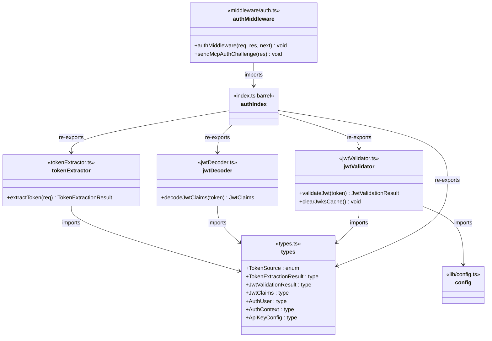
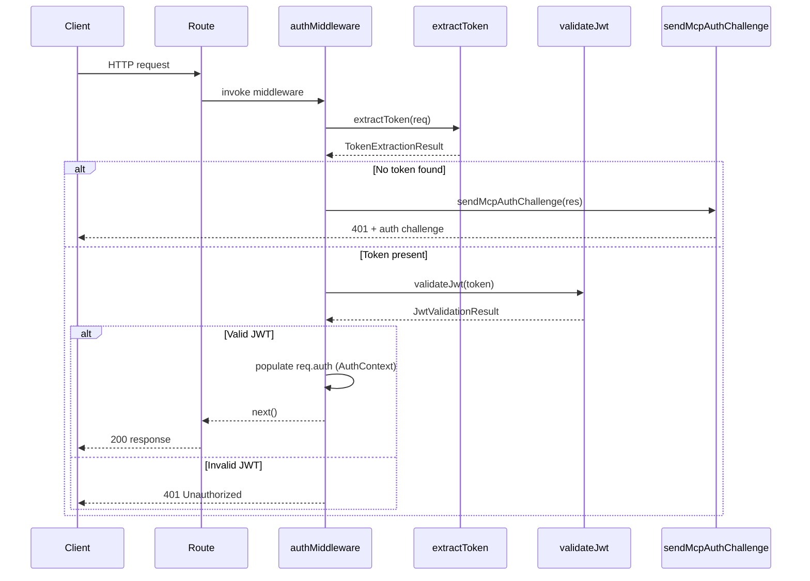

# Server Auth

## Overview

The Server Auth module provides the complete authentication pipeline for LiminalDB's server side. It defines shared auth types (JWT claims, auth context, token sources), extracts bearer tokens from incoming requests, decodes and validates JWTs against JWKS endpoints, and exposes Express middleware that gates all protected routes. A dedicated MCP auth challenge helper supports the MCP protocol's authentication flow.

## Responsibilities

- Define shared authentication types: TokenSource, JwtClaims, AuthUser, AuthContext, and result types
- Extract bearer tokens from Authorization headers and other sources via extractToken
- Decode JWT payloads without verification for claim inspection via decodeJwtClaims
- Validate JWTs cryptographically using JWKS with caching (validateJwt, clearJwksCache)
- Provide Express auth middleware (authMiddleware) that orchestrates extraction → validation → context population
- Send MCP-protocol-compliant auth challenges for unauthenticated MCP requests (sendMcpAuthChallenge)
- Re-export all auth utilities through a barrel index for clean imports

## Structure Diagram

## Entity Table

| Name | Kind | Role | Public Entrypoints | Depends On | Used By |
| --- | --- | --- | --- | --- | --- |
| types.ts | type-definitions | Defines all shared auth types and enums used across the module | TokenSource, TokenExtractionResult, JwtValidationResult, JwtClaims, AuthUser, AuthContext, ApiKeyConfig | none | tokenExtractor, jwtDecoder, jwtValidator, authIndex |
| extractToken | function | Extracts bearer token from HTTP request headers, returning source and token string | extractToken | types.ts | authIndex, src/index.ts, tests |
| decodeJwtClaims | function | Decodes a JWT payload without cryptographic verification to inspect claims | decodeJwtClaims | types.ts | authIndex |
| validateJwt | function | Validates a JWT cryptographically against a JWKS endpoint with key caching | validateJwt | types.ts, src/lib/config.ts | authIndex |
| clearJwksCache | function | Clears the cached JWKS keys, forcing a fresh fetch on next validation | clearJwksCache | types.ts, src/lib/config.ts | authIndex |
| auth/index.ts | barrel | Re-exports all auth library functions and types for convenient imports | src/lib/auth/index.ts | tokenExtractor, jwtDecoder, jwtValidator, types.ts | authMiddleware, src/api/mcp.ts |
| authMiddleware | function | Express middleware that extracts tokens, validates JWTs, and populates auth context on the request | authMiddleware | auth/index.ts | src/routes/prompts.ts, src/routes/drafts.ts, src/routes/preferences.ts, src/routes/auth.ts, src/routes/app.ts, src/routes/import-export.ts, src/api/mcp.ts, src/api/health.ts, src/index.ts |
| sendMcpAuthChallenge | function | Sends an MCP-protocol-compliant authentication challenge response for unauthenticated requests | sendMcpAuthChallenge | auth/index.ts | src/api/mcp.ts, src/index.ts |

## Key Flow

## Flow Notes

| Step | Actor/Component | Action | Output / Side Effect |
| --- | --- | --- | --- |
| 1 | Route handler | Invokes authMiddleware before the protected route handler | Middleware executes |
| 2 | authMiddleware | Calls extractToken to pull bearer token from Authorization header | TokenExtractionResult with token string and source |
| 3 | authMiddleware | If no token, sends MCP auth challenge or 401 depending on request type | 401 response with appropriate challenge headers |
| 4 | authMiddleware | Calls validateJwt to cryptographically verify the token against JWKS | JwtValidationResult with claims or error |
| 5 | authMiddleware | On success, populates req.auth with AuthContext (user identity, claims) and calls next() | Request proceeds to route handler with authenticated context |

## Source Coverage

- src/lib/auth/index.ts
- src/lib/auth/jwtDecoder.ts
- src/lib/auth/jwtValidator.ts
- src/lib/auth/tokenExtractor.ts
- src/lib/auth/types.ts
- src/middleware/auth.ts

## Cross-Module Context

- src/api/health.ts -> src/middleware/auth.ts (import)
- src/api/mcp.ts -> src/lib/auth/index.ts (import)
- src/api/mcp.ts -> src/middleware/auth.ts (import)
- src/index.ts -> src/lib/auth/tokenExtractor.ts (usage)
- src/index.ts -> src/middleware/auth.ts (usage)
- src/lib/auth/jwtValidator.ts -> src/lib/config.ts (import)
- src/routes/app.ts -> src/middleware/auth.ts (import)
- src/routes/auth.ts -> src/middleware/auth.ts (import)
- src/routes/drafts.ts -> src/middleware/auth.ts (import)
- src/routes/import-export.ts -> src/middleware/auth.ts (import)
- src/routes/preferences.ts -> src/middleware/auth.ts (import)
- src/routes/prompts.ts -> src/middleware/auth.ts (import)
- tests/service/auth/mcp.test.ts -> src/lib/auth/tokenExtractor.ts (usage)
- tests/service/auth/mcp.test.ts -> src/middleware/auth.ts (usage)
- tests/service/auth/middleware.test.ts -> src/lib/auth/index.ts (usage)
- tests/service/auth/middleware.test.ts -> src/lib/auth/tokenExtractor.ts (usage)
- tests/service/auth/middleware.test.ts -> src/middleware/auth.ts (usage)
- tests/service/auth/routes.test.ts -> src/lib/auth/tokenExtractor.ts (usage)
- tests/service/auth/routes.test.ts -> src/middleware/auth.ts (usage)
- tests/service/drafts/drafts.test.ts -> src/lib/auth/tokenExtractor.ts (usage)
- tests/service/drafts/drafts.test.ts -> src/middleware/auth.ts (usage)
- tests/service/mcp/auth-challenge.test.ts -> src/lib/auth/tokenExtractor.ts (usage)
- tests/service/mcp/auth-challenge.test.ts -> src/middleware/auth.ts (usage)
- tests/service/mcp/resources.test.ts -> src/lib/auth/tokenExtractor.ts (usage)
- tests/service/mcp/resources.test.ts -> src/middleware/auth.ts (usage)
- tests/service/mcp/tools.test.ts -> src/lib/auth/tokenExtractor.ts (usage)
- tests/service/mcp/tools.test.ts -> src/middleware/auth.ts (usage)
- tests/service/mcp/well-known.test.ts -> src/lib/auth/tokenExtractor.ts (usage)
- tests/service/mcp/well-known.test.ts -> src/middleware/auth.ts (usage)
- tests/service/preferences.test.ts -> src/lib/auth/tokenExtractor.ts (usage)
- tests/service/preferences.test.ts -> src/middleware/auth.ts (usage)
- tests/service/prompts/createPrompts.test.ts -> src/lib/auth/tokenExtractor.ts (usage)
- tests/service/prompts/createPrompts.test.ts -> src/middleware/auth.ts (usage)
- tests/service/prompts/deletePrompt.test.ts -> src/lib/auth/tokenExtractor.ts (usage)
- tests/service/prompts/deletePrompt.test.ts -> src/middleware/auth.ts (usage)
- tests/service/prompts/edgeCases.test.ts -> src/lib/auth/tokenExtractor.ts (usage)
- tests/service/prompts/edgeCases.test.ts -> src/middleware/auth.ts (usage)
- tests/service/prompts/flagsUsage.test.ts -> src/lib/auth/tokenExtractor.ts (usage)
- tests/service/prompts/flagsUsage.test.ts -> src/middleware/auth.ts (usage)
- tests/service/prompts/getPrompt.test.ts -> src/lib/auth/tokenExtractor.ts (usage)
- tests/service/prompts/getPrompt.test.ts -> src/middleware/auth.ts (usage)
- tests/service/prompts/importExport.test.ts -> src/lib/auth/tokenExtractor.ts (usage)
- tests/service/prompts/importExport.test.ts -> src/middleware/auth.ts (usage)
- tests/service/prompts/listPrompts.test.ts -> src/lib/auth/tokenExtractor.ts (usage)
- tests/service/prompts/listPrompts.test.ts -> src/middleware/auth.ts (usage)
- tests/service/prompts/mcpTools.test.ts -> src/lib/auth/tokenExtractor.ts (usage)
- tests/service/prompts/mcpTools.test.ts -> src/middleware/auth.ts (usage)
- tests/service/prompts/mergePrompt.test.ts -> src/lib/auth/tokenExtractor.ts (usage)
- tests/service/prompts/mergePrompt.test.ts -> src/middleware/auth.ts (usage)
- tests/service/prompts/updatePrompt.test.ts -> src/lib/auth/tokenExtractor.ts (usage)
- tests/service/prompts/updatePrompt.test.ts -> src/middleware/auth.ts (usage)
