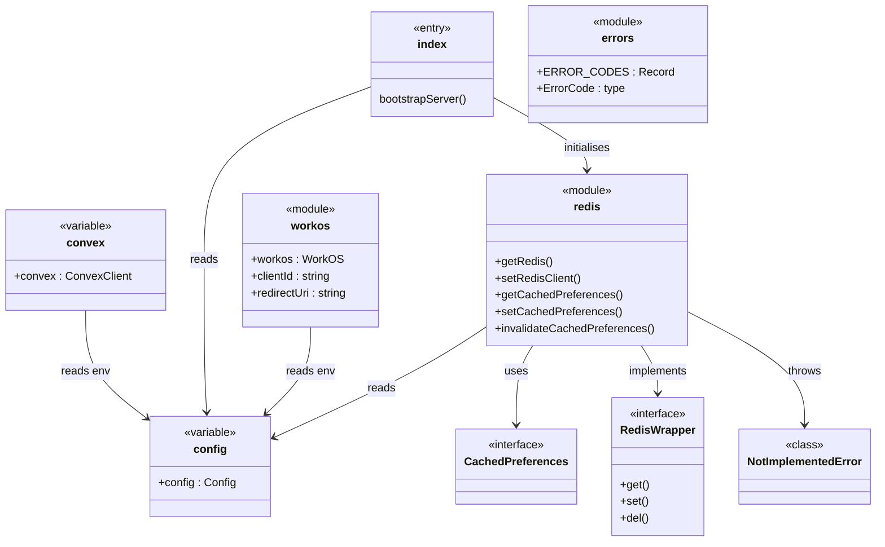
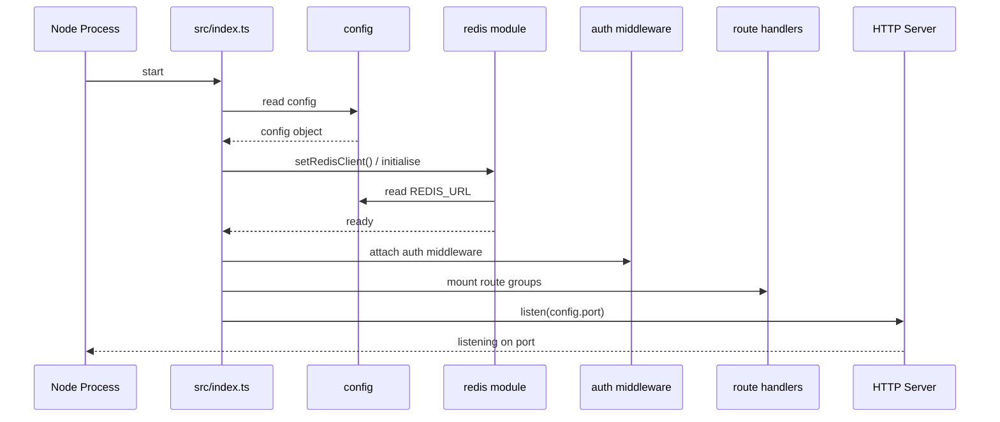

# Server Entry & Config

## Overview

Foundation module that bootstraps the LiminalDB HTTP server and exposes shared infrastructure singletons. `src/index.ts` is the process entry point — it reads configuration, initializes the Redis cache, attaches middleware and route handlers, and starts listening. The `src/lib/` files provide the canonical instances of external clients (Convex, Redis, WorkOS) and shared constants (error codes) consumed across the rest of the codebase.

## Responsibilities

- Bootstrap the HTTP server, attach middleware (auth, token extraction), and mount all route groups
- Centralise environment-driven configuration in a single `config` object
- Provide a shared Convex client for backend data operations
- Provide a Redis wrapper with preference caching helpers (get / set / invalidate)
- Initialise the WorkOS client and expose `clientId` and `redirectUri` for auth flows
- Define a canonical set of application error codes and the `ErrorCode` type

## Structure Diagram

## Entity Table

| Name | Kind | Role | Public Entrypoints | Depends On | Used By |
| --- | --- | --- | --- | --- | --- |
| src/index.ts | file (entry) | HTTP server bootstrap — mounts routes, middleware, initialises Redis, starts listening | src/index.ts | config, redis, health, mcp, auth middleware, routes/* | none |
| config | variable | Centralised configuration object sourced from environment variables | src/lib/config.ts:config | none | index.ts, health.ts, mcp.ts, jwtValidator.ts, redis.ts, routes/import-export, routes/preferences, routes/prompts |
| convex | variable | Shared Convex HTTP client for server-side queries and mutations | src/lib/convex.ts:convex | none | health.ts, mcp.ts, routes/import-export, routes/preferences, routes/prompts |
| RedisWrapper | interface | Abstraction over Redis client methods for testability | src/lib/redis.ts:RedisWrapper | none | redis module internals, tests/__mocks__/redis.ts |
| getRedis / setRedisClient | variable | Accessor and setter for the module-level Redis client singleton | src/lib/redis.ts:getRedis, src/lib/redis.ts:setRedisClient | config | index.ts, mcp.ts, routes/drafts, routes/preferences |
| getCachedPreferences | function | Reads cached user preferences from Redis | src/lib/redis.ts:getCachedPreferences | RedisWrapper, config | mcp.ts, routes/preferences, routes/drafts |
| setCachedPreferences | function | Writes user preferences into the Redis cache | src/lib/redis.ts:setCachedPreferences | RedisWrapper, config | routes/preferences |
| invalidateCachedPreferences | function | Evicts cached user preferences from Redis | src/lib/redis.ts:invalidateCachedPreferences | RedisWrapper, config | routes/preferences |
| NotImplementedError | class | Error thrown when a Redis operation is called on an unsupported wrapper | src/lib/redis.ts:NotImplementedError | none | none |
| CachedPreferences | interface | Shape of cached preference data stored in Redis | src/lib/redis.ts:CachedPreferences | schemas/preferences | getCachedPreferences, setCachedPreferences |
| ERROR_CODES | constant | Canonical map of application error code strings | src/lib/errors.ts:ERROR_CODES | none | none |
| ErrorCode | type | Union type derived from ERROR_CODES keys | src/lib/errors.ts:ErrorCode | none | none |
| workos / clientId / redirectUri | variable | WorkOS SDK instance and OAuth parameters for authentication | src/lib/workos.ts:workos, src/lib/workos.ts:clientId, src/lib/workos.ts:redirectUri | none | routes/auth.ts |

## Key Flow

## Flow Notes

| Step | Actor/Component | Action | Output / Side Effect |
| --- | --- | --- | --- |
| 1 | Node Process | Invokes src/index.ts as the application entry point | Execution begins |
| 2 | index.ts | Imports and reads the config singleton for port, env, and feature flags | Configuration available |
| 3 | index.ts | Initialises the Redis client via setRedisClient using REDIS_URL from config | Redis connection established (or no-op wrapper in dev) |
| 4 | index.ts | Attaches auth middleware (token extraction, JWT validation) to the Express app | Requests are authenticated before reaching routes |
| 5 | index.ts | Mounts route groups (auth, prompts, drafts, preferences, modules, import-export, well-known, health, MCP, app) | All API endpoints registered |
| 6 | index.ts | Calls app.listen on the configured port | Server accepting connections |

## Source Coverage

- src/index.ts
- src/lib/config.ts
- src/lib/convex.ts
- src/lib/errors.ts
- src/lib/redis.ts
- src/lib/workos.ts

## Cross-Module Context

- src/api/health.ts -> src/lib/config.ts (import)
- src/api/health.ts -> src/lib/convex.ts (import)
- src/api/mcp.ts -> src/lib/config.ts (import)
- src/index.ts -> src/api/health.ts (usage)
- src/index.ts -> src/api/mcp.ts (usage)
- src/index.ts -> src/lib/auth/tokenExtractor.ts (usage)
- src/index.ts -> src/middleware/auth.ts (usage)
- src/index.ts -> src/routes/app.ts (usage)
- src/index.ts -> src/routes/auth.ts (usage)
- src/index.ts -> src/routes/drafts.ts (usage)
- src/index.ts -> src/routes/import-export.ts (usage)
- src/index.ts -> src/routes/modules.ts (usage)
- src/index.ts -> src/routes/preferences.ts (usage)
- src/index.ts -> src/routes/prompts.ts (usage)
- src/index.ts -> src/routes/well-known.ts (usage)
- src/lib/auth/jwtValidator.ts -> src/lib/config.ts (import)
- src/lib/mcp.ts -> src/lib/config.ts (import)
- src/lib/mcp.ts -> src/lib/convex.ts (import)
- src/lib/mcp.ts -> src/lib/redis.ts (import)
- src/lib/redis.ts -> src/schemas/preferences.ts (import)
- src/routes/auth.ts -> src/lib/workos.ts (import)
- src/routes/drafts.ts -> src/lib/redis.ts (import)
- src/routes/import-export.ts -> src/lib/config.ts (import)
- src/routes/import-export.ts -> src/lib/convex.ts (import)
- src/routes/preferences.ts -> src/lib/config.ts (import)
- src/routes/preferences.ts -> src/lib/convex.ts (import)
- src/routes/preferences.ts -> src/lib/redis.ts (import)
- src/routes/prompts.ts -> src/lib/config.ts (import)
- src/routes/prompts.ts -> src/lib/convex.ts (import)
- tests/__mocks__/redis.ts -> src/lib/redis.ts (import)
- tests/service/drafts/drafts.test.ts -> src/lib/redis.ts (usage)
