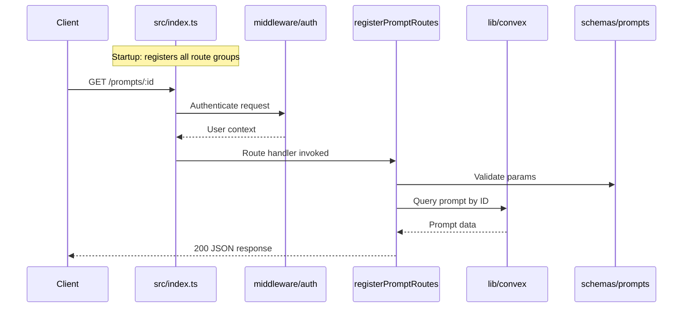

# Server Routes

## Overview

The Server Routes module defines all HTTP route handlers for the LiminalDB application. Each file exports a single registration function that mounts a group of related endpoints onto the server. Routes are organized by domain: app pages, authentication (WorkOS), prompts CRUD, drafts (Redis-backed), user preferences, import/export, modules, and `.well-known` discovery endpoints. The main entry point (`src/index.ts`) calls each registration function at startup to compose the full API surface.

## Responsibilities

- Serve authenticated app page routes with preference-aware rendering
- Handle WorkOS-based authentication flows (login, callback, logout)
- Provide full CRUD operations for prompts via Convex backend
- Manage ephemeral draft state backed by Redis
- Persist and retrieve user preferences through Convex
- Support bulk import and export of prompt data
- Expose module-related endpoints with preference schema validation
- Publish `.well-known` discovery metadata (e.g., MCP configuration)

## Structure Diagram

```mermaid
flowchart TD
  Entry["src/index.ts"]

  Entry --> App["registerAppRoutes"]
  Entry --> Auth["registerAuthRoutes"]
  Entry --> Prompts["registerPromptRoutes"]
  Entry --> Drafts["registerDraftRoutes"]
  Entry --> Prefs["registerPreferencesRoutes"]
  Entry --> IE["registerImportExportRoutes"]
  Entry --> Mods["registerModuleRoutes"]
  Entry --> WK["registerWellKnownRoutes"]

  subgraph Middleware & Libs
    AuthMW["middleware/auth"]
    WorkOS["lib/workos"]
    Redis["lib/redis"]
    Convex["lib/convex"]
    Config["lib/config"]
    Merge["lib/merge"]
  end

  subgraph Schemas
    SProm["schemas/prompts"]
    SDraft["schemas/drafts"]
    SPref["schemas/preferences"]
    SIE["schemas/import-export"]
  end

  App --> AuthMW
  App --> SPref
  Auth --> WorkOS
  Auth --> AuthMW
  Drafts --> Redis
  Drafts --> AuthMW
  Drafts --> SDraft
  Prompts --> Convex
  Prompts --> Config
  Prompts --> Merge
  Prompts --> AuthMW
  Prompts --> SProm
  Prefs --> Convex
  Prefs --> Config
  Prefs --> Redis
  Prefs --> AuthMW
  Prefs --> SPref
  IE --> Convex
  IE --> Config
  IE --> AuthMW
  IE --> SIE
  IE --> SProm
  Mods --> SPref
```

## Entity Table

| Name | Kind | Role | Public Entrypoints | Depends On | Used By |
| --- | --- | --- | --- | --- | --- |
| registerAppRoutes | function | Mounts authenticated app page routes with preference-aware rendering | src/routes/app.ts:registerAppRoutes | src/middleware/auth.ts, src/schemas/preferences.ts | src/index.ts |
| registerAuthRoutes | function | Handles WorkOS authentication flows including login, callback, and logout | src/routes/auth.ts:registerAuthRoutes | src/lib/workos.ts, src/middleware/auth.ts | src/index.ts |
| registerPromptRoutes | function | Full CRUD for prompts stored in Convex, with merge support for updates | src/routes/prompts.ts:registerPromptRoutes | convex/_generated/api.d.ts, src/lib/config.ts, src/lib/convex.ts, src/lib/merge.ts, src/middleware/auth.ts, src/schemas/prompts.ts | src/index.ts |
| registerDraftRoutes | function | Manages ephemeral prompt drafts backed by Redis | src/routes/drafts.ts:registerDraftRoutes | src/lib/redis.ts, src/middleware/auth.ts, src/schemas/drafts.ts | src/index.ts |
| registerPreferencesRoutes | function | Reads and writes user preferences via Convex with Redis caching | src/routes/preferences.ts:registerPreferencesRoutes | convex/_generated/api.d.ts, src/lib/config.ts, src/lib/convex.ts, src/lib/redis.ts, src/middleware/auth.ts, src/schemas/preferences.ts | src/index.ts |
| registerImportExportRoutes | function | Bulk import and export of prompt data through Convex | src/routes/import-export.ts:registerImportExportRoutes | convex/_generated/api.d.ts, src/lib/config.ts, src/lib/convex.ts, src/middleware/auth.ts, src/schemas/import-export.ts, src/schemas/prompts.ts | src/index.ts |
| registerModuleRoutes | function | Exposes module-related endpoints with preference schema validation | src/routes/modules.ts:registerModuleRoutes | src/schemas/preferences.ts | src/index.ts |
| registerWellKnownRoutes | function | Serves .well-known discovery endpoints (e.g., MCP/OAuth metadata) | src/routes/well-known.ts:registerWellKnownRoutes | none | src/index.ts |

## Key Flow

## Flow Notes

| Step | Actor/Component | Action | Output / Side Effect |
| --- | --- | --- | --- |
| 1 | src/index.ts | Calls each register*Routes function to mount all route groups on the server | All HTTP endpoints registered |
| 2 | Client | Sends an HTTP request to a mounted endpoint (e.g., GET /prompts/:id) | Request enters routing layer |
| 3 | middleware/auth | Validates JWT / session and attaches user context to the request | Authenticated request context |
| 4 | Route handler | Validates input against the corresponding schema and calls the appropriate backend (Convex, Redis, or WorkOS) | Backend operation result |
| 5 | Route handler | Formats and returns the response to the client | HTTP JSON response |

## Source Coverage

- src/routes/app.ts
- src/routes/auth.ts
- src/routes/drafts.ts
- src/routes/import-export.ts
- src/routes/modules.ts
- src/routes/preferences.ts
- src/routes/prompts.ts
- src/routes/well-known.ts

## Cross-Module Context

- src/index.ts -> src/routes/app.ts (usage)
- src/index.ts -> src/routes/auth.ts (usage)
- src/index.ts -> src/routes/drafts.ts (usage)
- src/index.ts -> src/routes/import-export.ts (usage)
- src/index.ts -> src/routes/modules.ts (usage)
- src/index.ts -> src/routes/preferences.ts (usage)
- src/index.ts -> src/routes/prompts.ts (usage)
- src/index.ts -> src/routes/well-known.ts (usage)
- src/routes/app.ts -> src/middleware/auth.ts (import)
- src/routes/app.ts -> src/schemas/preferences.ts (import)
- src/routes/auth.ts -> src/lib/workos.ts (import)
- src/routes/auth.ts -> src/middleware/auth.ts (import)
- src/routes/drafts.ts -> src/lib/redis.ts (import)
- src/routes/drafts.ts -> src/middleware/auth.ts (import)
- src/routes/drafts.ts -> src/schemas/drafts.ts (import)
- src/routes/import-export.ts -> convex/_generated/api.d.ts (import)
- src/routes/import-export.ts -> src/lib/config.ts (import)
- src/routes/import-export.ts -> src/lib/convex.ts (import)
- src/routes/import-export.ts -> src/middleware/auth.ts (import)
- src/routes/import-export.ts -> src/schemas/import-export.ts (import)
- src/routes/import-export.ts -> src/schemas/prompts.ts (import)
- src/routes/modules.ts -> src/schemas/preferences.ts (import)
- src/routes/preferences.ts -> convex/_generated/api.d.ts (import)
- src/routes/preferences.ts -> src/lib/config.ts (import)
- src/routes/preferences.ts -> src/lib/convex.ts (import)
- src/routes/preferences.ts -> src/lib/redis.ts (import)
- src/routes/preferences.ts -> src/middleware/auth.ts (import)
- src/routes/preferences.ts -> src/schemas/preferences.ts (import)
- src/routes/prompts.ts -> convex/_generated/api.d.ts (import)
- src/routes/prompts.ts -> src/lib/config.ts (import)
- src/routes/prompts.ts -> src/lib/convex.ts (import)
- src/routes/prompts.ts -> src/lib/merge.ts (import)
- src/routes/prompts.ts -> src/middleware/auth.ts (import)
- src/routes/prompts.ts -> src/schemas/prompts.ts (import)
- tests/service/auth/routes.test.ts -> src/routes/auth.ts (usage)
- tests/service/drafts/drafts.test.ts -> src/routes/drafts.ts (usage)
- tests/service/mcp/well-known.test.ts -> src/routes/well-known.ts (usage)
- tests/service/prompts/createPrompts.test.ts -> src/routes/prompts.ts (usage)
- tests/service/prompts/deletePrompt.test.ts -> src/routes/prompts.ts (usage)
- tests/service/prompts/edgeCases.test.ts -> src/routes/prompts.ts (usage)
- tests/service/prompts/getPrompt.test.ts -> src/routes/prompts.ts (usage)
- tests/service/prompts/importExport.test.ts -> src/routes/import-export.ts (usage)
- tests/service/prompts/updatePrompt.test.ts -> src/routes/prompts.ts (usage)
