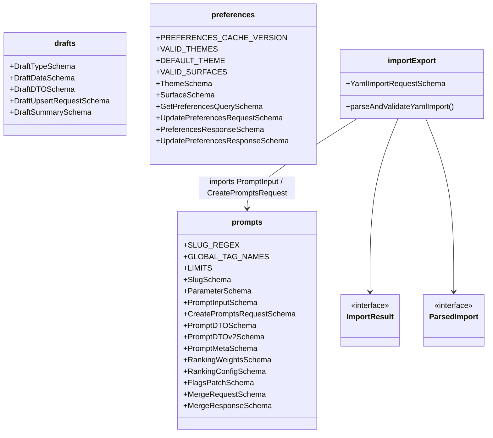
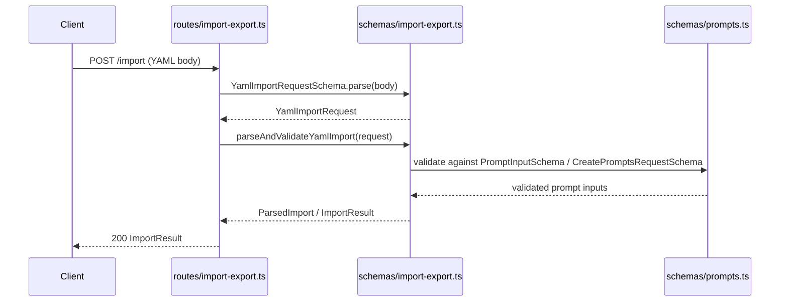

# Server Schemas

## Overview

Centralized Zod validation schemas that define the shape and constraints for all server-side data transfer objects. The module is organized into four schema files — **prompts**, **drafts**, **preferences**, and **import-export** — each exporting paired Zod schemas and inferred TypeScript types. These schemas are consumed by route handlers, MCP tools, and the Redis caching layer to enforce consistent validation at API boundaries.

## Responsibilities

- Define Zod schemas and inferred types for prompt CRUD, ranking, merging, and flags operations
- Define draft lifecycle schemas (type, DTO, upsert request, summary)
- Define user preference schemas including theme/surface enums, cache versioning, and get/update request-response shapes
- Provide YAML import parsing and validation via `parseAndValidateYamlImport`, producing structured `ParsedImport` / `ImportResult` objects
- Export shared constants (SLUG_REGEX, LIMITS, GLOBAL_TAG_NAMES, VALID_THEMES, VALID_SURFACES) used across routes and services

## Structure Diagram

## Entity Table

| Name | Kind | Role | Public Entrypoints | Depends On | Used By |
| --- | --- | --- | --- | --- | --- |
| prompts.ts | file | Core prompt validation schemas, constants (SLUG_REGEX, LIMITS, GLOBAL_TAG_NAMES), and DTO shapes for v1/v2 APIs | SlugSchema, ParameterSchema, PromptInputSchema, CreatePromptsRequestSchema, PromptDTOSchema, PromptDTOv2Schema, PromptMetaSchema, RankingWeightsSchema, RankingConfigSchema, FlagsPatchSchema, MergeRequestSchema, MergeResponseSchema | none | src/routes/prompts.ts, src/routes/import-export.ts, src/lib/mcp.ts, src/schemas/import-export.ts |
| drafts.ts | file | Draft lifecycle schemas covering type enum, full DTO, upsert payload, and list summary | DraftTypeSchema, DraftDataSchema, DraftDTOSchema, DraftUpsertRequestSchema, DraftSummarySchema | none | src/routes/drafts.ts, tests/service/drafts/drafts.test.ts |
| preferences.ts | file | User preference schemas with theme/surface enums, cache version constant, and request-response shapes | ThemeSchema, SurfaceSchema, GetPreferencesQuerySchema, UpdatePreferencesRequestSchema, PreferencesResponseSchema, UpdatePreferencesResponseSchema | none | src/routes/preferences.ts, src/routes/app.ts, src/routes/modules.ts, src/lib/mcp.ts, src/lib/redis.ts |
| import-export.ts | file | YAML import request validation and parsing function producing ImportResult/ParsedImport | YamlImportRequestSchema, parseAndValidateYamlImport | src/schemas/prompts.ts | src/routes/import-export.ts |
| ImportResult | interface | Describes the outcome of an import operation | ImportResult | src/schemas/prompts.ts | src/routes/import-export.ts |
| ParsedImport | interface | Intermediate parsed representation of a YAML import before persistence | ParsedImport | src/schemas/prompts.ts | src/routes/import-export.ts |

## Key Flow

## Flow Notes

| Step | Actor/Component | Action | Output / Side Effect |
| --- | --- | --- | --- |
| 1 | Client | Sends a POST request with YAML content to the import endpoint | Raw request body |
| 2 | routes/import-export.ts | Parses the raw body through YamlImportRequestSchema | Typed YamlImportRequest |
| 3 | schemas/import-export.ts | parseAndValidateYamlImport validates each prompt entry against PromptInputSchema from prompts.ts | ParsedImport containing validated prompt inputs |
| 4 | routes/import-export.ts | Persists parsed prompts and returns ImportResult to the client | ImportResult with success/error counts |

## Source Coverage

- src/schemas/drafts.ts
- src/schemas/import-export.ts
- src/schemas/preferences.ts
- src/schemas/prompts.ts

## Cross-Module Context

- src/lib/mcp.ts -> src/schemas/preferences.ts (import)
- src/lib/mcp.ts -> src/schemas/prompts.ts (import)
- src/lib/redis.ts -> src/schemas/preferences.ts (import)
- src/routes/app.ts -> src/schemas/preferences.ts (import)
- src/routes/drafts.ts -> src/schemas/drafts.ts (import)
- src/routes/import-export.ts -> src/schemas/import-export.ts (import)
- src/routes/import-export.ts -> src/schemas/prompts.ts (import)
- src/routes/modules.ts -> src/schemas/preferences.ts (import)
- src/routes/preferences.ts -> src/schemas/preferences.ts (import)
- src/routes/prompts.ts -> src/schemas/prompts.ts (import)
- tests/service/drafts/drafts.test.ts -> src/schemas/drafts.ts (usage)
- tests/service/prompts/edgeCases.test.ts -> src/schemas/prompts.ts (usage)
