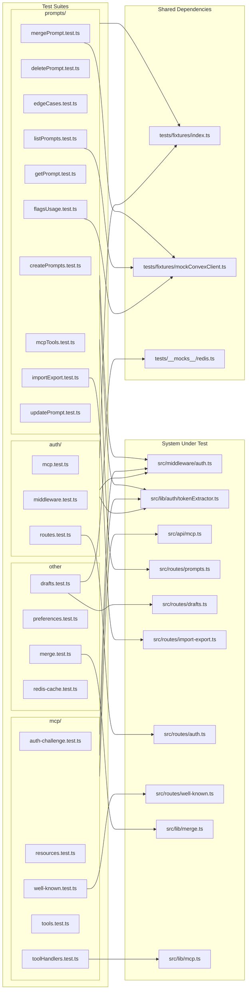
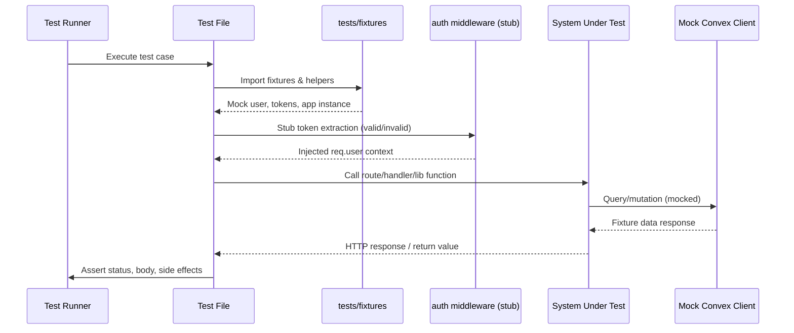

# Service Unit Tests

## Overview

Comprehensive unit test suite covering the LiminalDB server-side surface area. The 22 test files (≈5,575 LOC) are organized into four domains — **auth**, **MCP**, **prompts**, and **supporting services** (drafts, preferences, merge, caching). Nearly every test file depends on shared fixtures (`tests/fixtures/index.ts`) and stubs the auth pipeline via `src/middleware/auth.ts` and `src/lib/auth/tokenExtractor.ts`, establishing a consistent authenticated-request test harness across the suite.

## Responsibilities

- Validate authentication middleware, token extraction, and auth route behavior
- Test MCP protocol endpoints: auth challenges, tool invocation, resource listing, and .well-known discovery
- Cover full CRUD lifecycle for prompts including create, read, update, delete, list, merge, flags, edge cases, and import/export
- Verify draft persistence via Redis-backed routes with mock Redis
- Test user preferences API under authenticated context
- Unit-test the three-way merge algorithm in isolation
- Validate Redis caching behavior

## Structure Diagram

## Entity Table

| Name | Kind | Role | Public Entrypoints | Depends On | Used By |
| --- | --- | --- | --- | --- | --- |
| auth/mcp.test.ts | test-file | Tests MCP endpoint auth enforcement | none | src/api/mcp.ts, src/middleware/auth.ts, src/lib/auth/tokenExtractor.ts, tests/fixtures/index.ts | none |
| auth/middleware.test.ts | test-file | Tests auth middleware pipeline and token verification | none | src/lib/auth/index.ts, src/middleware/auth.ts, src/lib/auth/tokenExtractor.ts, tests/fixtures/index.ts | none |
| auth/routes.test.ts | test-file | Tests auth routes (login/callback flows) | none | src/routes/auth.ts, src/middleware/auth.ts, src/lib/auth/tokenExtractor.ts, tests/fixtures/index.ts | none |
| mcp/auth-challenge.test.ts | test-file | Tests MCP auth challenge responses | none | src/api/mcp.ts, src/middleware/auth.ts, src/lib/auth/tokenExtractor.ts | none |
| mcp/resources.test.ts | test-file | Tests MCP resource listing and reading | none | src/api/mcp.ts, src/middleware/auth.ts, src/lib/auth/tokenExtractor.ts, tests/fixtures/index.ts | none |
| mcp/toolHandlers.test.ts | test-file | Unit-tests MCP tool handler functions directly | none | src/lib/mcp.ts | none |
| mcp/tools.test.ts | test-file | Tests MCP tool invocation via HTTP | none | src/api/mcp.ts, src/middleware/auth.ts, src/lib/auth/tokenExtractor.ts, tests/fixtures/index.ts | none |
| mcp/well-known.test.ts | test-file | Tests .well-known endpoint for MCP discovery | none | src/routes/well-known.ts, src/middleware/auth.ts, src/lib/auth/tokenExtractor.ts | none |
| drafts/drafts.test.ts | test-file | Tests drafts CRUD with mocked Redis | none | src/routes/drafts.ts, src/schemas/drafts.ts, src/lib/redis.ts, src/middleware/auth.ts, tests/__mocks__/redis.ts, tests/fixtures/index.ts | none |
| preferences.test.ts | test-file | Tests user preferences API | none | src/middleware/auth.ts, src/lib/auth/tokenExtractor.ts, tests/fixtures/index.ts | none |
| lib/merge.test.ts | test-file | Tests three-way merge algorithm in isolation | none | src/lib/merge.ts, tests/fixtures/merge.ts | none |
| redis-cache.test.ts | test-file | Tests Redis caching layer behavior | none | none | none |
| prompts/createPrompts.test.ts | test-file | Tests prompt creation endpoint | none | src/routes/prompts.ts, src/middleware/auth.ts, src/lib/auth/tokenExtractor.ts, tests/fixtures/index.ts | none |
| prompts/deletePrompt.test.ts | test-file | Tests prompt deletion | none | src/routes/prompts.ts, src/middleware/auth.ts, src/lib/auth/tokenExtractor.ts, tests/fixtures/index.ts | none |
| prompts/edgeCases.test.ts | test-file | Tests boundary conditions and error handling for prompts | none | src/routes/prompts.ts, src/schemas/prompts.ts, src/middleware/auth.ts, src/lib/auth/tokenExtractor.ts, tests/fixtures/index.ts | none |
| prompts/importExport.test.ts | test-file | Tests bulk import/export of prompts (724 LOC) | none | src/routes/import-export.ts, src/middleware/auth.ts, src/lib/auth/tokenExtractor.ts, tests/fixtures/index.ts | none |
| prompts/mcpTools.test.ts | test-file | Tests prompt operations via MCP tool interface | none | src/api/mcp.ts, src/middleware/auth.ts, src/lib/auth/tokenExtractor.ts, tests/fixtures/index.ts | none |
| prompts/mergePrompt.test.ts | test-file | Tests prompt merge workflow with conflict handling | none | src/middleware/auth.ts, src/lib/auth/tokenExtractor.ts, tests/fixtures/index.ts, tests/fixtures/mockConvexClient.ts | none |

## Key Flow

## Flow Notes

| Step | Actor/Component | Action | Output / Side Effect |
| --- | --- | --- | --- |
| 1 | Test Runner | Discovers and executes test files organized by domain (auth, mcp, prompts, etc.) | Test file entry |
| 2 | Test File | Imports shared fixtures from tests/fixtures/index.ts and optionally mockConvexClient.ts or redis mock | Configured test harness with mock user, tokens, and app instance |
| 3 | Test File | Stubs auth middleware and tokenExtractor to simulate authenticated or unauthenticated requests | Auth pipeline bypassed with controlled identity |
| 4 | Test File | Invokes the system under test (route handler, MCP endpoint, or library function) with crafted request | SUT processes request using mocked dependencies |
| 5 | System Under Test | Interacts with mocked Convex client or Redis for data operations | Returns fixture-driven response data |
| 6 | Test File | Asserts on HTTP status codes, response bodies, error messages, and side effects | Pass/fail reported to test runner |

## Source Coverage

- tests/service/auth/mcp.test.ts
- tests/service/auth/middleware.test.ts
- tests/service/auth/routes.test.ts
- tests/service/drafts/drafts.test.ts
- tests/service/lib/merge.test.ts
- tests/service/mcp/auth-challenge.test.ts
- tests/service/mcp/resources.test.ts
- tests/service/mcp/toolHandlers.test.ts
- tests/service/mcp/tools.test.ts
- tests/service/mcp/well-known.test.ts
- tests/service/preferences.test.ts
- tests/service/prompts/createPrompts.test.ts
- tests/service/prompts/deletePrompt.test.ts
- tests/service/prompts/edgeCases.test.ts
- tests/service/prompts/flagsUsage.test.ts
- tests/service/prompts/getPrompt.test.ts
- tests/service/prompts/importExport.test.ts
- tests/service/prompts/listPrompts.test.ts
- tests/service/prompts/mcpTools.test.ts
- tests/service/prompts/mergePrompt.test.ts
- tests/service/prompts/updatePrompt.test.ts
- tests/service/redis-cache.test.ts

## Cross-Module Context

- tests/service/auth/mcp.test.ts -> src/api/mcp.ts (usage)
- tests/service/auth/mcp.test.ts -> src/lib/auth/tokenExtractor.ts (usage)
- tests/service/auth/mcp.test.ts -> src/middleware/auth.ts (usage)
- tests/service/auth/mcp.test.ts -> tests/fixtures/index.ts (usage)
- tests/service/auth/middleware.test.ts -> src/lib/auth/index.ts (usage)
- tests/service/auth/middleware.test.ts -> src/lib/auth/tokenExtractor.ts (usage)
- tests/service/auth/middleware.test.ts -> src/middleware/auth.ts (usage)
- tests/service/auth/middleware.test.ts -> tests/fixtures/index.ts (usage)
- tests/service/auth/routes.test.ts -> src/lib/auth/tokenExtractor.ts (usage)
- tests/service/auth/routes.test.ts -> src/middleware/auth.ts (usage)
- tests/service/auth/routes.test.ts -> src/routes/auth.ts (usage)
- tests/service/auth/routes.test.ts -> tests/fixtures/index.ts (usage)
- tests/service/drafts/drafts.test.ts -> src/lib/auth/tokenExtractor.ts (usage)
- tests/service/drafts/drafts.test.ts -> src/lib/redis.ts (usage)
- tests/service/drafts/drafts.test.ts -> src/middleware/auth.ts (usage)
- tests/service/drafts/drafts.test.ts -> src/routes/drafts.ts (usage)
- tests/service/drafts/drafts.test.ts -> src/schemas/drafts.ts (usage)
- tests/service/drafts/drafts.test.ts -> tests/__mocks__/redis.ts (usage)
- tests/service/drafts/drafts.test.ts -> tests/fixtures/index.ts (usage)
- tests/service/lib/merge.test.ts -> src/lib/merge.ts (usage)
- tests/service/lib/merge.test.ts -> tests/fixtures/merge.ts (usage)
- tests/service/mcp/auth-challenge.test.ts -> src/api/mcp.ts (usage)
- tests/service/mcp/auth-challenge.test.ts -> src/lib/auth/tokenExtractor.ts (usage)
- tests/service/mcp/auth-challenge.test.ts -> src/middleware/auth.ts (usage)
- tests/service/mcp/resources.test.ts -> src/api/mcp.ts (usage)
- tests/service/mcp/resources.test.ts -> src/lib/auth/tokenExtractor.ts (usage)
- tests/service/mcp/resources.test.ts -> src/middleware/auth.ts (usage)
- tests/service/mcp/resources.test.ts -> tests/fixtures/index.ts (usage)
- tests/service/mcp/toolHandlers.test.ts -> src/lib/mcp.ts (usage)
- tests/service/mcp/tools.test.ts -> src/api/mcp.ts (usage)
- tests/service/mcp/tools.test.ts -> src/lib/auth/tokenExtractor.ts (usage)
- tests/service/mcp/tools.test.ts -> src/middleware/auth.ts (usage)
- tests/service/mcp/tools.test.ts -> tests/fixtures/index.ts (usage)
- tests/service/mcp/well-known.test.ts -> src/lib/auth/tokenExtractor.ts (usage)
- tests/service/mcp/well-known.test.ts -> src/middleware/auth.ts (usage)
- tests/service/mcp/well-known.test.ts -> src/routes/well-known.ts (usage)
- tests/service/preferences.test.ts -> src/lib/auth/tokenExtractor.ts (usage)
- tests/service/preferences.test.ts -> src/middleware/auth.ts (usage)
- tests/service/preferences.test.ts -> tests/fixtures/index.ts (usage)
- tests/service/prompts/createPrompts.test.ts -> src/lib/auth/tokenExtractor.ts (usage)
- tests/service/prompts/createPrompts.test.ts -> src/middleware/auth.ts (usage)
- tests/service/prompts/createPrompts.test.ts -> src/routes/prompts.ts (usage)
- tests/service/prompts/createPrompts.test.ts -> tests/fixtures/index.ts (usage)
- tests/service/prompts/deletePrompt.test.ts -> src/lib/auth/tokenExtractor.ts (usage)
- tests/service/prompts/deletePrompt.test.ts -> src/middleware/auth.ts (usage)
- tests/service/prompts/deletePrompt.test.ts -> src/routes/prompts.ts (usage)
- tests/service/prompts/deletePrompt.test.ts -> tests/fixtures/index.ts (usage)
- tests/service/prompts/edgeCases.test.ts -> src/lib/auth/tokenExtractor.ts (usage)
- tests/service/prompts/edgeCases.test.ts -> src/middleware/auth.ts (usage)
- tests/service/prompts/edgeCases.test.ts -> src/routes/prompts.ts (usage)
- tests/service/prompts/edgeCases.test.ts -> src/schemas/prompts.ts (usage)
- tests/service/prompts/edgeCases.test.ts -> tests/fixtures/index.ts (usage)
- tests/service/prompts/flagsUsage.test.ts -> src/lib/auth/tokenExtractor.ts (usage)
- tests/service/prompts/flagsUsage.test.ts -> src/middleware/auth.ts (usage)
- tests/service/prompts/flagsUsage.test.ts -> tests/fixtures/index.ts (usage)
- tests/service/prompts/flagsUsage.test.ts -> tests/fixtures/mockConvexClient.ts (usage)
- tests/service/prompts/getPrompt.test.ts -> src/lib/auth/tokenExtractor.ts (usage)
- tests/service/prompts/getPrompt.test.ts -> src/middleware/auth.ts (usage)
- tests/service/prompts/getPrompt.test.ts -> src/routes/prompts.ts (usage)
- tests/service/prompts/getPrompt.test.ts -> tests/fixtures/index.ts (usage)
- tests/service/prompts/importExport.test.ts -> src/lib/auth/tokenExtractor.ts (usage)
- tests/service/prompts/importExport.test.ts -> src/middleware/auth.ts (usage)
- tests/service/prompts/importExport.test.ts -> src/routes/import-export.ts (usage)
- tests/service/prompts/importExport.test.ts -> tests/fixtures/index.ts (usage)
- tests/service/prompts/listPrompts.test.ts -> src/lib/auth/tokenExtractor.ts (usage)
- tests/service/prompts/listPrompts.test.ts -> src/middleware/auth.ts (usage)
- tests/service/prompts/listPrompts.test.ts -> tests/fixtures/index.ts (usage)
- tests/service/prompts/listPrompts.test.ts -> tests/fixtures/mockConvexClient.ts (usage)
- tests/service/prompts/mcpTools.test.ts -> src/api/mcp.ts (usage)
- tests/service/prompts/mcpTools.test.ts -> src/lib/auth/tokenExtractor.ts (usage)
- tests/service/prompts/mcpTools.test.ts -> src/middleware/auth.ts (usage)
- tests/service/prompts/mcpTools.test.ts -> tests/fixtures/index.ts (usage)
- tests/service/prompts/mergePrompt.test.ts -> src/lib/auth/tokenExtractor.ts (usage)
- tests/service/prompts/mergePrompt.test.ts -> src/middleware/auth.ts (usage)
- tests/service/prompts/mergePrompt.test.ts -> tests/fixtures/index.ts (usage)
- tests/service/prompts/mergePrompt.test.ts -> tests/fixtures/mockConvexClient.ts (usage)
- tests/service/prompts/updatePrompt.test.ts -> src/lib/auth/tokenExtractor.ts (usage)
- tests/service/prompts/updatePrompt.test.ts -> src/middleware/auth.ts (usage)
- tests/service/prompts/updatePrompt.test.ts -> src/routes/prompts.ts (usage)
- tests/service/prompts/updatePrompt.test.ts -> tests/fixtures/index.ts (usage)
