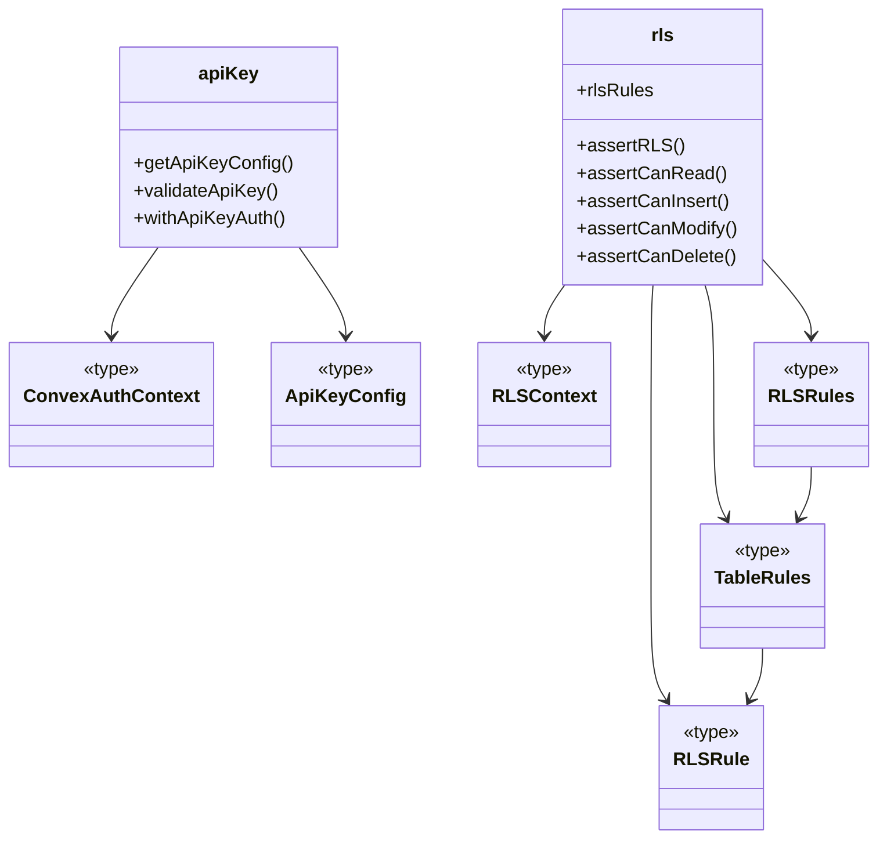
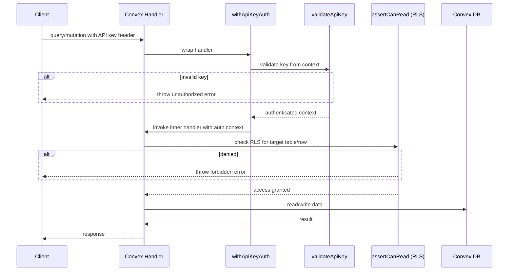

# Convex Auth & RLS

## Overview

Server-side authentication and authorization layer for LiminalDB's Convex backend. The module provides API key validation for authenticating inbound requests, shared type definitions for auth contexts, and a declarative row-level security (RLS) system that gates read, insert, modify, and delete operations per table. All Convex mutation and query handlers that touch user data flow through this module before accessing the database.

## Responsibilities

- Validate API keys from request headers against server-side configuration
- Provide a higher-order `withApiKeyAuth` wrapper that injects authenticated context into Convex functions
- Define per-table RLS rules (read, insert, modify, delete) as declarative policy objects
- Enforce RLS checks via assertion helpers (`assertCanRead`, `assertCanInsert`, `assertCanModify`, `assertCanDelete`)
- Export shared auth type definitions (`ConvexAuthContext`, `ApiKeyConfig`, `RLSContext`) consumed across the backend

## Structure Diagram

## Entity Table

| Name | Kind | Role | Public Entrypoints | Depends On | Used By |
| --- | --- | --- | --- | --- | --- |
| getApiKeyConfig | function | Reads API key configuration from environment / Convex context | convex/auth/apiKey.ts:getApiKeyConfig | convex/_generated/server.d.ts, ApiKeyConfig | convex/prompts.ts, convex/userPreferences.ts, convex/healthAuth.ts |
| validateApiKey | function | Validates an API key against configuration; throws on mismatch | convex/auth/apiKey.ts:validateApiKey | convex/_generated/server.d.ts, ApiKeyConfig | convex/prompts.ts, convex/userPreferences.ts, convex/healthAuth.ts |
| withApiKeyAuth | function | Higher-order wrapper injecting authenticated context into Convex handlers | convex/auth/apiKey.ts:withApiKeyAuth | convex/_generated/server.d.ts, ConvexAuthContext | convex/prompts.ts, convex/userPreferences.ts, convex/healthAuth.ts |
| rlsRules | variable | Declarative per-table RLS policy registry | convex/auth/rls.ts:rlsRules | RLSRules, RLSContext | convex/model/prompts.ts, convex/userPreferences.ts |
| assertRLS | function | General RLS assertion; delegates to operation-specific checks | convex/auth/rls.ts:assertRLS | RLSContext | convex/model/prompts.ts, convex/userPreferences.ts |
| assertCanRead | function | Asserts the authenticated user can read a given row | convex/auth/rls.ts:assertCanRead | RLSContext, rlsRules | convex/model/prompts.ts, convex/userPreferences.ts |
| assertCanInsert | function | Asserts the authenticated user can insert into a table | convex/auth/rls.ts:assertCanInsert | RLSContext, rlsRules | convex/model/prompts.ts, convex/userPreferences.ts |
| assertCanModify | function | Asserts the authenticated user can modify a row | convex/auth/rls.ts:assertCanModify | RLSContext, rlsRules | convex/model/prompts.ts, convex/userPreferences.ts |
| assertCanDelete | function | Asserts the authenticated user can delete a row | convex/auth/rls.ts:assertCanDelete | RLSContext, rlsRules | convex/model/prompts.ts, convex/userPreferences.ts |
| ConvexAuthContext | type | Represents the authenticated Convex request context | convex/auth/types.ts:ConvexAuthContext | none | convex/auth/apiKey.ts, convex/auth/rls.ts |
| ApiKeyConfig | type | Shape of API key configuration values | convex/auth/types.ts:ApiKeyConfig | none | convex/auth/apiKey.ts |
| RLSContext | type | Context passed into RLS rule evaluation (user identity + table + row) | convex/auth/types.ts:RLSContext | none | convex/auth/rls.ts |

## Key Flow

## Flow Notes

| Step | Actor/Component | Action | Output / Side Effect |
| --- | --- | --- | --- |
| 1 | Client | Sends a Convex query or mutation with an API key in the request header | Raw request reaches the Convex handler |
| 2 | withApiKeyAuth | Extracts and forwards the API key to `validateApiKey` | Authenticated `ConvexAuthContext` or an unauthorized error |
| 3 | validateApiKey | Compares the supplied key against `getApiKeyConfig` result | Passes if valid; throws if key is missing or incorrect |
| 4 | Convex Handler | Calls the appropriate RLS assertion (e.g. `assertCanRead`) with the auth context, table name, and target row | Access granted or forbidden error |
| 5 | Convex Handler | Performs the database read or write after both auth and RLS pass | Query/mutation result returned to the client |

## Source Coverage

- convex/auth.config.ts
- convex/auth/apiKey.ts
- convex/auth/rls.ts
- convex/auth/types.ts

## Cross-Module Context

- convex/auth/apiKey.ts -> convex/_generated/server.d.ts (import)
- convex/healthAuth.ts -> convex/auth/apiKey.ts (import)
- convex/model/prompts.ts -> convex/auth/rls.ts (import)
- convex/prompts.ts -> convex/auth/apiKey.ts (import)
- convex/userPreferences.ts -> convex/auth/apiKey.ts (import)
- convex/userPreferences.ts -> convex/auth/rls.ts (import)
- tests/convex/auth/apiKey.test.ts -> convex/auth/apiKey.ts (usage)
- tests/convex/auth/rls.test.ts -> convex/auth/rls.ts (usage)
- tests/convex/healthAuth.test.ts -> convex/auth/apiKey.ts (usage)
- tests/convex/healthAuth.test.ts -> convex/auth/types.ts (usage)
