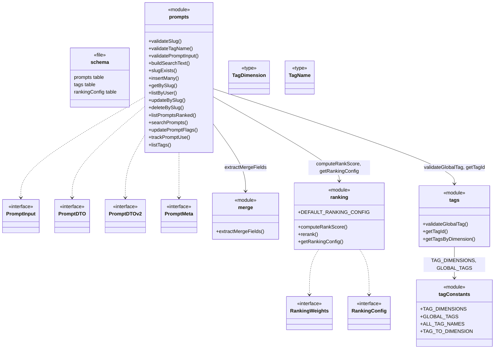
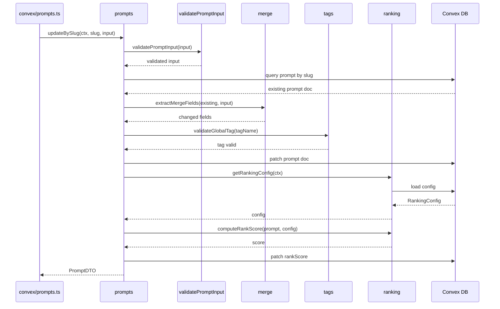

# Convex Data Model

## Overview

The Convex Data Model module is the domain model layer for LiminalDB, encapsulating all business logic for prompts, tags, ranking, and merge operations within the Convex backend. It is organized into four focused sub-modules (`prompts`, `tags`, `tagConstants`, `ranking`, `merge`) plus a schema definition, and is consumed by the Convex API layer (`convex/prompts.ts`), migrations, and an extensive test suite. The module enforces validation, slug-based addressing, tag taxonomy, weighted ranking, and partial-update merge semantics.

## Responsibilities

- Define the Convex database schema for prompts, tags, and ranking configuration
- Validate prompt inputs, slugs, and tag names before persistence
- CRUD operations for prompts scoped to authenticated users (slug-based addressing)
- Full-text search over prompts via a pre-built search text field
- Weighted ranking and re-ranking of prompts based on configurable scoring weights
- Partial-update merge field extraction for prompt updates
- Tag taxonomy management with typed dimensions, global tag constants, and DB-backed tag lookup
- Usage tracking for prompts (use-count increments)

## Structure Diagram

## Entity Table

| Name | Kind | Role | Public Entrypoints | Depends On | Used By |
| --- | --- | --- | --- | --- | --- |
| schema.ts | file | Defines Convex tables for prompts, tags, and ranking configuration | convex/schema.ts | none | Convex runtime |
| prompts | module | Core CRUD, search, validation, ranking, and usage-tracking logic for prompts | insertMany, getBySlug, listByUser, updateBySlug, deleteBySlug, listPromptsRanked, searchPrompts, trackPromptUse, listTags, validatePromptInput, buildSearchText | merge, ranking, tags, convex/auth/rls.ts | convex/prompts.ts, convex/migrations/backfillSearchText.ts |
| merge | module | Extracts changed fields from a partial prompt update for safe merging | extractMergeFields | none | prompts |
| ranking | module | Weighted rank-score computation and re-ranking of prompt lists | computeRankScore, rerank, getRankingConfig, DEFAULT_RANKING_CONFIG | none | prompts, convex/migrations/seedRankingConfig.ts |
| tags | module | Tag validation and DB lookup by name or dimension | validateGlobalTag, getTagId, getTagsByDimension | tagConstants | prompts |
| tagConstants | module | Static tag taxonomy: dimensions, global tag names, and dimension mapping | TAG_DIMENSIONS, GLOBAL_TAGS, ALL_TAG_NAMES, TAG_TO_DIMENSION | none | tags, convex/migrations/seedGlobalTags.ts |
| PromptInput | interface | Shape of caller-supplied data when creating or updating a prompt | convex/model/prompts.ts:PromptInput | none | prompts, convex/prompts.ts |
| PromptDTO / PromptDTOv2 | interface | Read-side data transfer objects returned from prompt queries | convex/model/prompts.ts:PromptDTO, convex/model/prompts.ts:PromptDTOv2 | none | prompts, convex/prompts.ts |
| RankingConfig / RankingWeights | interface | Configuration types controlling how prompt rank scores are computed | convex/model/ranking.ts:RankingConfig, convex/model/ranking.ts:RankingWeights | none | ranking, prompts |

## Key Flow

## Flow Notes

| Step | Actor/Component | Action | Output / Side Effect |
| --- | --- | --- | --- |
| 1 | API layer (convex/prompts.ts) | Calls updateBySlug with user context, slug, and partial input | Delegated to prompts model |
| 2 | prompts | Validates input via validatePromptInput (slug format, tag names, required fields) | Validated input or thrown error |
| 3 | prompts | Fetches existing prompt document by slug from DB | Existing prompt document |
| 4 | merge | extractMergeFields compares existing doc with input to isolate changed fields | Partial patch object with only changed fields |
| 5 | tags | validateGlobalTag ensures any supplied tags are in the global taxonomy | Validation pass or error |
| 6 | ranking | getRankingConfig loads weights from DB; computeRankScore derives a new score for the updated prompt | Numeric rank score persisted alongside prompt |
| 7 | prompts | Patches the prompt document and rank score in the DB, returns PromptDTO | Updated PromptDTO returned to API layer |

## Source Coverage

- convex/model/merge.ts
- convex/model/prompts.ts
- convex/model/ranking.ts
- convex/model/tagConstants.ts
- convex/model/tags.ts
- convex/schema.ts

## Cross-Module Context

- convex/migrations/backfillSearchText.ts -> convex/model/prompts.ts (import)
- convex/migrations/seedGlobalTags.ts -> convex/model/tagConstants.ts (import)
- convex/migrations/seedRankingConfig.ts -> convex/model/ranking.ts (import)
- convex/model/prompts.ts -> convex/_generated/dataModel.d.ts (import)
- convex/model/prompts.ts -> convex/_generated/server.d.ts (import)
- convex/model/prompts.ts -> convex/auth/rls.ts (import)
- convex/model/ranking.ts -> convex/_generated/server.d.ts (import)
- convex/model/tags.ts -> convex/_generated/dataModel.d.ts (import)
- convex/model/tags.ts -> convex/_generated/server.d.ts (import)
- convex/prompts.ts -> convex/model/prompts.ts (import)
- tests/convex/prompts/deleteBySlug.test.ts -> convex/model/prompts.ts (usage)
- tests/convex/prompts/getPromptBySlug.test.ts -> convex/model/prompts.ts (usage)
- tests/convex/prompts/insertPrompts.test.ts -> convex/model/prompts.ts (usage)
- tests/convex/prompts/mergeFields.test.ts -> convex/model/merge.ts (usage)
- tests/convex/prompts/ranking.test.ts -> convex/model/ranking.ts (usage)
- tests/convex/prompts/searchPrompts.test.ts -> convex/model/prompts.ts (usage)
- tests/convex/prompts/slugExists.test.ts -> convex/model/prompts.ts (usage)
- tests/convex/prompts/usageTracking.test.ts -> convex/model/prompts.ts (usage)
- tests/convex/prompts/validation.test.ts -> convex/model/prompts.ts (usage)
- tests/convex/tags/tagConstants.test.ts -> convex/model/tagConstants.ts (usage)
- tests/convex/tags/tags.test.ts -> convex/model/tagConstants.ts (usage)
- tests/convex/tags/tags.test.ts -> convex/model/tags.ts (usage)
