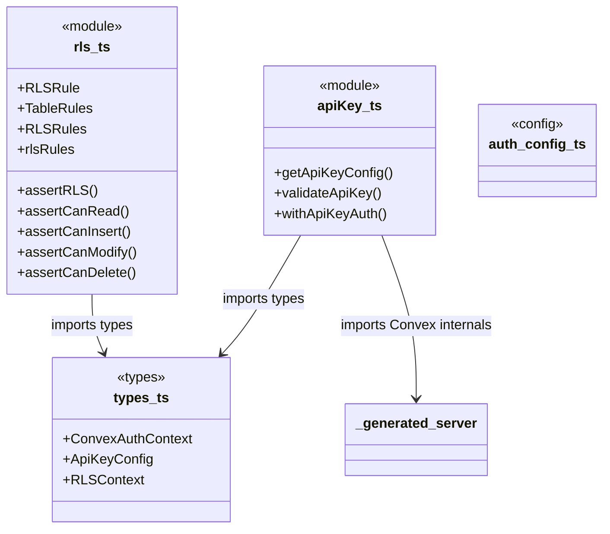
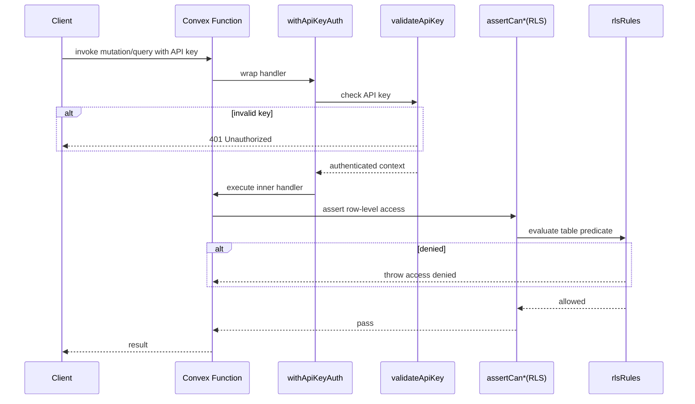

# Convex Auth & RLS

## Overview

Backend authentication and authorization layer for LiminalDB's Convex functions. The module provides API key validation (`apiKey.ts`) and declarative row-level security rules (`rls.ts`), unified through shared type contracts (`types.ts`). Every mutation and query handler that touches user data flows through this module to authenticate the caller and enforce per-table access policies.

## Responsibilities

- Validate inbound API keys against stored configuration and reject unauthenticated requests
- Provide a `withApiKeyAuth` higher-order wrapper that injects an authenticated context into Convex function handlers
- Define per-table RLS rules (read, insert, modify, delete) as a declarative rules map (`rlsRules`)
- Enforce row-level security via assertion helpers (`assertCanRead`, `assertCanInsert`, `assertCanModify`, `assertCanDelete`)
- Export shared type contracts (`ConvexAuthContext`, `ApiKeyConfig`, `RLSContext`) consumed by both auth subsystems

## Structure Diagram

## Entity Table

| Name | Kind | Role | Public Entrypoints | Depends On | Used By |
| --- | --- | --- | --- | --- | --- |
| getApiKeyConfig | function | Retrieves the API key configuration from environment or storage | convex/auth/apiKey.ts:getApiKeyConfig | ConvexAuthContext, ApiKeyConfig | convex/prompts.ts, convex/userPreferences.ts, convex/healthAuth.ts |
| validateApiKey | function | Validates an incoming API key against the stored configuration and returns auth status | convex/auth/apiKey.ts:validateApiKey | ConvexAuthContext, ApiKeyConfig | convex/prompts.ts, convex/userPreferences.ts, convex/healthAuth.ts |
| withApiKeyAuth | function | Higher-order wrapper that authenticates a Convex handler via API key before execution | convex/auth/apiKey.ts:withApiKeyAuth | validateApiKey, ConvexAuthContext | convex/prompts.ts, convex/userPreferences.ts, convex/healthAuth.ts |
| rlsRules | variable | Declarative map of per-table RLS policies (read/insert/modify/delete predicates) | convex/auth/rls.ts:rlsRules | RLSRule, TableRules, RLSContext | assertRLS, convex/model/prompts.ts, convex/userPreferences.ts |
| assertRLS | function | Generic RLS assertion — evaluates a named rule against a row and context | convex/auth/rls.ts:assertRLS | rlsRules, RLSContext | assertCanRead, assertCanInsert, assertCanModify, assertCanDelete |
| assertCanRead | function | Asserts the authenticated user may read the given row | convex/auth/rls.ts:assertCanRead | assertRLS | convex/model/prompts.ts, convex/userPreferences.ts |
| assertCanInsert | function | Asserts the authenticated user may insert a row into the target table | convex/auth/rls.ts:assertCanInsert | assertRLS | convex/model/prompts.ts, convex/userPreferences.ts |
| assertCanModify | function | Asserts the authenticated user may modify the given row | convex/auth/rls.ts:assertCanModify | assertRLS | convex/model/prompts.ts, convex/userPreferences.ts |
| assertCanDelete | function | Asserts the authenticated user may delete the given row | convex/auth/rls.ts:assertCanDelete | assertRLS | convex/model/prompts.ts, convex/userPreferences.ts |
| ConvexAuthContext | type | Type representing the authenticated Convex request context | convex/auth/types.ts:ConvexAuthContext | none | apiKey.ts, rls.ts |
| ApiKeyConfig | type | Shape of the API key configuration object | convex/auth/types.ts:ApiKeyConfig | none | apiKey.ts |
| RLSContext | type | Context passed into RLS rule predicates (includes user identity and table info) | convex/auth/types.ts:RLSContext | none | rls.ts |

## Key Flow

## Flow Notes

| Step | Actor/Component | Action | Output / Side Effect |
| --- | --- | --- | --- |
| 1 | Client | Sends a Convex function call with an API key in the request context | Raw request reaches the Convex handler |
| 2 | withApiKeyAuth | Intercepts the call and delegates to `validateApiKey` to verify the key | Authenticated `ConvexAuthContext` or 401 rejection |
| 3 | Convex Handler | Executes business logic; before data access calls an RLS assertion (e.g., `assertCanRead`) | RLS check invoked with table name, row, and auth context |
| 4 | assertCan* / rlsRules | Looks up the table's rule predicate in `rlsRules` and evaluates it against the RLSContext | Access granted (returns) or access denied (throws) |
| 5 | Convex Handler | Completes the operation and returns the result to the client | Query/mutation result delivered to caller |

## Source Coverage

- convex/auth.config.ts
- convex/auth/apiKey.ts
- convex/auth/rls.ts
- convex/auth/types.ts

## Cross-Module Context

- convex/auth/apiKey.ts -> convex/_generated/server.d.ts (import)
- convex/healthAuth.ts -> convex/auth/apiKey.ts (import)
- convex/model/prompts.ts -> convex/auth/rls.ts (import)
- convex/prompts.ts -> convex/auth/apiKey.ts (import)
- convex/userPreferences.ts -> convex/auth/apiKey.ts (import)
- convex/userPreferences.ts -> convex/auth/rls.ts (import)
- tests/convex/auth/apiKey.test.ts -> convex/auth/apiKey.ts (usage)
- tests/convex/auth/rls.test.ts -> convex/auth/rls.ts (usage)
- tests/convex/healthAuth.test.ts -> convex/auth/apiKey.ts (usage)
- tests/convex/healthAuth.test.ts -> convex/auth/types.ts (usage)
