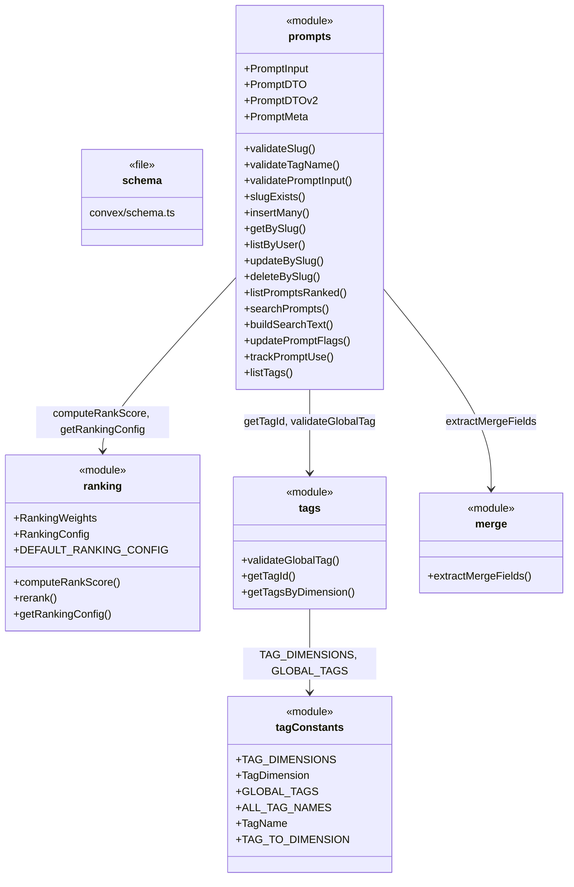
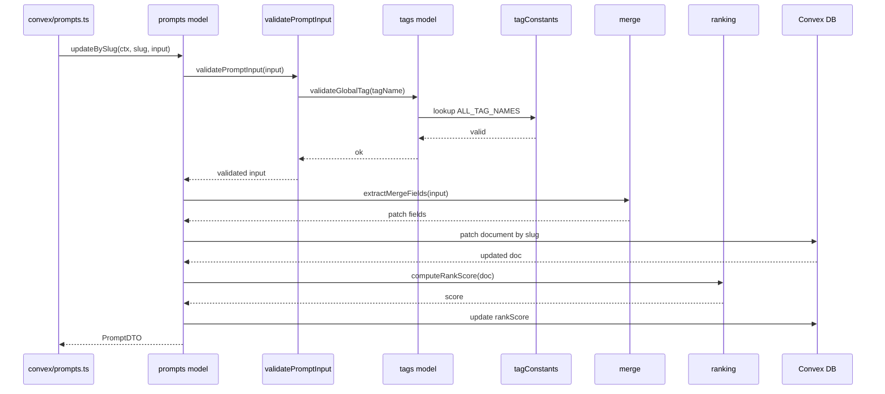

# Convex Data Model

## Overview

The Convex Data Model module defines the core domain layer for LiminalDB's prompt management system. It comprises the database schema (`convex/schema.ts`) and four model files that implement prompt CRUD, slug-based lookup, tag taxonomy, rank scoring, full-text search, and partial-update merge logic. All model functions operate against the Convex database through generated server/data-model types and enforce row-level security via `convex/auth/rls.ts`. The API layer (`convex/prompts.ts`) delegates directly to these model functions, keeping business logic centralized and testable.

## Responsibilities

- Define the Convex database schema for prompts, tags, ranking config, and related tables
- Validate prompt inputs including slug format, tag names, and field constraints
- Provide CRUD operations for prompts scoped to authenticated users (insert, get, update, delete by slug)
- Build and maintain full-text search indices via `buildSearchText` and `searchPrompts`
- Compute and apply rank scores to prompt listings using configurable weights (recency, usage, favorites)
- Manage a typed tag taxonomy with dimensions, global tag constants, and DB-backed tag resolution
- Extract merge fields for partial prompt updates to support PATCH-style mutations
- Track prompt usage events for ranking and analytics

## Structure Diagram

## Entity Table

| Name | Kind | Role | Public Entrypoints | Depends On | Used By |
| --- | --- | --- | --- | --- | --- |
| schema.ts | file | Defines all Convex database tables, indexes, and search indexes for the application | convex/schema.ts | none | none |
| prompts | module | Central model providing prompt CRUD, validation, search, ranking delegation, and tag listing | insertMany, getBySlug, listByUser, updateBySlug, deleteBySlug, listPromptsRanked, searchPrompts, buildSearchText, trackPromptUse, listTags, validatePromptInput | ranking, tags, merge, convex/auth/rls.ts | convex/prompts.ts, convex/migrations/backfillSearchText.ts |
| ranking | module | Implements rank scoring with configurable weights and provides DB-stored ranking config | computeRankScore, rerank, getRankingConfig, DEFAULT_RANKING_CONFIG | none | prompts, convex/migrations/seedRankingConfig.ts |
| tags | module | Resolves tag names to DB IDs and queries tags by dimension | validateGlobalTag, getTagId, getTagsByDimension | tagConstants | prompts |
| tagConstants | module | Defines the canonical tag taxonomy: dimensions, global tag names, and dimension mappings | TAG_DIMENSIONS, GLOBAL_TAGS, ALL_TAG_NAMES, TAG_TO_DIMENSION | none | tags, convex/migrations/seedGlobalTags.ts |
| merge | module | Extracts defined fields from partial input for PATCH-style prompt updates | extractMergeFields | none | prompts |

## Key Flow

## Flow Notes

| Step | Actor/Component | Action | Output / Side Effect |
| --- | --- | --- | --- |
| 1 | API layer (convex/prompts.ts) | Receives an updateBySlug mutation with slug and partial input | Delegates to prompts model |
| 2 | prompts model | Validates the input via validatePromptInput, which checks slug format and tag names against the tag taxonomy | Validated input or thrown error |
| 3 | merge module | extractMergeFields pulls only defined fields from the partial input for a safe PATCH | Patch object with only supplied fields |
| 4 | prompts model | Applies the patch to the Convex document identified by slug | Updated document in DB |
| 5 | ranking module | computeRankScore recalculates the rank score based on updated metadata and configured weights | New rank score persisted on the document |
| 6 | prompts model | Returns a PromptDTO projection of the updated document to the API layer | PromptDTO response |

## Source Coverage

- convex/model/merge.ts
- convex/model/prompts.ts
- convex/model/ranking.ts
- convex/model/tagConstants.ts
- convex/model/tags.ts
- convex/schema.ts

## Cross-Module Context

- convex/migrations/backfillSearchText.ts -> convex/model/prompts.ts (import)
- convex/migrations/seedGlobalTags.ts -> convex/model/tagConstants.ts (import)
- convex/migrations/seedRankingConfig.ts -> convex/model/ranking.ts (import)
- convex/model/prompts.ts -> convex/_generated/dataModel.d.ts (import)
- convex/model/prompts.ts -> convex/_generated/server.d.ts (import)
- convex/model/prompts.ts -> convex/auth/rls.ts (import)
- convex/model/ranking.ts -> convex/_generated/server.d.ts (import)
- convex/model/tags.ts -> convex/_generated/dataModel.d.ts (import)
- convex/model/tags.ts -> convex/_generated/server.d.ts (import)
- convex/prompts.ts -> convex/model/prompts.ts (import)
- tests/convex/prompts/deleteBySlug.test.ts -> convex/model/prompts.ts (usage)
- tests/convex/prompts/getPromptBySlug.test.ts -> convex/model/prompts.ts (usage)
- tests/convex/prompts/insertPrompts.test.ts -> convex/model/prompts.ts (usage)
- tests/convex/prompts/mergeFields.test.ts -> convex/model/merge.ts (usage)
- tests/convex/prompts/ranking.test.ts -> convex/model/ranking.ts (usage)
- tests/convex/prompts/searchPrompts.test.ts -> convex/model/prompts.ts (usage)
- tests/convex/prompts/slugExists.test.ts -> convex/model/prompts.ts (usage)
- tests/convex/prompts/usageTracking.test.ts -> convex/model/prompts.ts (usage)
- tests/convex/prompts/validation.test.ts -> convex/model/prompts.ts (usage)
- tests/convex/tags/tagConstants.test.ts -> convex/model/tagConstants.ts (usage)
- tests/convex/tags/tags.test.ts -> convex/model/tagConstants.ts (usage)
- tests/convex/tags/tags.test.ts -> convex/model/tags.ts (usage)
