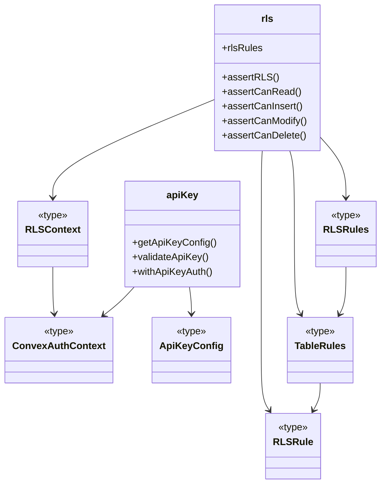
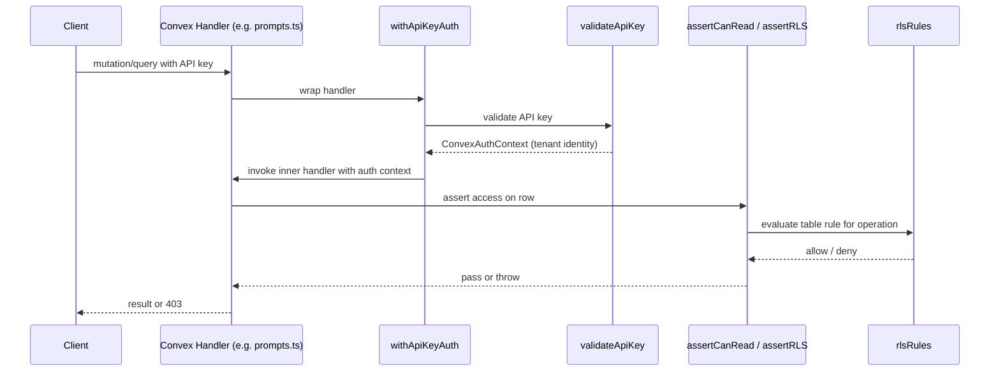

# Convex Auth & RLS

## Overview

The Convex Auth & RLS module implements server-side authentication and row-level security for LiminalDB's Convex backend. It provides API key validation for incoming requests and a declarative RLS rule system that enforces multi-tenant data isolation. All Convex mutations and queries that touch tenant data flow through this module to verify identity and authorize access.

## Responsibilities

- Validate API keys from incoming Convex function calls against stored configuration
- Provide a higher-order `withApiKeyAuth` wrapper that injects authenticated context into Convex handlers
- Define per-table RLS rules (read, insert, modify, delete) as a declarative rule set
- Enforce row-level security assertions (`assertCanRead`, `assertCanInsert`, `assertCanModify`, `assertCanDelete`) scoped to the authenticated tenant
- Export shared auth types (`ConvexAuthContext`, `ApiKeyConfig`, `RLSContext`) consumed across the Convex layer

## Structure Diagram

## Entity Table

| Name | Kind | Role | Public Entrypoints | Depends On | Used By |
| --- | --- | --- | --- | --- | --- |
| getApiKeyConfig | function | Retrieves API key configuration from the Convex environment | convex/auth/apiKey.ts:getApiKeyConfig | convex/_generated/server.d.ts, ApiKeyConfig | convex/healthAuth.ts, convex/prompts.ts, convex/userPreferences.ts |
| validateApiKey | function | Validates an API key against stored configuration and returns auth context | convex/auth/apiKey.ts:validateApiKey | convex/_generated/server.d.ts, ApiKeyConfig | convex/healthAuth.ts, convex/prompts.ts, convex/userPreferences.ts |
| withApiKeyAuth | function | Higher-order wrapper that authenticates a Convex handler via API key before execution | convex/auth/apiKey.ts:withApiKeyAuth | convex/_generated/server.d.ts, ConvexAuthContext | convex/healthAuth.ts, convex/prompts.ts, convex/userPreferences.ts |
| rlsRules | variable | Declarative map of per-table RLS rules defining read/insert/modify/delete policies | convex/auth/rls.ts:rlsRules | RLSRules, RLSContext | convex/model/prompts.ts, convex/userPreferences.ts |
| assertRLS | function | Core RLS enforcement — evaluates the relevant rule for a given operation and table | convex/auth/rls.ts:assertRLS | RLSContext, RLSRules | convex/model/prompts.ts, convex/userPreferences.ts |
| assertCanRead | function | Convenience wrapper asserting read permission on a row | convex/auth/rls.ts:assertCanRead | assertRLS | convex/model/prompts.ts, convex/userPreferences.ts |
| assertCanInsert | function | Convenience wrapper asserting insert permission for the tenant | convex/auth/rls.ts:assertCanInsert | assertRLS | convex/model/prompts.ts, convex/userPreferences.ts |
| assertCanModify | function | Convenience wrapper asserting modify permission on a row | convex/auth/rls.ts:assertCanModify | assertRLS | convex/model/prompts.ts, convex/userPreferences.ts |
| assertCanDelete | function | Convenience wrapper asserting delete permission on a row | convex/auth/rls.ts:assertCanDelete | assertRLS | convex/model/prompts.ts, convex/userPreferences.ts |
| ConvexAuthContext | type | Authenticated context type carrying tenant identity through Convex handlers | convex/auth/types.ts:ConvexAuthContext | none | apiKey, rls |
| ApiKeyConfig | type | Shape of API key configuration retrieved from environment | convex/auth/types.ts:ApiKeyConfig | none | apiKey |
| RLSContext | type | Context passed into RLS rule evaluators, extending ConvexAuthContext with table/row info | convex/auth/types.ts:RLSContext | none | rls |

## Key Flow

## Flow Notes

| Step | Actor/Component | Action | Output / Side Effect |
| --- | --- | --- | --- |
| 1 | Client | Sends a Convex mutation or query with an API key in the request arguments | Raw request reaches a Convex handler |
| 2 | withApiKeyAuth | Intercepts the handler, extracts the API key, and delegates to validateApiKey | ConvexAuthContext containing verified tenant identity |
| 3 | validateApiKey | Looks up API key config via getApiKeyConfig and compares the supplied key | Authenticated context or thrown authentication error |
| 4 | Convex Handler | Executes business logic and calls an RLS assertion (e.g. assertCanRead) before returning data | RLS check invoked with auth context and target row |
| 5 | assertRLS | Evaluates the matching rule from rlsRules for the table and operation | Access granted (no-op) or authorization error thrown |

## Source Coverage

- convex/auth.config.ts
- convex/auth/apiKey.ts
- convex/auth/rls.ts
- convex/auth/types.ts

## Cross-Module Context

- convex/auth/apiKey.ts -> convex/_generated/server.d.ts (import)
- convex/healthAuth.ts -> convex/auth/apiKey.ts (import)
- convex/model/prompts.ts -> convex/auth/rls.ts (import)
- convex/prompts.ts -> convex/auth/apiKey.ts (import)
- convex/userPreferences.ts -> convex/auth/apiKey.ts (import)
- convex/userPreferences.ts -> convex/auth/rls.ts (import)
- tests/convex/auth/apiKey.test.ts -> convex/auth/apiKey.ts (usage)
- tests/convex/auth/rls.test.ts -> convex/auth/rls.ts (usage)
- tests/convex/healthAuth.test.ts -> convex/auth/apiKey.ts (usage)
- tests/convex/healthAuth.test.ts -> convex/auth/types.ts (usage)
