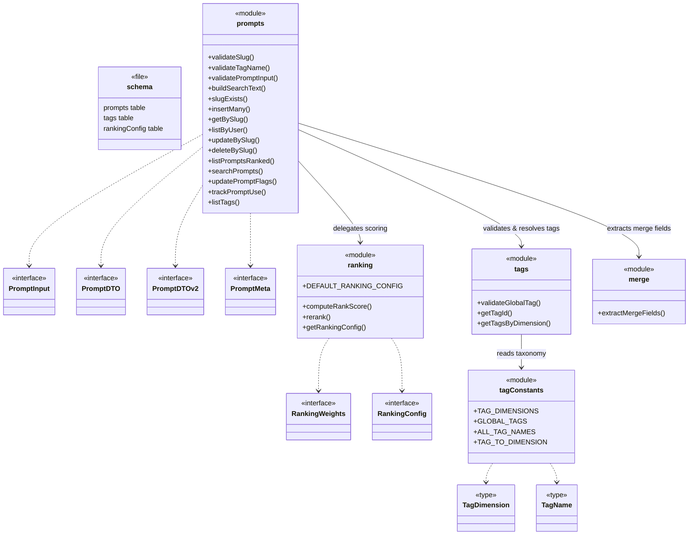
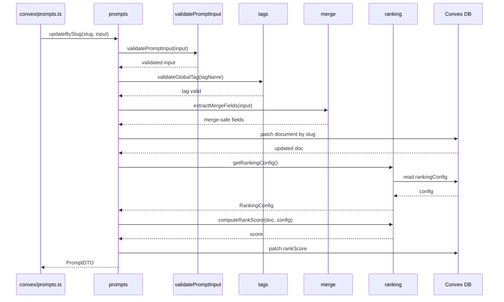

# Convex Data Model

## Overview

The Convex Data Model module defines the core domain logic for LiminalDB's prompt management system. It is organized into four focused files under `convex/model/` — prompts, tags, ranking, and merge — plus the Convex schema definition. The `prompts` module is the primary façade, orchestrating validation, CRUD operations, search, usage tracking, and ranked listing by delegating to the supporting ranking, tags, and merge sub-modules. All functions execute within Convex server functions and operate against the Convex database via generated data-model types.

## Responsibilities

- Define the Convex database schema for prompts, tags, ranking config, and related tables
- Validate prompt inputs (slug format, tag names, required fields) before persistence
- Provide slug-based CRUD operations (insertMany, getBySlug, updateBySlug, deleteBySlug) with row-level security enforcement
- Build full-text search indexes and execute prompt search queries
- Track prompt usage counts and timestamps for ranking signals
- Compute rank scores using configurable weights (recency, usage, freshness) and re-rank prompt lists
- Manage a global tag taxonomy organized by dimensions (e.g., category, domain) with validation
- Extract merge-safe fields from prompt updates to support partial/merge-style mutations

## Structure Diagram

## Entity Table

| Name | Kind | Role | Public Entrypoints | Depends On | Used By |
| --- | --- | --- | --- | --- | --- |
| schema.ts | file | Convex schema definition for prompts, tags, and ranking config tables | convex/schema.ts | none | Convex runtime |
| prompts | module | Primary domain façade: validation, CRUD, search, usage tracking, and ranked listing of prompts | validateSlug, validateTagName, validatePromptInput, buildSearchText, slugExists, insertMany, getBySlug, listByUser, updateBySlug, deleteBySlug, listPromptsRanked, searchPrompts, updatePromptFlags, trackPromptUse, listTags | ranking, tags, merge, convex/auth/rls.ts | convex/prompts.ts, convex/migrations/backfillSearchText.ts |
| PromptInput | interface | Shape of caller-supplied data when creating or updating a prompt | convex/model/prompts.ts:PromptInput | none | prompts |
| PromptDTO / PromptDTOv2 | interface | Read-side data transfer objects returned to callers (v1 and v2 shapes) | convex/model/prompts.ts:PromptDTO, convex/model/prompts.ts:PromptDTOv2 | none | prompts, convex/prompts.ts |
| PromptMeta | interface | Lightweight metadata projection of a prompt (used in lists) | convex/model/prompts.ts:PromptMeta | none | prompts |
| ranking | module | Computes and applies rank scores to prompts using configurable weight parameters | computeRankScore, rerank, getRankingConfig, DEFAULT_RANKING_CONFIG | convex/_generated/server.d.ts | prompts, convex/migrations/seedRankingConfig.ts |
| RankingWeights / RankingConfig | interface | Configuration interfaces for ranking weight tuning and storage | convex/model/ranking.ts:RankingWeights, convex/model/ranking.ts:RankingConfig | none | ranking, prompts |
| tags | module | Validates, resolves, and queries global tags from the database | validateGlobalTag, getTagId, getTagsByDimension | tagConstants, convex/_generated/server.d.ts | prompts |
| tagConstants | module | Static taxonomy of tag dimensions, global tag names, and dimension-lookup maps | TAG_DIMENSIONS, GLOBAL_TAGS, ALL_TAG_NAMES, TAG_TO_DIMENSION | none | tags, convex/migrations/seedGlobalTags.ts |
| merge | module | Extracts safe-to-merge fields from partial prompt updates | extractMergeFields | none | prompts |

## Key Flow

## Flow Notes

| Step | Actor/Component | Action | Output / Side Effect |
| --- | --- | --- | --- |
| 1 | Caller (convex/prompts.ts) | Invokes updateBySlug with a slug and partial prompt input | Delegated to prompts model |
| 2 | prompts | Runs validatePromptInput to check slug format, required fields, and tag names | Validated input or thrown error |
| 3 | tags | validateGlobalTag confirms each tag exists in the global taxonomy | Validation pass/fail |
| 4 | merge | extractMergeFields strips non-updatable fields, returning safe-to-patch object | Merge-safe field set |
| 5 | prompts | Patches the prompt document in Convex DB by slug | Updated document |
| 6 | ranking | Loads RankingConfig then computes a new rankScore for the updated prompt | Numeric rank score persisted to document |
| 7 | prompts | Returns the updated PromptDTO to the caller | PromptDTO response |

## Source Coverage

- convex/model/merge.ts
- convex/model/prompts.ts
- convex/model/ranking.ts
- convex/model/tagConstants.ts
- convex/model/tags.ts
- convex/schema.ts

## Cross-Module Context

- convex/migrations/backfillSearchText.ts -> convex/model/prompts.ts (import)
- convex/migrations/seedGlobalTags.ts -> convex/model/tagConstants.ts (import)
- convex/migrations/seedRankingConfig.ts -> convex/model/ranking.ts (import)
- convex/model/prompts.ts -> convex/_generated/dataModel.d.ts (import)
- convex/model/prompts.ts -> convex/_generated/server.d.ts (import)
- convex/model/prompts.ts -> convex/auth/rls.ts (import)
- convex/model/ranking.ts -> convex/_generated/server.d.ts (import)
- convex/model/tags.ts -> convex/_generated/dataModel.d.ts (import)
- convex/model/tags.ts -> convex/_generated/server.d.ts (import)
- convex/prompts.ts -> convex/model/prompts.ts (import)
- tests/convex/prompts/deleteBySlug.test.ts -> convex/model/prompts.ts (usage)
- tests/convex/prompts/getPromptBySlug.test.ts -> convex/model/prompts.ts (usage)
- tests/convex/prompts/insertPrompts.test.ts -> convex/model/prompts.ts (usage)
- tests/convex/prompts/mergeFields.test.ts -> convex/model/merge.ts (usage)
- tests/convex/prompts/ranking.test.ts -> convex/model/ranking.ts (usage)
- tests/convex/prompts/searchPrompts.test.ts -> convex/model/prompts.ts (usage)
- tests/convex/prompts/slugExists.test.ts -> convex/model/prompts.ts (usage)
- tests/convex/prompts/usageTracking.test.ts -> convex/model/prompts.ts (usage)
- tests/convex/prompts/validation.test.ts -> convex/model/prompts.ts (usage)
- tests/convex/tags/tagConstants.test.ts -> convex/model/tagConstants.ts (usage)
- tests/convex/tags/tags.test.ts -> convex/model/tagConstants.ts (usage)
- tests/convex/tags/tags.test.ts -> convex/model/tags.ts (usage)
