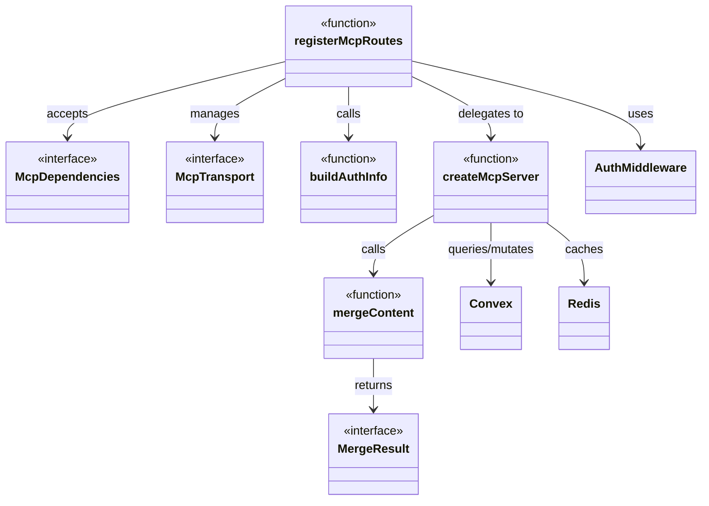
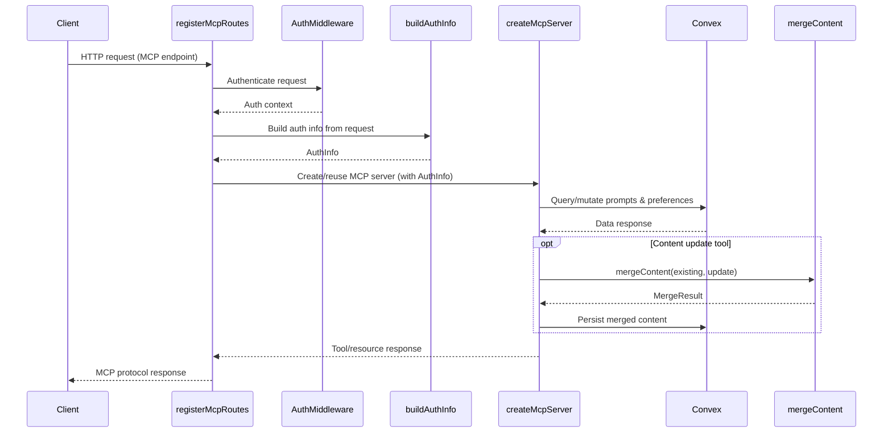

# MCP Server

## Overview

The MCP Server module implements the Model Context Protocol server for LiminalDB. It provides a layered architecture: route registration and transport handling in `src/api/mcp.ts`, core server creation with tool/resource definitions in `src/lib/mcp.ts`, and content merge logic in `src/lib/merge.ts`. The route layer wires authenticated HTTP endpoints to per-session MCP server instances that interact with Convex (data), Redis (caching), and schema definitions.

## Responsibilities

- Register MCP HTTP routes with authentication middleware
- Build per-request auth info from incoming connections
- Create and configure MCP server instances with tool and resource handlers
- Define MCP tools backed by Convex queries/mutations for prompts and preferences
- Provide content merge logic for combining prompt content updates
- Manage MCP transport lifecycle (session creation, message routing)

## Structure Diagram

## Entity Table

| Name | Kind | Role | Public Entrypoints | Depends On | Used By |
| --- | --- | --- | --- | --- | --- |
| registerMcpRoutes | function | Registers MCP HTTP endpoints on the app router with auth middleware, creating per-session MCP servers | src/api/mcp.ts:registerMcpRoutes | src/lib/auth/index.ts, src/lib/config.ts, src/lib/mcp.ts, src/middleware/auth.ts | src/index.ts |
| buildAuthInfo | function | Extracts and constructs authentication info from incoming MCP requests | src/api/mcp.ts:buildAuthInfo | src/lib/auth/index.ts, src/lib/config.ts | src/index.ts, tests/service/auth/mcp.test.ts |
| McpDependencies | interface | Defines the dependency injection contract for MCP route registration | src/api/mcp.ts:McpDependencies | none | src/index.ts |
| McpTransport | interface | Defines the transport abstraction for MCP session communication | src/api/mcp.ts:McpTransport | none | src/index.ts |
| createMcpServer | function | Creates a configured MCP server instance with tool definitions, resource handlers, and backend integrations | src/lib/mcp.ts:createMcpServer | convex/_generated/api.d.ts, src/lib/config.ts, src/lib/convex.ts, src/lib/merge.ts, src/lib/redis.ts, src/schemas/preferences.ts, src/schemas/prompts.ts | src/api/mcp.ts, tests/service/mcp/toolHandlers.test.ts |
| mergeContent | function | Merges updated content fields into existing prompt content, returning a MergeResult | src/lib/merge.ts:mergeContent | none | src/lib/mcp.ts, src/routes/prompts.ts, tests/service/lib/merge.test.ts |
| MergeResult | interface | Describes the outcome of a content merge operation | src/lib/merge.ts:MergeResult | none | src/lib/mcp.ts, src/routes/prompts.ts |

## Key Flow

## Flow Notes

| Step | Actor/Component | Action | Output / Side Effect |
| --- | --- | --- | --- |
| 1 | Client | Sends an HTTP request to an MCP endpoint | Raw HTTP request with auth credentials |
| 2 | registerMcpRoutes | Routes the request through auth middleware and calls buildAuthInfo | Authenticated AuthInfo object |
| 3 | createMcpServer | Handles the MCP tool/resource invocation, querying Convex for data | Data from Convex backend |
| 4 | mergeContent | Merges content updates when a prompt update tool is invoked | MergeResult indicating merged content and change status |
| 5 | createMcpServer | Returns the tool/resource response through the MCP transport | MCP protocol response to client |

## Source Coverage

- src/api/mcp.ts
- src/lib/mcp.ts
- src/lib/merge.ts

## Cross-Module Context

- src/api/mcp.ts -> src/lib/auth/index.ts (import)
- src/api/mcp.ts -> src/lib/config.ts (import)
- src/api/mcp.ts -> src/middleware/auth.ts (import)
- src/index.ts -> src/api/mcp.ts (usage)
- src/lib/mcp.ts -> convex/_generated/api.d.ts (import)
- src/lib/mcp.ts -> src/lib/config.ts (import)
- src/lib/mcp.ts -> src/lib/convex.ts (import)
- src/lib/mcp.ts -> src/lib/redis.ts (import)
- src/lib/mcp.ts -> src/schemas/preferences.ts (import)
- src/lib/mcp.ts -> src/schemas/prompts.ts (import)
- src/routes/prompts.ts -> src/lib/merge.ts (import)
- tests/service/auth/mcp.test.ts -> src/api/mcp.ts (usage)
- tests/service/lib/merge.test.ts -> src/lib/merge.ts (usage)
- tests/service/mcp/auth-challenge.test.ts -> src/api/mcp.ts (usage)
- tests/service/mcp/resources.test.ts -> src/api/mcp.ts (usage)
- tests/service/mcp/toolHandlers.test.ts -> src/lib/mcp.ts (usage)
- tests/service/mcp/tools.test.ts -> src/api/mcp.ts (usage)
- tests/service/prompts/mcpTools.test.ts -> src/api/mcp.ts (usage)
