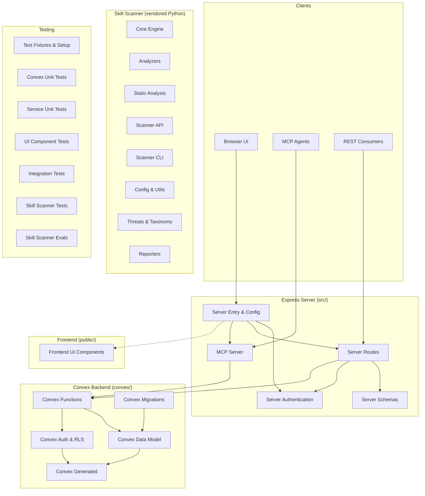

# LiminalDB — Repository Overview

LiminalDB is a multi-tenant prompt management platform with a TypeScript/Express server, a Convex real-time backend, an MCP (Model Context Protocol) integration layer, a browser-based UI, and a vendored Python skill-scanner security tool. The codebase spans **336 files** organized into the module groups described below.

---

## Architecture at a Glance

The system follows a layered architecture:

1. **Clients** (browser UI, MCP-connected AI agents, REST API consumers) connect to the Express server.
2. The **Express server** authenticates requests (JWT / API key), validates payloads (Zod schemas), and delegates to Convex or Redis.
3. **Convex** provides the real-time database with server-side auth, row-level security, domain models, and migrations.
4. A **vendored skill-scanner** ships alongside the main app for security analysis of skill packages.



---

## Module Directory

The repository is organized into **28 modules** across five major areas.

### Core Server (`src/`)

| Module | Responsibility |
|--------|---------------|
| [Server Entry & Config](server-entry--config.md) | Application bootstrap, configuration, Convex/WorkOS/Redis clients, error codes |
| [Server Authentication](server-authentication.md) | JWT decoding/validation, token extraction, auth middleware |
| [Server Routes](server-routes.md) | HTTP route handlers for prompts, drafts, auth flows, preferences, import/export, modules, and well-known endpoints |
| [Server Schemas](server-schemas.md) | Zod validation schemas for all API payloads |
| [MCP Server](mcp-server.md) | Model Context Protocol server with tool/resource definitions and merge logic |

### Convex Backend (`convex/`)

| Module | Responsibility |
|--------|---------------|
| [Convex Auth & RLS](convex-auth--rls.md) | API key validation and row-level security for multi-tenant data isolation |
| [Convex Data Model](convex-data-model.md) | Domain models for prompts, tags, ranking, and merge logic |
| [Convex Functions](convex-functions.md) | Query/mutation endpoints, triggers, health checks, user preferences |
| [Convex Generated](convex-generated.md) | Auto-generated type-safe API bindings (do not edit) |
| [Convex Migrations](convex-migrations.md) | Data migration scripts for schema evolution |

### Frontend (`public/`)

| Module | Responsibility |
|--------|---------------|
| [Frontend UI Components](frontend-ui-components.md) | Prompt editor/viewer, merge mode, tag selector, modal, toast, and utilities |

### Skill Scanner (vendored Python)

| Module | Responsibility |
|--------|---------------|
| [Skill Scanner Core](skill-scanner-core.md) | Scanning engine: models, loader, orchestrator, policy, rules, extractors |
| [Skill Scanner Analyzers](skill-scanner-analyzers.md) | Static, behavioral, LLM, bytecode, pipeline, cross-skill, and meta analyzers |
| [Skill Scanner Static Analysis](skill-scanner-static-analysis.md) | AST parsing, CFG, taint tracking, dataflow, interprocedural analysis |
| [Skill Scanner API](skill-scanner-api.md) | FastAPI REST server for scan endpoints |
| [Skill Scanner CLI](skill-scanner-cli.md) | CLI, interactive wizard, and policy TUI |
| [Skill Scanner Config & Utils](skill-scanner-config--utils.md) | Configuration, constants, logging, YARA modes, file utilities |
| [Skill Scanner Threats & Taxonomy](skill-scanner-threats--taxonomy.md) | Threat mappings, Cisco AI taxonomy, rule-based security checks |
| [Skill Scanner Reporters](skill-scanner-reporters.md) | JSON, Markdown, HTML, SARIF, and table output formatters |
| [Skill Scanner Examples](skill-scanner-examples.md) | Usage examples for the scanner library |
| [Skill Scanner Scripts](skill-scanner-scripts.md) | Maintenance scripts for taxonomy, docs, and Homebrew formula |

### Testing & Tooling

| Module | Responsibility |
|--------|---------------|
| [Test Fixtures & Setup](test-fixtures--setup.md) | Shared mocks, fixture data, JWT helpers, Vitest config |
| [Convex Unit Tests](convex-unit-tests.md) | Unit tests for auth, RLS, prompts model, tags, and health |
| [Service Unit Tests](service-unit-tests.md) | Unit tests for routes, auth middleware, MCP, drafts, preferences, merge, Redis |
| [UI Component Tests](ui-component-tests.md) | Tests for prompt editor/viewer, merge mode, tag selector, modals, theming |
| [Integration Tests](integration-tests.md) | End-to-end tests covering auth, health, CRUD, MCP, import/export, and UI |
| [Skill Scanner Tests](skill-scanner-tests.md) | Comprehensive test suite for all scanner layers |
| [Skill Scanner Evals](skill-scanner-evals.md) | Benchmark runners and accuracy evaluation framework |

### Ancillary

| Module | Responsibility |
|--------|---------------|
| [Liminal Spec](liminal-spec.md) | Build and validation tooling for the Liminal prompt format specification |
| [Dev Scripts](dev-scripts.md) | Utility scripts for seeding data, creating test users, debugging sessions |

---

## Key Data Flows

### Request → Response (Prompt CRUD)

```
Client → Express Router → Auth Middleware → Zod Validation → Convex Client → Convex Function → Data Model + RLS → Response
```

### MCP Tool Invocation

```
AI Agent → MCP Transport → Auth Challenge → MCP Server Instance → Convex + Redis → Tool Response
```

---

## Getting Started

Explore each module by following the links in the tables above. For understanding the core application flow, start with:

1. **[Server Entry & Config](server-entry--config.md)** — how the app boots
2. **[Server Authentication](server-authentication.md)** — how requests are authenticated
3. **[Convex Data Model](convex-data-model.md)** — the domain logic
4. **[Server Routes](server-routes.md)** — the full API surface
5. **[MCP Server](mcp-server.md)** — AI agent integration
