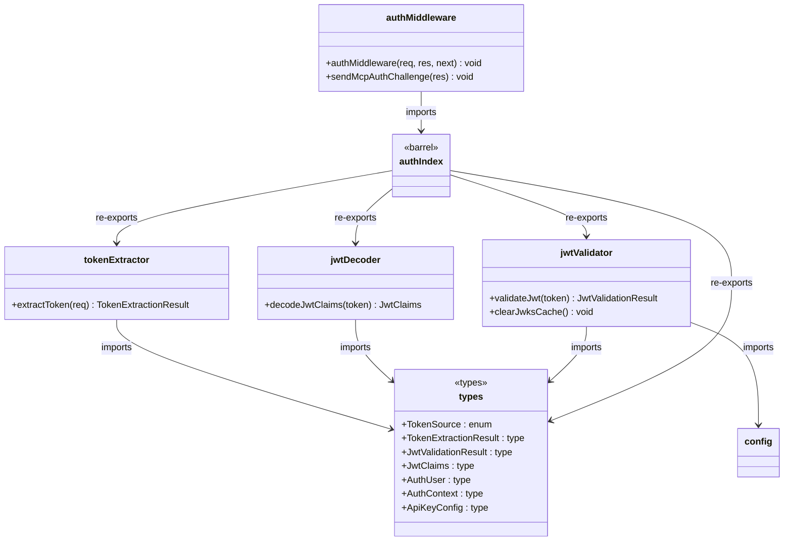
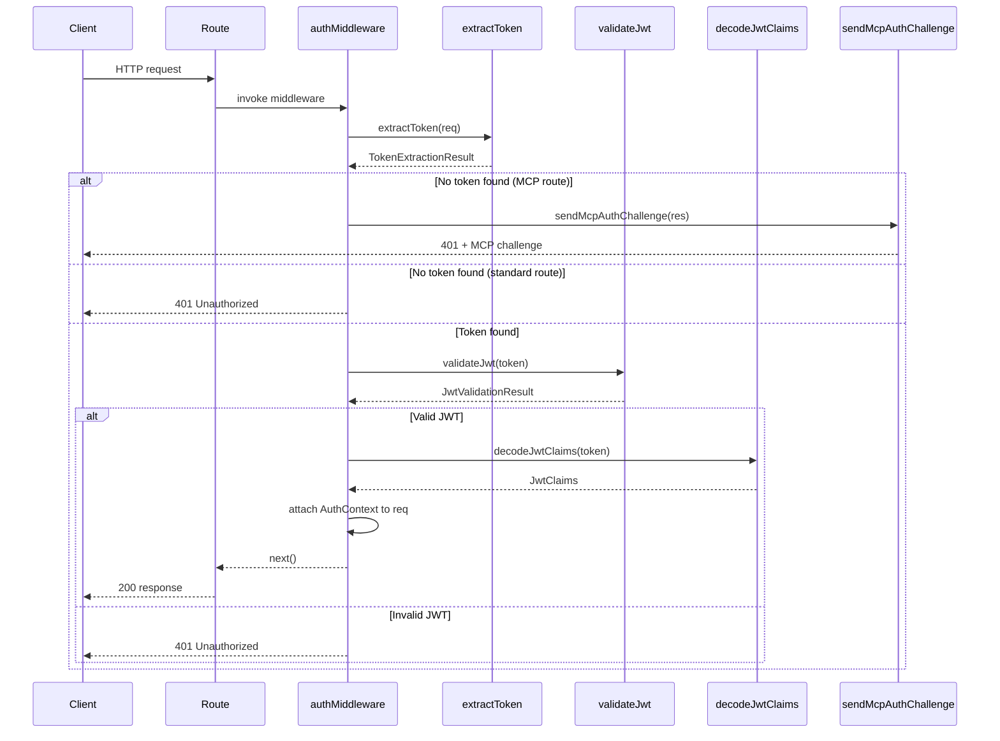

# Server Authentication

## Overview

The Server Authentication module provides JWT-based authentication for the LiminalDB service layer. It is organized as a small library (`src/lib/auth/`) of composable functions—token extraction, JWT decoding, and JWT validation—plus an Express-style auth middleware (`src/middleware/auth.ts`) that wires them together. The barrel `index.ts` re-exports all public symbols so consumers import from a single path. The module supports both Bearer-token and API-key authentication sources and includes an MCP-specific auth challenge flow.

## Responsibilities

- Extract bearer tokens or API keys from incoming HTTP requests (Authorization header, query params, etc.)
- Decode JWT claims without cryptographic verification for lightweight introspection
- Validate JWTs against JWKS endpoints with caching and cache-clearing support
- Define shared auth type contracts (AuthUser, AuthContext, JwtClaims, TokenSource, etc.)
- Provide Express middleware that gates route handlers behind authentication
- Send MCP-protocol-compliant authentication challenges for unauthenticated MCP requests

## Structure Diagram

## Entity Table

| Name | Kind | Role | Public Entrypoints | Depends On | Used By |
| --- | --- | --- | --- | --- | --- |
| types.ts | type-definitions | Shared auth type contracts: TokenSource enum, TokenExtractionResult, JwtValidationResult, JwtClaims, AuthUser, AuthContext, ApiKeyConfig | TokenSource, TokenExtractionResult, JwtValidationResult, JwtClaims, AuthUser, AuthContext, ApiKeyConfig | none | tokenExtractor, jwtDecoder, jwtValidator, authIndex |
| extractToken | function | Extracts a bearer token or API key from an HTTP request, returning a TokenExtractionResult with source metadata | extractToken | types.ts | authIndex, authMiddleware, src/index.ts, tests |
| decodeJwtClaims | function | Decodes JWT payload claims without cryptographic verification for lightweight introspection | decodeJwtClaims | types.ts | authIndex |
| validateJwt | function | Validates a JWT against a JWKS endpoint, returning a JwtValidationResult | validateJwt | types.ts, src/lib/config.ts | authIndex |
| clearJwksCache | function | Clears the cached JWKS key set to force re-fetch on next validation | clearJwksCache | src/lib/config.ts | authIndex |
| authIndex (barrel) | file | Barrel re-export that unifies all auth library symbols into a single import path | src/lib/auth/index.ts | tokenExtractor, jwtDecoder, jwtValidator, types.ts | authMiddleware, src/api/mcp.ts |
| authMiddleware | function | Express middleware that extracts and validates tokens, attaching AuthContext to the request or rejecting with 401 | authMiddleware | authIndex | src/routes/prompts.ts, src/routes/drafts.ts, src/routes/preferences.ts, src/routes/app.ts, src/routes/auth.ts, src/routes/import-export.ts, src/api/health.ts, src/api/mcp.ts |
| sendMcpAuthChallenge | function | Sends an MCP-protocol-compliant authentication challenge response for unauthenticated MCP requests | sendMcpAuthChallenge | authIndex | src/api/mcp.ts, src/routes/* |

## Key Flow

## Flow Notes

| Step | Actor/Component | Action | Output / Side Effect |
| --- | --- | --- | --- |
| 1 | Client | Sends HTTP request with Authorization header or API key to a protected route | Raw HTTP request reaches route handler |
| 2 | authMiddleware | Invokes extractToken to locate a bearer token or API key in the request | TokenExtractionResult with token string and TokenSource |
| 3 | authMiddleware | If no token is found on an MCP route, delegates to sendMcpAuthChallenge; otherwise returns 401 | 401 response with optional MCP challenge metadata |
| 4 | authMiddleware | Calls validateJwt to verify the token against the JWKS endpoint (with caching) | JwtValidationResult indicating success or failure |
| 5 | authMiddleware | On valid JWT, calls decodeJwtClaims to extract user identity claims and attaches AuthContext to the request | AuthContext (containing AuthUser) available to downstream handlers |
| 6 | Route handler | Proceeds with the authenticated request using req.authContext | Authenticated API response |

## Source Coverage

- src/lib/auth/index.ts
- src/lib/auth/jwtDecoder.ts
- src/lib/auth/jwtValidator.ts
- src/lib/auth/tokenExtractor.ts
- src/lib/auth/types.ts
- src/middleware/auth.ts

## Cross-Module Context

- src/api/health.ts -> src/middleware/auth.ts (import)
- src/api/mcp.ts -> src/lib/auth/index.ts (import)
- src/api/mcp.ts -> src/middleware/auth.ts (import)
- src/index.ts -> src/lib/auth/tokenExtractor.ts (usage)
- src/index.ts -> src/middleware/auth.ts (usage)
- src/lib/auth/jwtValidator.ts -> src/lib/config.ts (import)
- src/routes/app.ts -> src/middleware/auth.ts (import)
- src/routes/auth.ts -> src/middleware/auth.ts (import)
- src/routes/drafts.ts -> src/middleware/auth.ts (import)
- src/routes/import-export.ts -> src/middleware/auth.ts (import)
- src/routes/preferences.ts -> src/middleware/auth.ts (import)
- src/routes/prompts.ts -> src/middleware/auth.ts (import)
- tests/service/auth/mcp.test.ts -> src/lib/auth/tokenExtractor.ts (usage)
- tests/service/auth/mcp.test.ts -> src/middleware/auth.ts (usage)
- tests/service/auth/middleware.test.ts -> src/lib/auth/index.ts (usage)
- tests/service/auth/middleware.test.ts -> src/lib/auth/tokenExtractor.ts (usage)
- tests/service/auth/middleware.test.ts -> src/middleware/auth.ts (usage)
- tests/service/auth/routes.test.ts -> src/lib/auth/tokenExtractor.ts (usage)
- tests/service/auth/routes.test.ts -> src/middleware/auth.ts (usage)
- tests/service/drafts/drafts.test.ts -> src/lib/auth/tokenExtractor.ts (usage)
- tests/service/drafts/drafts.test.ts -> src/middleware/auth.ts (usage)
- tests/service/mcp/auth-challenge.test.ts -> src/lib/auth/tokenExtractor.ts (usage)
- tests/service/mcp/auth-challenge.test.ts -> src/middleware/auth.ts (usage)
- tests/service/mcp/resources.test.ts -> src/lib/auth/tokenExtractor.ts (usage)
- tests/service/mcp/resources.test.ts -> src/middleware/auth.ts (usage)
- tests/service/mcp/tools.test.ts -> src/lib/auth/tokenExtractor.ts (usage)
- tests/service/mcp/tools.test.ts -> src/middleware/auth.ts (usage)
- tests/service/mcp/well-known.test.ts -> src/lib/auth/tokenExtractor.ts (usage)
- tests/service/mcp/well-known.test.ts -> src/middleware/auth.ts (usage)
- tests/service/preferences.test.ts -> src/lib/auth/tokenExtractor.ts (usage)
- tests/service/preferences.test.ts -> src/middleware/auth.ts (usage)
- tests/service/prompts/createPrompts.test.ts -> src/lib/auth/tokenExtractor.ts (usage)
- tests/service/prompts/createPrompts.test.ts -> src/middleware/auth.ts (usage)
- tests/service/prompts/deletePrompt.test.ts -> src/lib/auth/tokenExtractor.ts (usage)
- tests/service/prompts/deletePrompt.test.ts -> src/middleware/auth.ts (usage)
- tests/service/prompts/edgeCases.test.ts -> src/lib/auth/tokenExtractor.ts (usage)
- tests/service/prompts/edgeCases.test.ts -> src/middleware/auth.ts (usage)
- tests/service/prompts/flagsUsage.test.ts -> src/lib/auth/tokenExtractor.ts (usage)
- tests/service/prompts/flagsUsage.test.ts -> src/middleware/auth.ts (usage)
- tests/service/prompts/getPrompt.test.ts -> src/lib/auth/tokenExtractor.ts (usage)
- tests/service/prompts/getPrompt.test.ts -> src/middleware/auth.ts (usage)
- tests/service/prompts/importExport.test.ts -> src/lib/auth/tokenExtractor.ts (usage)
- tests/service/prompts/importExport.test.ts -> src/middleware/auth.ts (usage)
- tests/service/prompts/listPrompts.test.ts -> src/lib/auth/tokenExtractor.ts (usage)
- tests/service/prompts/listPrompts.test.ts -> src/middleware/auth.ts (usage)
- tests/service/prompts/mcpTools.test.ts -> src/lib/auth/tokenExtractor.ts (usage)
- tests/service/prompts/mcpTools.test.ts -> src/middleware/auth.ts (usage)
- tests/service/prompts/mergePrompt.test.ts -> src/lib/auth/tokenExtractor.ts (usage)
- tests/service/prompts/mergePrompt.test.ts -> src/middleware/auth.ts (usage)
- tests/service/prompts/updatePrompt.test.ts -> src/lib/auth/tokenExtractor.ts (usage)
- tests/service/prompts/updatePrompt.test.ts -> src/middleware/auth.ts (usage)
