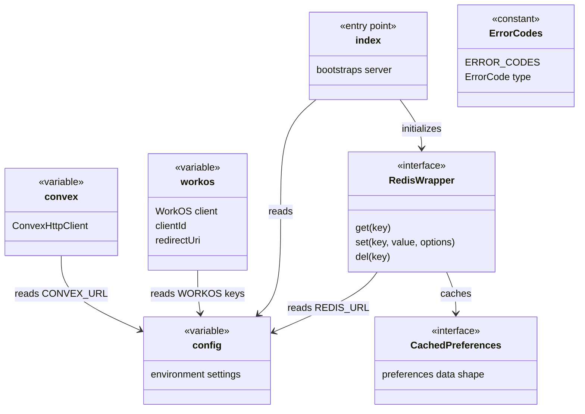
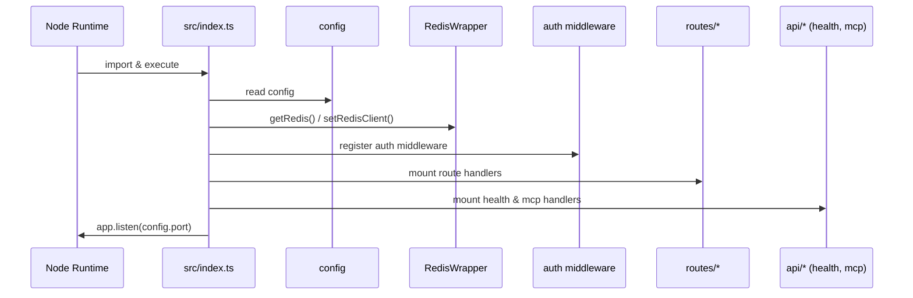

# Server Entry & Config

## Overview

The Server Entry & Config module is the bootstrap layer for the LiminalDB application. It encompasses the HTTP server entry point (`src/index.ts`), centralized configuration (`config`), external service clients for Convex and WorkOS, a Redis caching layer with typed preferences support, and standardized error codes. Every route, middleware, and API handler in the system depends on at least one export from this module.

## Responsibilities

- Bootstrap the Hono HTTP server, register middleware (auth, token extraction), and mount all route and API handlers
- Centralize environment-driven configuration in a single `config` object consumed across the codebase
- Initialize and export the Convex client for backend data access
- Initialize and export the WorkOS client, client ID, and redirect URI for authentication flows
- Provide a Redis abstraction (`RedisWrapper`) with typed caching for user preferences (`CachedPreferences`)
- Define canonical `ERROR_CODES` and the `ErrorCode` type for consistent error handling

## Structure Diagram

## Entity Table

| Name | Kind | Role | Public Entrypoints | Depends On | Used By |
| --- | --- | --- | --- | --- | --- |
| src/index.ts | file | Application entry point — creates the Hono app, applies auth middleware, mounts routes and API handlers, initializes Redis | src/index.ts | config, RedisWrapper, auth middleware, routes/*, api/* | none |
| config | variable | Centralized configuration object sourced from environment variables | src/lib/config.ts:config | none | src/index.ts, src/api/health.ts, src/api/mcp.ts, src/lib/auth/jwtValidator.ts, src/lib/mcp.ts, src/lib/redis.ts, src/routes/import-export.ts, src/routes/preferences.ts, src/routes/prompts.ts |
| convex | variable | Shared Convex HTTP client instance for backend queries and mutations | src/lib/convex.ts:convex | none | src/api/health.ts, src/lib/mcp.ts, src/routes/import-export.ts, src/routes/preferences.ts, src/routes/prompts.ts |
| workos / clientId / redirectUri | variable | WorkOS SDK client and OAuth configuration for authentication | src/lib/workos.ts:workos, src/lib/workos.ts:clientId, src/lib/workos.ts:redirectUri | none | src/routes/auth.ts |
| RedisWrapper | interface | Abstraction over Redis client providing get/set/del with a fallback NotImplementedError | src/lib/redis.ts:RedisWrapper, src/lib/redis.ts:getRedis, src/lib/redis.ts:setRedisClient | config | src/index.ts, src/lib/mcp.ts, src/routes/drafts.ts, src/routes/preferences.ts |
| CachedPreferences | interface | Typed shape for Redis-cached user preferences with get/set/invalidate helpers | src/lib/redis.ts:CachedPreferences, src/lib/redis.ts:getCachedPreferences, src/lib/redis.ts:setCachedPreferences, src/lib/redis.ts:invalidateCachedPreferences | config, src/schemas/preferences.ts | src/routes/preferences.ts, src/routes/drafts.ts, src/lib/mcp.ts |
| ERROR_CODES / ErrorCode | constant / type | Canonical error code map and union type for consistent API error responses | src/lib/errors.ts:ERROR_CODES, src/lib/errors.ts:ErrorCode | none | none |

## Key Flow

## Flow Notes

| Step | Actor/Component | Action | Output / Side Effect |
| --- | --- | --- | --- |
| 1 | Node Runtime | Imports and executes src/index.ts as the application entry point | Module-level code begins executing |
| 2 | src/index.ts | Reads the centralized config object for port, environment, and feature flags | Configuration values available for server setup |
| 3 | src/index.ts | Initializes Redis client via getRedis() using REDIS_URL from config | RedisWrapper instance ready for caching |
| 4 | src/index.ts | Registers auth middleware (token extraction, JWT validation) | All subsequent routes are protected |
| 5 | src/index.ts | Mounts route handlers (auth, prompts, preferences, drafts, modules, import-export, well-known, app) and API handlers (health, mcp) | HTTP endpoints registered on the Hono app |
| 6 | src/index.ts | Starts listening on the configured port | Server accepting HTTP requests |

## Source Coverage

- src/index.ts
- src/lib/config.ts
- src/lib/convex.ts
- src/lib/errors.ts
- src/lib/redis.ts
- src/lib/workos.ts

## Cross-Module Context

- src/api/health.ts -> src/lib/config.ts (import)
- src/api/health.ts -> src/lib/convex.ts (import)
- src/api/mcp.ts -> src/lib/config.ts (import)
- src/index.ts -> src/api/health.ts (usage)
- src/index.ts -> src/api/mcp.ts (usage)
- src/index.ts -> src/lib/auth/tokenExtractor.ts (usage)
- src/index.ts -> src/middleware/auth.ts (usage)
- src/index.ts -> src/routes/app.ts (usage)
- src/index.ts -> src/routes/auth.ts (usage)
- src/index.ts -> src/routes/drafts.ts (usage)
- src/index.ts -> src/routes/import-export.ts (usage)
- src/index.ts -> src/routes/modules.ts (usage)
- src/index.ts -> src/routes/preferences.ts (usage)
- src/index.ts -> src/routes/prompts.ts (usage)
- src/index.ts -> src/routes/well-known.ts (usage)
- src/lib/auth/jwtValidator.ts -> src/lib/config.ts (import)
- src/lib/mcp.ts -> src/lib/config.ts (import)
- src/lib/mcp.ts -> src/lib/convex.ts (import)
- src/lib/mcp.ts -> src/lib/redis.ts (import)
- src/lib/redis.ts -> src/schemas/preferences.ts (import)
- src/routes/auth.ts -> src/lib/workos.ts (import)
- src/routes/drafts.ts -> src/lib/redis.ts (import)
- src/routes/import-export.ts -> src/lib/config.ts (import)
- src/routes/import-export.ts -> src/lib/convex.ts (import)
- src/routes/preferences.ts -> src/lib/config.ts (import)
- src/routes/preferences.ts -> src/lib/convex.ts (import)
- src/routes/preferences.ts -> src/lib/redis.ts (import)
- src/routes/prompts.ts -> src/lib/config.ts (import)
- src/routes/prompts.ts -> src/lib/convex.ts (import)
- tests/__mocks__/redis.ts -> src/lib/redis.ts (import)
- tests/service/drafts/drafts.test.ts -> src/lib/redis.ts (usage)
