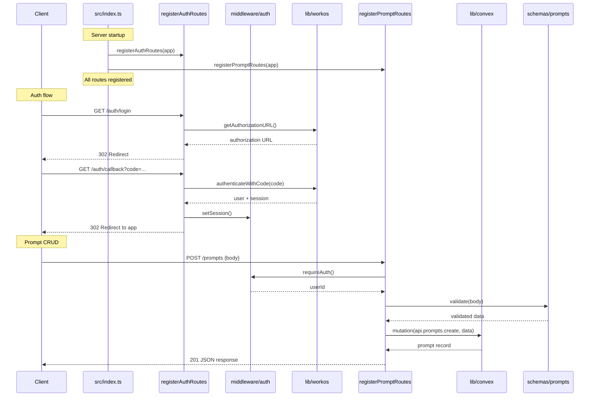

# Server Routes

## Overview

The Server Routes module contains all HTTP route registration functions for the LiminalDB application. Each file exports a single `register*Routes` function that attaches route handlers to the server. The module is organized by domain concern — prompts CRUD, drafts, auth flows, preferences, import/export, modules, app pages, health checks, and well-known endpoints. All route registrars are consumed by `src/index.ts` at startup to compose the full API surface.

## Responsibilities

- Register prompt CRUD endpoints (create, read, update, delete) with schema validation and merge logic
- Handle authentication flows via WorkOS (login, callback, logout)
- Manage draft lifecycle with Redis-backed storage
- Provide import/export functionality for bulk prompt operations via Convex
- Serve app page routes with auth-gated access
- Expose user preferences endpoints (get/set) with Convex persistence and Redis caching
- Register module-related routes with preferences schema support
- Expose well-known endpoints for MCP/OAuth discovery
- Provide health check endpoint with Convex connectivity status

## Structure Diagram

```mermaid
flowchart TD
  index["src/index.ts"]

  subgraph Routes["Server Routes"]
    app["registerAppRoutes\n(app.ts)"]
    auth["registerAuthRoutes\n(auth.ts)"]
    prompts["registerPromptRoutes\n(prompts.ts)"]
    drafts["registerDraftRoutes\n(drafts.ts)"]
    prefs["registerPreferencesRoutes\n(preferences.ts)"]
    impexp["registerImportExportRoutes\n(import-export.ts)"]
    modules["registerModuleRoutes\n(modules.ts)"]
    wellknown["registerWellKnownRoutes\n(well-known.ts)"]
    health["registerHealthRoutes\n(health.ts)"]
  end

  subgraph Shared["Shared Dependencies"]
    authMw["middleware/auth.ts"]
    convexLib["lib/convex.ts"]
    config["lib/config.ts"]
    redis["lib/redis.ts"]
    workos["lib/workos.ts"]
    merge["lib/merge.ts"]
    convexApi["convex/_generated/api"]
  end

  subgraph Schemas["Validation Schemas"]
    sPrompts["schemas/prompts.ts"]
    sDrafts["schemas/drafts.ts"]
    sPrefs["schemas/preferences.ts"]
    sImpExp["schemas/import-export.ts"]
  end

  index --> app & auth & prompts & drafts & prefs & impexp & modules & wellknown & health

  app --> authMw & sPrefs
  auth --> authMw & workos
  prompts --> authMw & convexLib & config & merge & convexApi & sPrompts
  drafts --> authMw & redis & sDrafts
  prefs --> authMw & convexLib & config & redis & convexApi & sPrefs
  impexp --> authMw & convexLib & config & convexApi & sImpExp & sPrompts
  modules --> sPrefs
  health --> authMw & convexLib & config & convexApi
```

## Entity Table

| Name | Kind | Role | Public Entrypoints | Depends On | Used By |
| --- | --- | --- | --- | --- | --- |
| registerAppRoutes | function | Registers auth-gated app page routes; uses preferences schema for page data | src/routes/app.ts:registerAppRoutes | src/middleware/auth.ts, src/schemas/preferences.ts | src/index.ts |
| registerAuthRoutes | function | Handles login, callback, and logout flows via WorkOS integration | src/routes/auth.ts:registerAuthRoutes | src/lib/workos.ts, src/middleware/auth.ts | src/index.ts, tests/service/auth/routes.test.ts |
| registerPromptRoutes | function | Full CRUD for prompts with Convex persistence, merge logic, and schema validation | src/routes/prompts.ts:registerPromptRoutes | convex/_generated/api.d.ts, src/lib/config.ts, src/lib/convex.ts, src/lib/merge.ts, src/middleware/auth.ts, src/schemas/prompts.ts | src/index.ts, tests/service/prompts/createPrompts.test.ts, tests/service/prompts/deletePrompt.test.ts, tests/service/prompts/edgeCases.test.ts, tests/service/prompts/getPrompt.test.ts, tests/service/prompts/updatePrompt.test.ts |
| registerDraftRoutes | function | Manages prompt drafts with Redis-backed ephemeral storage | src/routes/drafts.ts:registerDraftRoutes | src/lib/redis.ts, src/middleware/auth.ts, src/schemas/drafts.ts | src/index.ts, tests/service/drafts/drafts.test.ts |
| registerPreferencesRoutes | function | Get/set user preferences with Convex persistence and Redis caching | src/routes/preferences.ts:registerPreferencesRoutes | convex/_generated/api.d.ts, src/lib/config.ts, src/lib/convex.ts, src/lib/redis.ts, src/middleware/auth.ts, src/schemas/preferences.ts | src/index.ts |
| registerImportExportRoutes | function | Bulk import and export of prompts with validation and Convex batch operations | src/routes/import-export.ts:registerImportExportRoutes | convex/_generated/api.d.ts, src/lib/config.ts, src/lib/convex.ts, src/middleware/auth.ts, src/schemas/import-export.ts, src/schemas/prompts.ts | src/index.ts, tests/service/prompts/importExport.test.ts |
| registerModuleRoutes | function | Serves module-related endpoints using preferences schema | src/routes/modules.ts:registerModuleRoutes | src/schemas/preferences.ts | src/index.ts |
| registerWellKnownRoutes | function | Exposes .well-known endpoints for MCP/OAuth service discovery | src/routes/well-known.ts:registerWellKnownRoutes | none | src/index.ts, tests/service/mcp/well-known.test.ts |
| registerHealthRoutes | function | Health check endpoint reporting server and Convex connectivity status | src/api/health.ts:registerHealthRoutes | convex/_generated/api.d.ts, src/lib/config.ts, src/lib/convex.ts, src/middleware/auth.ts | src/index.ts |

## Key Flow

## Flow Notes

| Step | Actor/Component | Action | Output / Side Effect |
| --- | --- | --- | --- |
| 1 | src/index.ts | Calls each register*Routes function at startup to mount all HTTP handlers on the server | Fully configured route table |
| 2 | Client | Initiates auth flow via GET /auth/login | 302 redirect to WorkOS authorization URL |
| 3 | WorkOS | User authenticates; callback returns authorization code | GET /auth/callback with code parameter |
| 4 | registerAuthRoutes | Exchanges code with WorkOS, establishes session via auth middleware | Authenticated session; redirect to app |
| 5 | Client | Sends authenticated API request (e.g., POST /prompts) | Request with session credentials |
| 6 | registerPromptRoutes | Auth middleware validates session, schema validates body, Convex mutation persists data | 201 JSON response with created prompt |

## Source Coverage

- src/api/health.ts
- src/routes/app.ts
- src/routes/auth.ts
- src/routes/drafts.ts
- src/routes/import-export.ts
- src/routes/modules.ts
- src/routes/preferences.ts
- src/routes/prompts.ts
- src/routes/well-known.ts

## Cross-Module Context

- src/api/health.ts -> convex/_generated/api.d.ts (import)
- src/api/health.ts -> src/lib/config.ts (import)
- src/api/health.ts -> src/lib/convex.ts (import)
- src/api/health.ts -> src/middleware/auth.ts (import)
- src/index.ts -> src/api/health.ts (usage)
- src/index.ts -> src/routes/app.ts (usage)
- src/index.ts -> src/routes/auth.ts (usage)
- src/index.ts -> src/routes/drafts.ts (usage)
- src/index.ts -> src/routes/import-export.ts (usage)
- src/index.ts -> src/routes/modules.ts (usage)
- src/index.ts -> src/routes/preferences.ts (usage)
- src/index.ts -> src/routes/prompts.ts (usage)
- src/index.ts -> src/routes/well-known.ts (usage)
- src/routes/app.ts -> src/middleware/auth.ts (import)
- src/routes/app.ts -> src/schemas/preferences.ts (import)
- src/routes/auth.ts -> src/lib/workos.ts (import)
- src/routes/auth.ts -> src/middleware/auth.ts (import)
- src/routes/drafts.ts -> src/lib/redis.ts (import)
- src/routes/drafts.ts -> src/middleware/auth.ts (import)
- src/routes/drafts.ts -> src/schemas/drafts.ts (import)
- src/routes/import-export.ts -> convex/_generated/api.d.ts (import)
- src/routes/import-export.ts -> src/lib/config.ts (import)
- src/routes/import-export.ts -> src/lib/convex.ts (import)
- src/routes/import-export.ts -> src/middleware/auth.ts (import)
- src/routes/import-export.ts -> src/schemas/import-export.ts (import)
- src/routes/import-export.ts -> src/schemas/prompts.ts (import)
- src/routes/modules.ts -> src/schemas/preferences.ts (import)
- src/routes/preferences.ts -> convex/_generated/api.d.ts (import)
- src/routes/preferences.ts -> src/lib/config.ts (import)
- src/routes/preferences.ts -> src/lib/convex.ts (import)
- src/routes/preferences.ts -> src/lib/redis.ts (import)
- src/routes/preferences.ts -> src/middleware/auth.ts (import)
- src/routes/preferences.ts -> src/schemas/preferences.ts (import)
- src/routes/prompts.ts -> convex/_generated/api.d.ts (import)
- src/routes/prompts.ts -> src/lib/config.ts (import)
- src/routes/prompts.ts -> src/lib/convex.ts (import)
- src/routes/prompts.ts -> src/lib/merge.ts (import)
- src/routes/prompts.ts -> src/middleware/auth.ts (import)
- src/routes/prompts.ts -> src/schemas/prompts.ts (import)
- tests/service/auth/routes.test.ts -> src/routes/auth.ts (usage)
- tests/service/drafts/drafts.test.ts -> src/routes/drafts.ts (usage)
- tests/service/mcp/well-known.test.ts -> src/routes/well-known.ts (usage)
- tests/service/prompts/createPrompts.test.ts -> src/routes/prompts.ts (usage)
- tests/service/prompts/deletePrompt.test.ts -> src/routes/prompts.ts (usage)
- tests/service/prompts/edgeCases.test.ts -> src/routes/prompts.ts (usage)
- tests/service/prompts/getPrompt.test.ts -> src/routes/prompts.ts (usage)
- tests/service/prompts/importExport.test.ts -> src/routes/import-export.ts (usage)
- tests/service/prompts/updatePrompt.test.ts -> src/routes/prompts.ts (usage)
