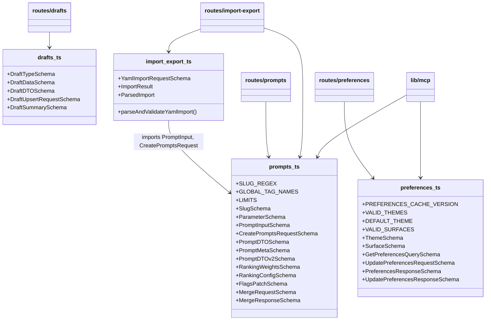
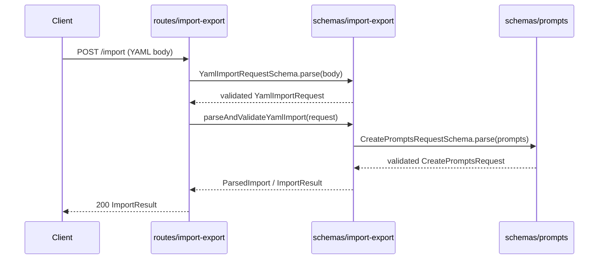

# Server Schemas

## Overview

Centralized Zod validation schemas that define the shape and constraints of all request/response payloads across the LiminalDB server. The module is organized into four schema files — prompts, drafts, preferences, and import/export — each exporting paired Zod schemas and inferred TypeScript types. These schemas serve as the single source of truth for API contract validation, consumed by route handlers, the MCP integration layer, and the Redis caching layer.

## Responsibilities

- Define Zod schemas and inferred types for prompt CRUD, versioning (v1/v2 DTOs), ranking configuration, flags patching, and merge operations
- Define draft type discrimination, draft DTO, upsert request, and summary schemas
- Define user preference schemas including theme and surface enums, cache versioning, and get/update request-response pairs
- Provide YAML import request validation and a `parseAndValidateYamlImport` helper that bridges raw YAML input into validated prompt structures
- Export shared constants (SLUG_REGEX, LIMITS, GLOBAL_TAG_NAMES, VALID_THEMES, VALID_SURFACES) used across routes and services

## Structure Diagram

## Entity Table

| Name | Kind | Role | Public Entrypoints | Depends On | Used By |
| --- | --- | --- | --- | --- | --- |
| prompts.ts | schema file | Core prompt domain schemas — input validation, DTO shapes for v1 and v2, ranking, flags, and merge payloads | ParameterSchema, SlugSchema, PromptInputSchema, CreatePromptsRequestSchema, PromptDTOSchema, PromptDTOv2Schema, PromptMetaSchema, RankingWeightsSchema, RankingConfigSchema, FlagsPatchSchema, MergeRequestSchema, MergeResponseSchema, SLUG_REGEX, LIMITS, GLOBAL_TAG_NAMES | none | routes/prompts.ts, routes/import-export.ts, lib/mcp.ts, schemas/import-export.ts, tests/service/prompts/edgeCases.test.ts |
| drafts.ts | schema file | Draft lifecycle schemas — type enum, full DTO, upsert request, and list summary | DraftTypeSchema, DraftDataSchema, DraftDTOSchema, DraftUpsertRequestSchema, DraftSummarySchema | none | routes/drafts.ts, tests/service/drafts/drafts.test.ts |
| preferences.ts | schema file | User preference schemas — theme/surface enums, cache version, get/update request-response pairs | ThemeSchema, SurfaceSchema, GetPreferencesQuerySchema, UpdatePreferencesRequestSchema, PreferencesResponseSchema, UpdatePreferencesResponseSchema, PREFERENCES_CACHE_VERSION, VALID_THEMES, DEFAULT_THEME, VALID_SURFACES | none | routes/preferences.ts, routes/app.ts, routes/modules.ts, lib/mcp.ts, lib/redis.ts |
| import-export.ts | schema file | YAML import validation — request schema plus parse-and-validate helper that produces typed prompt structures | YamlImportRequestSchema, parseAndValidateYamlImport, ImportResult, ParsedImport | prompts.ts | routes/import-export.ts |

## Key Flow

## Flow Notes

| Step | Actor/Component | Action | Output / Side Effect |
| --- | --- | --- | --- |
| 1 | Client | Sends a POST request with a YAML payload to the import-export route | Raw request body |
| 2 | routes/import-export | Validates the raw body against YamlImportRequestSchema | Typed YamlImportRequest or 400 validation error |
| 3 | routes/import-export | Calls parseAndValidateYamlImport to parse YAML and validate each prompt entry | Delegates to schemas/import-export |
| 4 | schemas/import-export | Uses CreatePromptsRequestSchema (from prompts.ts) to validate extracted prompt objects | ParsedImport with validated prompts or ImportResult with errors |
| 5 | routes/import-export | Returns the import result to the client | 200 with ImportResult payload |

## Source Coverage

- src/schemas/drafts.ts
- src/schemas/import-export.ts
- src/schemas/preferences.ts
- src/schemas/prompts.ts

## Cross-Module Context

- src/lib/mcp.ts -> src/schemas/preferences.ts (import)
- src/lib/mcp.ts -> src/schemas/prompts.ts (import)
- src/lib/redis.ts -> src/schemas/preferences.ts (import)
- src/routes/app.ts -> src/schemas/preferences.ts (import)
- src/routes/drafts.ts -> src/schemas/drafts.ts (import)
- src/routes/import-export.ts -> src/schemas/import-export.ts (import)
- src/routes/import-export.ts -> src/schemas/prompts.ts (import)
- src/routes/modules.ts -> src/schemas/preferences.ts (import)
- src/routes/preferences.ts -> src/schemas/preferences.ts (import)
- src/routes/prompts.ts -> src/schemas/prompts.ts (import)
- tests/service/drafts/drafts.test.ts -> src/schemas/drafts.ts (usage)
- tests/service/prompts/edgeCases.test.ts -> src/schemas/prompts.ts (usage)
