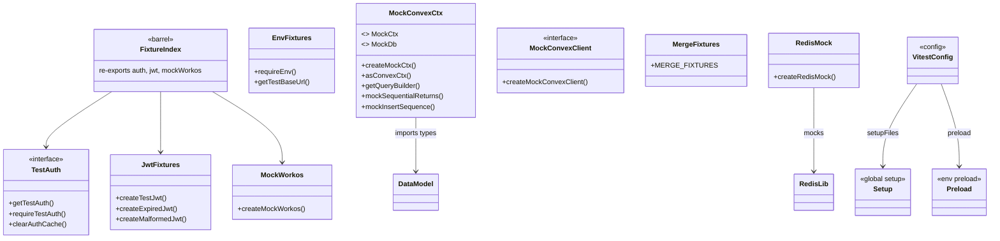
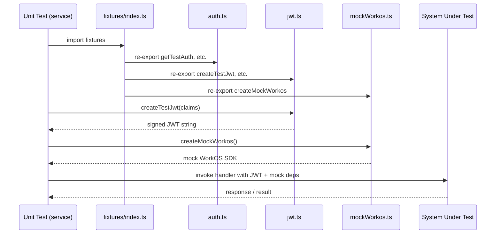

# Test Fixtures & Setup

## Overview

Shared test infrastructure providing mock factories, fixture data, JWT helpers, and environment configuration for both unit and integration tests. The module is organized into three tiers: (1) Vitest configuration and global setup (`vitest.config.ts`, `tests/setup.ts`, `tests/preload.ts`), (2) a barrel-exported fixture index for service-level unit tests (`tests/fixtures/index.ts`), and (3) specialized mock/fixture files consumed directly by Convex-layer tests and integration tests.

## Responsibilities

- Provide Vitest configuration, global setup, and environment preloading
- Supply mock WorkOS client for auth-related unit tests
- Generate test JWTs (valid, expired, malformed) for auth verification tests
- Manage test authentication credentials with caching for integration tests
- Expose environment helpers (base URL, required env vars) for integration tests
- Provide mock Convex context (MockCtx, MockDb) with query builder and insert sequence helpers for Convex function tests
- Provide mock Convex HTTP client for service-level prompt tests
- Supply merge fixture data for merge-related unit and UI tests
- Provide a Redis mock that replaces the production Redis module in draft tests

## Structure Diagram

## Entity Table

| Name | Kind | Role | Public Entrypoints | Depends On | Used By |
| --- | --- | --- | --- | --- | --- |
| vitest.config.ts | config | Root Vitest configuration defining test environments, setup files, and path aliases | vitest.config.ts | none | none |
| tests/setup.ts | file | Global test setup executed before each test suite | tests/setup.ts | none | none |
| tests/preload.ts | file | Environment preloading (e.g., env vars, polyfills) run before test discovery | tests/preload.ts | none | none |
| tests/fixtures/index.ts | barrel | Re-exports auth, JWT, and WorkOS mocks as a single import for service-level tests | tests/fixtures/index.ts | tests/fixtures/auth.ts, tests/fixtures/jwt.ts, tests/fixtures/mockWorkos.ts | service tests (auth, drafts, mcp, prompts, preferences) |
| TestAuth / auth.ts | interface + functions | Provides cached auth credentials (getTestAuth, requireTestAuth, clearAuthCache) for integration and unit tests | getTestAuth, requireTestAuth, clearAuthCache | none | fixtures/index.ts, integration tests |
| jwt.ts | functions | Creates test JWTs in valid, expired, and malformed variants | createTestJwt, createExpiredJwt, createMalformedJwt | none | fixtures/index.ts, integration/auth-api.test.ts |
| mockWorkos.ts | function | Creates a mock WorkOS SDK client for unit-testing auth flows | createMockWorkos | none | fixtures/index.ts |
| env.ts | functions | Provides requireEnv and getTestBaseUrl for integration test environment configuration | requireEnv, getTestBaseUrl | none | integration tests |
| mockConvexCtx.ts | interfaces + functions | Provides MockCtx/MockDb interfaces and helper functions for Convex function unit tests | createMockCtx, asConvexCtx, getQueryBuilder, mockSequentialReturns, mockInsertSequence | convex/_generated/dataModel.d.ts | convex prompt tests |
| mockConvexClient.ts | interface + function | Creates a mock Convex HTTP client for service-level prompt tests | createMockConvexClient | none | service/prompts tests (flagsUsage, listPrompts, mergePrompt) |
| merge.ts | constant | Supplies MERGE_FIXTURES test data for merge logic across unit, convex, and UI tests | MERGE_FIXTURES | none | convex/mergeFields.test.ts, service/lib/merge.test.ts, service/ui/merge-mode.test.ts |
| redis.ts (mock) | function | Provides createRedisMock that replaces the production Redis module in draft tests | createRedisMock | src/lib/redis.ts | service/drafts/drafts.test.ts |

## Key Flow

## Flow Notes

| Step | Actor/Component | Action | Output / Side Effect |
| --- | --- | --- | --- |
| 1 | Test file | Imports from fixtures/index.ts (service tests) or directly from specific fixture files (integration / convex tests) | Access to mock factories, JWT helpers, auth helpers, and fixture data |
| 2 | Test file | Calls factory functions (createTestJwt, createMockWorkos, createMockCtx, createRedisMock) to build test doubles | Configured mocks and test tokens ready for injection |
| 3 | Test file | Invokes the system under test with the constructed mocks and fixtures | Test assertions against the SUT's response or side effects |
| 4 | Test file (integration) | Uses getTestBaseUrl() and requireTestAuth() to target a live staging/preview server | Authenticated HTTP requests against the deployed service |

## Source Coverage

- tests/__mocks__/redis.ts
- tests/fixtures/auth.ts
- tests/fixtures/env.ts
- tests/fixtures/index.ts
- tests/fixtures/jwt.ts
- tests/fixtures/merge.ts
- tests/fixtures/mockConvexClient.ts
- tests/fixtures/mockConvexCtx.ts
- tests/fixtures/mockWorkos.ts
- tests/preload.ts
- tests/setup.ts
- vitest.config.ts

## Cross-Module Context

- tests/__mocks__/redis.ts -> src/lib/redis.ts (import)
- tests/convex/prompts/deleteBySlug.test.ts -> tests/fixtures/mockConvexCtx.ts (usage)
- tests/convex/prompts/getPromptBySlug.test.ts -> tests/fixtures/mockConvexCtx.ts (usage)
- tests/convex/prompts/insertPrompts.test.ts -> tests/fixtures/mockConvexCtx.ts (usage)
- tests/convex/prompts/mergeFields.test.ts -> tests/fixtures/merge.ts (usage)
- tests/convex/prompts/searchPrompts.test.ts -> tests/fixtures/mockConvexCtx.ts (usage)
- tests/convex/prompts/slugExists.test.ts -> tests/fixtures/mockConvexCtx.ts (usage)
- tests/convex/prompts/usageTracking.test.ts -> tests/fixtures/mockConvexCtx.ts (usage)
- tests/fixtures/mockConvexCtx.ts -> convex/_generated/dataModel.d.ts (import)
- tests/integration/auth-api.test.ts -> tests/fixtures/auth.ts (usage)
- tests/integration/auth-api.test.ts -> tests/fixtures/env.ts (usage)
- tests/integration/auth-api.test.ts -> tests/fixtures/jwt.ts (usage)
- tests/integration/auth-cookie.test.ts -> tests/fixtures/env.ts (usage)
- tests/integration/auth-mcp.test.ts -> tests/fixtures/auth.ts (usage)
- tests/integration/auth-mcp.test.ts -> tests/fixtures/env.ts (usage)
- tests/integration/health.test.ts -> tests/fixtures/env.ts (usage)
- tests/integration/healthAuth.test.ts -> tests/fixtures/auth.ts (usage)
- tests/integration/healthAuth.test.ts -> tests/fixtures/env.ts (usage)
- tests/integration/import-export.test.ts -> tests/fixtures/auth.ts (usage)
- tests/integration/import-export.test.ts -> tests/fixtures/env.ts (usage)
- tests/integration/mcp-oauth.test.ts -> tests/fixtures/auth.ts (usage)
- tests/integration/mcp-oauth.test.ts -> tests/fixtures/env.ts (usage)
- tests/integration/mcp.test.ts -> tests/fixtures/auth.ts (usage)
- tests/integration/mcp.test.ts -> tests/fixtures/env.ts (usage)
- tests/integration/merge.test.ts -> tests/fixtures/auth.ts (usage)
- tests/integration/merge.test.ts -> tests/fixtures/env.ts (usage)
- tests/integration/preferences.test.ts -> tests/fixtures/auth.ts (usage)
- tests/integration/preferences.test.ts -> tests/fixtures/env.ts (usage)
- tests/integration/prompts-api.test.ts -> tests/fixtures/auth.ts (usage)
- tests/integration/prompts-api.test.ts -> tests/fixtures/env.ts (usage)
- tests/integration/ui/ui-auth.test.ts -> tests/fixtures/auth.ts (usage)
- tests/integration/ui/ui-auth.test.ts -> tests/fixtures/env.ts (usage)
- tests/integration/ui/ui-prompts.test.ts -> tests/fixtures/auth.ts (usage)
- tests/integration/ui/ui-prompts.test.ts -> tests/fixtures/env.ts (usage)
- tests/service/auth/mcp.test.ts -> tests/fixtures/index.ts (usage)
- tests/service/auth/middleware.test.ts -> tests/fixtures/index.ts (usage)
- tests/service/auth/routes.test.ts -> tests/fixtures/index.ts (usage)
- tests/service/drafts/drafts.test.ts -> tests/__mocks__/redis.ts (usage)
- tests/service/drafts/drafts.test.ts -> tests/fixtures/index.ts (usage)
- tests/service/lib/merge.test.ts -> tests/fixtures/merge.ts (usage)
- tests/service/mcp/resources.test.ts -> tests/fixtures/index.ts (usage)
- tests/service/mcp/tools.test.ts -> tests/fixtures/index.ts (usage)
- tests/service/preferences.test.ts -> tests/fixtures/index.ts (usage)
- tests/service/prompts/createPrompts.test.ts -> tests/fixtures/index.ts (usage)
- tests/service/prompts/deletePrompt.test.ts -> tests/fixtures/index.ts (usage)
- tests/service/prompts/edgeCases.test.ts -> tests/fixtures/index.ts (usage)
- tests/service/prompts/flagsUsage.test.ts -> tests/fixtures/index.ts (usage)
- tests/service/prompts/flagsUsage.test.ts -> tests/fixtures/mockConvexClient.ts (usage)
- tests/service/prompts/getPrompt.test.ts -> tests/fixtures/index.ts (usage)
- tests/service/prompts/importExport.test.ts -> tests/fixtures/index.ts (usage)
- tests/service/prompts/listPrompts.test.ts -> tests/fixtures/index.ts (usage)
- tests/service/prompts/listPrompts.test.ts -> tests/fixtures/mockConvexClient.ts (usage)
- tests/service/prompts/mcpTools.test.ts -> tests/fixtures/index.ts (usage)
- tests/service/prompts/mergePrompt.test.ts -> tests/fixtures/index.ts (usage)
- tests/service/prompts/mergePrompt.test.ts -> tests/fixtures/mockConvexClient.ts (usage)
- tests/service/prompts/updatePrompt.test.ts -> tests/fixtures/index.ts (usage)
- tests/service/ui/merge-mode.test.ts -> tests/fixtures/merge.ts (usage)
