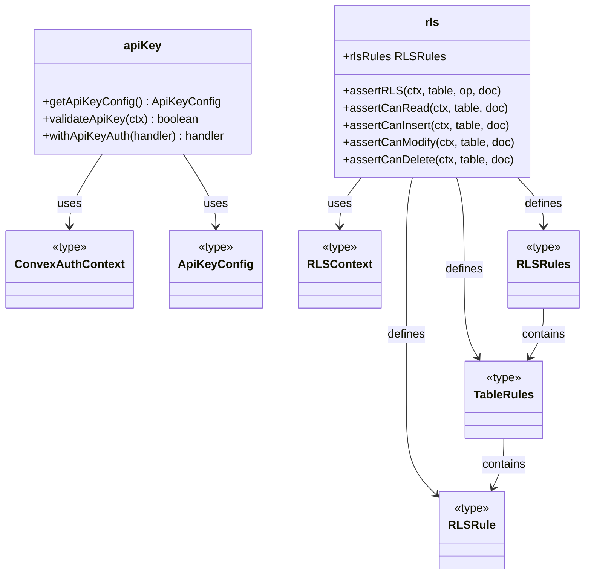
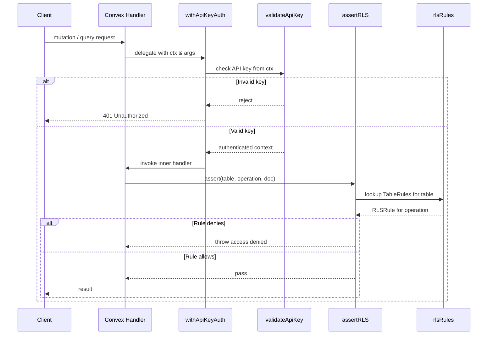

# Convex Auth & RLS

## Overview

Backend authentication and authorization layer for LiminalDB's Convex functions. The module provides two complementary security mechanisms: **API key validation** (authenticating inbound requests via a shared secret) and **row-level security (RLS)** rules that enforce per-table, per-operation access control based on the authenticated user context. Shared type definitions in `types.ts` keep the two subsystems loosely coupled while guaranteeing a consistent auth context shape.

## Responsibilities

- Validate API keys presented by callers against the server-side configuration
- Wrap Convex mutation/query handlers with an authentication guard (`withApiKeyAuth`)
- Define per-table RLS rules (read, insert, modify, delete) as declarative policy objects
- Enforce RLS assertions before data access in Convex functions
- Export shared auth context types (`ConvexAuthContext`, `ApiKeyConfig`, `RLSContext`) consumed across the backend

## Structure Diagram

## Entity Table

| Name | Kind | Role | Public Entrypoints | Depends On | Used By |
| --- | --- | --- | --- | --- | --- |
| getApiKeyConfig | function | Reads the API key configuration from the Convex environment | convex/auth/apiKey.ts:getApiKeyConfig | ConvexAuthContext, ApiKeyConfig | convex/prompts.ts, convex/healthAuth.ts, convex/userPreferences.ts |
| validateApiKey | function | Checks a supplied API key against the stored configuration; returns validity | convex/auth/apiKey.ts:validateApiKey | ConvexAuthContext, ApiKeyConfig | convex/prompts.ts, convex/healthAuth.ts, convex/userPreferences.ts |
| withApiKeyAuth | function | Higher-order wrapper that guards a Convex handler with API key authentication | convex/auth/apiKey.ts:withApiKeyAuth | ConvexAuthContext, ApiKeyConfig | convex/prompts.ts, convex/healthAuth.ts, convex/userPreferences.ts |
| rlsRules | variable | Declarative registry of per-table RLS policies | convex/auth/rls.ts:rlsRules | RLSRules, TableRules, RLSRule | convex/model/prompts.ts, convex/userPreferences.ts |
| assertRLS | function | Generic RLS gate — resolves operation type and delegates to the matching rule | convex/auth/rls.ts:assertRLS | RLSContext, rlsRules | convex/model/prompts.ts, convex/userPreferences.ts |
| assertCanRead | function | Asserts the caller may read a given document | convex/auth/rls.ts:assertCanRead | RLSContext | convex/model/prompts.ts, convex/userPreferences.ts |
| assertCanInsert | function | Asserts the caller may insert a document into the table | convex/auth/rls.ts:assertCanInsert | RLSContext | convex/model/prompts.ts, convex/userPreferences.ts |
| assertCanModify | function | Asserts the caller may update an existing document | convex/auth/rls.ts:assertCanModify | RLSContext | convex/model/prompts.ts, convex/userPreferences.ts |
| assertCanDelete | function | Asserts the caller may delete a document | convex/auth/rls.ts:assertCanDelete | RLSContext | convex/model/prompts.ts, convex/userPreferences.ts |
| ConvexAuthContext | type | Typed context shape carrying Convex auth identity info | convex/auth/types.ts:ConvexAuthContext | none | convex/auth/apiKey.ts, convex/auth/rls.ts |
| ApiKeyConfig | type | Shape of the API key configuration object | convex/auth/types.ts:ApiKeyConfig | none | convex/auth/apiKey.ts |
| RLSContext | type | Context passed into RLS rule evaluators (userId, table, document) | convex/auth/types.ts:RLSContext | none | convex/auth/rls.ts |

## Key Flow

## Flow Notes

| Step | Actor/Component | Action | Output / Side Effect |
| --- | --- | --- | --- |
| 1 | Client | Sends a mutation or query request to a Convex function, including API key credentials | Raw request reaches the Convex handler |
| 2 | withApiKeyAuth | Intercepts the call and extracts the API key from the request context | API key string passed to validateApiKey |
| 3 | validateApiKey | Compares the provided key against the stored ApiKeyConfig | Authentication success or 401 rejection |
| 4 | Convex Handler | Executes business logic and calls assertRLS (e.g., assertCanRead) before data access | RLS check initiated with table name, operation, and document |
| 5 | assertRLS | Looks up the matching RLSRule from rlsRules and evaluates the policy against the RLSContext | Access granted (pass-through) or access denied (exception thrown) |

## Source Coverage

- convex/auth.config.ts
- convex/auth/apiKey.ts
- convex/auth/rls.ts
- convex/auth/types.ts

## Cross-Module Context

- convex/auth/apiKey.ts -> convex/_generated/server.d.ts (import)
- convex/healthAuth.ts -> convex/auth/apiKey.ts (import)
- convex/model/prompts.ts -> convex/auth/rls.ts (import)
- convex/prompts.ts -> convex/auth/apiKey.ts (import)
- convex/userPreferences.ts -> convex/auth/apiKey.ts (import)
- convex/userPreferences.ts -> convex/auth/rls.ts (import)
- tests/convex/auth/apiKey.test.ts -> convex/auth/apiKey.ts (usage)
- tests/convex/auth/rls.test.ts -> convex/auth/rls.ts (usage)
- tests/convex/healthAuth.test.ts -> convex/auth/apiKey.ts (usage)
- tests/convex/healthAuth.test.ts -> convex/auth/types.ts (usage)
