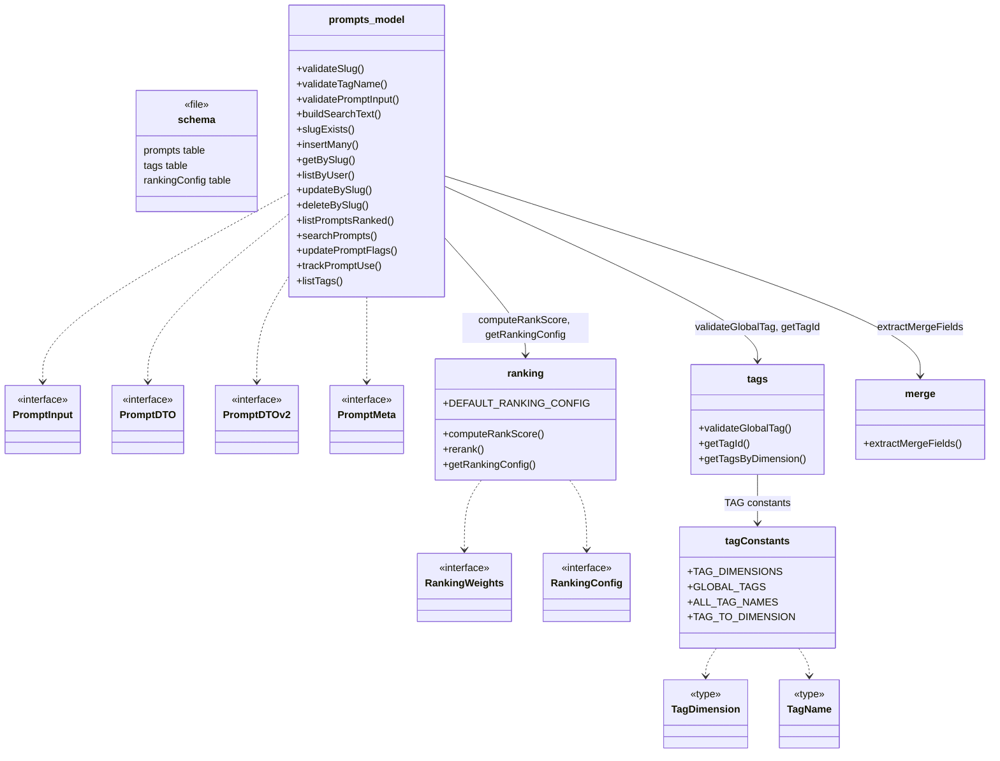
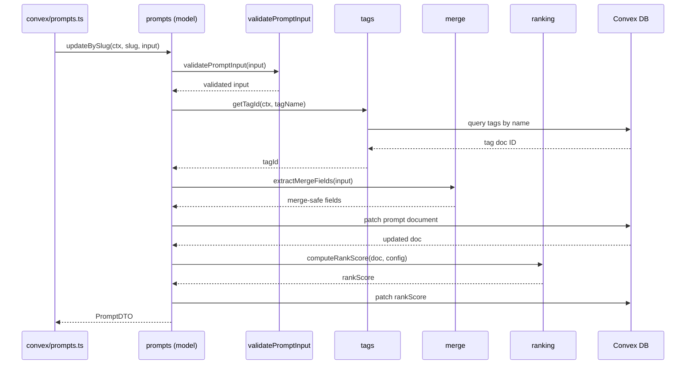

# Convex Data Model

## Overview

The Convex Data Model module defines the core domain layer for LiminalDB's prompt management system. It comprises the database schema (`convex/schema.ts`) and four model files that encapsulate prompt CRUD, validation, tag taxonomy, ranking/scoring, and merge logic. All Convex queries and mutations in the API layer (`convex/prompts.ts`) delegate to these model functions, keeping business rules centralized and testable.

## Responsibilities

- Define the Convex database schema for prompts, tags, and ranking configuration
- Validate prompt inputs (slug format, tag names, required fields) before persistence
- Provide slug-based CRUD operations (insertMany, getBySlug, updateBySlug, deleteBySlug) with RLS enforcement
- Maintain a typed tag taxonomy with dimensions and global tag constants
- Resolve tag names to Convex document IDs and query tags by dimension
- Compute rank scores for prompts using configurable weights (recency, usage, flags)
- Support full-text search via buildSearchText and searchPrompts
- Extract merge-safe fields from prompt updates to support partial-update semantics
- Track prompt usage statistics (trackPromptUse) for ranking signals

## Structure Diagram

## Entity Table

| Name | Kind | Role | Public Entrypoints | Depends On | Used By |
| --- | --- | --- | --- | --- | --- |
| schema.ts | file | Defines Convex tables (prompts, tags, rankingConfig) and their indexes | convex/schema.ts | none | convex/_generated/dataModel.d.ts |
| prompts (model) | module | Core CRUD, validation, search, and usage-tracking logic for prompts | insertMany, getBySlug, listByUser, updateBySlug, deleteBySlug, listPromptsRanked, searchPrompts, updatePromptFlags, trackPromptUse, listTags, validatePromptInput, validateSlug, validateTagName, buildSearchText, slugExists | merge, ranking, tags, convex/auth/rls.ts | convex/prompts.ts, convex/migrations/backfillSearchText.ts |
| PromptInput | interface | Shape of incoming prompt data for insert/update | convex/model/prompts.ts:PromptInput | none | prompts (model), convex/prompts.ts |
| PromptDTO / PromptDTOv2 | interface | Read-side data transfer objects returned by queries | convex/model/prompts.ts:PromptDTO, convex/model/prompts.ts:PromptDTOv2 | none | prompts (model), convex/prompts.ts |
| ranking | module | Weighted rank-score computation and configuration retrieval | computeRankScore, rerank, getRankingConfig, DEFAULT_RANKING_CONFIG | convex/_generated/server.d.ts | prompts (model), convex/migrations/seedRankingConfig.ts |
| tags | module | Resolves tag names to document IDs, validates against the global taxonomy | validateGlobalTag, getTagId, getTagsByDimension | tagConstants, convex/_generated/dataModel.d.ts | prompts (model) |
| tagConstants | module | Static tag taxonomy: dimensions, global tag list, and reverse lookup map | TAG_DIMENSIONS, GLOBAL_TAGS, ALL_TAG_NAMES, TAG_TO_DIMENSION, TagDimension, TagName | none | tags, convex/migrations/seedGlobalTags.ts |
| merge | module | Extracts merge-safe fields from partial prompt updates | extractMergeFields | none | prompts (model) |

## Key Flow

## Flow Notes

| Step | Actor/Component | Action | Output / Side Effect |
| --- | --- | --- | --- |
| 1 | API layer (convex/prompts.ts) | Calls updateBySlug with authenticated context, slug, and partial input | Delegates to prompts model |
| 2 | prompts (model) | Runs validatePromptInput to enforce slug format, required fields, and tag-name validity | Throws on invalid input; otherwise continues |
| 3 | tags module | Resolves each tag name to its Convex document ID via getTagId, querying the tags table | Array of tag IDs ready for storage |
| 4 | merge module | extractMergeFields picks only the fields safe for partial update, preventing accidental overwrites | Merge-safe field object |
| 5 | prompts (model) | Patches the prompt document in Convex DB with merged fields and resolved tag IDs | Updated prompt document |
| 6 | ranking module | computeRankScore recalculates the prompt's rank using configured weights and persists the new score | Updated rankScore stored on the prompt |

## Source Coverage

- convex/model/merge.ts
- convex/model/prompts.ts
- convex/model/ranking.ts
- convex/model/tagConstants.ts
- convex/model/tags.ts
- convex/schema.ts

## Cross-Module Context

- convex/migrations/backfillSearchText.ts -> convex/model/prompts.ts (import)
- convex/migrations/seedGlobalTags.ts -> convex/model/tagConstants.ts (import)
- convex/migrations/seedRankingConfig.ts -> convex/model/ranking.ts (import)
- convex/model/prompts.ts -> convex/_generated/dataModel.d.ts (import)
- convex/model/prompts.ts -> convex/_generated/server.d.ts (import)
- convex/model/prompts.ts -> convex/auth/rls.ts (import)
- convex/model/ranking.ts -> convex/_generated/server.d.ts (import)
- convex/model/tags.ts -> convex/_generated/dataModel.d.ts (import)
- convex/model/tags.ts -> convex/_generated/server.d.ts (import)
- convex/prompts.ts -> convex/model/prompts.ts (import)
- tests/convex/prompts/deleteBySlug.test.ts -> convex/model/prompts.ts (usage)
- tests/convex/prompts/getPromptBySlug.test.ts -> convex/model/prompts.ts (usage)
- tests/convex/prompts/insertPrompts.test.ts -> convex/model/prompts.ts (usage)
- tests/convex/prompts/mergeFields.test.ts -> convex/model/merge.ts (usage)
- tests/convex/prompts/ranking.test.ts -> convex/model/ranking.ts (usage)
- tests/convex/prompts/searchPrompts.test.ts -> convex/model/prompts.ts (usage)
- tests/convex/prompts/slugExists.test.ts -> convex/model/prompts.ts (usage)
- tests/convex/prompts/usageTracking.test.ts -> convex/model/prompts.ts (usage)
- tests/convex/prompts/validation.test.ts -> convex/model/prompts.ts (usage)
- tests/convex/tags/tagConstants.test.ts -> convex/model/tagConstants.ts (usage)
- tests/convex/tags/tags.test.ts -> convex/model/tagConstants.ts (usage)
- tests/convex/tags/tags.test.ts -> convex/model/tags.ts (usage)
