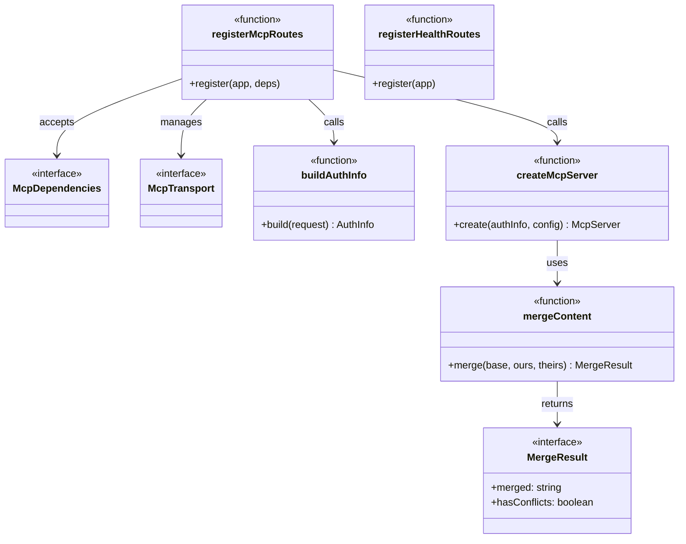
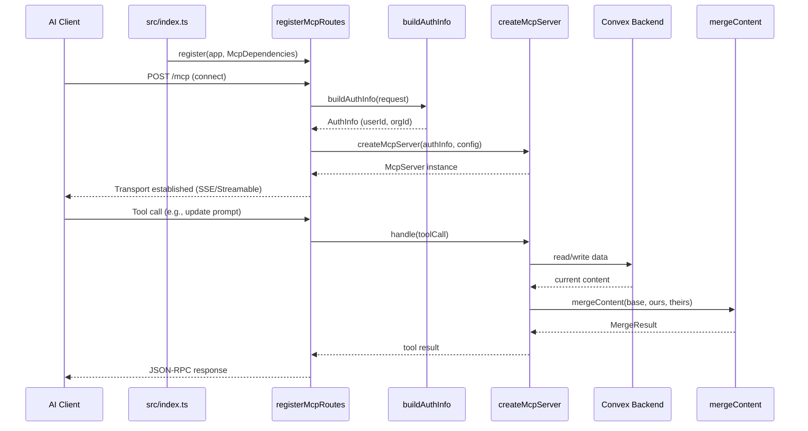

# MCP Server

## Overview

The MCP Server module implements the Model Context Protocol server for LiminalDB. It handles HTTP route registration for MCP endpoints, constructs per-session MCP server instances with tool/resource handlers backed by Convex and Redis, and provides content merge logic for concurrent edits. The module is the primary interface through which AI clients interact with the LiminalDB platform.

## Responsibilities

- Register MCP HTTP routes (SSE/Streamable transport) on the Hono application server
- Build and manage per-session MCP transport instances with authentication context
- Create fully configured MCP server instances with tools, resources, and prompt handlers
- Provide three-way content merge logic for resolving concurrent edits
- Expose health-check routes with Convex connectivity and system status

## Structure Diagram

## Entity Table

| Name | Kind | Role | Public Entrypoints | Depends On | Used By |
| --- | --- | --- | --- | --- | --- |
| registerMcpRoutes | function | Registers MCP HTTP endpoints on the Hono app, handling transport lifecycle and auth | src/api/mcp.ts:registerMcpRoutes | src/lib/mcp.ts, src/lib/auth/index.ts, src/lib/config.ts, src/middleware/auth.ts | src/index.ts, tests/service/mcp/*.test.ts, tests/service/auth/mcp.test.ts |
| buildAuthInfo | function | Extracts and validates authentication information from incoming MCP requests | src/api/mcp.ts:buildAuthInfo | src/lib/auth/index.ts, src/middleware/auth.ts | src/index.ts, tests/service/auth/mcp.test.ts |
| McpDependencies | interface | Defines external dependencies required to initialize MCP routes (config, auth, etc.) | src/api/mcp.ts:McpDependencies | src/lib/config.ts, src/lib/auth/index.ts | src/index.ts, tests/service/mcp/*.test.ts |
| McpTransport | interface | Represents a per-session MCP transport connection (SSE or Streamable HTTP) | src/api/mcp.ts:McpTransport | none | src/api/mcp.ts |
| createMcpServer | function | Constructs an MCP server instance with all tool, resource, and prompt handlers wired to Convex/Redis | src/lib/mcp.ts:createMcpServer | convex/_generated/api.d.ts, src/lib/config.ts, src/lib/convex.ts, src/lib/merge.ts, src/lib/redis.ts, src/schemas/preferences.ts, src/schemas/prompts.ts | src/api/mcp.ts, tests/service/mcp/toolHandlers.test.ts |
| mergeContent | function | Performs three-way content merge to resolve concurrent edits | src/lib/merge.ts:mergeContent | none | src/lib/mcp.ts, src/routes/prompts.ts, tests/service/lib/merge.test.ts |
| MergeResult | interface | Describes the output of a merge operation, including conflict status | src/lib/merge.ts:MergeResult | none | src/lib/mcp.ts, src/routes/prompts.ts |
| registerHealthRoutes | function | Registers health-check endpoints that verify Convex connectivity and report system status | src/api/health.ts:registerHealthRoutes | convex/_generated/api.d.ts, src/lib/config.ts, src/lib/convex.ts, src/middleware/auth.ts | src/index.ts |

## Key Flow

## Flow Notes

| Step | Actor/Component | Action | Output / Side Effect |
| --- | --- | --- | --- |
| 1 | src/index.ts | Calls registerMcpRoutes and registerHealthRoutes to mount all MCP and health endpoints on the Hono app | HTTP routes registered |
| 2 | AI Client | Initiates an MCP connection via HTTP POST to the MCP endpoint | Incoming request with auth credentials |
| 3 | registerMcpRoutes | Invokes buildAuthInfo to extract and validate JWT-based authentication from the request | AuthInfo object with userId and organization context |
| 4 | registerMcpRoutes | Calls createMcpServer with the authenticated context to spin up a per-session MCP server | Fully configured McpServer with tools, resources, and prompts |
| 5 | McpServer | Handles incoming tool calls by reading/writing to Convex and Redis, using mergeContent for concurrent edit resolution | Tool results returned via JSON-RPC over the established transport |

## Source Coverage

- src/api/health.ts
- src/api/mcp.ts
- src/lib/mcp.ts
- src/lib/merge.ts

## Cross-Module Context

- src/api/health.ts -> convex/_generated/api.d.ts (import)
- src/api/health.ts -> src/lib/config.ts (import)
- src/api/health.ts -> src/lib/convex.ts (import)
- src/api/health.ts -> src/middleware/auth.ts (import)
- src/api/mcp.ts -> src/lib/auth/index.ts (import)
- src/api/mcp.ts -> src/lib/config.ts (import)
- src/api/mcp.ts -> src/middleware/auth.ts (import)
- src/index.ts -> src/api/health.ts (usage)
- src/index.ts -> src/api/mcp.ts (usage)
- src/lib/mcp.ts -> convex/_generated/api.d.ts (import)
- src/lib/mcp.ts -> src/lib/config.ts (import)
- src/lib/mcp.ts -> src/lib/convex.ts (import)
- src/lib/mcp.ts -> src/lib/redis.ts (import)
- src/lib/mcp.ts -> src/schemas/preferences.ts (import)
- src/lib/mcp.ts -> src/schemas/prompts.ts (import)
- src/routes/prompts.ts -> src/lib/merge.ts (import)
- tests/service/auth/mcp.test.ts -> src/api/mcp.ts (usage)
- tests/service/lib/merge.test.ts -> src/lib/merge.ts (usage)
- tests/service/mcp/auth-challenge.test.ts -> src/api/mcp.ts (usage)
- tests/service/mcp/resources.test.ts -> src/api/mcp.ts (usage)
- tests/service/mcp/toolHandlers.test.ts -> src/lib/mcp.ts (usage)
- tests/service/mcp/tools.test.ts -> src/api/mcp.ts (usage)
- tests/service/prompts/mcpTools.test.ts -> src/api/mcp.ts (usage)
