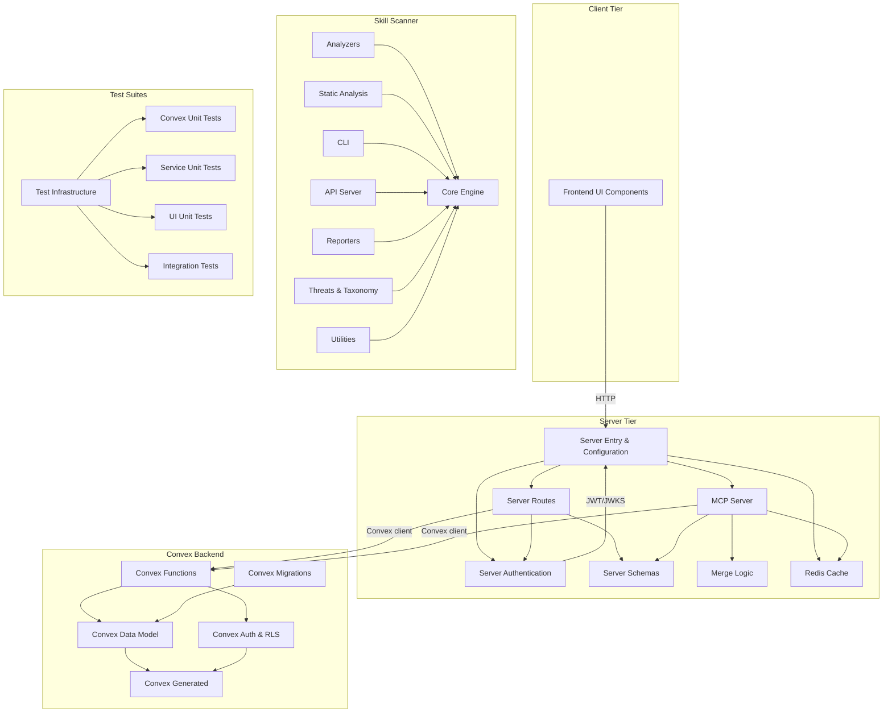

# LiminalDB — Repository Overview

LiminalDB is a prompt management platform that provides CRUD operations, tagging, ranking, merge conflict resolution, and AI-client integration via the **Model Context Protocol (MCP)**. The codebase spans a Hono HTTP server, a Convex real-time backend, a vanilla-JS web UI, and a vendored Python skill-scanner security tool.

## Architecture at a Glance

The system is organized into four major tiers, each containing several focused modules:

| Tier | Modules | Tech |
|---|---|---|
| **Convex Backend** | Auth & RLS, Data Model, Functions, Migrations, Generated types | Convex (TypeScript) |
| **HTTP Server** | Entry & Config, Authentication, Routes, Schemas, MCP Server | Hono / Node (TypeScript) |
| **Frontend** | UI Components (editor, viewer, merge, modals, tags) | Vanilla JS |
| **Skill Scanner** (vendored) | Core, Analyzers, Static Analysis, CLI, API, Reporters, Threats, Tests, Evals | Python / FastAPI |
| **Test Suites** | Unit (Convex), Service, Integration, UI, Test Infrastructure | Vitest |

## Module Directory

### Convex Backend

| Module | Responsibility | Page |
|---|---|---|
| **[Convex Auth & RLS](convex-auth--rls.md)** | API key validation and row-level security rules for Convex functions | [→](convex-auth--rls.md) |
| **[Convex Data Model](convex-data-model.md)** | Core domain models — prompts, tags, ranking, merge logic | [→](convex-data-model.md) |
| **[Convex Functions](convex-functions.md)** | Query/mutation endpoints, triggers, health checks, user preferences | [→](convex-functions.md) |
| **[Convex Generated](convex-generated.md)** | Auto-generated type-safe API bindings and data-model types | [→](convex-generated.md) |
| **[Convex Migrations](convex-migrations.md)** | Search-text backfill, global tag seeding, ranking config init | [→](convex-migrations.md) |

### HTTP Server

| Module | Responsibility | Page |
|---|---|---|
| **[Server Entry & Configuration](server-entry--configuration.md)** | App bootstrap, config, Convex client, WorkOS, Redis, error codes | [→](server-entry--configuration.md) |
| **[Server Authentication](server-authentication.md)** | JWT decoding/validation, token extraction, auth middleware, MCP auth challenges | [→](server-authentication.md) |
| **[Server Routes](server-routes.md)** | HTTP handlers for pages, auth flows, prompts CRUD, drafts, preferences, import/export, modules, well-known | [→](server-routes.md) |
| **[Server Schemas](server-schemas.md)** | Zod validation schemas for prompts, drafts, preferences, import/export | [→](server-schemas.md) |
| **[MCP Server](mcp-server.md)** | Model Context Protocol server — route registration, transport, per-session tools & resources | [→](mcp-server.md) |

### Frontend

| Module | Responsibility | Page |
|---|---|---|
| **[Frontend UI Components](frontend-ui-components.md)** | Prompt editor/viewer, merge mode, modals, toasts, tag selector, utilities | [→](frontend-ui-components.md) |

### Skill Scanner (Vendored Python)

| Module | Responsibility | Page |
|---|---|---|
| **[Core](skill-scanner-core.md)** | Scanning engine — models, loader, orchestration, policy, rules, file magic | [→](skill-scanner-core.md) |
| **[Analyzers](skill-scanner-analyzers.md)** | Static, behavioral, LLM, bytecode, pipeline, trigger, meta, cross-skill, VirusTotal, AI defense | [→](skill-scanner-analyzers.md) |
| **[Static Analysis](skill-scanner-static-analysis.md)** | AST, CFG, dataflow, taint tracking, interprocedural analysis, content extraction | [→](skill-scanner-static-analysis.md) |
| **[CLI](skill-scanner-cli.md)** | Command-line interface, wizard, policy TUI, pre-commit hook | [→](skill-scanner-cli.md) |
| **[API](skill-scanner-api.md)** | FastAPI REST endpoints for scanning, batch analysis, health checks | [→](skill-scanner-api.md) |
| **[Reporters](skill-scanner-reporters.md)** | JSON, Markdown, HTML, SARIF, and table output formatters | [→](skill-scanner-reporters.md) |
| **[Threats & Taxonomy](skill-scanner-threats--taxonomy.md)** | Threat mapping, severity classification, Cisco AI taxonomy | [→](skill-scanner-threats--taxonomy.md) |
| **[Utilities](skill-scanner-utilities.md)** | File handling, logging, data-pack rule checks | [→](skill-scanner-utilities.md) |
| **[Examples](skill-scanner-examples.md)** | Programmatic, CLI, batch, and API usage demos | [→](skill-scanner-examples.md) |
| **[Scripts](skill-scanner-scripts.md)** | Taxonomy checking, false-positive analysis, doc generation, Homebrew updates | [→](skill-scanner-scripts.md) |
| **[Eval Runners](skill-scanner-eval-runners.md)** | Benchmark runners for scanner accuracy and policy compliance | [→](skill-scanner-eval-runners.md) |
| **[Eval Skills](skill-scanner-eval-skills.md)** | Sample malicious and safe skills as test fixtures | [→](skill-scanner-eval-skills.md) |
| **[Tests](skill-scanner-tests.md)** | Full test suite for the scanner (~50 files, 15k+ LOC) | [→](skill-scanner-tests.md) |

### Testing & Dev

| Module | Responsibility | Page |
|---|---|---|
| **[Test Infrastructure](test-infrastructure.md)** | Vitest config, global setup, mocks (Redis/Convex/WorkOS), fixtures, DOM helpers | [→](test-infrastructure.md) |
| **[Convex Unit Tests](convex-unit-tests.md)** | Backend tests — auth, RLS, health, prompts model, tags, limits sync | [→](convex-unit-tests.md) |
| **[Service Unit Tests](service-unit-tests.md)** | Server tests — auth middleware, routes, MCP, prompts CRUD, drafts, merge, redis | [→](service-unit-tests.md) |
| **[UI Unit Tests](ui-unit-tests.md)** | Frontend tests — editor, viewer, merge, modals, toasts, tags, theme, shell history | [→](ui-unit-tests.md) |
| **[Integration Tests](integration-tests.md)** | End-to-end tests against staging — auth, health, prompts, MCP, preferences, UI | [→](integration-tests.md) |
| **[Dev Scripts](dev-scripts.md)** | Test user creation, session debugging, token inspection, prompt seeding | [→](dev-scripts.md) |
| **[Liminal Spec](liminal-spec.md)** | Spec format build, validation, and tests | [→](liminal-spec.md) |

## Key Data Flows

1. **Web UI → Server → Convex**: Browser loads vanilla JS components, which call Hono route handlers authenticated via JWT middleware, which delegate to Convex functions protected by API key auth and RLS.
2. **AI Client → MCP → Convex**: AI tools connect via MCP transport, authenticate with OAuth/bearer tokens, invoke MCP tools that read/write prompts through the Convex client, with Redis caching for preferences and drafts.
3. **Merge**: Both the server routes and MCP tools use shared merge logic (`src/lib/merge.ts` + `convex/model/merge.ts`) to reconcile concurrent prompt edits.

## Next Steps

Dive into individual modules starting with the core platform:

1. **[Server Entry & Configuration](server-entry--configuration.md)** — understand how the app boots
2. **[Convex Data Model](convex-data-model.md)** — learn the domain schema
3. **[Server Routes](server-routes.md)** — explore the API surface
4. **[MCP Server](mcp-server.md)** — see how AI clients integrate
5. **[Test Infrastructure](test-infrastructure.md)** — get oriented before running tests
