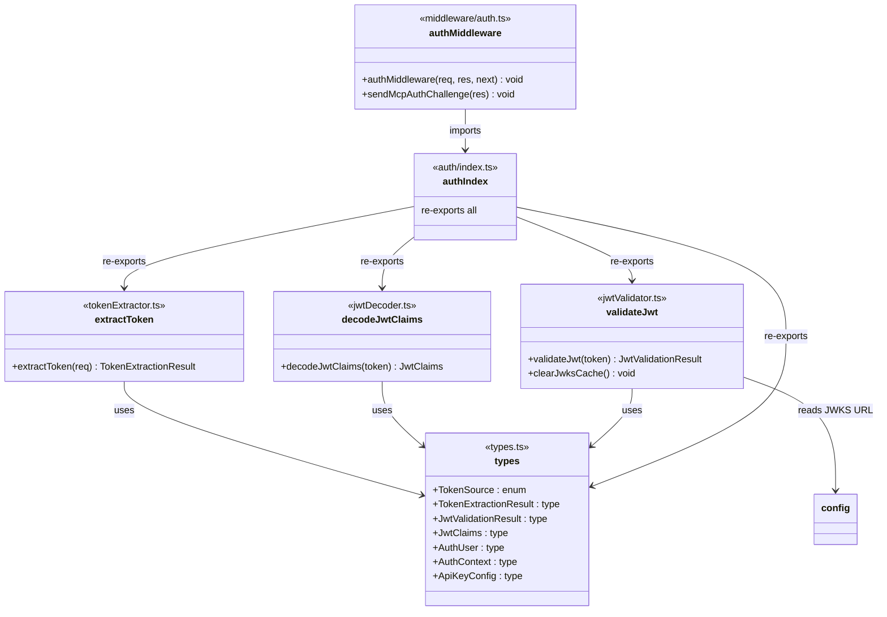
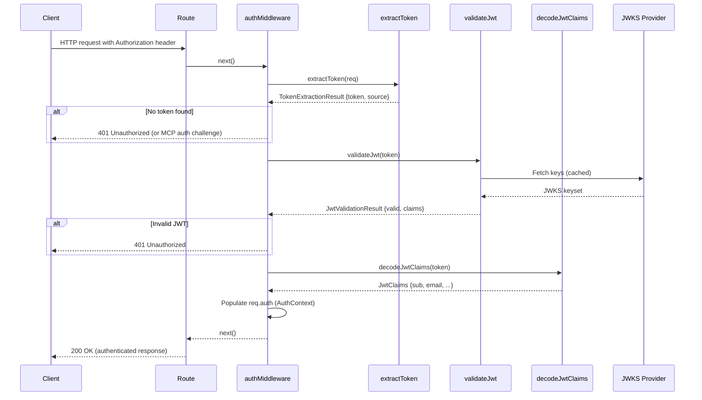

# Server Authentication

## Overview

The Server Authentication module provides a layered JWT-based authentication pipeline for the LiminalDB HTTP server. It is composed of a token extractor (pulls Bearer tokens from requests), a JWT decoder (base64-decodes claims without cryptographic verification), a JWT validator (verifies signatures via JWKS), shared auth type definitions, and an Express middleware that orchestrates these components to gate access to all API routes. A dedicated MCP auth challenge helper handles OAuth 2.0-style error responses for MCP endpoints.

## Responsibilities

- Extract Bearer tokens from HTTP Authorization headers and query parameters, identifying the token source
- Decode JWT claims from raw tokens without cryptographic verification (for introspection/logging)
- Validate JWTs cryptographically using JWKS fetched from the configured identity provider (WorkOS)
- Provide a unified set of auth-related TypeScript types shared across the server codebase
- Gate all protected routes via Express middleware that composes extraction, decoding, and validation
- Send MCP-spec OAuth 2.0 auth challenge responses for unauthenticated MCP requests
- Cache and manage JWKS key material with a clearable cache for testing and key rotation

## Structure Diagram

## Entity Table

| Name | Kind | Role | Public Entrypoints | Depends On | Used By |
| --- | --- | --- | --- | --- | --- |
| types.ts | type-definitions | Defines shared auth types: TokenSource enum, TokenExtractionResult, JwtValidationResult, JwtClaims, AuthUser, AuthContext, ApiKeyConfig | TokenSource, TokenExtractionResult, JwtValidationResult, JwtClaims, AuthUser, AuthContext, ApiKeyConfig | none | jwtDecoder.ts, jwtValidator.ts, tokenExtractor.ts, auth/index.ts |
| extractToken | function | Extracts Bearer token from request Authorization header or query params, returning token string and source | extractToken | types.ts | auth/index.ts, middleware/auth.ts, src/index.ts, tests (many) |
| decodeJwtClaims | function | Base64-decodes JWT payload to extract claims without cryptographic verification | decodeJwtClaims | types.ts | auth/index.ts, middleware/auth.ts |
| validateJwt | function | Validates JWT signature and claims using JWKS from the configured identity provider | validateJwt, clearJwksCache | types.ts, src/lib/config.ts | auth/index.ts, middleware/auth.ts |
| auth/index.ts | barrel | Re-exports all auth library functions and types as a single import path | src/lib/auth/index.ts | types.ts, tokenExtractor.ts, jwtDecoder.ts, jwtValidator.ts | middleware/auth.ts, src/api/mcp.ts |
| authMiddleware | function | Express middleware that orchestrates token extraction, JWT validation, and populates req.auth context | authMiddleware | auth/index.ts | src/routes/*, src/api/health.ts, src/api/mcp.ts, src/index.ts |
| sendMcpAuthChallenge | function | Sends an MCP-spec OAuth 2.0 WWW-Authenticate challenge response for unauthenticated MCP requests | sendMcpAuthChallenge | auth/index.ts | src/api/mcp.ts, src/routes/* |

## Key Flow

## Flow Notes

| Step | Actor/Component | Action | Output / Side Effect |
| --- | --- | --- | --- |
| 1 | Client | Sends HTTP request with Bearer token in Authorization header (or query param) | Raw HTTP request reaches route handler |
| 2 | authMiddleware | Calls extractToken() to pull the Bearer token and identify its source (header vs query) | TokenExtractionResult with token string and TokenSource |
| 3 | authMiddleware | If no token found, returns 401 or calls sendMcpAuthChallenge for MCP routes | 401 response with optional WWW-Authenticate header |
| 4 | validateJwt | Fetches JWKS from configured provider (cached), verifies JWT signature and standard claims | JwtValidationResult indicating validity and decoded claims |
| 5 | authMiddleware | On valid JWT, constructs AuthContext with AuthUser (sub, email) and attaches to request | req.auth populated; next() called to proceed to route handler |

## Source Coverage

- src/lib/auth/index.ts
- src/lib/auth/jwtDecoder.ts
- src/lib/auth/jwtValidator.ts
- src/lib/auth/tokenExtractor.ts
- src/lib/auth/types.ts
- src/middleware/auth.ts

## Cross-Module Context

- src/api/health.ts -> src/middleware/auth.ts (import)
- src/api/mcp.ts -> src/lib/auth/index.ts (import)
- src/api/mcp.ts -> src/middleware/auth.ts (import)
- src/index.ts -> src/lib/auth/tokenExtractor.ts (usage)
- src/index.ts -> src/middleware/auth.ts (usage)
- src/lib/auth/jwtValidator.ts -> src/lib/config.ts (import)
- src/routes/app.ts -> src/middleware/auth.ts (import)
- src/routes/auth.ts -> src/middleware/auth.ts (import)
- src/routes/drafts.ts -> src/middleware/auth.ts (import)
- src/routes/import-export.ts -> src/middleware/auth.ts (import)
- src/routes/preferences.ts -> src/middleware/auth.ts (import)
- src/routes/prompts.ts -> src/middleware/auth.ts (import)
- tests/service/auth/mcp.test.ts -> src/lib/auth/tokenExtractor.ts (usage)
- tests/service/auth/mcp.test.ts -> src/middleware/auth.ts (usage)
- tests/service/auth/middleware.test.ts -> src/lib/auth/index.ts (usage)
- tests/service/auth/middleware.test.ts -> src/lib/auth/tokenExtractor.ts (usage)
- tests/service/auth/middleware.test.ts -> src/middleware/auth.ts (usage)
- tests/service/auth/routes.test.ts -> src/lib/auth/tokenExtractor.ts (usage)
- tests/service/auth/routes.test.ts -> src/middleware/auth.ts (usage)
- tests/service/drafts/drafts.test.ts -> src/lib/auth/tokenExtractor.ts (usage)
- tests/service/drafts/drafts.test.ts -> src/middleware/auth.ts (usage)
- tests/service/mcp/auth-challenge.test.ts -> src/lib/auth/tokenExtractor.ts (usage)
- tests/service/mcp/auth-challenge.test.ts -> src/middleware/auth.ts (usage)
- tests/service/mcp/resources.test.ts -> src/lib/auth/tokenExtractor.ts (usage)
- tests/service/mcp/resources.test.ts -> src/middleware/auth.ts (usage)
- tests/service/mcp/tools.test.ts -> src/lib/auth/tokenExtractor.ts (usage)
- tests/service/mcp/tools.test.ts -> src/middleware/auth.ts (usage)
- tests/service/mcp/well-known.test.ts -> src/lib/auth/tokenExtractor.ts (usage)
- tests/service/mcp/well-known.test.ts -> src/middleware/auth.ts (usage)
- tests/service/preferences.test.ts -> src/lib/auth/tokenExtractor.ts (usage)
- tests/service/preferences.test.ts -> src/middleware/auth.ts (usage)
- tests/service/prompts/createPrompts.test.ts -> src/lib/auth/tokenExtractor.ts (usage)
- tests/service/prompts/createPrompts.test.ts -> src/middleware/auth.ts (usage)
- tests/service/prompts/deletePrompt.test.ts -> src/lib/auth/tokenExtractor.ts (usage)
- tests/service/prompts/deletePrompt.test.ts -> src/middleware/auth.ts (usage)
- tests/service/prompts/edgeCases.test.ts -> src/lib/auth/tokenExtractor.ts (usage)
- tests/service/prompts/edgeCases.test.ts -> src/middleware/auth.ts (usage)
- tests/service/prompts/flagsUsage.test.ts -> src/lib/auth/tokenExtractor.ts (usage)
- tests/service/prompts/flagsUsage.test.ts -> src/middleware/auth.ts (usage)
- tests/service/prompts/getPrompt.test.ts -> src/lib/auth/tokenExtractor.ts (usage)
- tests/service/prompts/getPrompt.test.ts -> src/middleware/auth.ts (usage)
- tests/service/prompts/importExport.test.ts -> src/lib/auth/tokenExtractor.ts (usage)
- tests/service/prompts/importExport.test.ts -> src/middleware/auth.ts (usage)
- tests/service/prompts/listPrompts.test.ts -> src/lib/auth/tokenExtractor.ts (usage)
- tests/service/prompts/listPrompts.test.ts -> src/middleware/auth.ts (usage)
- tests/service/prompts/mcpTools.test.ts -> src/lib/auth/tokenExtractor.ts (usage)
- tests/service/prompts/mcpTools.test.ts -> src/middleware/auth.ts (usage)
- tests/service/prompts/mergePrompt.test.ts -> src/lib/auth/tokenExtractor.ts (usage)
- tests/service/prompts/mergePrompt.test.ts -> src/middleware/auth.ts (usage)
- tests/service/prompts/updatePrompt.test.ts -> src/lib/auth/tokenExtractor.ts (usage)
- tests/service/prompts/updatePrompt.test.ts -> src/middleware/auth.ts (usage)
