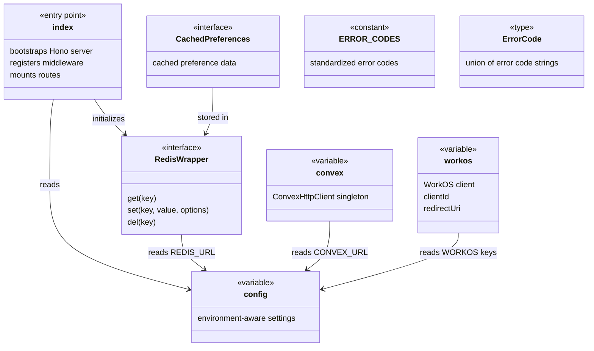
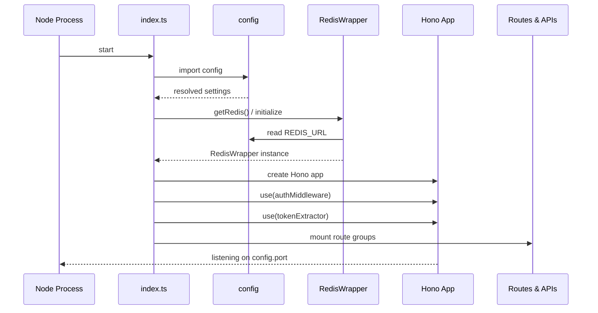

# Server Entry & Configuration

## Overview

This module contains the application entry point (`src/index.ts`) and foundational library singletons that the rest of the server depends on. It bootstraps the Hono HTTP server, loads environment-driven configuration, initializes the Convex backend client, sets up WorkOS authentication primitives, establishes the Redis caching layer for user preferences, and defines a shared error-code vocabulary. Nearly every route and API handler imports from this module.

## Responsibilities

- Bootstrap the Hono HTTP server, register middleware (auth, token extraction), and mount all route groups
- Provide a centralized, environment-aware configuration object (`config`) consumed across the application
- Initialize and export the Convex client singleton for backend data access
- Initialize and export WorkOS client, client ID, and redirect URI for OAuth/AuthKit integration
- Provide a Redis abstraction layer (`RedisWrapper`) with preference caching helpers (`getCachedPreferences`, `setCachedPreferences`, `invalidateCachedPreferences`)
- Define standardized error codes (`ERROR_CODES`) and the `ErrorCode` type for consistent API error responses

## Structure Diagram

## Entity Table

| Name | Kind | Role | Public Entrypoints | Depends On | Used By |
| --- | --- | --- | --- | --- | --- |
| index.ts | file | Application entry point — creates the Hono app, applies auth middleware, and mounts all route/API handlers | src/index.ts | config, RedisWrapper, health API, MCP API, auth middleware, routes/* | none |
| config | variable | Centralized configuration object derived from environment variables (ports, URLs, secrets, feature flags) | src/lib/config.ts:config | none | index.ts, health API, MCP API, jwtValidator, redis, routes/preferences, routes/prompts, routes/import-export |
| convex | variable | Convex HTTP client singleton used for all backend data operations | src/lib/convex.ts:convex | none | health API, mcp, routes/import-export, routes/preferences, routes/prompts |
| workos / clientId / redirectUri | variable | WorkOS SDK client and OAuth parameters for AuthKit-based authentication | src/lib/workos.ts:workos, src/lib/workos.ts:clientId, src/lib/workos.ts:redirectUri | none | routes/auth |
| RedisWrapper | interface | Abstraction over Redis client enabling test mocking and optional Redis availability | src/lib/redis.ts:RedisWrapper, src/lib/redis.ts:getRedis, src/lib/redis.ts:setRedisClient | config | index.ts, routes/preferences, routes/drafts, mcp, tests |
| CachedPreferences | interface | Shape of user preferences stored in Redis cache with TTL | src/lib/redis.ts:CachedPreferences, src/lib/redis.ts:getCachedPreferences, src/lib/redis.ts:setCachedPreferences, src/lib/redis.ts:invalidateCachedPreferences | RedisWrapper, preferences schema | routes/preferences, routes/drafts, mcp |
| ERROR_CODES / ErrorCode | constant / type | Standardized error code vocabulary for consistent API error responses | src/lib/errors.ts:ERROR_CODES, src/lib/errors.ts:ErrorCode | none | none |
| NotImplementedError | class | Custom error thrown when Redis operations are called without an available Redis client | src/lib/redis.ts:NotImplementedError | none | tests |

## Key Flow

## Flow Notes

| Step | Actor/Component | Action | Output / Side Effect |
| --- | --- | --- | --- |
| 1 | Node Process | Executes src/index.ts as the application entry point | Module-level imports trigger config resolution and client initialization |
| 2 | config | Reads environment variables and constructs a typed configuration object | Singleton config object available to all importers |
| 3 | index.ts | Initializes Redis connection using config.REDIS_URL via getRedis() | RedisWrapper instance ready for preference caching |
| 4 | index.ts | Creates Hono app, registers auth middleware and token extractor, mounts health, MCP, auth, prompts, preferences, drafts, modules, import-export, well-known, and app routes | Fully configured HTTP server listening on configured port |

## Source Coverage

- src/index.ts
- src/lib/config.ts
- src/lib/convex.ts
- src/lib/errors.ts
- src/lib/redis.ts
- src/lib/workos.ts

## Cross-Module Context

- src/api/health.ts -> src/lib/config.ts (import)
- src/api/health.ts -> src/lib/convex.ts (import)
- src/api/mcp.ts -> src/lib/config.ts (import)
- src/index.ts -> src/api/health.ts (usage)
- src/index.ts -> src/api/mcp.ts (usage)
- src/index.ts -> src/lib/auth/tokenExtractor.ts (usage)
- src/index.ts -> src/middleware/auth.ts (usage)
- src/index.ts -> src/routes/app.ts (usage)
- src/index.ts -> src/routes/auth.ts (usage)
- src/index.ts -> src/routes/drafts.ts (usage)
- src/index.ts -> src/routes/import-export.ts (usage)
- src/index.ts -> src/routes/modules.ts (usage)
- src/index.ts -> src/routes/preferences.ts (usage)
- src/index.ts -> src/routes/prompts.ts (usage)
- src/index.ts -> src/routes/well-known.ts (usage)
- src/lib/auth/jwtValidator.ts -> src/lib/config.ts (import)
- src/lib/mcp.ts -> src/lib/config.ts (import)
- src/lib/mcp.ts -> src/lib/convex.ts (import)
- src/lib/mcp.ts -> src/lib/redis.ts (import)
- src/lib/redis.ts -> src/schemas/preferences.ts (import)
- src/routes/auth.ts -> src/lib/workos.ts (import)
- src/routes/drafts.ts -> src/lib/redis.ts (import)
- src/routes/import-export.ts -> src/lib/config.ts (import)
- src/routes/import-export.ts -> src/lib/convex.ts (import)
- src/routes/preferences.ts -> src/lib/config.ts (import)
- src/routes/preferences.ts -> src/lib/convex.ts (import)
- src/routes/preferences.ts -> src/lib/redis.ts (import)
- src/routes/prompts.ts -> src/lib/config.ts (import)
- src/routes/prompts.ts -> src/lib/convex.ts (import)
- tests/__mocks__/redis.ts -> src/lib/redis.ts (import)
- tests/service/drafts/drafts.test.ts -> src/lib/redis.ts (usage)
