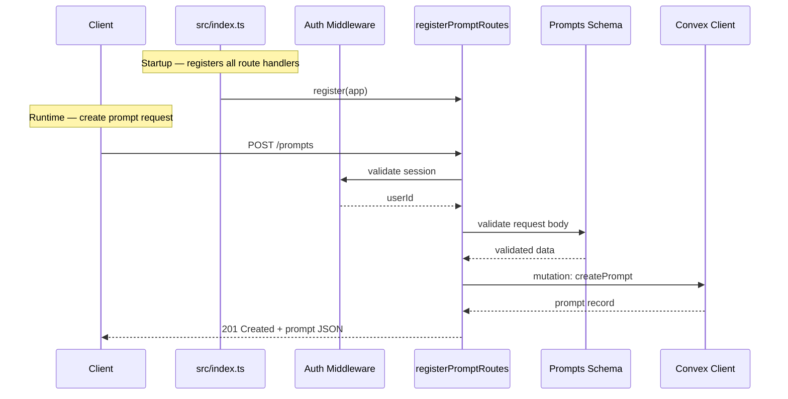

# Server Routes

## Overview

The Server Routes module contains eight route-registration functions, each mounting a cohesive group of HTTP endpoints onto the application server. Routes span app pages, OAuth/auth flows, prompts CRUD, drafts (Redis-backed), user preferences, import/export, module configuration, and well-known discovery endpoints. All route files follow a consistent pattern: a single exported `register*Routes(app)` function that the main entry point (`src/index.ts`) calls at startup. Most routes depend on shared auth middleware for session enforcement and on schema modules for request/response validation.

## Responsibilities

- Register app-page routes with auth-gated rendering
- Handle OAuth login/callback flows via WorkOS
- Provide full CRUD operations for prompts against Convex backend
- Manage ephemeral draft state in Redis
- Read and update user preferences in Convex with Redis caching
- Bulk import and export of prompt data
- Expose module configuration endpoints
- Serve `.well-known` discovery documents for MCP/OAuth

## Structure Diagram

```mermaid
flowchart TD
  entry["src/index.ts"]
  entry --> app["registerAppRoutes"]
  entry --> auth["registerAuthRoutes"]
  entry --> drafts["registerDraftRoutes"]
  entry --> prompts["registerPromptRoutes"]
  entry --> prefs["registerPreferencesRoutes"]
  entry --> ie["registerImportExportRoutes"]
  entry --> mods["registerModuleRoutes"]
  entry --> wk["registerWellKnownRoutes"]

  subgraph Middleware & Libs
    authMw["auth middleware"]
    workos["WorkOS client"]
    redis["Redis client"]
    convex["Convex client"]
    config["config"]
    merge["merge util"]
  end

  subgraph Schemas
    sPrompts["prompts schema"]
    sDrafts["drafts schema"]
    sPrefs["preferences schema"]
    sIE["import-export schema"]
  end

  app --> authMw
  app --> sPrefs
  auth --> workos
  auth --> authMw
  drafts --> redis
  drafts --> authMw
  drafts --> sDrafts
  prompts --> convex
  prompts --> config
  prompts --> authMw
  prompts --> sPrompts
  prompts --> merge
  prefs --> convex
  prefs --> config
  prefs --> redis
  prefs --> authMw
  prefs --> sPrefs
  ie --> convex
  ie --> config
  ie --> authMw
  ie --> sIE
  ie --> sPrompts
  mods --> sPrefs
```

## Entity Table

| Name | Kind | Role | Public Entrypoints | Depends On | Used By |
| --- | --- | --- | --- | --- | --- |
| registerAppRoutes | function | Mounts app page routes (dashboard, editor) behind auth middleware | registerAppRoutes | auth middleware, preferences schema | src/index.ts |
| registerAuthRoutes | function | Handles OAuth login initiation and callback via WorkOS | registerAuthRoutes | WorkOS client, auth middleware | src/index.ts, tests/service/auth/routes.test.ts |
| registerDraftRoutes | function | CRUD for ephemeral prompt drafts stored in Redis | registerDraftRoutes | Redis client, auth middleware, drafts schema | src/index.ts, tests/service/drafts/drafts.test.ts |
| registerPromptRoutes | function | Full CRUD for prompts persisted in Convex, with merge support | registerPromptRoutes | Convex client, config, merge util, auth middleware, prompts schema | src/index.ts, tests/service/prompts/* |
| registerPreferencesRoutes | function | Read/write user preferences via Convex with Redis cache layer | registerPreferencesRoutes | Convex client, config, Redis client, auth middleware, preferences schema | src/index.ts |
| registerImportExportRoutes | function | Bulk import and export of prompt collections through Convex | registerImportExportRoutes | Convex client, config, auth middleware, import-export schema, prompts schema | src/index.ts, tests/service/prompts/importExport.test.ts |
| registerModuleRoutes | function | Expose module configuration endpoints | registerModuleRoutes | preferences schema | src/index.ts |
| registerWellKnownRoutes | function | Serve .well-known discovery documents for MCP and OAuth | registerWellKnownRoutes | none | src/index.ts, tests/service/mcp/well-known.test.ts |

## Key Flow

## Flow Notes

| Step | Actor/Component | Action | Output / Side Effect |
| --- | --- | --- | --- |
| 1 | src/index.ts | Calls each register*Routes(app) to mount all HTTP endpoints on the server | All route groups registered on the app instance |
| 2 | Client | Sends an HTTP request (e.g., POST /prompts) to the server | Request reaches the matching route handler |
| 3 | Route handler | Invokes auth middleware to validate session and extract userId | Authenticated userId or 401 response |
| 4 | Route handler | Validates request body against the appropriate schema | Validated and typed request data |
| 5 | Route handler | Calls the backing store (Convex, Redis) to perform the operation | Persisted or retrieved data |
| 6 | Route handler | Returns HTTP response with status code and JSON body to the client | Typed API response |

## Source Coverage

- src/routes/app.ts
- src/routes/auth.ts
- src/routes/drafts.ts
- src/routes/import-export.ts
- src/routes/modules.ts
- src/routes/preferences.ts
- src/routes/prompts.ts
- src/routes/well-known.ts

## Cross-Module Context

- src/index.ts -> src/routes/app.ts (usage)
- src/index.ts -> src/routes/auth.ts (usage)
- src/index.ts -> src/routes/drafts.ts (usage)
- src/index.ts -> src/routes/import-export.ts (usage)
- src/index.ts -> src/routes/modules.ts (usage)
- src/index.ts -> src/routes/preferences.ts (usage)
- src/index.ts -> src/routes/prompts.ts (usage)
- src/index.ts -> src/routes/well-known.ts (usage)
- src/routes/app.ts -> src/middleware/auth.ts (import)
- src/routes/app.ts -> src/schemas/preferences.ts (import)
- src/routes/auth.ts -> src/lib/workos.ts (import)
- src/routes/auth.ts -> src/middleware/auth.ts (import)
- src/routes/drafts.ts -> src/lib/redis.ts (import)
- src/routes/drafts.ts -> src/middleware/auth.ts (import)
- src/routes/drafts.ts -> src/schemas/drafts.ts (import)
- src/routes/import-export.ts -> convex/_generated/api.d.ts (import)
- src/routes/import-export.ts -> src/lib/config.ts (import)
- src/routes/import-export.ts -> src/lib/convex.ts (import)
- src/routes/import-export.ts -> src/middleware/auth.ts (import)
- src/routes/import-export.ts -> src/schemas/import-export.ts (import)
- src/routes/import-export.ts -> src/schemas/prompts.ts (import)
- src/routes/modules.ts -> src/schemas/preferences.ts (import)
- src/routes/preferences.ts -> convex/_generated/api.d.ts (import)
- src/routes/preferences.ts -> src/lib/config.ts (import)
- src/routes/preferences.ts -> src/lib/convex.ts (import)
- src/routes/preferences.ts -> src/lib/redis.ts (import)
- src/routes/preferences.ts -> src/middleware/auth.ts (import)
- src/routes/preferences.ts -> src/schemas/preferences.ts (import)
- src/routes/prompts.ts -> convex/_generated/api.d.ts (import)
- src/routes/prompts.ts -> src/lib/config.ts (import)
- src/routes/prompts.ts -> src/lib/convex.ts (import)
- src/routes/prompts.ts -> src/lib/merge.ts (import)
- src/routes/prompts.ts -> src/middleware/auth.ts (import)
- src/routes/prompts.ts -> src/schemas/prompts.ts (import)
- tests/service/auth/routes.test.ts -> src/routes/auth.ts (usage)
- tests/service/drafts/drafts.test.ts -> src/routes/drafts.ts (usage)
- tests/service/mcp/well-known.test.ts -> src/routes/well-known.ts (usage)
- tests/service/prompts/createPrompts.test.ts -> src/routes/prompts.ts (usage)
- tests/service/prompts/deletePrompt.test.ts -> src/routes/prompts.ts (usage)
- tests/service/prompts/edgeCases.test.ts -> src/routes/prompts.ts (usage)
- tests/service/prompts/getPrompt.test.ts -> src/routes/prompts.ts (usage)
- tests/service/prompts/importExport.test.ts -> src/routes/import-export.ts (usage)
- tests/service/prompts/updatePrompt.test.ts -> src/routes/prompts.ts (usage)
