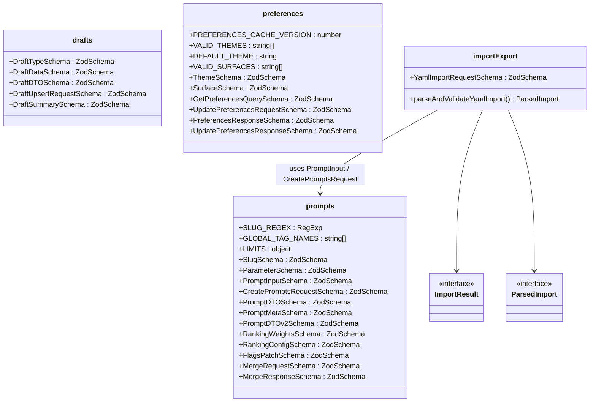
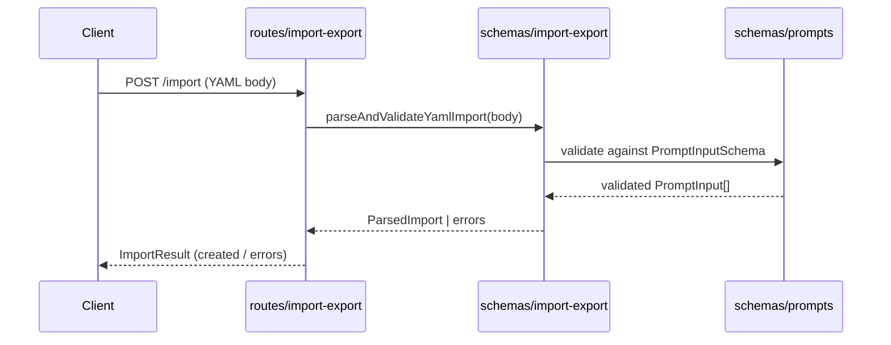

# Server Schemas

## Overview

Centralized Zod validation schemas and inferred TypeScript types for the LiminalDB server. The module is organized into four schema files — **prompts**, **drafts**, **preferences**, and **import-export** — that define the contract between route handlers, MCP tooling, and persistence layers. Each file co-locates a Zod schema with its inferred `z.infer<>` type alias and any domain constants (limits, regex patterns, enums). The import-export schema depends on prompts for reuse of `PromptInput` / `CreatePromptsRequest` shapes.

## Responsibilities

- Define Zod schemas for prompt CRUD, ranking, flags, and merge operations
- Define Zod schemas for draft types, upsert requests, and summaries
- Define Zod schemas for user preferences (theme, surface) including cache versioning
- Define Zod schemas and a validation helper for YAML import/export payloads
- Export inferred TypeScript types so consumers stay type-safe without duplicating shapes
- Provide domain constants (SLUG_REGEX, LIMITS, GLOBAL_TAG_NAMES, VALID_THEMES, VALID_SURFACES)

## Structure Diagram

## Entity Table

| Name | Kind | Role | Public Entrypoints | Depends On | Used By |
| --- | --- | --- | --- | --- | --- |
| prompts.ts | schema file | Core prompt domain schemas, DTOs, ranking config, flags, and merge operations | SLUG_REGEX, LIMITS, GLOBAL_TAG_NAMES, SlugSchema, ParameterSchema, PromptInputSchema, CreatePromptsRequestSchema, PromptDTOSchema, PromptDTOv2Schema, PromptMetaSchema, RankingWeightsSchema, RankingConfigSchema, FlagsPatchSchema, MergeRequestSchema, MergeResponseSchema | none | src/routes/prompts.ts, src/routes/import-export.ts, src/lib/mcp.ts, src/schemas/import-export.ts |
| drafts.ts | schema file | Draft lifecycle schemas — type enum, data shape, upsert request, and summary projection | DraftTypeSchema, DraftDataSchema, DraftDTOSchema, DraftUpsertRequestSchema, DraftSummarySchema | none | src/routes/drafts.ts, tests/service/drafts/drafts.test.ts |
| preferences.ts | schema file | User preference schemas for theme/surface selection, query params, and response shapes | PREFERENCES_CACHE_VERSION, VALID_THEMES, DEFAULT_THEME, VALID_SURFACES, ThemeSchema, SurfaceSchema, GetPreferencesQuerySchema, UpdatePreferencesRequestSchema, PreferencesResponseSchema, UpdatePreferencesResponseSchema | none | src/routes/preferences.ts, src/routes/app.ts, src/routes/modules.ts, src/lib/mcp.ts, src/lib/redis.ts |
| import-export.ts | schema file | YAML import/export validation — parses raw YAML payload and validates against prompt schemas | YamlImportRequestSchema, parseAndValidateYamlImport, ImportResult, ParsedImport | src/schemas/prompts.ts | src/routes/import-export.ts |
| parseAndValidateYamlImport | function | Parses a YAML string and validates it against PromptInput schemas, returning a ParsedImport or errors | parseAndValidateYamlImport | PromptInputSchema, CreatePromptsRequestSchema | src/routes/import-export.ts |

## Key Flow

## Flow Notes

| Step | Actor/Component | Action | Output / Side Effect |
| --- | --- | --- | --- |
| 1 | Client | Sends a POST request with a YAML payload to the import endpoint | Raw YAML body reaches the route handler |
| 2 | ImportExportRoute | Delegates to parseAndValidateYamlImport for schema-level validation | Function invoked with the raw body |
| 3 | ImportExportSchema | Parses YAML and runs each entry through PromptInputSchema from prompts.ts | Array of validated PromptInput objects or Zod validation errors |
| 4 | ImportExportRoute | Returns the ImportResult to the client — created prompts or error details | HTTP response with success/failure payload |

## Source Coverage

- src/schemas/drafts.ts
- src/schemas/import-export.ts
- src/schemas/preferences.ts
- src/schemas/prompts.ts

## Cross-Module Context

- src/lib/mcp.ts -> src/schemas/preferences.ts (import)
- src/lib/mcp.ts -> src/schemas/prompts.ts (import)
- src/lib/redis.ts -> src/schemas/preferences.ts (import)
- src/routes/app.ts -> src/schemas/preferences.ts (import)
- src/routes/drafts.ts -> src/schemas/drafts.ts (import)
- src/routes/import-export.ts -> src/schemas/import-export.ts (import)
- src/routes/import-export.ts -> src/schemas/prompts.ts (import)
- src/routes/modules.ts -> src/schemas/preferences.ts (import)
- src/routes/preferences.ts -> src/schemas/preferences.ts (import)
- src/routes/prompts.ts -> src/schemas/prompts.ts (import)
- tests/service/drafts/drafts.test.ts -> src/schemas/drafts.ts (usage)
- tests/service/prompts/edgeCases.test.ts -> src/schemas/prompts.ts (usage)
