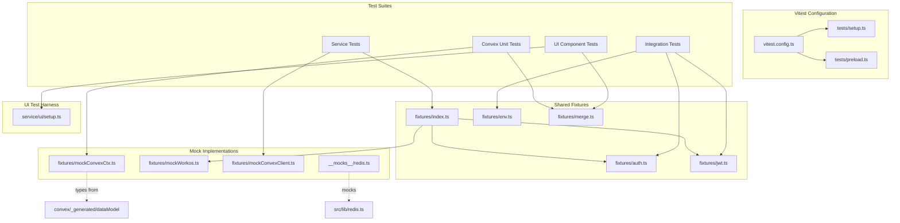
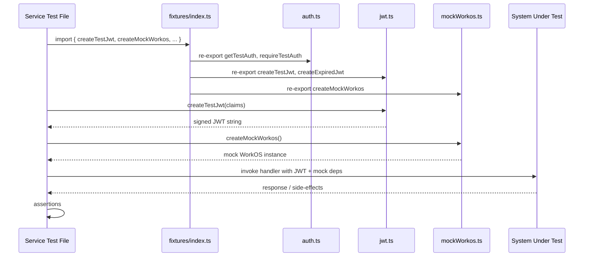

# Test Infrastructure

## Overview

Centralized test setup, configuration, fixtures, mocks, and shared helpers powering the LiminalDB test suite across three tiers: **unit tests** (Convex functions), **service tests** (API routes, MCP tools, UI components), and **integration tests** (live staging server). The module is organized into four layers: Vitest configuration and global setup, mock implementations (Redis, Convex, WorkOS), reusable fixture factories (auth, JWT, environment), and a rich UI test harness with DOM helpers.

## Responsibilities

- Configure Vitest with global setup, preload scripts, and module aliasing via `vitest.config.ts`
- Provide environment variable access and base-URL resolution for integration tests (`env.ts`)
- Generate and cache real or mock authentication tokens for test requests (`auth.ts`, `jwt.ts`)
- Supply mock implementations of external dependencies: Redis (`redis.ts`), WorkOS (`mockWorkos.ts`), Convex client (`mockConvexClient.ts`), and Convex query context (`mockConvexCtx.ts`)
- Offer deterministic merge-conflict fixture data (`merge.ts`) used by Convex, service, and UI tests
- Provide a comprehensive UI test harness with DOM injection, simulated user interactions, and async waiting utilities (`tests/service/ui/setup.ts`)
- Re-export commonly used service-test fixtures through a barrel file (`tests/fixtures/index.ts`)

## Structure Diagram

## Entity Table

| Name | Kind | Role | Public Entrypoints | Depends On | Used By |
| --- | --- | --- | --- | --- | --- |
| vitest.config.ts | config | Root Vitest configuration defining test projects, setup files, and module aliases | vitest.config.ts | tests/setup.ts, tests/preload.ts | none |
| tests/setup.ts | file | Global test setup executed before each test file | tests/setup.ts | none | vitest.config.ts |
| tests/preload.ts | file | Preload script for environment variable stubs and global polyfills | tests/preload.ts | none | vitest.config.ts |
| fixtures/index.ts | barrel | Re-exports auth, JWT, and WorkOS mocks for service-level tests | tests/fixtures/index.ts | fixtures/auth.ts, fixtures/jwt.ts, fixtures/mockWorkos.ts | Service tests (17 files) |
| TestAuth | interface | Shape of cached authentication credentials used across integration tests | tests/fixtures/auth.ts:TestAuth | none | Integration tests, fixtures/index.ts |
| getTestAuth / requireTestAuth / clearAuthCache | function | Obtain, require, or invalidate cached auth tokens for test HTTP requests | tests/fixtures/auth.ts:getTestAuth, tests/fixtures/auth.ts:requireTestAuth, tests/fixtures/auth.ts:clearAuthCache | none | Integration tests (12 files), fixtures/index.ts |
| requireEnv / getTestBaseUrl | function | Safely read required env vars and resolve the staging base URL for integration tests | tests/fixtures/env.ts:requireEnv, tests/fixtures/env.ts:getTestBaseUrl | none | Integration tests (13 files) |
| createTestJwt / createExpiredJwt / createMalformedJwt | function | Generate valid, expired, or malformed JWTs for auth boundary testing | tests/fixtures/jwt.ts:createTestJwt, tests/fixtures/jwt.ts:createExpiredJwt, tests/fixtures/jwt.ts:createMalformedJwt | none | fixtures/index.ts, auth-api integration test |
| MERGE_FIXTURES | constant | Deterministic merge-conflict scenario data shared across Convex, service, and UI tests | tests/fixtures/merge.ts:MERGE_FIXTURES | none | mergeFields.test.ts, merge.test.ts, merge-mode.test.ts |
| createRedisMock | function | In-memory Redis mock replacing src/lib/redis for unit tests | tests/__mocks__/redis.ts:createRedisMock | src/lib/redis.ts | drafts.test.ts |
| createMockWorkos | function | Mock WorkOS SDK with controllable user-management and SSO responses | tests/fixtures/mockWorkos.ts:createMockWorkos | none | fixtures/index.ts |
| MockConvexClient / createMockConvexClient | interface + function | Lightweight mock of the Convex HTTP client for service-layer prompt tests | tests/fixtures/mockConvexClient.ts:MockConvexClient, tests/fixtures/mockConvexClient.ts:createMockConvexClient | none | flagsUsage.test.ts, listPrompts.test.ts, mergePrompt.test.ts |
| MockCtx / MockDb / createMockCtx | interface + function | Full mock of a Convex mutation/query context with in-memory DB, query builder, and insert helpers | tests/fixtures/mockConvexCtx.ts:MockCtx, tests/fixtures/mockConvexCtx.ts:MockDb, tests/fixtures/mockConvexCtx.ts:createMockCtx, tests/fixtures/mockConvexCtx.ts:asConvexCtx, tests/fixtures/mockConvexCtx.ts:getQueryBuilder, tests/fixtures/mockConvexCtx.ts:mockSequentialReturns, tests/fixtures/mockConvexCtx.ts:mockInsertSequence | convex/_generated/dataModel.d.ts | Convex unit tests (6 files) |
| UI Test Harness (setup.ts) | module | DOM injection, template loading, mock fetch/clipboard, simulated user events, and async wait utilities for UI component tests | tests/service/ui/setup.ts:loadTemplate, tests/service/ui/setup.ts:mockFetch, tests/service/ui/setup.ts:createPromptViewerTestEnv, tests/service/ui/setup.ts:click, tests/service/ui/setup.ts:input, tests/service/ui/setup.ts:blur, tests/service/ui/setup.ts:waitForAsync, tests/service/ui/setup.ts:waitForElement | none | UI component tests (8 files) |

## Key Flow

## Flow Notes

| Step | Actor/Component | Action | Output / Side Effect |
| --- | --- | --- | --- |
| 1 | Test File | Imports fixtures via barrel (index.ts) or directly from specialized fixture files | Auth helpers, JWT factories, and mock constructors available |
| 2 | JWT Fixture | createTestJwt generates a signed JWT with configurable claims; createExpiredJwt / createMalformedJwt produce error-path tokens | JWT string ready for Authorization header |
| 3 | Mock Factory | createMockWorkos / createMockConvexClient / createMockCtx build controllable stand-ins for external services | Mock instances with preset or programmable return values |
| 4 | Test File | Passes JWT and mocks into the system under test (route handler, MCP tool, Convex function) | Response or mutation side-effects captured |
| 5 | Test File | Asserts on returned data, status codes, mock call counts, or DB state via MockCtx | Pass / fail verdict reported to Vitest |

## Source Coverage

- tests/__mocks__/redis.ts
- tests/fixtures/auth.ts
- tests/fixtures/env.ts
- tests/fixtures/index.ts
- tests/fixtures/jwt.ts
- tests/fixtures/merge.ts
- tests/fixtures/mockConvexClient.ts
- tests/fixtures/mockConvexCtx.ts
- tests/fixtures/mockWorkos.ts
- tests/preload.ts
- tests/service/ui/setup.ts
- tests/setup.ts
- vitest.config.ts

## Cross-Module Context

- tests/__mocks__/redis.ts -> src/lib/redis.ts (import)
- tests/convex/prompts/deleteBySlug.test.ts -> tests/fixtures/mockConvexCtx.ts (usage)
- tests/convex/prompts/getPromptBySlug.test.ts -> tests/fixtures/mockConvexCtx.ts (usage)
- tests/convex/prompts/insertPrompts.test.ts -> tests/fixtures/mockConvexCtx.ts (usage)
- tests/convex/prompts/mergeFields.test.ts -> tests/fixtures/merge.ts (usage)
- tests/convex/prompts/searchPrompts.test.ts -> tests/fixtures/mockConvexCtx.ts (usage)
- tests/convex/prompts/slugExists.test.ts -> tests/fixtures/mockConvexCtx.ts (usage)
- tests/convex/prompts/usageTracking.test.ts -> tests/fixtures/mockConvexCtx.ts (usage)
- tests/fixtures/mockConvexCtx.ts -> convex/_generated/dataModel.d.ts (import)
- tests/integration/auth-api.test.ts -> tests/fixtures/auth.ts (usage)
- tests/integration/auth-api.test.ts -> tests/fixtures/env.ts (usage)
- tests/integration/auth-api.test.ts -> tests/fixtures/jwt.ts (usage)
- tests/integration/auth-cookie.test.ts -> tests/fixtures/env.ts (usage)
- tests/integration/auth-mcp.test.ts -> tests/fixtures/auth.ts (usage)
- tests/integration/auth-mcp.test.ts -> tests/fixtures/env.ts (usage)
- tests/integration/health.test.ts -> tests/fixtures/env.ts (usage)
- tests/integration/healthAuth.test.ts -> tests/fixtures/auth.ts (usage)
- tests/integration/healthAuth.test.ts -> tests/fixtures/env.ts (usage)
- tests/integration/import-export.test.ts -> tests/fixtures/auth.ts (usage)
- tests/integration/import-export.test.ts -> tests/fixtures/env.ts (usage)
- tests/integration/mcp-oauth.test.ts -> tests/fixtures/auth.ts (usage)
- tests/integration/mcp-oauth.test.ts -> tests/fixtures/env.ts (usage)
- tests/integration/mcp.test.ts -> tests/fixtures/auth.ts (usage)
- tests/integration/mcp.test.ts -> tests/fixtures/env.ts (usage)
- tests/integration/merge.test.ts -> tests/fixtures/auth.ts (usage)
- tests/integration/merge.test.ts -> tests/fixtures/env.ts (usage)
- tests/integration/preferences.test.ts -> tests/fixtures/auth.ts (usage)
- tests/integration/preferences.test.ts -> tests/fixtures/env.ts (usage)
- tests/integration/prompts-api.test.ts -> tests/fixtures/auth.ts (usage)
- tests/integration/prompts-api.test.ts -> tests/fixtures/env.ts (usage)
- tests/integration/ui/ui-auth.test.ts -> tests/fixtures/auth.ts (usage)
- tests/integration/ui/ui-auth.test.ts -> tests/fixtures/env.ts (usage)
- tests/integration/ui/ui-prompts.test.ts -> tests/fixtures/auth.ts (usage)
- tests/integration/ui/ui-prompts.test.ts -> tests/fixtures/env.ts (usage)
- tests/service/auth/mcp.test.ts -> tests/fixtures/index.ts (usage)
- tests/service/auth/middleware.test.ts -> tests/fixtures/index.ts (usage)
- tests/service/auth/routes.test.ts -> tests/fixtures/index.ts (usage)
- tests/service/drafts/drafts.test.ts -> tests/__mocks__/redis.ts (usage)
- tests/service/drafts/drafts.test.ts -> tests/fixtures/index.ts (usage)
- tests/service/lib/merge.test.ts -> tests/fixtures/merge.ts (usage)
- tests/service/mcp/resources.test.ts -> tests/fixtures/index.ts (usage)
- tests/service/mcp/tools.test.ts -> tests/fixtures/index.ts (usage)
- tests/service/preferences.test.ts -> tests/fixtures/index.ts (usage)
- tests/service/prompts/createPrompts.test.ts -> tests/fixtures/index.ts (usage)
- tests/service/prompts/deletePrompt.test.ts -> tests/fixtures/index.ts (usage)
- tests/service/prompts/edgeCases.test.ts -> tests/fixtures/index.ts (usage)
- tests/service/prompts/flagsUsage.test.ts -> tests/fixtures/index.ts (usage)
- tests/service/prompts/flagsUsage.test.ts -> tests/fixtures/mockConvexClient.ts (usage)
- tests/service/prompts/getPrompt.test.ts -> tests/fixtures/index.ts (usage)
- tests/service/prompts/importExport.test.ts -> tests/fixtures/index.ts (usage)
- tests/service/prompts/listPrompts.test.ts -> tests/fixtures/index.ts (usage)
- tests/service/prompts/listPrompts.test.ts -> tests/fixtures/mockConvexClient.ts (usage)
- tests/service/prompts/mcpTools.test.ts -> tests/fixtures/index.ts (usage)
- tests/service/prompts/mergePrompt.test.ts -> tests/fixtures/index.ts (usage)
- tests/service/prompts/mergePrompt.test.ts -> tests/fixtures/mockConvexClient.ts (usage)
- tests/service/prompts/updatePrompt.test.ts -> tests/fixtures/index.ts (usage)
- tests/service/ui/merge-mode.test.ts -> tests/fixtures/merge.ts (usage)
- tests/service/ui/merge-mode.test.ts -> tests/service/ui/setup.ts (usage)
- tests/service/ui/modal-toast.test.ts -> tests/service/ui/setup.ts (usage)
- tests/service/ui/prompt-editor.test.ts -> tests/service/ui/setup.ts (usage)
- tests/service/ui/prompt-viewer.test.ts -> tests/service/ui/setup.ts (usage)
- tests/service/ui/prompts-module.test.ts -> tests/service/ui/setup.ts (usage)
- tests/service/ui/shell-history.test.ts -> tests/service/ui/setup.ts (usage)
- tests/service/ui/tag-selector.test.ts -> tests/service/ui/setup.ts (usage)
- tests/service/ui/theme-picker.test.ts -> tests/service/ui/setup.ts (usage)
