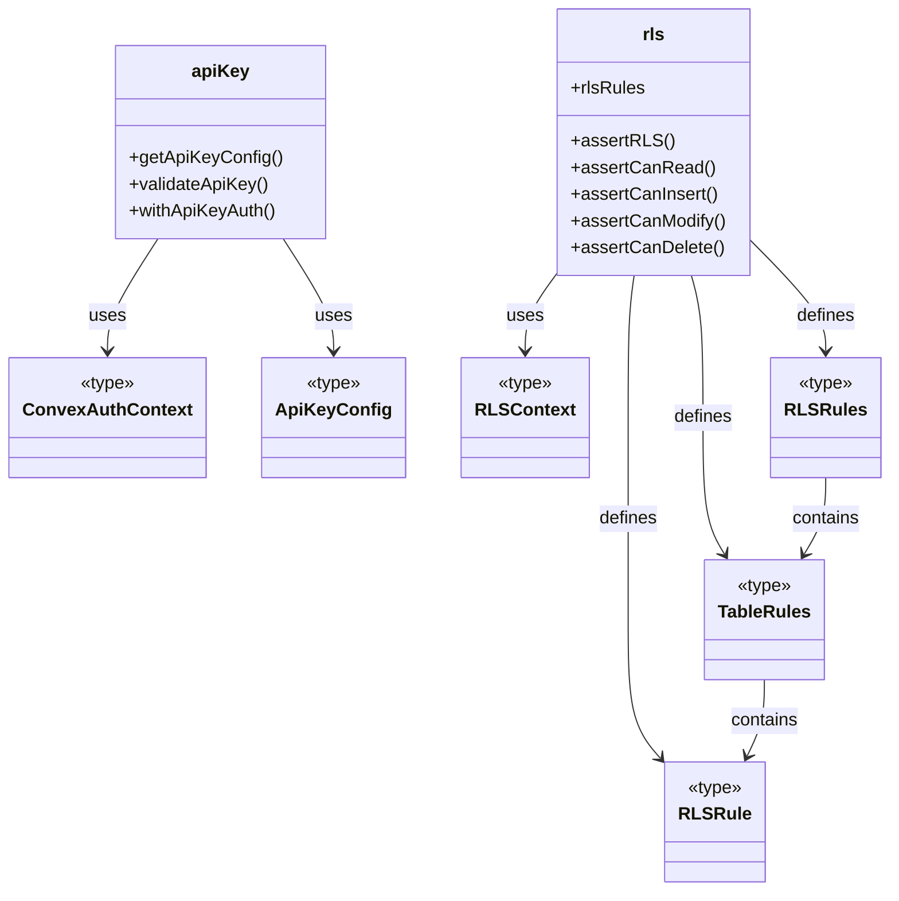
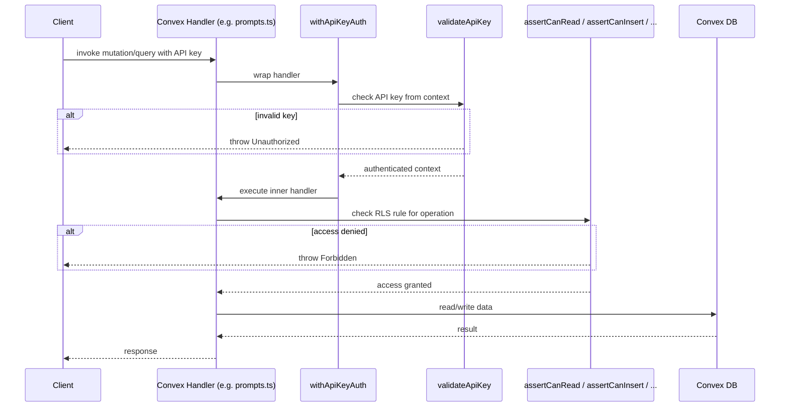

# Convex Auth & Security

## Overview

The Convex Auth & Security module provides the backend authentication and authorization layer for LiminalDB's Convex functions. It comprises three concerns: API key validation (verifying shared-secret keys on inbound requests), row-level security (RLS) rules that gate read/write/delete access per table, and shared auth type definitions consumed by both subsystems. The auth config file wires up the Convex authentication provider. All Convex mutation and query handlers that touch user data depend on this module to enforce access control.

## Responsibilities

- Validate API keys presented by clients against server-side configuration
- Wrap Convex function handlers with API key authentication via `withApiKeyAuth`
- Define and enforce row-level security rules per table (read, insert, modify, delete)
- Export reusable auth context and config types (`ConvexAuthContext`, `ApiKeyConfig`, `RLSContext`)
- Provide granular RLS assertion helpers (`assertCanRead`, `assertCanInsert`, `assertCanModify`, `assertCanDelete`)
- Configure the Convex authentication provider via `auth.config.ts`

## Structure Diagram

## Entity Table

| Name | Kind | Role | Public Entrypoints | Depends On | Used By |
| --- | --- | --- | --- | --- | --- |
| auth.config.ts | file | Convex authentication provider configuration | none | none | none |
| getApiKeyConfig | function | Retrieves the API key configuration from environment/server context | convex/auth/apiKey.ts:getApiKeyConfig | ConvexAuthContext, ApiKeyConfig, convex/_generated/server.d.ts | convex/healthAuth.ts, convex/prompts.ts, convex/userPreferences.ts |
| validateApiKey | function | Validates an incoming API key against stored configuration | convex/auth/apiKey.ts:validateApiKey | ConvexAuthContext, ApiKeyConfig, convex/_generated/server.d.ts | convex/healthAuth.ts, convex/prompts.ts, convex/userPreferences.ts |
| withApiKeyAuth | function | Higher-order wrapper that enforces API key auth on a Convex handler | convex/auth/apiKey.ts:withApiKeyAuth | ConvexAuthContext, ApiKeyConfig, convex/_generated/server.d.ts | convex/healthAuth.ts, convex/prompts.ts, convex/userPreferences.ts |
| assertRLS | function | Generic RLS assertion — checks a rule for a given operation and table | convex/auth/rls.ts:assertRLS | RLSContext, RLSRules | convex/model/prompts.ts, convex/userPreferences.ts |
| assertCanRead | function | Asserts the caller has read access to a row | convex/auth/rls.ts:assertCanRead | RLSContext | convex/model/prompts.ts, convex/userPreferences.ts |
| assertCanInsert | function | Asserts the caller has insert access to a table | convex/auth/rls.ts:assertCanInsert | RLSContext | convex/model/prompts.ts, convex/userPreferences.ts |
| assertCanModify | function | Asserts the caller has modify access to a row | convex/auth/rls.ts:assertCanModify | RLSContext | convex/model/prompts.ts, convex/userPreferences.ts |
| assertCanDelete | function | Asserts the caller has delete access to a row | convex/auth/rls.ts:assertCanDelete | RLSContext | convex/model/prompts.ts, convex/userPreferences.ts |
| rlsRules | variable | Central registry of per-table RLS rule definitions | convex/auth/rls.ts:rlsRules | RLSRules, RLSRule, TableRules | convex/model/prompts.ts, convex/userPreferences.ts |
| ConvexAuthContext | type | Typed context for Convex auth identity and session | convex/auth/types.ts:ConvexAuthContext | none | convex/auth/apiKey.ts, convex/auth/rls.ts |
| ApiKeyConfig | type | Shape of the API key configuration object | convex/auth/types.ts:ApiKeyConfig | none | convex/auth/apiKey.ts |
| RLSContext | type | Context passed into RLS rule evaluators (identity + row data) | convex/auth/types.ts:RLSContext | none | convex/auth/rls.ts |

## Key Flow

## Flow Notes

| Step | Actor/Component | Action | Output / Side Effect |
| --- | --- | --- | --- |
| 1 | Client | Invokes a Convex query or mutation, supplying an API key in the request context | Raw request reaches the Convex handler |
| 2 | withApiKeyAuth | Intercepts the call and delegates to `validateApiKey` to verify the presented key against `getApiKeyConfig` | Authenticated context or Unauthorized error |
| 3 | Convex Handler | Calls the appropriate RLS assertion (e.g. `assertCanRead`) before accessing data | Access granted or Forbidden error |
| 4 | Convex Handler | Performs the database operation and returns the result to the client | Query/mutation response |

## Source Coverage

- convex/auth.config.ts
- convex/auth/apiKey.ts
- convex/auth/rls.ts
- convex/auth/types.ts

## Cross-Module Context

- convex/auth/apiKey.ts -> convex/_generated/server.d.ts (import)
- convex/healthAuth.ts -> convex/auth/apiKey.ts (import)
- convex/model/prompts.ts -> convex/auth/rls.ts (import)
- convex/prompts.ts -> convex/auth/apiKey.ts (import)
- convex/userPreferences.ts -> convex/auth/apiKey.ts (import)
- convex/userPreferences.ts -> convex/auth/rls.ts (import)
- tests/convex/auth/apiKey.test.ts -> convex/auth/apiKey.ts (usage)
- tests/convex/auth/rls.test.ts -> convex/auth/rls.ts (usage)
- tests/convex/healthAuth.test.ts -> convex/auth/apiKey.ts (usage)
- tests/convex/healthAuth.test.ts -> convex/auth/types.ts (usage)
