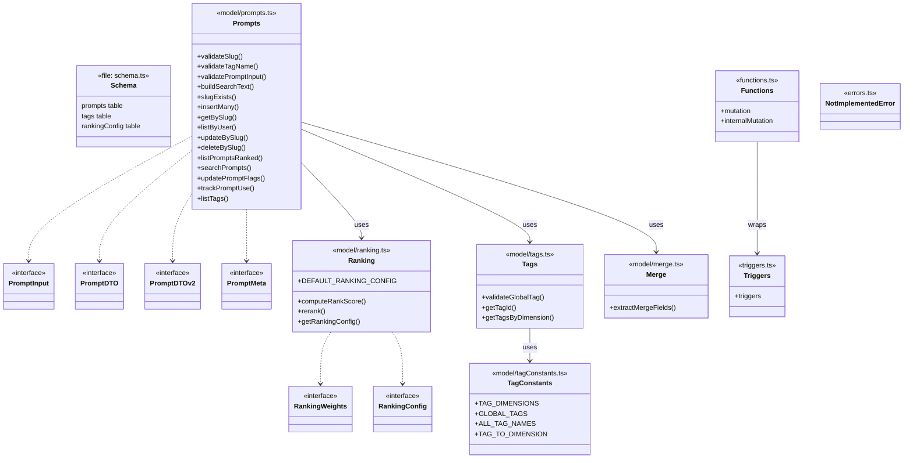
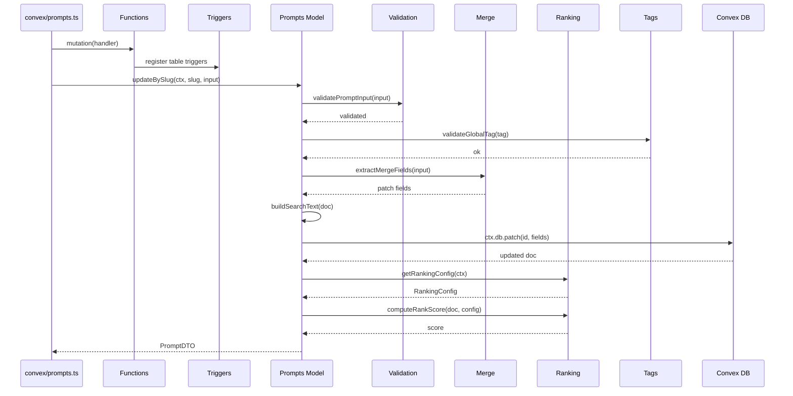

# Convex Data Model

## Overview

The Convex Data Model module defines the domain layer for LiminalDB's server-side logic. It encompasses the Convex schema definition, prompt CRUD operations with slug-based addressing, a tag taxonomy system with predefined dimensions, a configurable ranking/scoring engine, merge-field extraction for partial updates, custom mutation wrappers with trigger support, and shared error types. All model functions operate against the Convex database context and enforce row-level security via the auth/rls collaborator.

## Responsibilities

- Define the Convex database schema for prompts, tags, ranking config, and related tables
- Provide prompt CRUD operations (insert, get, update, delete) addressed by user-scoped slugs
- Validate prompt inputs, slugs, and tag names before persistence
- Build and maintain searchable text indexes for full-text prompt search
- Compute rank scores using configurable weights (recency, frequency, flagged status) and re-rank prompt lists
- Manage a global tag taxonomy organized by dimensions (e.g., domain, purpose) with validation
- Extract merge fields from partial update payloads for safe patching
- Wrap Convex mutation and internalMutation with trigger-aware custom function builders
- Track prompt usage events for ranking signals

## Structure Diagram

## Entity Table

| Name | Kind | Role | Public Entrypoints | Depends On | Used By |
| --- | --- | --- | --- | --- | --- |
| schema.ts | file | Defines all Convex tables (prompts, tags, rankingConfig) and their indexes | none | none | none |
| Prompts (model/prompts.ts) | module | Core domain logic for prompt CRUD, validation, search, ranking, usage tracking, and tag listing | insertMany, getBySlug, listByUser, updateBySlug, deleteBySlug, listPromptsRanked, searchPrompts, updatePromptFlags, trackPromptUse, listTags, validateSlug, validateTagName, validatePromptInput, slugExists, buildSearchText | model/merge.ts, model/ranking.ts, model/tags.ts, auth/rls.ts | convex/prompts.ts, migrations/backfillSearchText.ts |
| Ranking (model/ranking.ts) | module | Configurable rank-score computation and list re-ranking with tunable weights | computeRankScore, rerank, getRankingConfig, DEFAULT_RANKING_CONFIG | none | model/prompts.ts, migrations/seedRankingConfig.ts |
| Tags (model/tags.ts) | module | Tag lookup, validation against the global tag set, and dimension-based queries | validateGlobalTag, getTagId, getTagsByDimension | model/tagConstants.ts | model/prompts.ts |
| TagConstants (model/tagConstants.ts) | module | Static tag taxonomy definitions: dimensions, global tag names, and dimension mappings | TAG_DIMENSIONS, GLOBAL_TAGS, ALL_TAG_NAMES, TAG_TO_DIMENSION | none | model/tags.ts, migrations/seedGlobalTags.ts |
| Merge (model/merge.ts) | module | Extracts non-undefined fields from a partial update payload for safe patching | extractMergeFields | none | model/prompts.ts |
| Functions (functions.ts) | module | Custom Convex mutation and internalMutation wrappers that integrate the trigger system | mutation, internalMutation | triggers.ts | convex/prompts.ts, convex/userPreferences.ts |
| Triggers (triggers.ts) | module | Defines table-level triggers invoked by custom function wrappers on data mutations | triggers | none | functions.ts |
| NotImplementedError | class | Custom error class for unimplemented code paths | NotImplementedError | none | none |

## Key Flow

## Flow Notes

| Step | Actor/Component | Action | Output / Side Effect |
| --- | --- | --- | --- |
| 1 | API layer (convex/prompts.ts) | Invokes an update mutation through the custom Functions wrapper which integrates triggers | Trigger-aware mutation context |
| 2 | Prompts Model | Validates the incoming input (slug format, tag names, required fields) via validation helpers | Validated PromptInput or thrown validation error |
| 3 | Merge | Extracts only the defined (non-undefined) fields from the partial update payload | Clean patch object for safe database update |
| 4 | Prompts Model | Builds searchable text from the prompt content and persists the update to Convex DB | Updated document in the prompts table |
| 5 | Ranking | Loads ranking config and computes the rank score for the updated prompt based on weights | Numeric rank score attached to the PromptDTO response |

## Source Coverage

- convex/errors.ts
- convex/functions.ts
- convex/model/merge.ts
- convex/model/prompts.ts
- convex/model/ranking.ts
- convex/model/tagConstants.ts
- convex/model/tags.ts
- convex/schema.ts
- convex/triggers.ts

## Cross-Module Context

- convex/functions.ts -> convex/_generated/server.d.ts (import)
- convex/migrations/backfillSearchText.ts -> convex/model/prompts.ts (import)
- convex/migrations/seedGlobalTags.ts -> convex/model/tagConstants.ts (import)
- convex/migrations/seedRankingConfig.ts -> convex/model/ranking.ts (import)
- convex/model/prompts.ts -> convex/_generated/dataModel.d.ts (import)
- convex/model/prompts.ts -> convex/_generated/server.d.ts (import)
- convex/model/prompts.ts -> convex/auth/rls.ts (import)
- convex/model/ranking.ts -> convex/_generated/server.d.ts (import)
- convex/model/tags.ts -> convex/_generated/dataModel.d.ts (import)
- convex/model/tags.ts -> convex/_generated/server.d.ts (import)
- convex/prompts.ts -> convex/functions.ts (import)
- convex/prompts.ts -> convex/model/prompts.ts (import)
- convex/triggers.ts -> convex/_generated/dataModel.d.ts (import)
- convex/userPreferences.ts -> convex/functions.ts (import)
- tests/convex/prompts/deleteBySlug.test.ts -> convex/model/prompts.ts (usage)
- tests/convex/prompts/getPromptBySlug.test.ts -> convex/model/prompts.ts (usage)
- tests/convex/prompts/insertPrompts.test.ts -> convex/model/prompts.ts (usage)
- tests/convex/prompts/mergeFields.test.ts -> convex/model/merge.ts (usage)
- tests/convex/prompts/ranking.test.ts -> convex/model/ranking.ts (usage)
- tests/convex/prompts/searchPrompts.test.ts -> convex/model/prompts.ts (usage)
- tests/convex/prompts/slugExists.test.ts -> convex/model/prompts.ts (usage)
- tests/convex/prompts/usageTracking.test.ts -> convex/model/prompts.ts (usage)
- tests/convex/prompts/validation.test.ts -> convex/model/prompts.ts (usage)
- tests/convex/tags/tagConstants.test.ts -> convex/model/tagConstants.ts (usage)
- tests/convex/tags/tags.test.ts -> convex/model/tagConstants.ts (usage)
- tests/convex/tags/tags.test.ts -> convex/model/tags.ts (usage)
