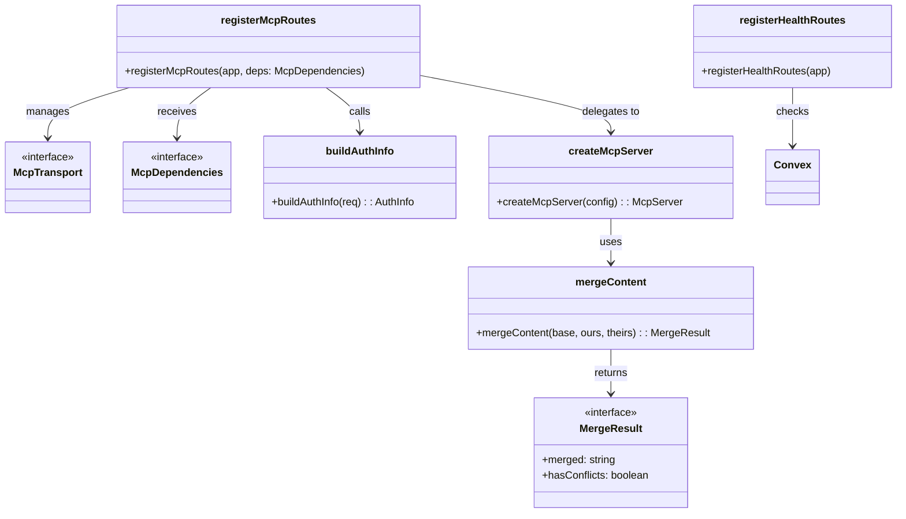
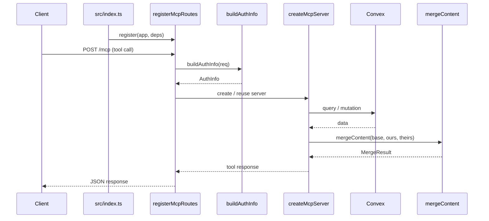

# MCP Server

## Overview

The MCP Server module implements the Model Context Protocol server for LiminalDB. It comprises route registration (`src/api/mcp.ts`), the core MCP server factory (`src/lib/mcp.ts`), content merge logic (`src/lib/merge.ts`), and a health-check route (`src/api/health.ts`). The API layer wires authenticated HTTP transports to an MCP server instance that exposes tools, resources, and prompts backed by Convex and Redis. The merge utility provides deterministic content-merging used by both MCP tool handlers and the REST prompts route.

## Responsibilities

- Register MCP HTTP/SSE routes with authentication via `registerMcpRoutes`
- Build per-request auth context with `buildAuthInfo`
- Create and configure the MCP server instance (`createMcpServer`) including tools, resources, and prompts
- Perform content merging with conflict detection via `mergeContent`
- Expose health-check endpoints with Convex connectivity status via `registerHealthRoutes`

## Structure Diagram

## Entity Table

| Name | Kind | Role | Public Entrypoints | Depends On | Used By |
| --- | --- | --- | --- | --- | --- |
| registerMcpRoutes | function | Registers MCP HTTP and SSE endpoints on the application, wiring auth middleware and transport lifecycle | src/api/mcp.ts:registerMcpRoutes | src/lib/mcp.ts, src/lib/auth/index.ts, src/lib/config.ts, src/middleware/auth.ts | src/index.ts, tests/service/mcp/*.test.ts |
| buildAuthInfo | function | Extracts and validates authentication information from an incoming request for MCP sessions | src/api/mcp.ts:buildAuthInfo | src/lib/auth/index.ts, src/middleware/auth.ts | src/index.ts, tests/service/auth/mcp.test.ts |
| McpTransport | interface | Describes the transport abstraction for MCP message exchange (HTTP/SSE) | src/api/mcp.ts:McpTransport | none | registerMcpRoutes |
| McpDependencies | interface | Declares external dependencies injected into MCP route registration (config, auth, etc.) | src/api/mcp.ts:McpDependencies | none | registerMcpRoutes |
| createMcpServer | function | Factory that builds a fully configured MCP server with tools, resources, and prompt handlers backed by Convex and Redis | src/lib/mcp.ts:createMcpServer | convex/_generated/api.d.ts, src/lib/config.ts, src/lib/convex.ts, src/lib/redis.ts, src/lib/merge.ts, src/schemas/preferences.ts, src/schemas/prompts.ts | src/api/mcp.ts, tests/service/mcp/toolHandlers.test.ts |
| mergeContent | function | Three-way content merge with conflict detection, used for concurrent edits in MCP tools and REST routes | src/lib/merge.ts:mergeContent | none | src/lib/mcp.ts, src/routes/prompts.ts, tests/service/lib/merge.test.ts |
| MergeResult | interface | Describes the output of a merge operation including merged text and conflict flag | src/lib/merge.ts:MergeResult | none | src/lib/mcp.ts, src/routes/prompts.ts |
| registerHealthRoutes | function | Registers health-check endpoints that verify Convex connectivity and report server status | src/api/health.ts:registerHealthRoutes | convex/_generated/api.d.ts, src/lib/config.ts, src/lib/convex.ts, src/middleware/auth.ts | src/index.ts |

## Key Flow

## Flow Notes

| Step | Actor/Component | Action | Output / Side Effect |
| --- | --- | --- | --- |
| 1 | src/index.ts | Calls `registerMcpRoutes` and `registerHealthRoutes` to mount all MCP and health endpoints on the HTTP app | Routes registered on app |
| 2 | Client | Sends an authenticated MCP request (HTTP POST or SSE connection) to the server | Raw HTTP request |
| 3 | registerMcpRoutes | Invokes `buildAuthInfo` to extract and validate the caller's identity from the request | AuthInfo object |
| 4 | registerMcpRoutes | Creates or reuses an MCP server instance via `createMcpServer` and dispatches the request through the transport | MCP server processes tool/resource/prompt call |
| 5 | createMcpServer | Executes tool handler which queries/mutates Convex and optionally invokes `mergeContent` for content updates | MergeResult or query data |
| 6 | registerMcpRoutes | Returns the MCP response payload to the client over the active transport | JSON response to client |

## Source Coverage

- src/api/health.ts
- src/api/mcp.ts
- src/lib/mcp.ts
- src/lib/merge.ts

## Cross-Module Context

- src/api/health.ts -> convex/_generated/api.d.ts (import)
- src/api/health.ts -> src/lib/config.ts (import)
- src/api/health.ts -> src/lib/convex.ts (import)
- src/api/health.ts -> src/middleware/auth.ts (import)
- src/api/mcp.ts -> src/lib/auth/index.ts (import)
- src/api/mcp.ts -> src/lib/config.ts (import)
- src/api/mcp.ts -> src/middleware/auth.ts (import)
- src/index.ts -> src/api/health.ts (usage)
- src/index.ts -> src/api/mcp.ts (usage)
- src/lib/mcp.ts -> convex/_generated/api.d.ts (import)
- src/lib/mcp.ts -> src/lib/config.ts (import)
- src/lib/mcp.ts -> src/lib/convex.ts (import)
- src/lib/mcp.ts -> src/lib/redis.ts (import)
- src/lib/mcp.ts -> src/schemas/preferences.ts (import)
- src/lib/mcp.ts -> src/schemas/prompts.ts (import)
- src/routes/prompts.ts -> src/lib/merge.ts (import)
- tests/service/auth/mcp.test.ts -> src/api/mcp.ts (usage)
- tests/service/lib/merge.test.ts -> src/lib/merge.ts (usage)
- tests/service/mcp/auth-challenge.test.ts -> src/api/mcp.ts (usage)
- tests/service/mcp/resources.test.ts -> src/api/mcp.ts (usage)
- tests/service/mcp/toolHandlers.test.ts -> src/lib/mcp.ts (usage)
- tests/service/mcp/tools.test.ts -> src/api/mcp.ts (usage)
- tests/service/prompts/mcpTools.test.ts -> src/api/mcp.ts (usage)
