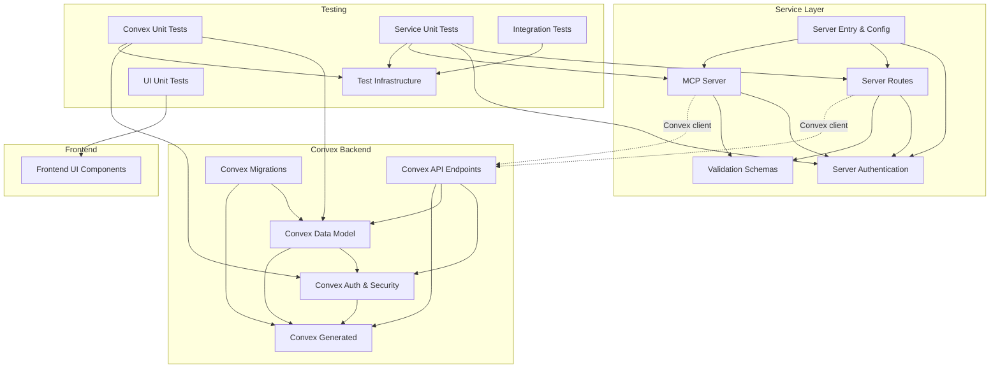

# LiminalDB — Repository Overview

LiminalDB is a prompt management platform that provides CRUD operations, search, tagging, ranking, and merge capabilities for prompts. It exposes both a REST API and a [Model Context Protocol (MCP)](https://modelcontextprotocol.io/) server, backed by a Convex database with Redis caching, WorkOS authentication, and a vanilla-JS web frontend.

## Architecture at a Glance

The codebase is organized into three major tiers — **Convex backend**, **Node/Express service layer**, and **browser frontend** — plus a vendored **Skill Scanner** security tool and comprehensive **test infrastructure**.

```
liminaldb/
├── convex/          # Backend: schema, models, auth, endpoints, migrations
├── src/             # Service: Express server, routes, auth, MCP, schemas
├── public/js/       # Frontend: vanilla JS UI components
├── tests/           # Unit, service, and integration tests
├── vendor/          # Vendored skill-scanner tool
└── scripts/         # Dev/debug utilities
```

## Module Map

### Convex Backend

| Module | Responsibility |
|--------|---------------|
| [Convex API Endpoints](convex-api-endpoints.md) | Public query/mutation endpoints for prompts, health, and user preferences |
| [Convex Auth & Security](convex-auth--security.md) | API-key validation, row-level security, auth types |
| [Convex Data Model](convex-data-model.md) | Schema, prompt CRUD, tags, ranking, merge, custom function wrappers |
| [Convex Generated](convex-generated.md) | Auto-generated typed API surface and server builders |
| [Convex Migrations](convex-migrations.md) | Data migration scripts for backfill, seeding, and status checks |

### Service Layer

| Module | Responsibility |
|--------|---------------|
| [Server Entry & Configuration](server-entry--configuration.md) | Express entrypoint, config, Convex/WorkOS/Redis clients, error codes |
| [Server Authentication](server-authentication.md) | JWT pipeline: token extraction → decoding → validation → middleware |
| [Server Routes](server-routes.md) | HTTP route handlers for pages, auth, prompts, drafts, import/export, preferences, modules, `.well-known` |
| [MCP Server](mcp-server.md) | MCP protocol server, tool/resource registration, merge logic |
| [Validation Schemas](validation-schemas.md) | Zod schemas and TypeScript types for prompts, drafts, import/export, preferences |

### Frontend

| Module | Responsibility |
|--------|---------------|
| [Frontend UI Components](frontend-ui-components.md) | Vanilla JS components for editing, viewing, merge mode, modals, tags, utilities |

### Testing

| Module | Responsibility |
|--------|---------------|
| [Test Infrastructure](test-infrastructure.md) | Vitest config, shared fixtures, mocks for Convex/WorkOS/Redis |
| [Convex Unit Tests](convex-unit-tests.md) | Unit tests for backend auth, prompts, tags, ranking |
| [Service Unit Tests](service-unit-tests.md) | Unit tests for routes, auth middleware, MCP, drafts, merge, caching |
| [UI Unit Tests](ui-unit-tests.md) | Unit tests for frontend components |
| [Integration Tests](integration-tests.md) | End-to-end tests covering auth, health, MCP, prompts, import/export, UI |

### Vendored: Skill Scanner

| Module | Responsibility |
|--------|---------------|
| [Skill Scanner Core](skill-scanner-core.md) | Scanning engine: models, loader, orchestrator, policies |
| [Skill Scanner Analyzers](skill-scanner-analyzers.md) | Static, behavioral, LLM, bytecode, pipeline, and meta analyzers |
| [Skill Scanner Static Analysis](skill-scanner-static-analysis.md) | AST, CFG, dataflow, taint tracking, type analysis |
| [Skill Scanner Rules & Extractors](skill-scanner-rules--extractors.md) | Rule definitions, YARA scanner, registry, content extractors |
| [Skill Scanner CLI & API](skill-scanner-cli--api.md) | CLI, wizard, TUI, REST API, pre-commit hooks |
| [Skill Scanner Reporters](skill-scanner-reporters.md) | Output formatters: JSON, Markdown, HTML, SARIF, table |
| [Skill Scanner Threats & Taxonomy](skill-scanner-threats--taxonomy.md) | Threat mapping, severity classification, Cisco AI taxonomy |
| [Skill Scanner Utilities](skill-scanner-utilities.md) | File handling, logging helpers |
| [Skill Scanner Eval Skills](skill-scanner-eval-skills.md) | Sample malicious/safe skills for testing |
| [Skill Scanner Eval Runners](skill-scanner-eval-runners.md) | Benchmark runners for accuracy measurement |
| [Skill Scanner Examples](skill-scanner-examples.md) | Example scripts demonstrating scanner usage |
| [Skill Scanner Dev Scripts](skill-scanner-dev-scripts.md) | Taxonomy checks, false-positive analysis, doc generation |
| [Skill Scanner Tests](skill-scanner-tests.md) | Comprehensive test suite for all scanner subsystems |

### Other

| Module | Responsibility |
|--------|---------------|
| [Dev Scripts](dev-scripts.md) | Test-user creation, session debugging, data seeding |
| [Liminal Spec](liminal-spec.md) | Specification build/validation tooling |

## Module Dependency Diagram



## Data Flow

Requests enter the system through either **HTTP/REST** or **MCP** transports. Both paths authenticate via the JWT pipeline, then call into Convex endpoints which enforce row-level security before touching the data model. Redis provides caching for drafts and preferences. The browser frontend communicates exclusively through the REST API.

## Getting Started

Dive into individual modules for detailed documentation:

1. **Start with the backend:** [Convex Data Model](convex-data-model.md) → [Convex Auth & Security](convex-auth--security.md) → [Convex API Endpoints](convex-api-endpoints.md)
2. **Understand the service layer:** [Server Entry & Configuration](server-entry--configuration.md) → [Server Authentication](server-authentication.md) → [Server Routes](server-routes.md)
3. **Explore the MCP integration:** [MCP Server](mcp-server.md)
4. **Review validation contracts:** [Validation Schemas](validation-schemas.md)
5. **Check test coverage:** [Test Infrastructure](test-infrastructure.md) and the individual test modules
