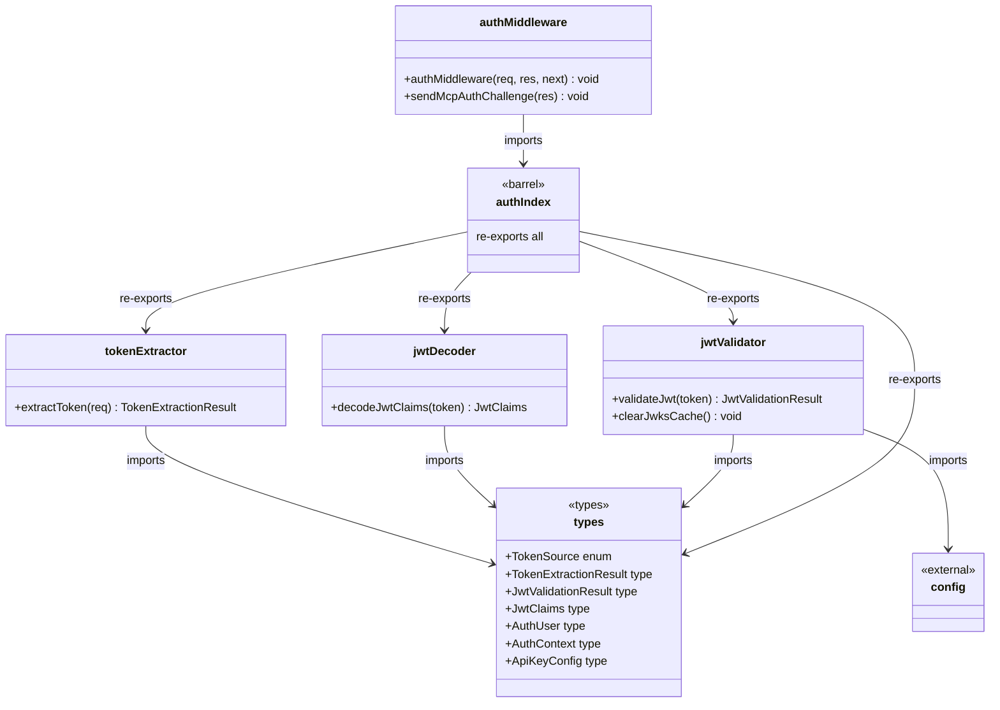
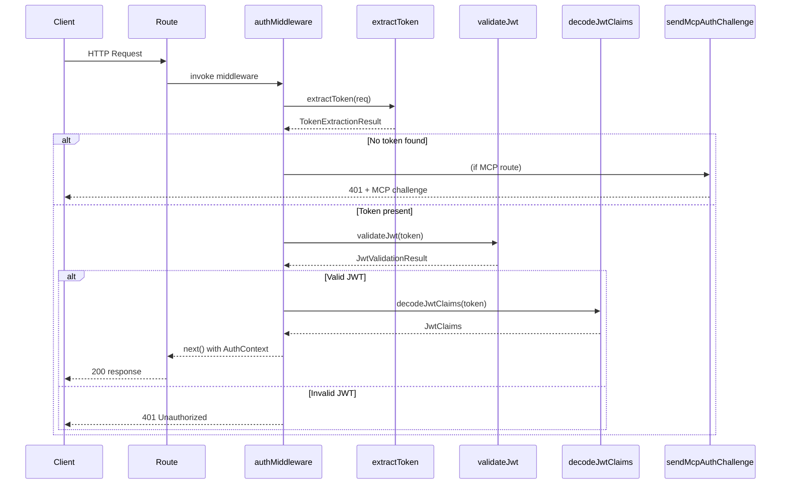

# Server Authentication

## Overview

The Server Authentication module provides JWT-based authentication for the LiminalDB HTTP service layer. It is organized as a layered pipeline: token extraction from incoming requests, JWT decoding and JWKS-based validation, and an Express-style auth middleware that gates access to all protected routes. A dedicated MCP auth challenge helper supports the MCP protocol's authentication flow. All auth-related types are centralized in a shared types file, and the barrel `index.ts` re-exports the public API.

## Responsibilities

- Extract bearer tokens from HTTP Authorization headers and other sources
- Decode JWT claims without cryptographic verification (for inspection/logging)
- Validate JWTs against JWKS endpoints with audience and issuer checks, with a clearable cache
- Provide Express-compatible auth middleware that populates AuthContext on requests
- Send MCP-protocol-specific authentication challenge responses for unauthorized MCP clients
- Define shared auth types (AuthUser, AuthContext, JwtClaims, TokenSource, etc.)

## Structure Diagram

## Entity Table

| Name | Kind | Role | Public Entrypoints | Depends On | Used By |
| --- | --- | --- | --- | --- | --- |
| types | type-definitions | Centralizes all auth-related types and enums (TokenSource, AuthUser, AuthContext, JwtClaims, etc.) | src/lib/auth/types.ts | none | tokenExtractor, jwtDecoder, jwtValidator, authIndex |
| extractToken | function | Extracts a bearer token from the incoming HTTP request, returning a TokenExtractionResult with the token and its source | src/lib/auth/tokenExtractor.ts | types | authIndex, src/index.ts, tests |
| decodeJwtClaims | function | Decodes JWT payload claims without cryptographic verification, used for inspection and logging | src/lib/auth/jwtDecoder.ts | types | authIndex |
| validateJwt | function | Validates a JWT against JWKS endpoints with audience/issuer verification, returns JwtValidationResult | src/lib/auth/jwtValidator.ts | types, src/lib/config.ts | authIndex |
| clearJwksCache | function | Clears the cached JWKS keys, forcing re-fetch on next validation | src/lib/auth/jwtValidator.ts | types, src/lib/config.ts | authIndex |
| authIndex | barrel | Re-exports all auth library functions and types as a single import point | src/lib/auth/index.ts | tokenExtractor, jwtDecoder, jwtValidator, types | authMiddleware, src/api/mcp.ts |
| authMiddleware | function | Express middleware that extracts and validates tokens, populating AuthContext on the request or rejecting with 401 | src/middleware/auth.ts | authIndex | src/routes/prompts.ts, src/routes/drafts.ts, src/routes/preferences.ts, src/routes/app.ts, src/routes/auth.ts, src/routes/import-export.ts, src/api/health.ts, src/api/mcp.ts |
| sendMcpAuthChallenge | function | Sends an MCP-protocol-compliant authentication challenge response for unauthorized MCP clients | src/middleware/auth.ts | authIndex | src/api/mcp.ts |

## Key Flow

## Flow Notes

| Step | Actor/Component | Action | Output / Side Effect |
| --- | --- | --- | --- |
| 1 | Route handler | Invokes authMiddleware before the route logic executes | Middleware function called with req, res, next |
| 2 | authMiddleware | Calls extractToken to pull a bearer token from the Authorization header or other sources | TokenExtractionResult with token string and TokenSource |
| 3 | authMiddleware | If no token is found and the route is an MCP endpoint, calls sendMcpAuthChallenge to return a protocol-compliant 401 | 401 response with MCP auth challenge headers |
| 4 | authMiddleware | If a token is present, calls validateJwt to verify signature against JWKS, check audience and issuer claims | JwtValidationResult indicating success or failure |
| 5 | authMiddleware | On valid JWT, decodes claims and populates AuthContext (with AuthUser) on the request object, then calls next() | Request proceeds to route handler with authenticated context |

## Source Coverage

- src/lib/auth/index.ts
- src/lib/auth/jwtDecoder.ts
- src/lib/auth/jwtValidator.ts
- src/lib/auth/tokenExtractor.ts
- src/lib/auth/types.ts
- src/middleware/auth.ts

## Cross-Module Context

- src/api/health.ts -> src/middleware/auth.ts (import)
- src/api/mcp.ts -> src/lib/auth/index.ts (import)
- src/api/mcp.ts -> src/middleware/auth.ts (import)
- src/index.ts -> src/lib/auth/tokenExtractor.ts (usage)
- src/index.ts -> src/middleware/auth.ts (usage)
- src/lib/auth/jwtValidator.ts -> src/lib/config.ts (import)
- src/routes/app.ts -> src/middleware/auth.ts (import)
- src/routes/auth.ts -> src/middleware/auth.ts (import)
- src/routes/drafts.ts -> src/middleware/auth.ts (import)
- src/routes/import-export.ts -> src/middleware/auth.ts (import)
- src/routes/preferences.ts -> src/middleware/auth.ts (import)
- src/routes/prompts.ts -> src/middleware/auth.ts (import)
- tests/service/auth/mcp.test.ts -> src/lib/auth/tokenExtractor.ts (usage)
- tests/service/auth/mcp.test.ts -> src/middleware/auth.ts (usage)
- tests/service/auth/middleware.test.ts -> src/lib/auth/index.ts (usage)
- tests/service/auth/middleware.test.ts -> src/lib/auth/tokenExtractor.ts (usage)
- tests/service/auth/middleware.test.ts -> src/middleware/auth.ts (usage)
- tests/service/auth/routes.test.ts -> src/lib/auth/tokenExtractor.ts (usage)
- tests/service/auth/routes.test.ts -> src/middleware/auth.ts (usage)
- tests/service/drafts/drafts.test.ts -> src/lib/auth/tokenExtractor.ts (usage)
- tests/service/drafts/drafts.test.ts -> src/middleware/auth.ts (usage)
- tests/service/mcp/auth-challenge.test.ts -> src/lib/auth/tokenExtractor.ts (usage)
- tests/service/mcp/auth-challenge.test.ts -> src/middleware/auth.ts (usage)
- tests/service/mcp/resources.test.ts -> src/lib/auth/tokenExtractor.ts (usage)
- tests/service/mcp/resources.test.ts -> src/middleware/auth.ts (usage)
- tests/service/mcp/tools.test.ts -> src/lib/auth/tokenExtractor.ts (usage)
- tests/service/mcp/tools.test.ts -> src/middleware/auth.ts (usage)
- tests/service/mcp/well-known.test.ts -> src/lib/auth/tokenExtractor.ts (usage)
- tests/service/mcp/well-known.test.ts -> src/middleware/auth.ts (usage)
- tests/service/preferences.test.ts -> src/lib/auth/tokenExtractor.ts (usage)
- tests/service/preferences.test.ts -> src/middleware/auth.ts (usage)
- tests/service/prompts/createPrompts.test.ts -> src/lib/auth/tokenExtractor.ts (usage)
- tests/service/prompts/createPrompts.test.ts -> src/middleware/auth.ts (usage)
- tests/service/prompts/deletePrompt.test.ts -> src/lib/auth/tokenExtractor.ts (usage)
- tests/service/prompts/deletePrompt.test.ts -> src/middleware/auth.ts (usage)
- tests/service/prompts/edgeCases.test.ts -> src/lib/auth/tokenExtractor.ts (usage)
- tests/service/prompts/edgeCases.test.ts -> src/middleware/auth.ts (usage)
- tests/service/prompts/flagsUsage.test.ts -> src/lib/auth/tokenExtractor.ts (usage)
- tests/service/prompts/flagsUsage.test.ts -> src/middleware/auth.ts (usage)
- tests/service/prompts/getPrompt.test.ts -> src/lib/auth/tokenExtractor.ts (usage)
- tests/service/prompts/getPrompt.test.ts -> src/middleware/auth.ts (usage)
- tests/service/prompts/importExport.test.ts -> src/lib/auth/tokenExtractor.ts (usage)
- tests/service/prompts/importExport.test.ts -> src/middleware/auth.ts (usage)
- tests/service/prompts/listPrompts.test.ts -> src/lib/auth/tokenExtractor.ts (usage)
- tests/service/prompts/listPrompts.test.ts -> src/middleware/auth.ts (usage)
- tests/service/prompts/mcpTools.test.ts -> src/lib/auth/tokenExtractor.ts (usage)
- tests/service/prompts/mcpTools.test.ts -> src/middleware/auth.ts (usage)
- tests/service/prompts/mergePrompt.test.ts -> src/lib/auth/tokenExtractor.ts (usage)
- tests/service/prompts/mergePrompt.test.ts -> src/middleware/auth.ts (usage)
- tests/service/prompts/updatePrompt.test.ts -> src/lib/auth/tokenExtractor.ts (usage)
- tests/service/prompts/updatePrompt.test.ts -> src/middleware/auth.ts (usage)
