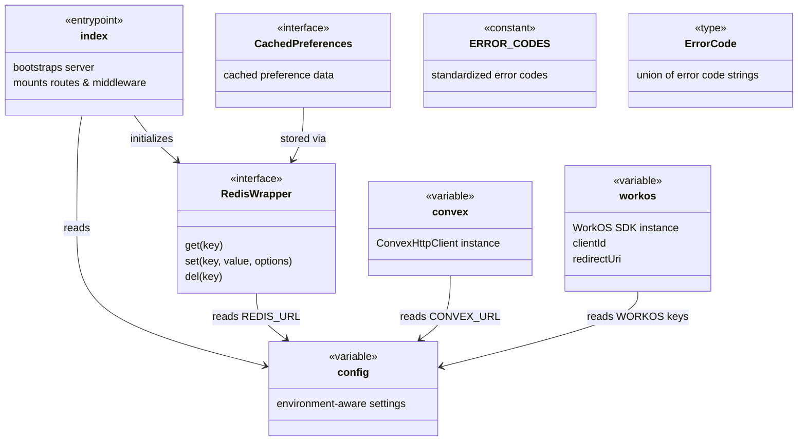
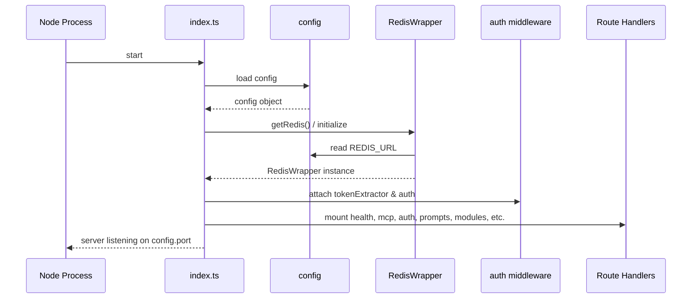

# Server Entry & Configuration

## Overview

This module forms the application's foundation layer: the HTTP server entrypoint (`src/index.ts`), centralized configuration, external service clients (Convex, WorkOS, Redis), and shared error codes. The entrypoint bootstraps the server by loading configuration, initializing the Redis cache, attaching middleware, and mounting all route handlers. The `src/lib/` files expose singleton clients and helpers consumed across the entire codebase.

## Responsibilities

- Bootstrap the HTTP server, attach middleware, and mount all route and API handlers
- Provide centralized, environment-aware configuration via the `config` variable
- Initialize and expose a Convex client for backend data access
- Initialize and expose WorkOS client, client ID, and redirect URI for authentication
- Provide a Redis abstraction layer with preference caching (get/set/invalidate)
- Define standardized application error codes and the ErrorCode type

## Structure Diagram

## Entity Table

| Name | Kind | Role | Public Entrypoints | Depends On | Used By |
| --- | --- | --- | --- | --- | --- |
| index.ts | file (entrypoint) | Server bootstrap: loads config, initializes Redis, attaches middleware and all route handlers | src/index.ts | config, RedisWrapper, routes/*, middleware/auth, api/* | none |
| config | variable | Centralized environment-aware configuration object consumed across the application | src/lib/config.ts:config | none | index.ts, health.ts, mcp.ts, jwtValidator.ts, redis.ts, import-export.ts, preferences.ts, prompts.ts |
| convex | variable | Singleton Convex HTTP client for backend data operations | src/lib/convex.ts:convex | none | health.ts, mcp.ts, import-export.ts, preferences.ts, prompts.ts |
| workos / clientId / redirectUri | variable | WorkOS SDK client and OAuth parameters for authentication flows | src/lib/workos.ts:workos, src/lib/workos.ts:clientId, src/lib/workos.ts:redirectUri | none | auth.ts |
| RedisWrapper | interface | Abstraction over Redis client enabling test mocking and optional Redis usage | src/lib/redis.ts:RedisWrapper, src/lib/redis.ts:getRedis, src/lib/redis.ts:setRedisClient | config | index.ts, mcp.ts, drafts.ts, preferences.ts, tests |
| CachedPreferences | interface | Typed interface for user preferences stored in Redis cache | src/lib/redis.ts:CachedPreferences, src/lib/redis.ts:getCachedPreferences, src/lib/redis.ts:setCachedPreferences, src/lib/redis.ts:invalidateCachedPreferences | RedisWrapper, preferences schema | index.ts, mcp.ts, drafts.ts, preferences.ts |
| ERROR_CODES / ErrorCode | constant / type | Standardized error code constants and union type for consistent error responses | src/lib/errors.ts:ERROR_CODES, src/lib/errors.ts:ErrorCode | none | none |

## Key Flow

## Flow Notes

| Step | Actor/Component | Action | Output / Side Effect |
| --- | --- | --- | --- |
| 1 | index.ts | Imports and reads the centralized `config` object for port, environment, and service URLs | Configuration values available |
| 2 | index.ts | Initializes Redis connection via `getRedis()`, which reads REDIS_URL from config | RedisWrapper instance ready for caching |
| 3 | index.ts | Attaches token extraction and authentication middleware to the server | Incoming requests will be authenticated |
| 4 | index.ts | Mounts all route handlers (health, MCP, auth, prompts, modules, drafts, preferences, import-export, well-known, app) | All API endpoints registered |
| 5 | index.ts | Starts the HTTP server on the configured port | Server listening and accepting connections |

## Source Coverage

- src/index.ts
- src/lib/config.ts
- src/lib/convex.ts
- src/lib/errors.ts
- src/lib/redis.ts
- src/lib/workos.ts

## Cross-Module Context

- src/api/health.ts -> src/lib/config.ts (import)
- src/api/health.ts -> src/lib/convex.ts (import)
- src/api/mcp.ts -> src/lib/config.ts (import)
- src/index.ts -> src/api/health.ts (usage)
- src/index.ts -> src/api/mcp.ts (usage)
- src/index.ts -> src/lib/auth/tokenExtractor.ts (usage)
- src/index.ts -> src/middleware/auth.ts (usage)
- src/index.ts -> src/routes/app.ts (usage)
- src/index.ts -> src/routes/auth.ts (usage)
- src/index.ts -> src/routes/drafts.ts (usage)
- src/index.ts -> src/routes/import-export.ts (usage)
- src/index.ts -> src/routes/modules.ts (usage)
- src/index.ts -> src/routes/preferences.ts (usage)
- src/index.ts -> src/routes/prompts.ts (usage)
- src/index.ts -> src/routes/well-known.ts (usage)
- src/lib/auth/jwtValidator.ts -> src/lib/config.ts (import)
- src/lib/mcp.ts -> src/lib/config.ts (import)
- src/lib/mcp.ts -> src/lib/convex.ts (import)
- src/lib/mcp.ts -> src/lib/redis.ts (import)
- src/lib/redis.ts -> src/schemas/preferences.ts (import)
- src/routes/auth.ts -> src/lib/workos.ts (import)
- src/routes/drafts.ts -> src/lib/redis.ts (import)
- src/routes/import-export.ts -> src/lib/config.ts (import)
- src/routes/import-export.ts -> src/lib/convex.ts (import)
- src/routes/preferences.ts -> src/lib/config.ts (import)
- src/routes/preferences.ts -> src/lib/convex.ts (import)
- src/routes/preferences.ts -> src/lib/redis.ts (import)
- src/routes/prompts.ts -> src/lib/config.ts (import)
- src/routes/prompts.ts -> src/lib/convex.ts (import)
- tests/__mocks__/redis.ts -> src/lib/redis.ts (import)
- tests/service/drafts/drafts.test.ts -> src/lib/redis.ts (usage)
