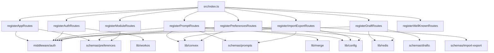
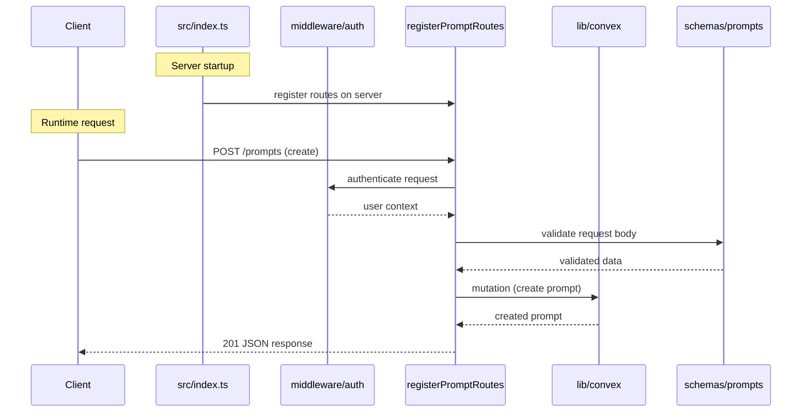

# Server Routes

## Overview

The Server Routes module contains all HTTP route registration functions for the LiminalDB application. Each file exports a single `register*Routes` function that mounts a cohesive group of endpoints onto the server. The main entry point (`src/index.ts`) calls each registration function at startup to compose the full API surface. Routes span app pages, authentication (via WorkOS), prompts CRUD, drafts (Redis-backed), import/export, user preferences, module configuration, and `.well-known` discovery endpoints.

## Responsibilities

- Register app page routes with auth-gated rendering and preferences context
- Handle OAuth/authentication flows via WorkOS (login, callback, logout)
- Provide full CRUD operations for prompts backed by Convex with schema validation and merge support
- Manage ephemeral draft state in Redis with schema-validated endpoints
- Support bulk import and export of prompts via Convex with dedicated schemas
- Persist and retrieve user preferences through Convex with Redis caching
- Expose module configuration endpoints using preferences schemas
- Serve .well-known discovery endpoints for MCP and related protocols

## Structure Diagram

## Entity Table

| Name | Kind | Role | Public Entrypoints | Depends On | Used By |
| --- | --- | --- | --- | --- | --- |
| registerAppRoutes | function | Mounts app page routes with auth middleware and preferences context | registerAppRoutes | middleware/auth, schemas/preferences | src/index.ts |
| registerAuthRoutes | function | Handles OAuth login, callback, and logout flows via WorkOS | registerAuthRoutes | lib/workos, middleware/auth | src/index.ts, tests/service/auth/routes.test.ts |
| registerPromptRoutes | function | Full CRUD for prompts with Convex persistence, schema validation, and merge support | registerPromptRoutes | lib/convex, lib/config, lib/merge, middleware/auth, schemas/prompts | src/index.ts, tests/service/prompts/*.test.ts |
| registerDraftRoutes | function | Manages ephemeral draft state backed by Redis | registerDraftRoutes | lib/redis, middleware/auth, schemas/drafts | src/index.ts, tests/service/drafts/drafts.test.ts |
| registerImportExportRoutes | function | Bulk import and export of prompts via Convex | registerImportExportRoutes | lib/convex, lib/config, middleware/auth, schemas/import-export, schemas/prompts | src/index.ts, tests/service/prompts/importExport.test.ts |
| registerPreferencesRoutes | function | Read/write user preferences via Convex with Redis caching | registerPreferencesRoutes | lib/convex, lib/config, lib/redis, middleware/auth, schemas/preferences | src/index.ts |
| registerModuleRoutes | function | Exposes module configuration endpoints | registerModuleRoutes | schemas/preferences | src/index.ts |
| registerWellKnownRoutes | function | Serves .well-known discovery endpoints for MCP protocol | registerWellKnownRoutes | none | src/index.ts, tests/service/mcp/well-known.test.ts |

## Key Flow

## Flow Notes

| Step | Actor/Component | Action | Output / Side Effect |
| --- | --- | --- | --- |
| 1 | src/index.ts | Calls each register*Routes function to mount all route groups on the server at startup | Fully configured HTTP route table |
| 2 | Client | Sends an HTTP request (e.g., POST /prompts) to a registered route | Request enters the matched route handler |
| 3 | middleware/auth | Validates the session/JWT and attaches user context to the request | Authenticated user identity or 401 rejection |
| 4 | Route handler | Validates the request body against the relevant schema (e.g., schemas/prompts) | Validated and typed request data or 400 error |
| 5 | Route handler | Calls the appropriate backend service (Convex for persistence, Redis for drafts/cache) | Data written or retrieved from the backing store |
| 6 | Route handler | Returns the JSON response to the client with appropriate status code | HTTP response (200/201/204) |

## Source Coverage

- src/routes/app.ts
- src/routes/auth.ts
- src/routes/drafts.ts
- src/routes/import-export.ts
- src/routes/modules.ts
- src/routes/preferences.ts
- src/routes/prompts.ts
- src/routes/well-known.ts

## Cross-Module Context

- src/index.ts -> src/routes/app.ts (usage)
- src/index.ts -> src/routes/auth.ts (usage)
- src/index.ts -> src/routes/drafts.ts (usage)
- src/index.ts -> src/routes/import-export.ts (usage)
- src/index.ts -> src/routes/modules.ts (usage)
- src/index.ts -> src/routes/preferences.ts (usage)
- src/index.ts -> src/routes/prompts.ts (usage)
- src/index.ts -> src/routes/well-known.ts (usage)
- src/routes/app.ts -> src/middleware/auth.ts (import)
- src/routes/app.ts -> src/schemas/preferences.ts (import)
- src/routes/auth.ts -> src/lib/workos.ts (import)
- src/routes/auth.ts -> src/middleware/auth.ts (import)
- src/routes/drafts.ts -> src/lib/redis.ts (import)
- src/routes/drafts.ts -> src/middleware/auth.ts (import)
- src/routes/drafts.ts -> src/schemas/drafts.ts (import)
- src/routes/import-export.ts -> convex/_generated/api.d.ts (import)
- src/routes/import-export.ts -> src/lib/config.ts (import)
- src/routes/import-export.ts -> src/lib/convex.ts (import)
- src/routes/import-export.ts -> src/middleware/auth.ts (import)
- src/routes/import-export.ts -> src/schemas/import-export.ts (import)
- src/routes/import-export.ts -> src/schemas/prompts.ts (import)
- src/routes/modules.ts -> src/schemas/preferences.ts (import)
- src/routes/preferences.ts -> convex/_generated/api.d.ts (import)
- src/routes/preferences.ts -> src/lib/config.ts (import)
- src/routes/preferences.ts -> src/lib/convex.ts (import)
- src/routes/preferences.ts -> src/lib/redis.ts (import)
- src/routes/preferences.ts -> src/middleware/auth.ts (import)
- src/routes/preferences.ts -> src/schemas/preferences.ts (import)
- src/routes/prompts.ts -> convex/_generated/api.d.ts (import)
- src/routes/prompts.ts -> src/lib/config.ts (import)
- src/routes/prompts.ts -> src/lib/convex.ts (import)
- src/routes/prompts.ts -> src/lib/merge.ts (import)
- src/routes/prompts.ts -> src/middleware/auth.ts (import)
- src/routes/prompts.ts -> src/schemas/prompts.ts (import)
- tests/service/auth/routes.test.ts -> src/routes/auth.ts (usage)
- tests/service/drafts/drafts.test.ts -> src/routes/drafts.ts (usage)
- tests/service/mcp/well-known.test.ts -> src/routes/well-known.ts (usage)
- tests/service/prompts/createPrompts.test.ts -> src/routes/prompts.ts (usage)
- tests/service/prompts/deletePrompt.test.ts -> src/routes/prompts.ts (usage)
- tests/service/prompts/edgeCases.test.ts -> src/routes/prompts.ts (usage)
- tests/service/prompts/getPrompt.test.ts -> src/routes/prompts.ts (usage)
- tests/service/prompts/importExport.test.ts -> src/routes/import-export.ts (usage)
- tests/service/prompts/updatePrompt.test.ts -> src/routes/prompts.ts (usage)
