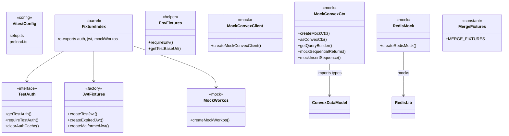
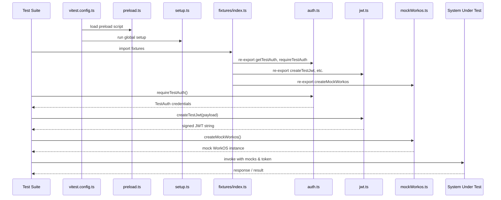

# Test Infrastructure

## Overview

Shared test configuration, setup files, fixtures, and mock utilities that underpin all three test tiers in LiminalDB: unit tests for Convex functions, service-level tests, and integration tests. The module is organized around a Vitest configuration (`vitest.config.ts`), global setup/preload hooks, and a layered fixture system that provides auth helpers, JWT factories, environment accessors, and mock objects for Convex, WorkOS, and Redis.

## Responsibilities

- Configure Vitest with global setup, preload scripts, and path aliases
- Provide reusable auth fixtures (TestAuth, getTestAuth, requireTestAuth, clearAuthCache) for integration and service tests
- Generate test JWTs including valid, expired, and malformed variants
- Supply environment helpers (requireEnv, getTestBaseUrl) for integration test targeting
- Mock external dependencies: Convex client, Convex query context, WorkOS SDK, and Redis
- Offer merge test-data constants shared across Convex, service, and UI test suites
- Re-export commonly used fixtures through a barrel index for service-level tests

## Structure Diagram

## Entity Table

| Name | Kind | Role | Public Entrypoints | Depends On | Used By |
| --- | --- | --- | --- | --- | --- |
| vitest.config.ts | config | Root Vitest configuration defining setup files, preload, and path aliases | vitest.config.ts | none | none |
| tests/setup.ts | file | Global test setup hook executed before all suites | tests/setup.ts | none | none |
| tests/preload.ts | file | Preload script for environment and module stubbing before test import resolution | tests/preload.ts | none | none |
| tests/fixtures/index.ts | barrel | Re-exports auth, JWT, and WorkOS mock fixtures for service-level tests | tests/fixtures/index.ts | tests/fixtures/auth.ts, tests/fixtures/jwt.ts, tests/fixtures/mockWorkos.ts | service tests (17 suites) |
| TestAuth / auth.ts | interface + functions | Auth credential management: obtain, require, and cache-clear test auth tokens | getTestAuth, requireTestAuth, clearAuthCache | none | integration tests, tests/fixtures/index.ts |
| jwt.ts | factory functions | Create valid, expired, and malformed JWTs for auth testing | createTestJwt, createExpiredJwt, createMalformedJwt | none | tests/fixtures/index.ts, auth-api integration test |
| env.ts | helper functions | Provide required env vars and base URL for integration test targets | requireEnv, getTestBaseUrl | none | integration tests (13 suites) |
| mockWorkos.ts | mock factory | Create a mock WorkOS SDK instance for service-level tests | createMockWorkos | none | tests/fixtures/index.ts |
| mockConvexClient.ts | mock factory | Create a mock Convex HTTP client for service prompt tests | createMockConvexClient | none | flagsUsage, listPrompts, mergePrompt service tests |
| mockConvexCtx.ts | mock factory | Simulate Convex mutation/query context with mock DB, query builder, and sequencing helpers | createMockCtx, asConvexCtx, getQueryBuilder, mockSequentialReturns, mockInsertSequence | convex/_generated/dataModel.d.ts | Convex prompt unit tests (6 suites) |
| redis.ts (mock) | mock factory | Provide an in-memory Redis mock replacing src/lib/redis | createRedisMock | src/lib/redis.ts | drafts service test |
| merge.ts | constant | Shared merge test-data fixtures used across Convex, service, and UI test suites | MERGE_FIXTURES | none | mergeFields, merge lib, merge-mode UI tests |

## Key Flow

## Flow Notes

| Step | Actor/Component | Action | Output / Side Effect |
| --- | --- | --- | --- |
| 1 | Vitest | Loads preload.ts to stub environment variables and module aliases before imports resolve | Patched process.env and module stubs |
| 2 | Vitest | Runs setup.ts for any global before-all hooks | Global test state initialized |
| 3 | Test Suite | Imports fixtures via barrel index (service tests) or directly (integration / Convex tests) | Auth helpers, JWT factories, mock constructors available |
| 4 | Test Suite | Calls requireTestAuth() or getTestAuth() to obtain test credentials; calls JWT/mock factories as needed | TestAuth object, JWT strings, mock WorkOS/Convex/Redis instances |
| 5 | Test Suite | Invokes the system under test with the prepared mocks and credentials | Assertions validated against expected behavior |

## Source Coverage

- tests/__mocks__/redis.ts
- tests/fixtures/auth.ts
- tests/fixtures/env.ts
- tests/fixtures/index.ts
- tests/fixtures/jwt.ts
- tests/fixtures/merge.ts
- tests/fixtures/mockConvexClient.ts
- tests/fixtures/mockConvexCtx.ts
- tests/fixtures/mockWorkos.ts
- tests/preload.ts
- tests/setup.ts
- vitest.config.ts

## Cross-Module Context

- tests/__mocks__/redis.ts -> src/lib/redis.ts (import)
- tests/convex/prompts/deleteBySlug.test.ts -> tests/fixtures/mockConvexCtx.ts (usage)
- tests/convex/prompts/getPromptBySlug.test.ts -> tests/fixtures/mockConvexCtx.ts (usage)
- tests/convex/prompts/insertPrompts.test.ts -> tests/fixtures/mockConvexCtx.ts (usage)
- tests/convex/prompts/mergeFields.test.ts -> tests/fixtures/merge.ts (usage)
- tests/convex/prompts/searchPrompts.test.ts -> tests/fixtures/mockConvexCtx.ts (usage)
- tests/convex/prompts/slugExists.test.ts -> tests/fixtures/mockConvexCtx.ts (usage)
- tests/convex/prompts/usageTracking.test.ts -> tests/fixtures/mockConvexCtx.ts (usage)
- tests/fixtures/mockConvexCtx.ts -> convex/_generated/dataModel.d.ts (import)
- tests/integration/auth-api.test.ts -> tests/fixtures/auth.ts (usage)
- tests/integration/auth-api.test.ts -> tests/fixtures/env.ts (usage)
- tests/integration/auth-api.test.ts -> tests/fixtures/jwt.ts (usage)
- tests/integration/auth-cookie.test.ts -> tests/fixtures/env.ts (usage)
- tests/integration/auth-mcp.test.ts -> tests/fixtures/auth.ts (usage)
- tests/integration/auth-mcp.test.ts -> tests/fixtures/env.ts (usage)
- tests/integration/health.test.ts -> tests/fixtures/env.ts (usage)
- tests/integration/healthAuth.test.ts -> tests/fixtures/auth.ts (usage)
- tests/integration/healthAuth.test.ts -> tests/fixtures/env.ts (usage)
- tests/integration/import-export.test.ts -> tests/fixtures/auth.ts (usage)
- tests/integration/import-export.test.ts -> tests/fixtures/env.ts (usage)
- tests/integration/mcp-oauth.test.ts -> tests/fixtures/auth.ts (usage)
- tests/integration/mcp-oauth.test.ts -> tests/fixtures/env.ts (usage)
- tests/integration/mcp.test.ts -> tests/fixtures/auth.ts (usage)
- tests/integration/mcp.test.ts -> tests/fixtures/env.ts (usage)
- tests/integration/merge.test.ts -> tests/fixtures/auth.ts (usage)
- tests/integration/merge.test.ts -> tests/fixtures/env.ts (usage)
- tests/integration/preferences.test.ts -> tests/fixtures/auth.ts (usage)
- tests/integration/preferences.test.ts -> tests/fixtures/env.ts (usage)
- tests/integration/prompts-api.test.ts -> tests/fixtures/auth.ts (usage)
- tests/integration/prompts-api.test.ts -> tests/fixtures/env.ts (usage)
- tests/integration/ui/ui-auth.test.ts -> tests/fixtures/auth.ts (usage)
- tests/integration/ui/ui-auth.test.ts -> tests/fixtures/env.ts (usage)
- tests/integration/ui/ui-prompts.test.ts -> tests/fixtures/auth.ts (usage)
- tests/integration/ui/ui-prompts.test.ts -> tests/fixtures/env.ts (usage)
- tests/service/auth/mcp.test.ts -> tests/fixtures/index.ts (usage)
- tests/service/auth/middleware.test.ts -> tests/fixtures/index.ts (usage)
- tests/service/auth/routes.test.ts -> tests/fixtures/index.ts (usage)
- tests/service/drafts/drafts.test.ts -> tests/__mocks__/redis.ts (usage)
- tests/service/drafts/drafts.test.ts -> tests/fixtures/index.ts (usage)
- tests/service/lib/merge.test.ts -> tests/fixtures/merge.ts (usage)
- tests/service/mcp/resources.test.ts -> tests/fixtures/index.ts (usage)
- tests/service/mcp/tools.test.ts -> tests/fixtures/index.ts (usage)
- tests/service/preferences.test.ts -> tests/fixtures/index.ts (usage)
- tests/service/prompts/createPrompts.test.ts -> tests/fixtures/index.ts (usage)
- tests/service/prompts/deletePrompt.test.ts -> tests/fixtures/index.ts (usage)
- tests/service/prompts/edgeCases.test.ts -> tests/fixtures/index.ts (usage)
- tests/service/prompts/flagsUsage.test.ts -> tests/fixtures/index.ts (usage)
- tests/service/prompts/flagsUsage.test.ts -> tests/fixtures/mockConvexClient.ts (usage)
- tests/service/prompts/getPrompt.test.ts -> tests/fixtures/index.ts (usage)
- tests/service/prompts/importExport.test.ts -> tests/fixtures/index.ts (usage)
- tests/service/prompts/listPrompts.test.ts -> tests/fixtures/index.ts (usage)
- tests/service/prompts/listPrompts.test.ts -> tests/fixtures/mockConvexClient.ts (usage)
- tests/service/prompts/mcpTools.test.ts -> tests/fixtures/index.ts (usage)
- tests/service/prompts/mergePrompt.test.ts -> tests/fixtures/index.ts (usage)
- tests/service/prompts/mergePrompt.test.ts -> tests/fixtures/mockConvexClient.ts (usage)
- tests/service/prompts/updatePrompt.test.ts -> tests/fixtures/index.ts (usage)
- tests/service/ui/merge-mode.test.ts -> tests/fixtures/merge.ts (usage)
