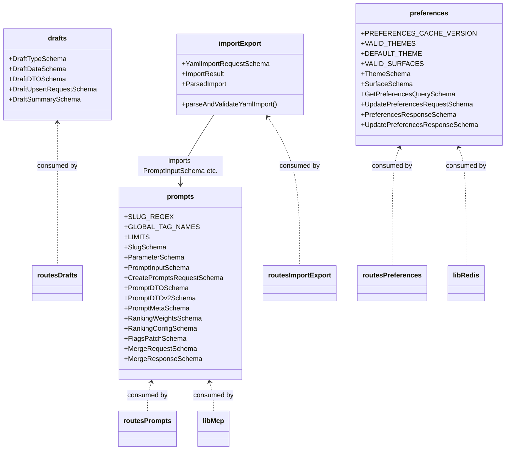
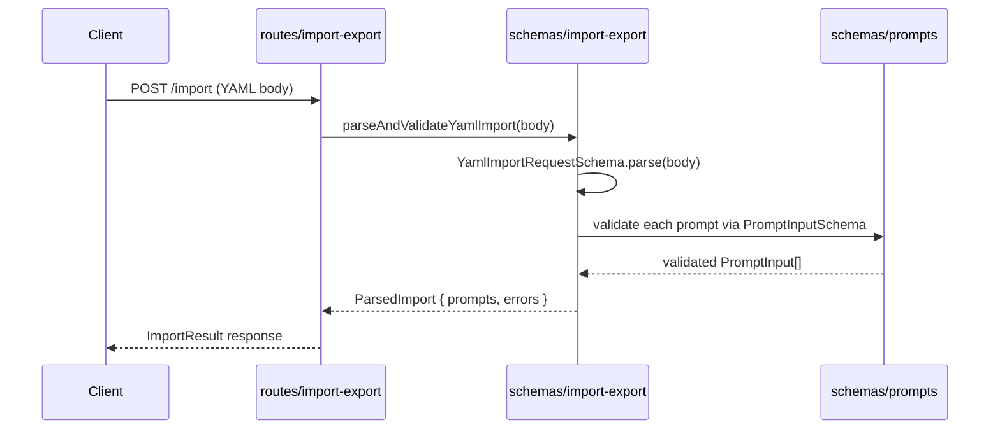

# Validation Schemas

## Overview

Centralized Zod schema definitions and inferred TypeScript types that form the validation contract for LiminalDB's core domain objects. The module is organized into four schema files — **prompts**, **drafts**, **import-export**, and **preferences** — each exporting paired `*Schema` / `*Type` values consumed by route handlers, MCP tools, caching layers, and tests. The import-export schema depends on the prompts schema; all other schema files are independent.

## Responsibilities

- Define Zod schemas for prompt CRUD, parameters, slugs, DTOs (v1 & v2), ranking configuration, flags patching, and merge operations
- Define Zod schemas for draft types, draft DTOs, upsert requests, and draft summaries
- Provide YAML import request validation and a `parseAndValidateYamlImport` helper that bridges raw YAML input to validated prompt structures
- Define user preference schemas including theme, surface, cache versioning, and get/update request-response contracts
- Export inferred TypeScript types alongside every Zod schema for compile-time safety across consumers
- Expose domain constants (SLUG_REGEX, GLOBAL_TAG_NAMES, LIMITS, VALID_THEMES, VALID_SURFACES, DEFAULT_THEME, PREFERENCES_CACHE_VERSION)

## Structure Diagram

## Entity Table

| Name | Kind | Role | Public Entrypoints | Depends On | Used By |
| --- | --- | --- | --- | --- | --- |
| prompts.ts | schema file | Core prompt domain schemas, constants, and inferred types | SLUG_REGEX, GLOBAL_TAG_NAMES, LIMITS, SlugSchema, ParameterSchema, PromptInputSchema, CreatePromptsRequestSchema, PromptDTOSchema, PromptDTOv2Schema, PromptMetaSchema, RankingWeightsSchema, RankingConfigSchema, FlagsPatchSchema, MergeRequestSchema, MergeResponseSchema | none | src/routes/prompts.ts, src/routes/import-export.ts, src/lib/mcp.ts, src/schemas/import-export.ts |
| drafts.ts | schema file | Draft entity schemas for type, DTO, upsert, and summary | DraftTypeSchema, DraftDataSchema, DraftDTOSchema, DraftUpsertRequestSchema, DraftSummarySchema | none | src/routes/drafts.ts, tests/service/drafts/drafts.test.ts |
| import-export.ts | schema file | YAML import validation and parsing bridge to prompt schemas | YamlImportRequestSchema, parseAndValidateYamlImport, ImportResult, ParsedImport | src/schemas/prompts.ts | src/routes/import-export.ts |
| preferences.ts | schema file | User preference schemas for themes, surfaces, and cache versioning | PREFERENCES_CACHE_VERSION, VALID_THEMES, DEFAULT_THEME, VALID_SURFACES, ThemeSchema, SurfaceSchema, GetPreferencesQuerySchema, UpdatePreferencesRequestSchema, PreferencesResponseSchema, UpdatePreferencesResponseSchema | none | src/routes/preferences.ts, src/routes/app.ts, src/routes/modules.ts, src/lib/mcp.ts, src/lib/redis.ts |

## Key Flow

## Flow Notes

| Step | Actor/Component | Action | Output / Side Effect |
| --- | --- | --- | --- |
| 1 | Client | Sends a POST request with raw YAML content to the import endpoint | HTTP request body |
| 2 | ImportRoute | Delegates to parseAndValidateYamlImport for schema-level validation | Calls import-export schema helper |
| 3 | ImportSchema | Parses top-level request with YamlImportRequestSchema, then validates each prompt entry against PromptInputSchema from prompts.ts | ParsedImport with validated prompts and any per-entry errors |
| 4 | ImportRoute | Returns structured ImportResult to the client with success/failure counts | JSON response |

## Source Coverage

- src/schemas/drafts.ts
- src/schemas/import-export.ts
- src/schemas/preferences.ts
- src/schemas/prompts.ts

## Cross-Module Context

- src/lib/mcp.ts -> src/schemas/preferences.ts (import)
- src/lib/mcp.ts -> src/schemas/prompts.ts (import)
- src/lib/redis.ts -> src/schemas/preferences.ts (import)
- src/routes/app.ts -> src/schemas/preferences.ts (import)
- src/routes/drafts.ts -> src/schemas/drafts.ts (import)
- src/routes/import-export.ts -> src/schemas/import-export.ts (import)
- src/routes/import-export.ts -> src/schemas/prompts.ts (import)
- src/routes/modules.ts -> src/schemas/preferences.ts (import)
- src/routes/preferences.ts -> src/schemas/preferences.ts (import)
- src/routes/prompts.ts -> src/schemas/prompts.ts (import)
- tests/service/drafts/drafts.test.ts -> src/schemas/drafts.ts (usage)
- tests/service/prompts/edgeCases.test.ts -> src/schemas/prompts.ts (usage)
