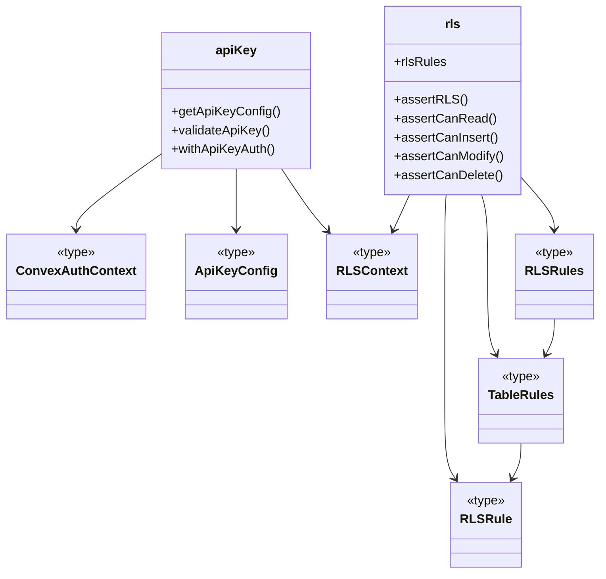
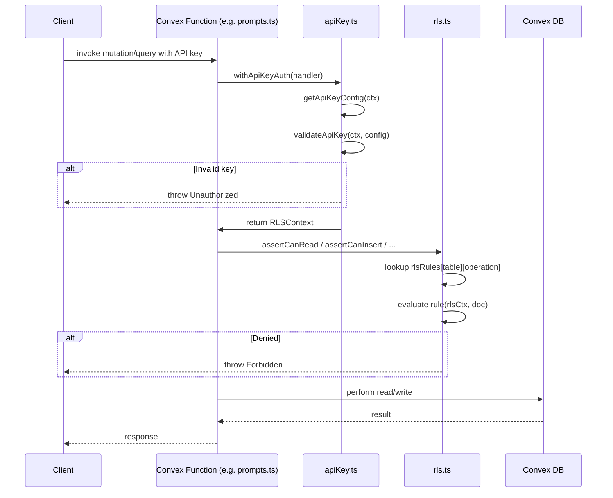

# Convex Auth & RLS

## Overview

Backend authentication and authorization layer for LiminalDB's Convex functions. The module provides two complementary mechanisms: **API key validation** (`apiKey.ts`) that authenticates inbound requests against stored keys, and **row-level security** (`rls.ts`) that enforces per-table read/insert/modify/delete policies based on the authenticated user context. Shared type definitions in `types.ts` connect the two subsystems.

## Responsibilities

- Validate API keys presented in Convex function calls and resolve them to an authenticated context
- Provide a `withApiKeyAuth` wrapper that guards Convex functions behind API key authentication
- Define per-table RLS rules (read, insert, modify, delete) via a declarative `rlsRules` configuration
- Expose assertion helpers (`assertCanRead`, `assertCanInsert`, `assertCanModify`, `assertCanDelete`) consumed by model and endpoint layers
- Export shared auth context types (`ConvexAuthContext`, `ApiKeyConfig`, `RLSContext`) used across modules

## Structure Diagram

## Entity Table

| Name | Kind | Role | Public Entrypoints | Depends On | Used By |
| --- | --- | --- | --- | --- | --- |
| getApiKeyConfig | function | Reads API key configuration from the Convex environment | convex/auth/apiKey.ts:getApiKeyConfig | ConvexAuthContext, ApiKeyConfig | convex/prompts.ts, convex/healthAuth.ts, convex/userPreferences.ts |
| validateApiKey | function | Validates a supplied API key and returns an authenticated context or throws | convex/auth/apiKey.ts:validateApiKey | ConvexAuthContext, ApiKeyConfig | convex/prompts.ts, convex/healthAuth.ts, convex/userPreferences.ts |
| withApiKeyAuth | function | Higher-order wrapper that guards a Convex function with API key authentication | convex/auth/apiKey.ts:withApiKeyAuth | ConvexAuthContext, ApiKeyConfig | convex/prompts.ts, convex/healthAuth.ts, convex/userPreferences.ts |
| rlsRules | variable | Declarative per-table RLS policy registry | convex/auth/rls.ts:rlsRules | RLSRules, RLSContext | convex/model/prompts.ts, convex/userPreferences.ts |
| assertRLS | function | Generic RLS assertion that delegates to the appropriate rule for table and operation | convex/auth/rls.ts:assertRLS | RLSContext, rlsRules | convex/model/prompts.ts, convex/userPreferences.ts |
| assertCanRead | function | Asserts the current user can read a row from the given table | convex/auth/rls.ts:assertCanRead | RLSContext | convex/model/prompts.ts, convex/userPreferences.ts |
| assertCanInsert | function | Asserts the current user can insert into the given table | convex/auth/rls.ts:assertCanInsert | RLSContext | convex/model/prompts.ts, convex/userPreferences.ts |
| assertCanModify | function | Asserts the current user can modify a row in the given table | convex/auth/rls.ts:assertCanModify | RLSContext | convex/model/prompts.ts, convex/userPreferences.ts |
| assertCanDelete | function | Asserts the current user can delete a row from the given table | convex/auth/rls.ts:assertCanDelete | RLSContext | convex/model/prompts.ts, convex/userPreferences.ts |
| ConvexAuthContext | type | Convex mutation/query context augmented with auth info | convex/auth/types.ts:ConvexAuthContext | none | apiKey.ts, rls.ts |
| ApiKeyConfig | type | Shape of the API key configuration (key value, permissions, etc.) | convex/auth/types.ts:ApiKeyConfig | none | apiKey.ts |
| RLSContext | type | Context passed to RLS rule functions (includes authenticated user identity) | convex/auth/types.ts:RLSContext | none | apiKey.ts, rls.ts |
| RLSRule | type | Signature for a single RLS predicate function | convex/auth/rls.ts:RLSRule | RLSContext | rls.ts |
| TableRules | type | Set of RLS rules (read/insert/modify/delete) for one table | convex/auth/rls.ts:TableRules | RLSRule | rls.ts |
| RLSRules | type | Map of table name → TableRules covering all protected tables | convex/auth/rls.ts:RLSRules | TableRules | rls.ts |

## Key Flow

## Flow Notes

| Step | Actor/Component | Action | Output / Side Effect |
| --- | --- | --- | --- |
| 1 | Client | Calls a Convex function (mutation or query) with an API key in the request | Raw request reaches the Convex function handler |
| 2 | withApiKeyAuth | Wraps the handler; calls getApiKeyConfig then validateApiKey to authenticate the caller | An RLSContext containing the authenticated user identity, or an Unauthorized error |
| 3 | Convex Function | Invokes the appropriate RLS assertion (e.g. assertCanRead) before accessing data | RLS rule for the table and operation is evaluated against the context and document |
| 4 | rls.ts | Looks up the table's rule in rlsRules and runs the predicate with the RLSContext | Allows the operation to proceed, or throws a Forbidden error |
| 5 | Convex Function | Performs the authorized database read or write | Result returned to the client |

## Source Coverage

- convex/auth.config.ts
- convex/auth/apiKey.ts
- convex/auth/rls.ts
- convex/auth/types.ts

## Cross-Module Context

- convex/auth/apiKey.ts -> convex/_generated/server.d.ts (import)
- convex/healthAuth.ts -> convex/auth/apiKey.ts (import)
- convex/model/prompts.ts -> convex/auth/rls.ts (import)
- convex/prompts.ts -> convex/auth/apiKey.ts (import)
- convex/userPreferences.ts -> convex/auth/apiKey.ts (import)
- convex/userPreferences.ts -> convex/auth/rls.ts (import)
- tests/convex/auth/apiKey.test.ts -> convex/auth/apiKey.ts (usage)
- tests/convex/auth/rls.test.ts -> convex/auth/rls.ts (usage)
- tests/convex/healthAuth.test.ts -> convex/auth/apiKey.ts (usage)
- tests/convex/healthAuth.test.ts -> convex/auth/types.ts (usage)
