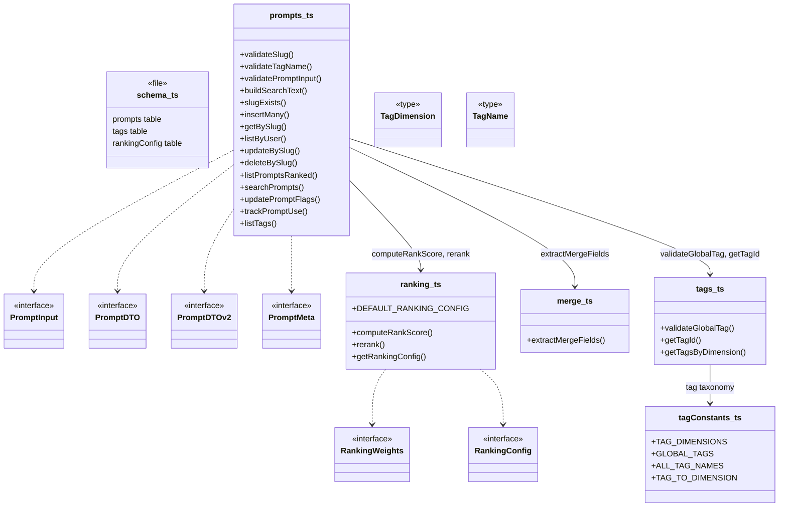
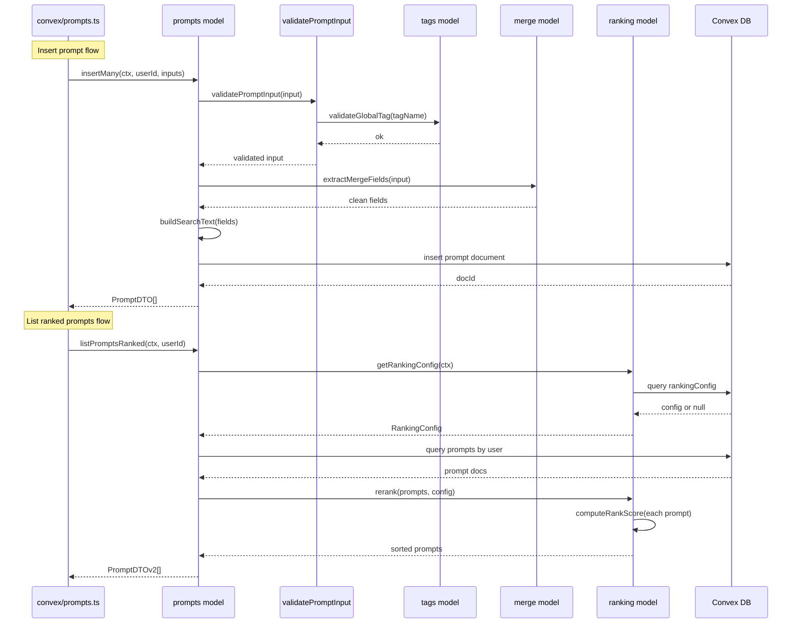

# Convex Data Model

## Overview

Core domain model layer for LiminalDB's Convex backend. This module defines the schema, data-transfer interfaces, and business logic for prompts, tags, ranking, and merge operations. It is consumed by the Convex API layer (`convex/prompts.ts`), migrations, and tests. The model is organized into four focused files—`prompts.ts` (CRUD, search, validation), `ranking.ts` (score computation and config), `tags.ts` (tag lookup and validation), and `merge.ts` (field extraction for partial updates)—plus a shared `tagConstants.ts` for tag taxonomy and the top-level `schema.ts` for Convex table definitions.

## Responsibilities

- Define Convex table schema for prompts, tags, ranking config, and related entities
- Provide prompt CRUD operations (insertMany, getBySlug, updateBySlug, deleteBySlug) with slug-based addressing
- Validate prompt inputs, slugs, and tag names before persistence
- Build full-text search indexes via buildSearchText and expose searchPrompts
- Compute rank scores using configurable weights (recency, usage, flags) and re-rank prompt lists
- Manage a global tag taxonomy organized by dimensions (TagDimension) with validation
- Extract merge-safe field subsets for partial prompt updates via extractMergeFields
- Track prompt usage events for ranking signal (trackPromptUse)
- Expose DTO interfaces (PromptDTO, PromptDTOv2, PromptMeta) for API consumers

## Structure Diagram

## Entity Table

| Name | Kind | Role | Public Entrypoints | Depends On | Used By |
| --- | --- | --- | --- | --- | --- |
| schema.ts | file | Defines Convex table schemas for prompts, tags, and ranking config | convex/schema.ts | none | none |
| PromptInput | interface | Input shape for creating/updating prompts | convex/model/prompts.ts:PromptInput | none | convex/prompts.ts |
| PromptDTO | interface | V1 data-transfer object returned from prompt queries | convex/model/prompts.ts:PromptDTO | none | convex/prompts.ts |
| PromptDTOv2 | interface | V2 data-transfer object with extended prompt fields | convex/model/prompts.ts:PromptDTOv2 | none | convex/prompts.ts |
| PromptMeta | interface | Lightweight prompt metadata (slug, tags, flags) | convex/model/prompts.ts:PromptMeta | none | convex/prompts.ts |
| insertMany | function | Batch-insert validated prompts for a user | convex/model/prompts.ts:insertMany | validatePromptInput, buildSearchText, extractMergeFields | convex/prompts.ts |
| getBySlug | function | Retrieve a single prompt by slug with RLS enforcement | convex/model/prompts.ts:getBySlug | convex/auth/rls.ts | convex/prompts.ts |
| updateBySlug | function | Partial update of a prompt identified by slug | convex/model/prompts.ts:updateBySlug | extractMergeFields, buildSearchText | convex/prompts.ts |
| deleteBySlug | function | Soft or hard delete of a prompt by slug | convex/model/prompts.ts:deleteBySlug | convex/auth/rls.ts | convex/prompts.ts |
| listPromptsRanked | function | List prompts sorted by computed rank score | convex/model/prompts.ts:listPromptsRanked | getRankingConfig, rerank | convex/prompts.ts |
| searchPrompts | function | Full-text search over prompt search index | convex/model/prompts.ts:searchPrompts | buildSearchText | convex/prompts.ts |
| trackPromptUse | function | Record a usage event to feed ranking signals | convex/model/prompts.ts:trackPromptUse | none | convex/prompts.ts |
| computeRankScore | function | Calculate a prompt's rank score from weighted signals | convex/model/ranking.ts:computeRankScore | RankingWeights | convex/model/prompts.ts |
| rerank | function | Sort a prompt array by computed rank scores | convex/model/ranking.ts:rerank | computeRankScore, RankingConfig | convex/model/prompts.ts |
| getRankingConfig | function | Load ranking config from DB or fall back to defaults | convex/model/ranking.ts:getRankingConfig | DEFAULT_RANKING_CONFIG | convex/model/prompts.ts |
| DEFAULT_RANKING_CONFIG | constant | Fallback ranking weights when no DB config exists | convex/model/ranking.ts:DEFAULT_RANKING_CONFIG | none | getRankingConfig, convex/migrations/seedRankingConfig.ts |
| extractMergeFields | function | Extract only defined fields from an update payload for safe merging | convex/model/merge.ts:extractMergeFields | none | convex/model/prompts.ts |
| tagConstants | file | Defines the global tag taxonomy: dimensions, tag names, and mappings | convex/model/tagConstants.ts:TAG_DIMENSIONS, convex/model/tagConstants.ts:GLOBAL_TAGS, convex/model/tagConstants.ts:ALL_TAG_NAMES, convex/model/tagConstants.ts:TAG_TO_DIMENSION | none | convex/model/tags.ts, convex/migrations/seedGlobalTags.ts |
| validateGlobalTag | function | Assert a tag name belongs to the global taxonomy | convex/model/tags.ts:validateGlobalTag | tagConstants | convex/model/prompts.ts |
| getTagId | function | Resolve a tag name to its Convex document ID | convex/model/tags.ts:getTagId | tagConstants | convex/model/prompts.ts |
| getTagsByDimension | function | Retrieve all tags within a given dimension | convex/model/tags.ts:getTagsByDimension | tagConstants | convex/model/prompts.ts |

## Key Flow

## Flow Notes

| Step | Actor/Component | Action | Output / Side Effect |
| --- | --- | --- | --- |
| 1 | API layer (convex/prompts.ts) | Calls model function (e.g., insertMany) with authenticated context and user inputs | Delegates to prompts model |
| 2 | prompts model | Validates inputs via validatePromptInput, which checks slugs and tag names against the tag taxonomy | Validated PromptInput or thrown validation error |
| 3 | prompts model | Calls extractMergeFields to produce a clean field set, then buildSearchText for the search index | Merge-safe document fields with search text |
| 4 | prompts model | Persists document to Convex DB and returns DTO | PromptDTO or PromptDTOv2 array |
| 5 | prompts model (ranked listing) | Loads ranking config via getRankingConfig, queries user prompts, then calls rerank which applies computeRankScore to each prompt | Sorted PromptDTOv2[] by descending rank score |

## Source Coverage

- convex/model/merge.ts
- convex/model/prompts.ts
- convex/model/ranking.ts
- convex/model/tagConstants.ts
- convex/model/tags.ts
- convex/schema.ts

## Cross-Module Context

- convex/migrations/backfillSearchText.ts -> convex/model/prompts.ts (import)
- convex/migrations/seedGlobalTags.ts -> convex/model/tagConstants.ts (import)
- convex/migrations/seedRankingConfig.ts -> convex/model/ranking.ts (import)
- convex/model/prompts.ts -> convex/_generated/dataModel.d.ts (import)
- convex/model/prompts.ts -> convex/_generated/server.d.ts (import)
- convex/model/prompts.ts -> convex/auth/rls.ts (import)
- convex/model/ranking.ts -> convex/_generated/server.d.ts (import)
- convex/model/tags.ts -> convex/_generated/dataModel.d.ts (import)
- convex/model/tags.ts -> convex/_generated/server.d.ts (import)
- convex/prompts.ts -> convex/model/prompts.ts (import)
- tests/convex/prompts/deleteBySlug.test.ts -> convex/model/prompts.ts (usage)
- tests/convex/prompts/getPromptBySlug.test.ts -> convex/model/prompts.ts (usage)
- tests/convex/prompts/insertPrompts.test.ts -> convex/model/prompts.ts (usage)
- tests/convex/prompts/mergeFields.test.ts -> convex/model/merge.ts (usage)
- tests/convex/prompts/ranking.test.ts -> convex/model/ranking.ts (usage)
- tests/convex/prompts/searchPrompts.test.ts -> convex/model/prompts.ts (usage)
- tests/convex/prompts/slugExists.test.ts -> convex/model/prompts.ts (usage)
- tests/convex/prompts/usageTracking.test.ts -> convex/model/prompts.ts (usage)
- tests/convex/prompts/validation.test.ts -> convex/model/prompts.ts (usage)
- tests/convex/tags/tagConstants.test.ts -> convex/model/tagConstants.ts (usage)
- tests/convex/tags/tags.test.ts -> convex/model/tagConstants.ts (usage)
- tests/convex/tags/tags.test.ts -> convex/model/tags.ts (usage)
