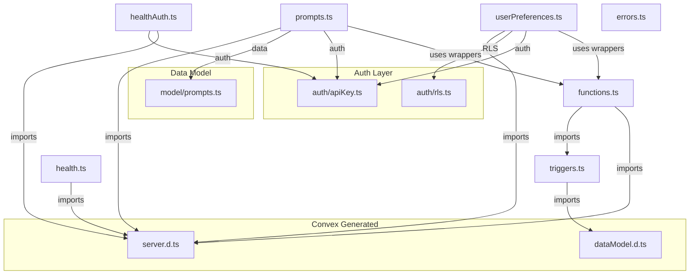
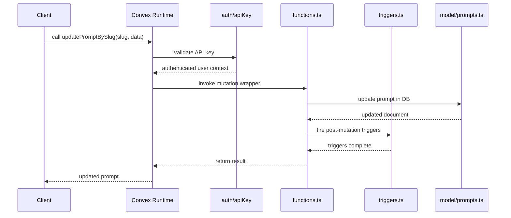

# Convex Functions

## Overview

The Convex Functions module defines the server-side query and mutation endpoints for LiminalDB. It is organized around a central `functions.ts` wrapper that augments Convex's built-in `mutation` and `internalMutation` with database triggers, then exposes domain-specific endpoints across prompts, user preferences, and health checks. All public mutations and queries authenticate via API key validation, and preference endpoints additionally enforce row-level security (RLS).

## Responsibilities

- Wrap Convex mutation/internalMutation with trigger support via functions.ts
- Expose CRUD and search endpoints for prompts (insert, get, list, update, delete, search, rank, tags, flags, usage tracking)
- Provide user preference endpoints (theme get/update, all preferences) with API key auth and RLS
- Define database triggers that fire on data changes
- Offer unauthenticated and authenticated health check endpoints
- Export a NotImplementedError utility class for unimplemented code paths

## Structure Diagram

## Entity Table

| Name | Kind | Role | Public Entrypoints | Depends On | Used By |
| --- | --- | --- | --- | --- | --- |
| mutation | variable | Trigger-aware mutation wrapper built on top of Convex's generated mutation | convex/functions.ts:mutation | convex/_generated/server.d.ts, convex/triggers.ts | convex/prompts.ts, convex/userPreferences.ts |
| internalMutation | variable | Trigger-aware internal mutation wrapper for server-only operations | convex/functions.ts:internalMutation | convex/_generated/server.d.ts, convex/triggers.ts | convex/prompts.ts, convex/userPreferences.ts |
| triggers | variable | Defines database triggers that fire on data model changes | convex/triggers.ts:triggers | convex/_generated/dataModel.d.ts | convex/functions.ts |
| insertPrompts | variable | Mutation to insert one or more prompts | convex/prompts.ts:insertPrompts | convex/functions.ts, convex/auth/apiKey.ts, convex/model/prompts.ts | none |
| getPromptBySlug | variable | Query to retrieve a single prompt by its slug | convex/prompts.ts:getPromptBySlug | convex/functions.ts, convex/auth/apiKey.ts, convex/model/prompts.ts | none |
| listPrompts | variable | Query to list prompts with basic ordering | convex/prompts.ts:listPrompts | convex/functions.ts, convex/auth/apiKey.ts, convex/model/prompts.ts | none |
| listPromptsRanked | variable | Query to list prompts sorted by ranking criteria | convex/prompts.ts:listPromptsRanked | convex/functions.ts, convex/auth/apiKey.ts, convex/model/prompts.ts | none |
| searchPrompts | variable | Full-text search query over prompts | convex/prompts.ts:searchPrompts | convex/functions.ts, convex/auth/apiKey.ts, convex/model/prompts.ts | none |
| updatePromptBySlug | variable | Mutation to update a prompt identified by slug | convex/prompts.ts:updatePromptBySlug | convex/functions.ts, convex/auth/apiKey.ts, convex/model/prompts.ts | none |
| deletePromptBySlug | variable | Mutation to delete a prompt by slug | convex/prompts.ts:deletePromptBySlug | convex/functions.ts, convex/auth/apiKey.ts, convex/model/prompts.ts | none |
| updatePromptFlags | variable | Mutation to toggle prompt flags (e.g., featured, archived) | convex/prompts.ts:updatePromptFlags | convex/functions.ts, convex/auth/apiKey.ts, convex/model/prompts.ts | none |
| trackPromptUse | variable | Mutation to record a usage event against a prompt | convex/prompts.ts:trackPromptUse | convex/functions.ts, convex/auth/apiKey.ts, convex/model/prompts.ts | none |
| listTags | variable | Query to list all tags across prompts | convex/prompts.ts:listTags | convex/functions.ts, convex/auth/apiKey.ts, convex/model/prompts.ts | none |
| getThemePreference | variable | Query to retrieve the current user's theme preference | convex/userPreferences.ts:getThemePreference | convex/functions.ts, convex/auth/apiKey.ts, convex/auth/rls.ts | none |
| updateThemePreference | variable | Mutation to update the current user's theme preference | convex/userPreferences.ts:updateThemePreference | convex/functions.ts, convex/auth/apiKey.ts, convex/auth/rls.ts | none |
| getAllPreferences | variable | Query to retrieve all preferences for the current user | convex/userPreferences.ts:getAllPreferences | convex/functions.ts, convex/auth/apiKey.ts, convex/auth/rls.ts | none |
| check (health) | variable | Unauthenticated health check endpoint | convex/health.ts:check | convex/_generated/server.d.ts | none |
| check (healthAuth) | variable | Authenticated health check endpoint requiring API key | convex/healthAuth.ts:check | convex/_generated/server.d.ts, convex/auth/apiKey.ts | none |
| NotImplementedError | class | Custom error class for unimplemented code paths | convex/errors.ts:NotImplementedError | none | none |

## Key Flow

## Flow Notes

| Step | Actor/Component | Action | Output / Side Effect |
| --- | --- | --- | --- |
| 1 | Client | Calls a Convex endpoint (e.g., updatePromptBySlug) with an API key and arguments | Request reaches Convex runtime |
| 2 | auth/apiKey | Validates the API key and resolves the authenticated user identity | Authenticated context available to the endpoint |
| 3 | functions.ts (mutation wrapper) | Wraps the mutation handler with trigger support and delegates to domain logic | Domain handler executes within trigger-aware context |
| 4 | model/prompts.ts | Performs the database read/write against the Convex data model | Data persisted or retrieved |
| 5 | triggers.ts | Post-mutation triggers fire for any registered data model change listeners | Side-effects complete; result returned to client |

## Source Coverage

- convex/errors.ts
- convex/functions.ts
- convex/health.ts
- convex/healthAuth.ts
- convex/prompts.ts
- convex/triggers.ts
- convex/userPreferences.ts

## Cross-Module Context

- convex/functions.ts -> convex/_generated/server.d.ts (import)
- convex/health.ts -> convex/_generated/server.d.ts (import)
- convex/healthAuth.ts -> convex/_generated/server.d.ts (import)
- convex/healthAuth.ts -> convex/auth/apiKey.ts (import)
- convex/prompts.ts -> convex/_generated/server.d.ts (import)
- convex/prompts.ts -> convex/auth/apiKey.ts (import)
- convex/prompts.ts -> convex/model/prompts.ts (import)
- convex/triggers.ts -> convex/_generated/dataModel.d.ts (import)
- convex/userPreferences.ts -> convex/_generated/server.d.ts (import)
- convex/userPreferences.ts -> convex/auth/apiKey.ts (import)
- convex/userPreferences.ts -> convex/auth/rls.ts (import)
