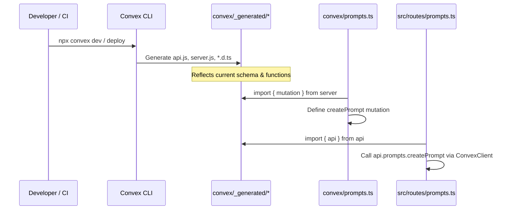

# Convex Generated

## Overview

Auto-generated Convex backend bindings that provide type-safe API references, data model types, and server function constructors. These files are produced by the Convex CLI (`npx convex dev` / `npx convex deploy`) and serve as the foundational glue layer between hand-written backend functions and the Convex runtime. Nearly every backend module and several frontend/route modules import from this package.

## Responsibilities

- Expose typed API references (`api`, `internal`, `components`) for calling Convex functions from clients and other server functions
- Provide data model type definitions (`Doc`, `Id`, `TableNames`, etc.) consumed by model-layer code and test fixtures
- Export typed server function constructors (`query`, `mutation`, `action`, `internalQuery`, `internalMutation`, `internalAction`, `httpAction`) used by all hand-written Convex functions
- Maintain type safety across the full Convex stack by reflecting the current schema and function signatures

## Structure Diagram

```mermaid
flowchart TD
  subgraph generated["convex/_generated"]
    apiTypes["api.d.ts\nAPI type map"]
    apiJs["api.js\napi / internal / components"]
    dataModel["dataModel.d.ts\nDoc, Id, TableNames"]
    serverTypes["server.d.ts\nTyped function constructors"]
    serverJs["server.js\nquery, mutation, action, …"]
  end

  subgraph consumers_server["Backend Consumers"]
    functions["convex/functions.ts"]
    prompts["convex/prompts.ts"]
    modelPrompts["convex/model/prompts.ts"]
    modelTags["convex/model/tags.ts"]
    modelRanking["convex/model/ranking.ts"]
    triggers["convex/triggers.ts"]
    health["convex/health.ts"]
    healthAuth["convex/healthAuth.ts"]
    auth["convex/auth/apiKey.ts"]
    userPrefs["convex/userPreferences.ts"]
    migrations["convex/migrations/*"]
  end

  subgraph consumers_client["Client / Route Consumers"]
    srcHealth["src/api/health.ts"]
    mcp["src/lib/mcp.ts"]
    routePrompts["src/routes/prompts.ts"]
    routePrefs["src/routes/preferences.ts"]
    routeImport["src/routes/import-export.ts"]
  end

  subgraph consumers_test["Test Consumers"]
    mockCtx["tests/fixtures/mockConvexCtx.ts"]
    intTests["tests/integration/*"]
    unitTests["tests/convex/*"]
  end

  serverTypes --> functions & prompts & modelPrompts & modelTags & modelRanking & health & healthAuth & auth & userPrefs & migrations
  dataModel --> modelPrompts & modelTags & triggers & mockCtx & unitTests
  apiTypes --> srcHealth & mcp & routePrompts & routePrefs & routeImport & intTests & migrations
```

## Entity Table

| Name | Kind | Role | Public Entrypoints | Depends On | Used By |
| --- | --- | --- | --- | --- | --- |
| api.d.ts | file | Type-level map of all public and internal Convex function signatures, enabling typed client calls | convex/_generated/api.d.ts | none | src/api/health.ts, src/lib/mcp.ts, src/routes/prompts.ts, src/routes/preferences.ts, src/routes/import-export.ts, convex/migrations/backfillSearchText.ts, tests/integration/* |
| api.js | file | Runtime API reference objects (api, internal, components) used to address Convex functions | api, internal, components | none | none |
| dataModel.d.ts | file | Type definitions for the Convex data model — Doc, Id, TableNames, DatabaseReader/Writer | convex/_generated/dataModel.d.ts | none | convex/model/prompts.ts, convex/model/tags.ts, convex/triggers.ts, tests/fixtures/mockConvexCtx.ts, tests/convex/prompts/insertPrompts.test.ts |
| server.d.ts | file | Type declarations for server function constructors, binding data model types to Convex generics | convex/_generated/server.d.ts | none | convex/functions.ts, convex/prompts.ts, convex/model/prompts.ts, convex/model/tags.ts, convex/model/ranking.ts, convex/health.ts, convex/healthAuth.ts, convex/auth/apiKey.ts, convex/userPreferences.ts, convex/migrations/*, tests/convex/tags/tags.test.ts |
| server.js | file | Runtime exports of typed function constructors: query, mutation, action, internalQuery, internalMutation, internalAction, httpAction | query, mutation, action, internalQuery, internalMutation, internalAction, httpAction | none | none |

## Key Flow

## Flow Notes

| Step | Actor/Component | Action | Output / Side Effect |
| --- | --- | --- | --- |
| 1 | Convex CLI | Reads schema.ts and all function files to generate typed bindings | convex/_generated/* files written to disk |
| 2 | Backend function (e.g. convex/prompts.ts) | Imports typed constructors (query, mutation, action) from server.js / server.d.ts | Fully typed Convex function definitions |
| 3 | Client code (e.g. src/routes/prompts.ts) | Imports api object from api.js / api.d.ts to reference backend functions | Type-safe function references for ConvexClient calls |
| 4 | Model layer (e.g. convex/model/prompts.ts) | Imports Doc / Id types from dataModel.d.ts for domain type annotations | Strongly typed document and ID references |

## Source Coverage

- convex/_generated/api.d.ts
- convex/_generated/api.js
- convex/_generated/dataModel.d.ts
- convex/_generated/server.d.ts
- convex/_generated/server.js

## Cross-Module Context

- convex/auth/apiKey.ts -> convex/_generated/server.d.ts (import)
- convex/functions.ts -> convex/_generated/server.d.ts (import)
- convex/health.ts -> convex/_generated/server.d.ts (import)
- convex/healthAuth.ts -> convex/_generated/server.d.ts (import)
- convex/migrations/backfillSearchText.ts -> convex/_generated/api.d.ts (import)
- convex/migrations/backfillSearchText.ts -> convex/_generated/server.d.ts (import)
- convex/migrations/migrationStatus.ts -> convex/_generated/server.d.ts (import)
- convex/migrations/seedGlobalTags.ts -> convex/_generated/server.d.ts (import)
- convex/migrations/seedRankingConfig.ts -> convex/_generated/server.d.ts (import)
- convex/model/prompts.ts -> convex/_generated/dataModel.d.ts (import)
- convex/model/prompts.ts -> convex/_generated/server.d.ts (import)
- convex/model/ranking.ts -> convex/_generated/server.d.ts (import)
- convex/model/tags.ts -> convex/_generated/dataModel.d.ts (import)
- convex/model/tags.ts -> convex/_generated/server.d.ts (import)
- convex/prompts.ts -> convex/_generated/server.d.ts (import)
- convex/triggers.ts -> convex/_generated/dataModel.d.ts (import)
- convex/userPreferences.ts -> convex/_generated/server.d.ts (import)
- src/api/health.ts -> convex/_generated/api.d.ts (import)
- src/lib/mcp.ts -> convex/_generated/api.d.ts (import)
- src/routes/import-export.ts -> convex/_generated/api.d.ts (import)
- src/routes/preferences.ts -> convex/_generated/api.d.ts (import)
- src/routes/prompts.ts -> convex/_generated/api.d.ts (import)
- tests/convex/prompts/insertPrompts.test.ts -> convex/_generated/dataModel.d.ts (usage)
- tests/convex/tags/tags.test.ts -> convex/_generated/server.d.ts (usage)
- tests/fixtures/mockConvexCtx.ts -> convex/_generated/dataModel.d.ts (import)
- tests/integration/convex.test.ts -> convex/_generated/api.d.ts (usage)
- tests/integration/convex/convexCalls.test.ts -> convex/_generated/api.d.ts (usage)
- tests/integration/convex/prompts.test.ts -> convex/_generated/api.d.ts (usage)
