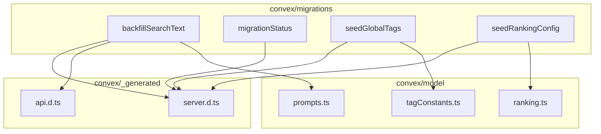
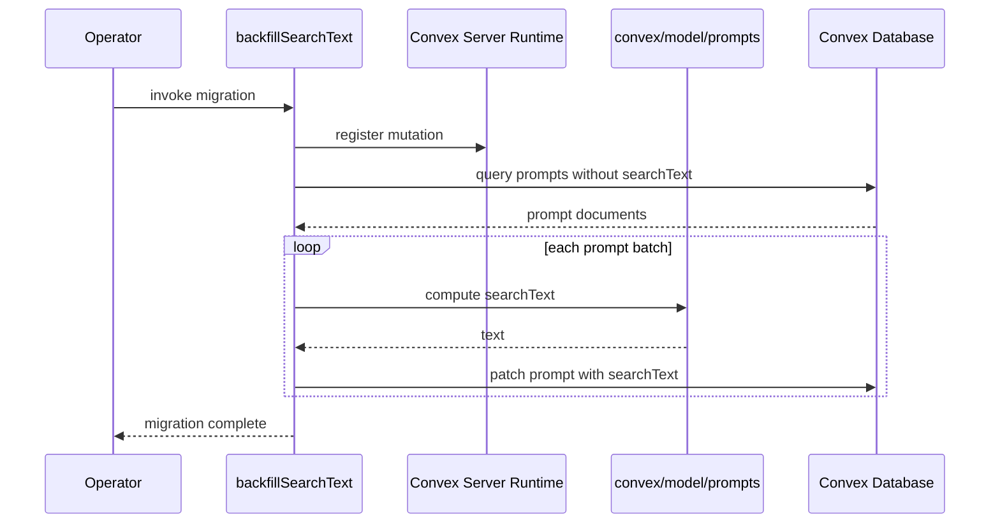

# Convex Migrations

## Overview

Data migration and seeding scripts for the LiminalDB Convex backend. This module contains four standalone migration functions: backfilling search text on prompts, querying migration status, seeding global tags, and seeding ranking configuration. Each script imports from the Convex server runtime and delegates to domain model modules for business logic and constants.

## Responsibilities

- Backfill computed `searchText` fields on existing prompt documents
- Report the current status of migrations
- Seed the database with a canonical set of global tags from tagConstants
- Seed the database with default ranking configuration from the ranking model

## Structure Diagram

## Entity Table

| Name | Kind | Role | Public Entrypoints | Depends On | Used By |
| --- | --- | --- | --- | --- | --- |
| backfillSearchText | variable | Migration that iterates prompt documents and populates their searchText field | backfillSearchText | convex/_generated/api.d.ts, convex/_generated/server.d.ts, convex/model/prompts.ts | none |
| migrationStatus | variable | Query that reports the current state of running or completed migrations | migrationStatus | convex/_generated/server.d.ts | none |
| seedGlobalTags | variable | Seeder that inserts the canonical global tag set into the database | seedGlobalTags | convex/_generated/server.d.ts, convex/model/tagConstants.ts | none |
| seedRankingConfig | variable | Seeder that inserts default ranking configuration into the database | seedRankingConfig | convex/_generated/server.d.ts, convex/model/ranking.ts | none |

## Key Flow

## Flow Notes

| Step | Actor/Component | Action | Output / Side Effect |
| --- | --- | --- | --- |
| 1 | Operator | Invokes a migration function (e.g., backfillSearchText) via Convex dashboard or CLI | Migration execution begins |
| 2 | backfillSearchText | Queries the database for prompt documents missing the searchText field | Batch of prompt documents |
| 3 | backfillSearchText | Delegates to convex/model/prompts to compute the searchText value for each prompt | Computed search text strings |
| 4 | backfillSearchText | Patches each prompt document in the database with the computed searchText | Updated prompt records |
| 5 | Operator | Calls migrationStatus to verify completion | Migration status report |

## Source Coverage

- convex/migrations/backfillSearchText.ts
- convex/migrations/migrationStatus.ts
- convex/migrations/seedGlobalTags.ts
- convex/migrations/seedRankingConfig.ts

## Cross-Module Context

- convex/migrations/backfillSearchText.ts -> convex/_generated/api.d.ts (import)
- convex/migrations/backfillSearchText.ts -> convex/_generated/server.d.ts (import)
- convex/migrations/backfillSearchText.ts -> convex/model/prompts.ts (import)
- convex/migrations/migrationStatus.ts -> convex/_generated/server.d.ts (import)
- convex/migrations/seedGlobalTags.ts -> convex/_generated/server.d.ts (import)
- convex/migrations/seedGlobalTags.ts -> convex/model/tagConstants.ts (import)
- convex/migrations/seedRankingConfig.ts -> convex/_generated/server.d.ts (import)
- convex/migrations/seedRankingConfig.ts -> convex/model/ranking.ts (import)
